本人改写的Typora主题更新于此(纵享丝滑): https://gitee.com/hongjilin/hongs--typora-theme

# #说明

>本人想的是方便大家,本着大家共同进步的初心,所以将本人过滤一遍后还觉得很好用的知识或者软件推荐给大家,本人基本每天都会进行笔记的更新与勘误,所以觉得有用的话给本笔记点个`star`,能及时收到笔记的更新的同时也能给予本人些许肯定,感谢不尽 [本人笔记地址](https://gitee.com/hongjilin/hongs-study-notes)
>
>1. 这个软件是本人记笔记的软件,如果要看本人笔记建议使用该软件,能有较好的阅读体验
>2. Typora 本人一直认为它**功能强大、设计冷静、体验美妙、理念先进**.真的特别好用,特别适合程序员朋友,一旦上手你会爱上它的,我有时候能一周写出数万字的学习笔记或者个人注解都是得益于这软件使用体验之美好
>3. 具体使用方式网上已经有很完备的文章进行描述,给出地址,需要的可以去看:[少数派的文章地址](https://sspai.com/post/54912),本笔记主要还是说一下基础使用安装以及个人使用配置的推荐
>4. 少年,MD文件你不会还在浏览器打开吧??????那你打开这份笔记真的是打开你新世界大门了!!!!!!!!!!!!!!!
>5. 该软件的使用展示将以使用本人笔记为例子

# #目录

>[TOC]

# Typora

# 1、下载安装软件包

>1. 本人在隔壁文件夹中提供了部分版本安装包,可以免去同学们下载的麻烦,直接选择符合自己电脑版本的双击直接安装即可(`占用空间太大了,已经删除,乖乖去官网吧`)
>
>2. [官方下载](https://www.typora.io/):
>
>   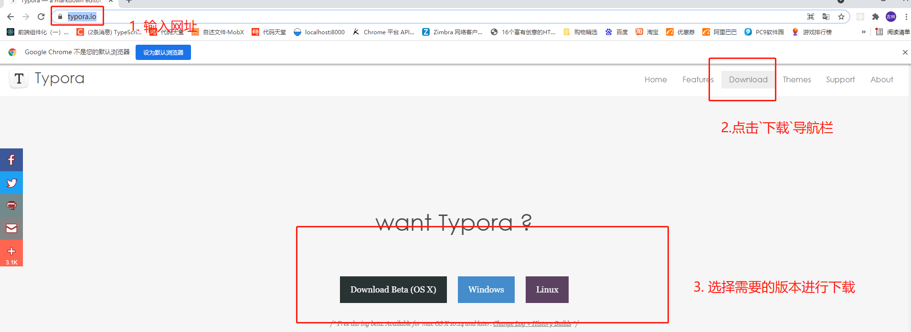
>
>3. 双击运行进行安装即可

# 2、主题更换

### Ⅰ-为什么要装该软件以及新主题

>1. 默认主题不够漂亮,或者在某些地方无法达到本人作笔记需求(如:`代码块样式,字体等`),这个就看人喜欢与否,本人比较看重本人推荐的主题的标红效果
>
>2. 本人是按照`gitlab`这个主题进行笔记记录,如果用这个主题展最能原汁原味示本人的笔记,当然这个见仁见智,你也可以自己去下载喜欢的主题
>
>3. 新旧主题对比,这里我随便找到笔记中的一部分进行截图对比
>
>   1. 不用该软件,直接网站观看(此处以本人笔记为例),当然可能有其他方法我却不知道的
>
>      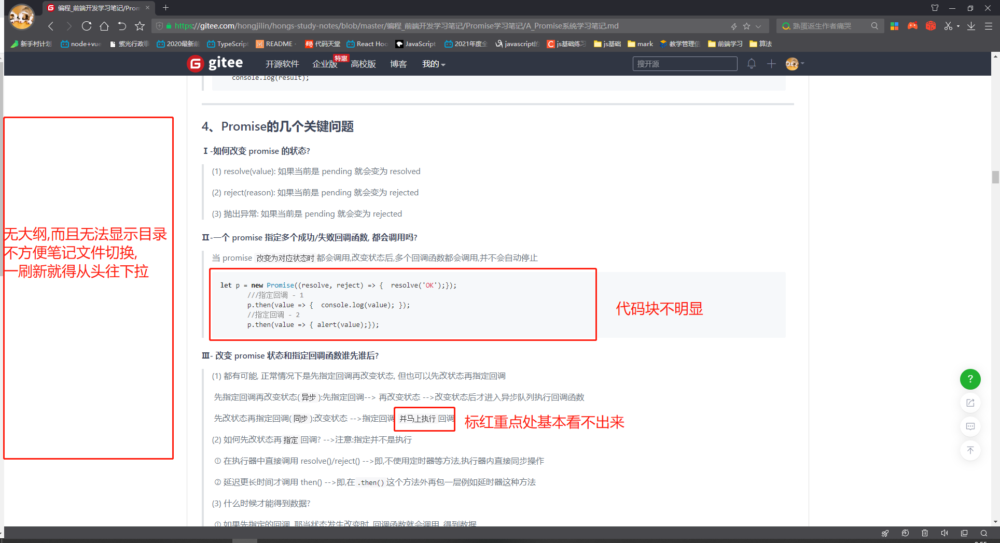
>
>      
>
>   2. 使用该软件,但用默认主题
>
>      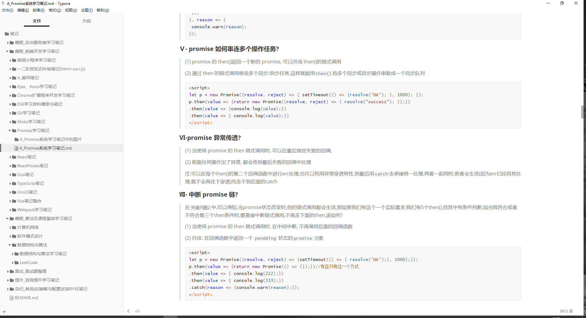
>
>   3. 使用该软件,使用本人主题
>
>      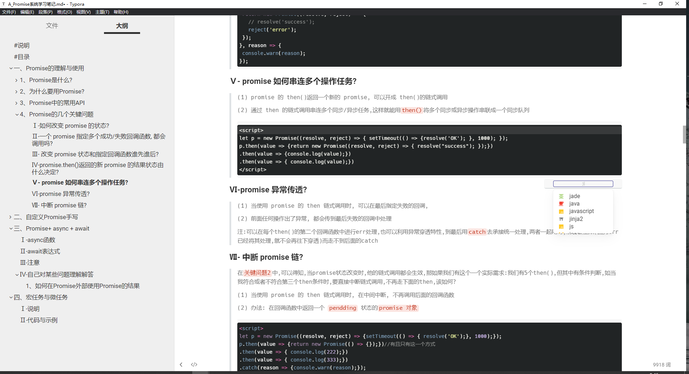
>
>   4. 该软件最强大的还不是显示,最强大的是它能非常快捷并高效地写笔记

### Ⅱ-如何更换主题

>1. 点击左上角`文件`-->`偏好设置`-->`外观`-->`打开主题文件夹`-->`将本人给的主题文件拖入或复制进入`(也可以自己下载)-->`重启软件`-->`可在主题处切换主题`
>
>2. 图例
>
>   1. 主题文件放入主题文件夹中
>
>      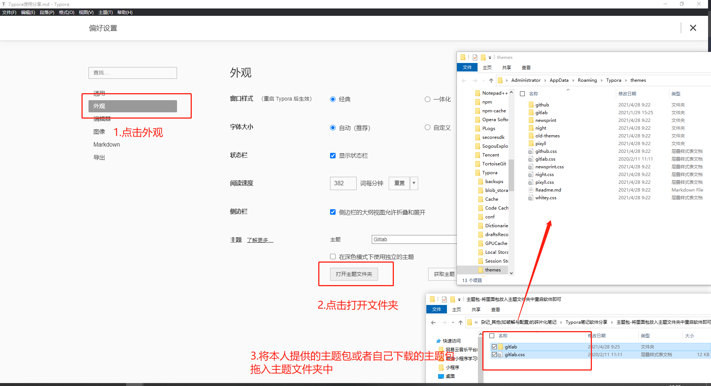
>
>   2. 重启软件,选择主题
>
>      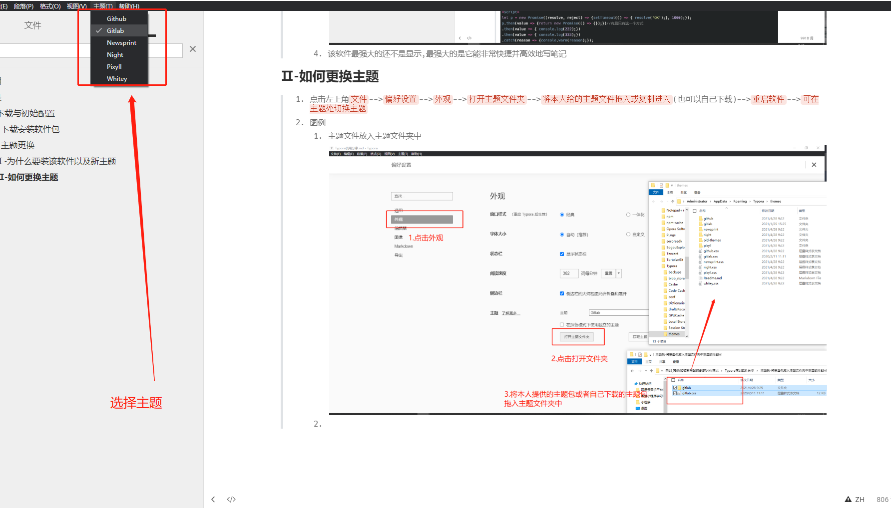

# 3、觉得好用的初始配置

### Ⅰ-视图设置

>当你文件夹有所嵌套时(阅读本人笔记必开好吧),`建议开启文件树`-->建议背一下快捷键,用多了非常好用
>
>1. 视图设置列表: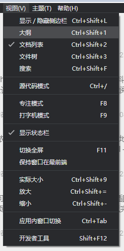
>
>2. 打开文件树效果:
>
>3. 打开文件大纲效果(可以点击大纲,直接跳转,类似目录)
>
>   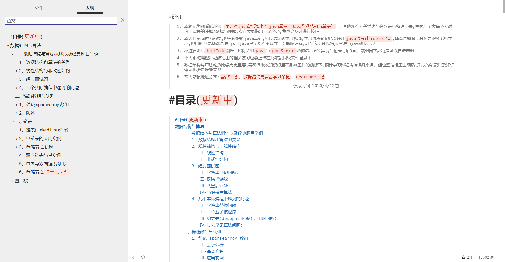

### Ⅱ-偏好设置

>1. 建议修改`启动选项`
>
>2. 建议修改`侧边栏`
>
>   

# 4、好用的快捷键

>很多,可以直接网上搜索,这里举例几个
>
>1. 图片可以直接复制粘贴进来,可以进行缩放
>
>2. 选中文字后`ctrl+K`。会将剪切板内容作为网址,选中文字为显示内容变成超链接: [选中的内容](地址)
>
>3. `shift+ctrl+k`快捷生成代码块,同时能在其右下角选择语言,进行不同语言格式显示
>
>  ```js
>  代码块
>  ```
>
>4. `数字 + . +空格`快捷生成序列,然后`换行回车`会生成接下去的列表,`tab`会转成子序列,一直回车会往外生成序列直到出序列
>
>  1. 这就是生成的
>     1. 这是`tab`生成的子序列
>
>5. `ctrl+ 123456`将选中行变成几级标题 ,如下图就是`ctrl+3`
>
>  
>
>6. 其他的可以`右键插入`,或者百度,不再赘述
>
>7. 锚点:即链接处(`"#"+"本笔记内某标题"`)
>
>   ```md
>   # titleB
>   - [toA](#titleA)
>   //例如
>   [详见本笔记常用操作第17点](#17、打开控制台抽屉)
>   ```

# 5、使用本软件观看本笔记效果截图示例

>1. 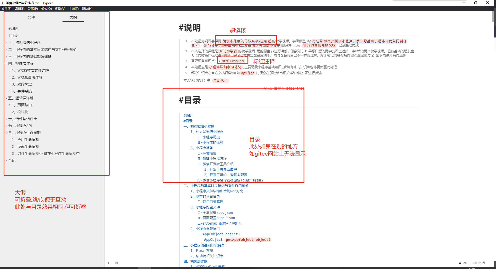
>
>2. 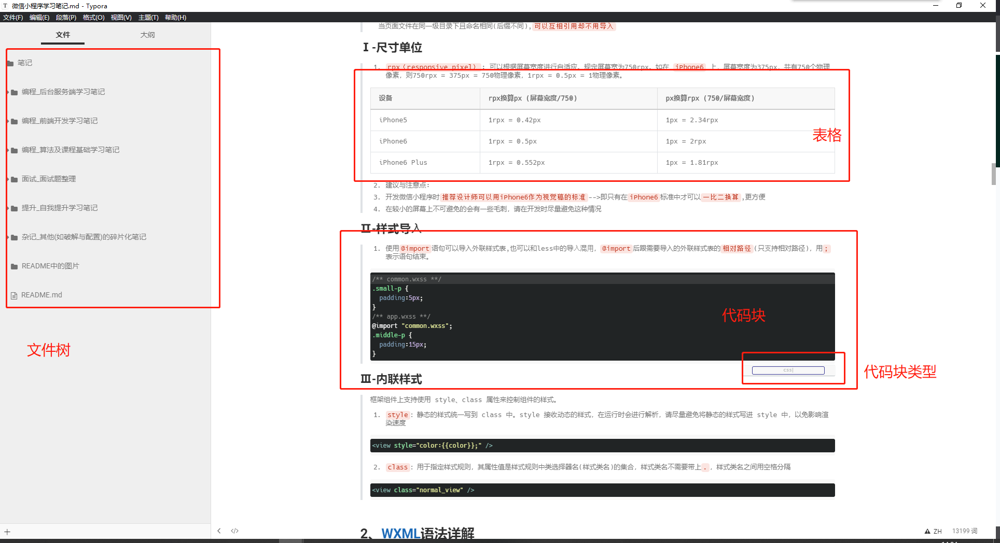
>3. 

# 6、利用该软件将笔记转为pdf文件

>有时候我们想要将笔记转为pdf文件方便自己阅读查看，就可以直接使用Typora导出成PDF文件了
>
>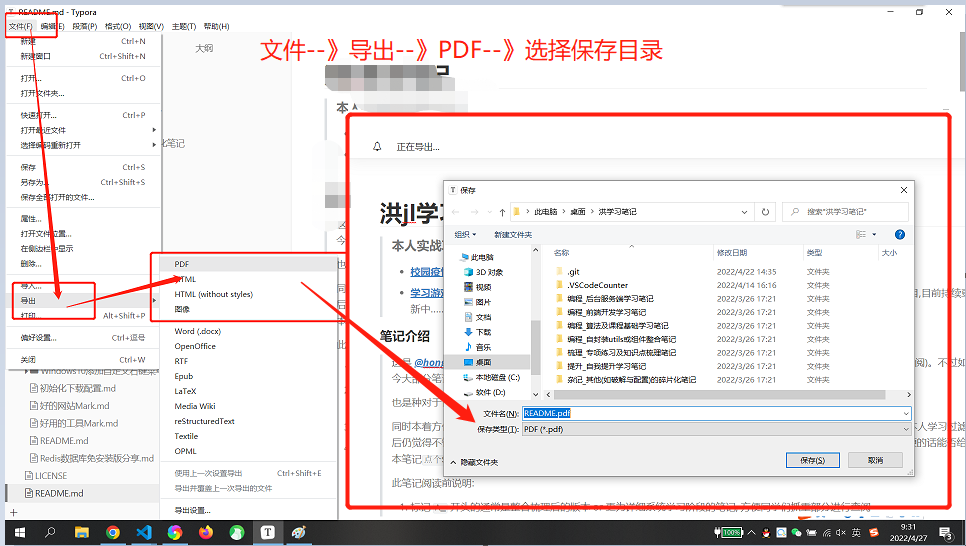

### 效果如下：

>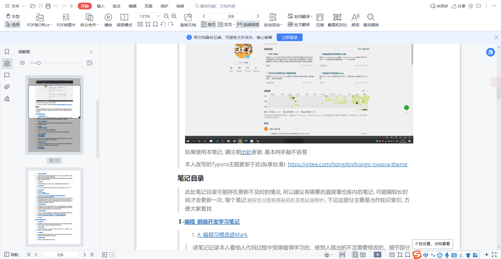
>
>
