# #说明

>本人对于所遇面试题进行了详细的知识点拆解与梳理,在此分享给大家,有错欢迎指出讨论,求共同进步 --> **[JavaScript专项练习](https://gitee.com/hongjilin/hongs-study-notes/tree/master/面试_面试题整理/JavaScript专项练习)**
>除此笔记外大家可以看我其他笔记 :**[全栈笔记](https://gitee.com/hongjilin/hongs-study-notes/tree/master)**、**[数据结构与算法](https://gitee.com/hongjilin/hongs-study-notes/tree/master/编程_算法及课程基础学习笔记/数据结构与算法)**、**[编程_前端开发学习笔记](https://gitee.com/hongjilin/hongs-study-notes/tree/master/编程_前端开发学习笔记)**、**[编程_后台服务端学习笔记](https://gitee.com/hongjilin/hongs-study-notes/tree/master/编程_后台服务端学习笔记)** 、**[Java](https://gitee.com/hongjilin/hongs-study-notes/tree/master/编程_后台服务端学习笔记/Java)** 、**[Nodejs](https://gitee.com/hongjilin/hongs-study-notes/tree/master/编程_后台服务端学习笔记/Nodejs)** 、**[JavaScript笔记](https://gitee.com/hongjilin/hongs-study-notes/tree/master/编程_前端开发学习笔记/HTML+CSS+JS基础笔记/JavaScript笔记)**、**[编程工具使用笔记](https://gitee.com/hongjilin/hongs-study-notes/tree/master/编程_前端开发学习笔记/A_前端工具使用笔记)** 、**[ES6及后续版本学习笔记](https://gitee.com/hongjilin/hongs-study-notes/tree/master/编程_前端开发学习笔记/ES6及后续版本学习笔记)** 、**[Vue笔记整合](https://gitee.com/hongjilin/hongs-study-notes/tree/master/编程_前端开发学习笔记/Vue笔记整合)** 、**[React笔记](https://gitee.com/hongjilin/hongs-study-notes/tree/master/编程_前端开发学习笔记/React笔记)**、**[微信小程序学习笔记](https://gitee.com/hongjilin/hongs-study-notes/tree/master/编程_前端开发学习笔记/微信小程序学习笔记)**、**[Chrome开发使用及学习笔记](https://gitee.com/hongjilin/hongs-study-notes/tree/master/编程_前端开发学习笔记/Chrome开发使用及学习笔记)** 以及许多其他笔记就不一一例举了

# 一、DOM操作相关

## Ⅰ- 单选题

### 1、获取页面 某标签 数量

>在开发中, 通常都是使用h标签来定义文本中的标题, 若想要知道文本中共有多少个标题主题文档, 该如何实现（   ）
>
>```js
>//a
>var hele=document.getElementByTagName('h1');
>alert(hele.length);
>//b
>var hele=document.getElementsByTagName('h1');
>alert(hele.length);
>//c
>var hele=getElementsByTagName('h1');
>alert(hele.length);
>//d
>var hele=getElementByTagName('h1');
>alert(hele.length);
>```
>
>##### 解析
>
>1. A和B之间的区别在Element和Elements。因为返回的是集合, 所以必然是Elements。
>
>2. 记住ID具有唯一性所以只能返回element, className、Name、TagName都是可以重复的所以需要返回elements就行了
>
>3. 各个方法:
>
>  >- document.getElementById();
>  >
>  >- document.getElementsByTagName();
>  >
>  >- document.getElementsByName();
>  >
>  >- document.getElementsByClassName();
>  >
>  >- 除了ById是Element, 其余都是Elements
>
>- 所以选第二个

### 2、对class为test的div对象设置红色背景

>以下代码中,为class为test的div对象设置红色背景的正确js代码为(    )
>
>```js
><div class="test"></div>    
>//以下是选项
>document.getElementsByClassName("test").style.backgroundColor="red";
>document.getElementsByClassName("test")[0].style.backgroundColor="red";
>document.getElementsByClassName("test")[0].style.background-color="red";
>document.getElementsByClassName("test").style.background-color="red";
>```
>
>##### 知识点梳理
>
>>- getElementsByClassName返回的是一个节点列表,是数组类型
>>- 在js里面添加的属性名使用驼峰法，在css里面使用连接线 除了id和query 其他返回的都是节点列表
>
>##### 答案解析:
>
>>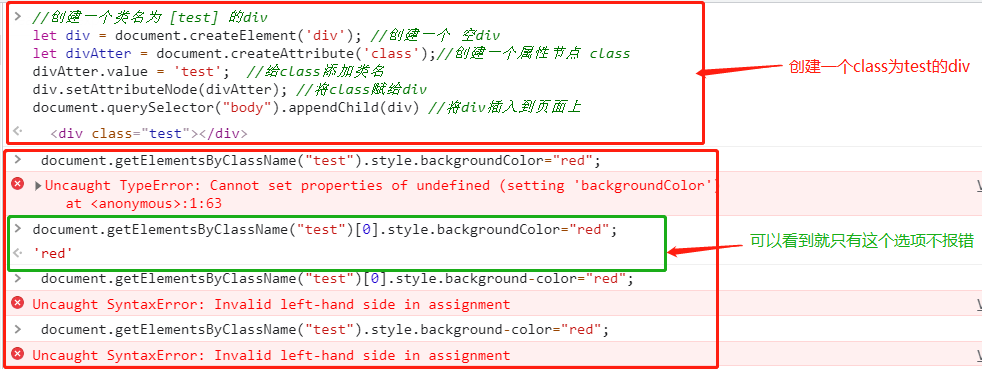
>
>1. 第一个错误是因为,getElementsByClassName得到的是一个数组集合,即便它只有一个结果
>2. 第三个错误是因为在js里面添加的属性名使用驼峰法，在css里面使用连接线 除了id和query 其他返回的都是节点列表
>3. 第四个错误是因为犯了上面两个错误
>4. 所以选第二个

### 3、获取表单的select选中值

>```html
>//如何获取下面表单 select ;  域的选择部分的文本？()
><form name="a">
><select name="a" size="1" id=”obj”>
><option value="a">1</option>
><option value="b">2</option>
><option value="c">3</option>
></select>
></form> 
>//以下是四个选项
>obj.options[obj.selectedIndex].text
>obj.options[obj.selectedIndex].value
>obj. value
>obj.text
>```
>
>##### 知识点梳理:
>
>> 此题主要还是考察细心,注意题中说的是 **文本** ,而不是取 **value**
>
>##### 答案解析:
>
>>**文本**指的是1 选择a ; 如果要获取option里面的**value** 选择b
>>
>>```js
>>window.onload=function(){
>>//首先获得下拉框节点对象
>>const obj = document.querySelector('#obj');
>>//1. 如何获得当前选中的值
>>const value = obj.value;
>>//2. 如何获得该下拉框所有option的节点对象
>>const options = obj.options;  //注意:得到的options是一个对象数组
>>//3. 如何获得第几个option的value值?比如我要获取第一个,可以这样:
>>const firstValue = options[0].value;
>>//4. 如何获取第几个options的文本内容?比如我获取第一个,可以这样:
>>const firstText = options[0].text;
>>//5. 如何获得当前选中的option的索引?
>>const selectIndex = obj.selectIndex;
>>//6. 如何获得当前选中option的文本内容?  2中得到了所有options、5中得到选中的索引、结合4可以得到答案
>>const selectedText = options[selectIndex].text;    
>>}
>>```
>

### 4、关于下述代码所实现的功能，以下说法正确的是:

>```html
><div>
> <input type="button" id ="button1" value="1" onclick="moveBtn(this);">
> <input type="button" id ="button2" value="2" />
> </div>
> <script type="text/javascript">
> function moveBtn(obj) {
> var clone = obj.cloneNode(true);
> var parent = obj.parentNode;
> parent.appendChild(clone);
> parent.removeChild(obj);
> }
> </script>
>//下面是选项
>鼠标单击Button1后将Button1链接到Button2的后面
>鼠标单击Button1后将Button1移动到Button2的后面
>鼠标单击Button1后将Button2移动到Button1的后面
>鼠标单击Button1后将Button2链接到Button1的后面
>```
>
>##### 答案解析
>
>>```js
>>var clone = obj.cloneNode(true); // 复制一个button1结点
>>var parent = obj.parentNode; // 找到button1的父节点
>>parent.appendChild(clone); // 将复制的结点加入到父节点，也就是button1的复制结点现在在button2后面了
>>parent.removeChild(obj); // 移除原来的button1
>>```
>>
>>最终达到的效果 : 就是把button1结点移到button2结点后面

### 5、el 是一个id="id1"的div元素，以下哪行代码会执行失败

>```js
>el.className='aaa'
>el.tagName='p'
>el.innerHTML=''
>el.id='id2'
>```
>
>##### 知识梳理及答案解析
>
>1. className 属性**设置或返回**元素的 class 属性。
>   - 获取属性值：HTMLElementObject.className；
>   - 设置属性值：HTMLElementObject.className=*classname* 
>2. tagName 属性返回元素的标签名。HTML 返回 tagName 属性的值是大写的。
>   - 读取方法: element.tagName()
>   - 但是要注意:**tagName是只读的，不能修改**,所以可以判断此处错了
>3. innerHTML 属性**设置或返回**表格行的开始和结束标签之间的 HTML。
>   - 设置方法: HTMLElementObject.innerHTML=text 
>4. id 属性设置或者返回元素的 id。
>   - 设置方法HTMLElementObject.id=id
>
>##### 新的疑惑提出
>
>在验证 **选项D** 时发现了一个很有意思的事情,直接上代码,猜一下下面打印的结果
>
>>```html
>><body>
>>  <div id="id1">xxx</div>
>></body>
>><script>
>>  let el = document.querySelector('#id1')
>>  console.log(el)
>>  el.id = 'id2'
>>  console.log(el)
>>  el.id = 'id4'
>>  console.log(el)
>>  setTimeout(() => {
>>    el.id = 'id3'
>>    console.log(el)
>>  }, 1000)
>></script>
>>```
>>
>> 
>
>是不是有点奇怪,这里有两个疑惑点:为何前面三个都是**id4** ,如果是因为改到引用的问题,为何第四个是 **id3**?
>
>1. 首先先解答为何加在延时器中的 **id3** 可以正常打印出来?
>
>   - 定时器会将代码推入宏任务中,待前方同步任务执行完成后在运行,所以即便它也是改到了**el**, 但前方的打印输出已经执行完毕了,就不会对控制台前面三个产生影响
>
>2. 为什么前面三个打印会按照最后一次修改为准呢?不是说同步吗?那即便改到了 **el** 应该不会影响到修改前的console.log(),难道console.log()是异步的?
>
>   - console.log()是异步的吗?  详情请看本人笔记,这个能解释为何会引发这种问题  --> [Chrome的JavaScript控制台是否懒惰评估数组中处理](https://gitee.com/hongjilin/hongs-study-notes/blob/master/编程_前端开发学习笔记/HTML+CSS+JS基础笔记/JavaScript笔记/Chrome的JavaScript控制台是否懒惰评估数组中处理.md)
>
>   - 当你用调试工具打断点后,实际上发现会是正常的,这就很有意思了,不过好像也并没有什么大的影响
>
>     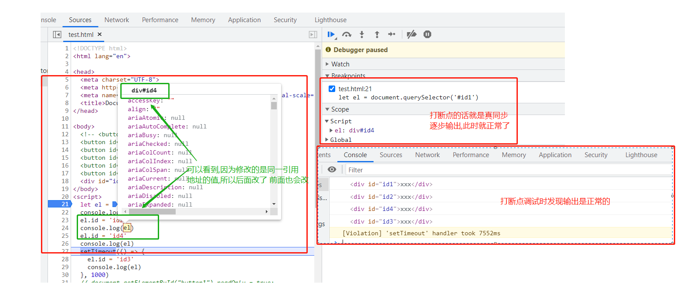


## Ⅱ - 不定项选择

### 1、在一个块元素中，存在了很多的行元素，现在要求，将这些行元素中，只要有显示“叮咚”的行元素全部删除

>```js
>$("span").detach("叮咚");
>$("p").detach("叮咚");
>$("div").detach("叮咚");
>$("em").detach("叮咚");
>```
>
>##### 知识点梳理
>
>>本题主要考察你对于行内元素与块级元素的分类记忆
>>
>>* 行内元素(包括行内块级):
>>
>>  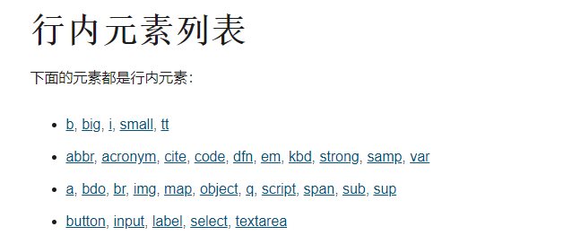 
>>
>>* 块级元素:
>>
>>   
>
>##### 答案解析:
>
>> * P、div标签是块级元素,所以错
>> * 答案选择AD

### 2、页面有一个按钮button id为 buttonx，通过原生的js如何禁用？(IE 考虑IE 8.0以上版本)

>```html
><body>
>  <button id="button1">禁用1</button>
>  <button id="button2">禁用2</button>
>  <button id="button3">禁用3</button>
>  <button id="button4">禁用4</button>
>  <button id="button5">禁用5</button>
>  <button id="button6">禁用6</button>
></body>
><script>
>  //下面是选项    
>  document.getElementById("button1").readOnly = true;
>  document.getElementById("button2").setAttribute('readOnly', 'true');
>  document.getElementById("button3").disabled = true;
>  document.getElementById("button4").disabled = false; //使用此方法设置 disabled 为false
>  document.getElementById("button5").setAttribute('disabled', 'true');
>  document.getElementById("button6").setAttribute('disabled', false); //使用 setAttribute 方法设置 disabled 为false
></script>
>```
>
>##### 知识点梳理
>
>>* disabled和readOnly都是表单的公有属性， readOnly是只读， disabled是禁用。
>>* 同时 Readonly 只针对 input(text/password)  和 textarea 有效
>>* 只要设置了 [disabled] 属性不论什么值都会禁用,包括 **false**,页面似乎只在乎是否有这个属性 而不在乎其值
>>* 小知识点：setArrtibute在ie7以前是不能通过style和class设置属性的
>>*  **[JavaScript专项练习]()**
>
>##### 答案解析
>
>>* 同时 Readonly 只针对 input(text/password)  和 textarea 有效,所以排除A、B项
>>* 其余项看下方图解
>>
>>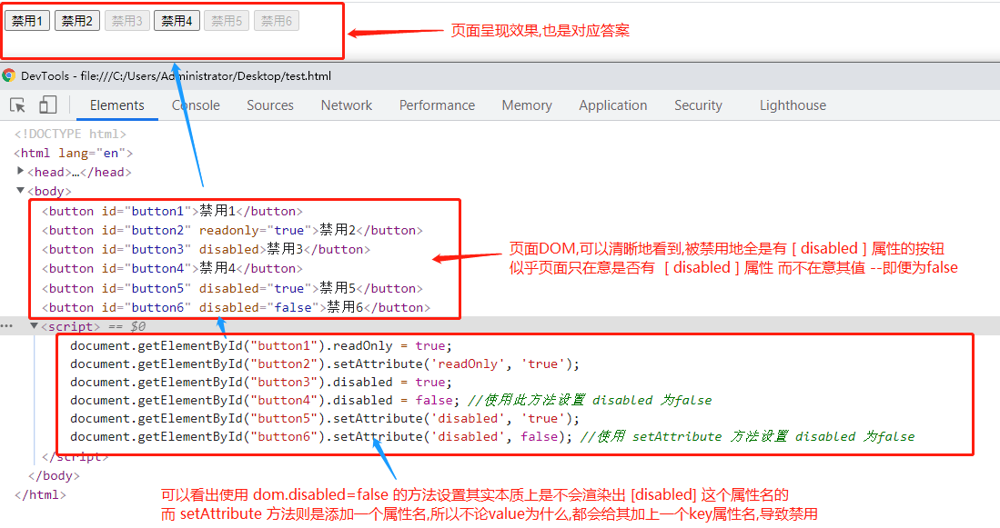 

# 二、正则相关

> 如果对于此部分知识点相对薄弱的同学可以看我正则笔记 --> **[正则表达式学习笔记](https://gitee.com/hongjilin/hongs-study-notes/tree/master/编程_前端开发学习笔记/正则表达式学习笔记)** 

## Ⅰ - 单选题

### 1、请选择下方代码运行结果

>以下代码执行后, result 的值是：
>
>```js
>let result = "66handsome努力学习的汪2021学习".match(/\d+\w*/g)
>//下面为选项
>[&quot;66&quot;]
>[&quot;2021&quot;]
>[&quot;66handsome&quot;,2021&quot;]
>[&quot;66handsome努力学习的汪2021学习&quot;]
>[&quot;66&quot;, &quot;2021&quot;]
>```
>
>##### 知识点梳理:
>
>1. match() 方法可在字符串内检索指定的值, 或找到一个或多个正则表达式的匹配
>
>2. 字符转义知识点: **& quot;**  === "" 其实就是双引号的文字表记
>
>3. |  正则  |                             定义                             |
>     | :----: | :----------------------------------------------------------: |
>     |   \d   |                   匹配一个数字,等价于[0-9]                   |
>     |   \w   |         匹配字母、数字或者下划线,等价于 [A-Za-z0-9_]         |
>     | **\W** | **上面不是大写的,别认错了**:匹配**非**word(数字、字母),与上方小写的相反 |
>     |   +    |               匹配前面一个表达式 1 次或者多次                |
>     |   *    |                 匹配前一个表达式 0 次或多次                  |
>     |   /g   |                           全局匹配                           |
>
>##### 答案解析:
>
>>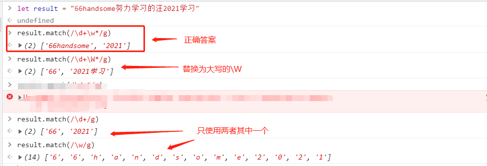
>
>所以选第三个

### 2、 以下代码页面输出结果为（   ）

>```js
>var str1=new RegExp("e");
>document.write(str1.exec("hello"));
>//下方是选项
>e
>null
>TRUE
>其他几项都不对
>```
>
>##### 知识点梳理:
>
>>  - **exec()** 方法用于检索字符串中的正则表达式的匹配, 如果字符串中有匹配的值返回该匹配值构成的数组 
>>  - exec中，hello匹配成功"e"，document.write将数组转换为字符串e
>
>##### 答案解析
>
>1. 返回值:返回一个数组, 其中存放匹配的结果。如果未找到匹配, 则返回值为 null。
>
>>所以"e".exec("hello")中,"e"是正则表达式, "hello"是检索的字符串。在"hello"字符串中, 能够匹配到"e"。因此document.write("e"); 最后结果为e。
>
>2. 说明
>
>>exec() 方法的功能非常强大, 它是一个通用的方法, 而且使用起来也比 test() 方法以及支持正则表达式的 String 对象的方法更为复杂。
>>如果 exec() 找到了匹配的文本, 则返回一个结果数组。否则返回 null。此数组的第 0 个元素是与正则表达式相匹配的文本, 第 1 个元素是与 RegExpObject 的第 1 个子表达式相匹配的文本（如果有的话）, 第 2 个元素是与 RegExpObject 的第 2 个子表达式相匹配的文本（如果有的话）, 以此类推。除了数组元素和 length 属性之外, exec() 方法还返回两个属性。index 属性声明的是匹配文本的第一个字符的位置。input 属性则存放的是被检索的字符串 string。我们可以看得出, 在调用非全局的 RegExp 对象的 exec() 方法时, 返回的数组与调用方法 String.match() 返回的数组是相同的。
>>但是, 当 RegExpObject 是一个全局正则表达式时, exec() 的行为就稍微复杂一些。它会在 RegExpObject 的 lastIndex 属性指定的字符处开始检索字符串 string。当 exec() 找到了与表达式相匹配的文本时, 在匹配后, 它将把 RegExpObject 的 lastIndex 属性设置为匹配文本的最后一个字符的下一个位置。这就是说, 您可以通过反复调用 exec() 方法来遍历字符串中的所有匹配文本。当 exec() 再也找不到匹配的文本时, 它将返回 null, 并把 lastIndex 属性重置为 0。
>
>3. 所以页面输出结果为 e

# 三、变量相关

## Ⅰ- 单选题

### 1、关于对变量的说法，错误的是？

>```js
>一般使用 var key; 的形式声明
>由于javascript的动态特性，常常直接采取 key= val; 的形式 声明与赋值
>若声明而未对变量赋值，该变量的值为undefined
>var carname="Volvo";var carname;顺序执行后，carname的值依然为Volvo
>```
>
>##### 答案解析:
>
>>- 解释第一、二选项: javascript 一般使用var key = val；的声明与赋值，声明变量的时候也要用var key； 如果不用var关键字，声明的就是全局变量，一般不要这么做；
>>- 解释第三、四选项：(变量声明提升)JS代码执行时候，先扫一遍JS代码，进行JS变量定义，定义时候不赋值(undefined)，结束完成后，开始执行JS代码，当执行到赋值语句的时候，开始给变量赋值。
>>- 所以第二项错误

### 2、以下代码执行后，控制台的输出是：

>```js
>var a = 10;
>function a(){}
>console.log(typeof a)
>//以下是选项
>&quot;number&quot;
>&quot;object&quot;
>&quot;function&quot;
>&quot;undefined&quot;
>```
>
>##### 知识点梳理:
>
>* 字符转义知识点: **& quot;**  === "" 其实就是双引号的文字表记
>* 函数提升大于变量提升，变量提升会提升到除函数声明的后面；
>
>##### 答案解析:
>
>>以下给出实际解析后代码
>
>```js
>var a = function (){} //函数提升,优先级高于变量提升,所以即便在变量后面声明,仍然顶在变量前方
>var a;    //这边不是因为什么之后重声明才变为number，是因为变量赋值才变的
>a = 10;   //如果有多个var a ,那a的类型最后就会是最后赋值操作的参数类型。  
>console.log(typeof a)
>```
>
>>所以可以明显知道,答案会是number

## Ⅱ - 不定项选择题

### 1、下列哪些是javascript原始数据类型。

>```js
>String
>Null
>Undefined
>Object
>Boolean
>Number
>```
>
>##### 知识点梳理
>
>1. **原始(基础)类型: ==>  unn ssbb**
>
>>  - undefined
>>  - null
>>  - Number
>>  - String
>>  - Symbol : ES6 系列新增
>>  - Boolean
>>  - Bigint : ES2020 系列：新增基本数据类型 BigInt
>
>2. **内置类型（Built-in)**
>
>>Undefined Null  Number String  Symbol Bigint  Boolean **Object**
>
>3. **对象(引用)类型 ==> 所以对象比较特殊**
>
>>  - Object: 任意对象
>>  - Function: 一种特别的`对象`(可以执行)  -->内部包含可运行的代码
>>  - Array: 一种特别的`对象`(`key`为数值下标属性, 内部数据是有序的)
>
>4. **原始值**
>
>>  - 除 Object 以外的所有类型都是不可变的（值本身无法被改变）。
>>  - 例如，与 C 语言不同，JavaScript 中字符串是不可变的
>>  - 译注：如，JavaScript 中对字符串的操作一定返回了一个新字符串，原始字符串并没有被改变）。我们称这些类型的值为“原始值”
>
>5. **原始类型和对象类型的区别，总结起来就是**：
>
>>| 类型       | 原始类型 | 对象类型     |
>>| ---------- | -------- | ------------ |
>>| 值         | 不可改变 | 可以改变     |
>>| 属性和方法 | 不能添加 | 能添加       |
>>| 存储值     | 值       | 地址（指针） |
>>| 比较       | 值的比较 | 地址的比较   |
>
>##### 答案解析
>
>>除了Oject,其他的全选

# 四、运算符、类型转换 相关

> 此部分相关知识点不懂得可以尝试百度 [ js Operators logical ] 关键词了解详情

## Ⅰ- 单选题

### 1、下面代码结果分别是什么?

>```js
>console.log(([])?true:false); 
>console.log(([]==false?true:false)); 
>console.log(({}==false)?true:false) 
>//下面是选项
>false true true
>true true true
>true false true
>true true false
>```
>
>##### 知识点梳理:
>
>>此题考察类型转换，三元运算符先**分清是非**，再决定今后该走哪条路，“==”运算符比较 会 **"更喜欢"** 用Number类型来进行比较
>
>1. **== 运算符（两个操作数的类型不相同时）**
>
>  - 如果一个值是null，另一个值是undefined，则它们相等
>  - 如果一个值是数字，另一个值是字符串，先将字符串转换为数学，然后使用转换后的值进行比较。
>  - 如果其中一个值是true，则将其转换为1再进行比较。如果其中的一个值是false，则将其转换为0再进行比较。
>  - 如果一个值是对象，另一个值是数字或字符串，则将对象转换为原始值，再进行比较。
>
>2. **对象到数字的转换**
>
>  - 如果对象具有valueOf()方法，后者返回一个原始值，则JavaScript将这个原始值转换为数字（如果需要的话）并返回一个数字。
>  - 否则，如果对象具有toString()方法，后者返回一个原始值，则JavaScript将其转换并返回。（对象的toString()方法返回一个字符串直接量（之前所说的原始值），JavaScript将这个字符串转换为数字类型，并返回这个数字）。
>  - 否则，JavaScript抛出一个类型错误异常。
>
>3. **空数组转换为数字0**
>
>  - 数组继承了默认的valueOf()方法，这个方法返回一个对象而不是一个原始值，因此，数组到数学的转换则调用toString()方法。空数组转换为空字符串，空字符串转换为数字0.
>
>##### 答案解析
>
>```js
>console.log(Boolean([])); //true
>console.log(Number([])); //0
>console.log(Number({})); // NaN
>console.log(Number(false)); //0
>//所以题目可以这样转换
>console.log(([])?true:fasle);// => console.log((true)?true:false);
>console.log([]==false?true:false); // => console.log(0==0?true:false);
>console.log(({}==false)?true:false); // => console.log((NaN==0)?true:false);
>```
>
> 

### 2、以下哪个表达式的值为true？

>```js
>'1' === 1
>isNaN(1/0)
>1 in [1]
>1 && 2 > 1
>```
>
>##### 知识点梳理
>
>- 考查函数的优先级  -->  [可以点我传送](https://developer.mozilla.org/en-US/docs/Web/JavaScript/Reference/Operators/Operator_Precedence)
>
>- `isNaN()` 函数用来确定一个值是否为[NaN](https://developer.mozilla.org/zh-CN/docs/Web/JavaScript/Reference/Global_Objects/NaN) 
>
>- 考察对于逻辑符 “&&”和‘||’ 的理解:
>
>  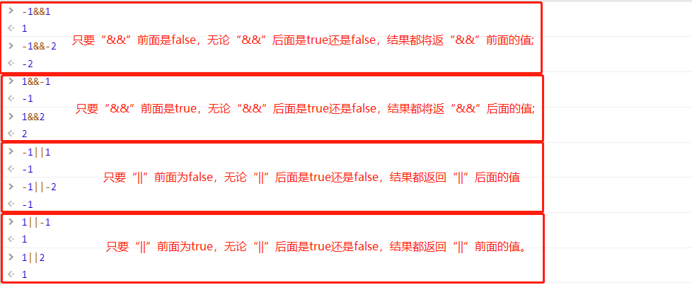 
>
>##### 答案解析
>
>1. A选项，'1'是字符串string，1是数字number。类型不一样，===下比较返回false。
>
>2. B选项。
>
>  >- 任何数值除以0都会导致错误而终止程序执行。但是在 JavaScript 中，**会返回出特殊的值**，因此不会影响程序的执行。
>  >- 比0大的数除以0，则会得到无穷大，所以 js 用 `Infinity` 来显示出来。
>  >- 也就是1/0得到的是Infinity。isNaN(1/0)返回的是false。但是isNaN(0/0)返回的就是true
>
>3. C选项。
>
>  >- in操作符，对于数组属性需要指定数字形式的**索引值**来表示数组的属性名称（固有属性除外，如length）。
>  >- 所以说在这里，1 in [1]并不是表示数字1在不在数组里。而是表示数组中含不含有1这个索引index值。
>  >- 数组长度为1，所以只含有的index值为0，这个表达式返回fasle。
>
>4. D选项。
>
>  > * 1 && 2 > 1，先判断右边的表达式，2>1返回true。1 && true返回的结果也是true。

### 3、以下Js程序的输出是什么（）

>```js
>var a="undefined";
>var b="false";
>var c="";
>function assert(aVar){
>if(aVar) alert(true);
>else  alert(false);
>}
>assert(a);
>assert(b);
>assert(c);
>//以下是选项
>true，true，true
>true，true，false
>false，false，true
>false，false，false
>```
>
>##### 知识点梳理:
>
>- `if(condition)`  的condition求值结果若非布尔值，ECMAScript会自动调用Boolean()转换函数将结果转换为布尔值。转换规则为：
>
> > | 数据类型  | 转换为true     | 转换为false |
> > | --------- | -------------- | ----------- |
> > | boolean   | true           | false       |
> > | String    | 任何非空字符串 | 空字符串    |
> > | Number    | 任何非零数字值 | 0和NaN      |
> > | Object    | 任何对象       | null        |
> > | Undefined |                | undefined   |
>
>- JavaScript里面的六种假值：false、0、''''、undefined、null、NaN
>
>##### 答案解析:
>
>此题会错应该主要就是被误导了,题中 "undefined","false" 是字符串!!!
>
>变量abc都是字符串型的变量，而不是真正的undefined和false，在判断里都会被认为是真值，显示true，只有空串为false
>
>所以选择B

### 4、JavaScript定义var a="30",var b=8,则执行a%b会得到 ?

>```js
>//以下是选项
>undefined
>6
>"6"
>null
>```
>
>##### 知识点梳理
>
>>* 运算中，如果是数字与字符串的加法运算，那么数字会被转化为字符串，进行字符串拼接 其他运算的时候，字符串会被转化为数字，然后进行运算
>>* % --> 余数指整数除法中被除数未被除尽部分，且余数的取值范围为0到除数之间（不包括除数）的整数。
>
>##### 答案解析
>
>> 30/8得3余6 所以答案是B

### 5、下面结果为真的表达式是：

>```js
>null instanceof Object
>null === undefined
>null == undefined
>NaN == NaN
>```
>
>##### 知识点梳理
>
>1. **instanceof**运算符希望左操作数是一个对象，右操作数表示对象的类（初始化对象的构造函数）。如果左侧的对象是右侧对象的实例，返回true，否则返回false。 
>   - 例如：计算o instanceof f   首先计算f.prototype，然后在原型链中查找o，找到返回true 
>2. **===**严格相等运算符：首先计算其操作数的值，然后比较这两个值，比较过程中没有任何类型转换 
>3. **==**相等运算符：如果两个操作数不是同一类型，那么会尝试进行一些类型转换，然后进行比较
>4. MDN相等性判断表格(实际上也不用去背,理解即可):
>
>|           | Undefined | Null    | Number                | String                        | Boolean                       | Object                        |
>| :-------- | :-------: | ------- | --------------------- | ----------------------------- | ----------------------------- | ----------------------------- |
>| Undefined |  `true`   | `true`  | `false`               | `false`                       | `false`                       | `IsFalsy(B)`                  |
>| Null      |  `true`   | `true`  | `false`               | `false`                       | `false`                       | `IsFalsy(B)`                  |
>| Number    |  `false`  | `false` | `A === B`             | `A === ToNumber(B)`           | `A=== ToNumber(B)`            | `A== ToPrimitive(B)`          |
>| String    |  `false`  | `false` | `ToNumber(A) === B`   | `A === B`                     | `ToNumber(A) === ToNumber(B)` | `ToPrimitive(B) == A`         |
>| Boolean   |  `false`  | `false` | `ToNumber(A) === B`   | `ToNumber(A) === ToNumber(B)` | `A === B`                     | ToNumber(A) == ToPrimitive(B) |
>| Object    |   false   | false   | `ToPrimitive(A) == B` | `ToPrimitive(A) == B`         | ToPrimitive(A) == ToNumber(B) | `A === B`                     |
>
>##### 答案解析
>
>1. null instanceof Object: false
>   - 此处可能有同学会提出疑惑:在js中 typeof null会返回object,那为什么**null instanceof Object 会返回 false**?
>   - 我的理解是：null的类型是object，这是由于历史原因造成的。1995年的 JavaScript 语言第一版，只设计了五种数据类型（对象、整数、浮点数、字符串和布尔值），没考虑null，只把它当作object的一种特殊值。因此null并不是Object实例化的对象，再后来null独立出来，作为一种单独的数据类型，为了兼容以前的代码，typeof null返回object就没法改变了
>2. B与C选项
>   -  null和undefined是不同的，但它们都表示“值的空缺”，判断相等运算符“==”**两者是相等的者往往可以互换，因此==运算符认为两者是相等的**,如果要进行正确判断要使用严格相等运算符“===”来区分它们。
>3. D选项
>   - NaN表示非数字值,是一个不确定数,所以NaN不能等于NaN
>   - 特殊之处：它和任何值都不相等，包括自身。
>   - 判断NaN的方法：**x!=x返回true**
>4. 所以选择C

### 6、下面程序的显示结果是?

>```js
>var x = new Boolean(false);
>if (x) {
>alert('hi'); 
>}
>var y = Boolean(0);
>if (y) {
>alert('hello');  
>}
>```
>
>##### 知识点梳理
>
>1. 详情可以查阅[MDN的Boolean相关资料](https://developer.mozilla.org/zh-CN/docs/Web/JavaScript/Reference/Global_Objects/Boolean)
>2. 注意点: 要分清 **new Boolean()** 与 **Boolean()**的区别:
>  -  
>  -  **任何对象转为布尔值，都为得到 true**（**切记！在 JS 中，只有 0，-0，NaN，""，null，undefined 这六个值转布尔值时，结果为 false**）包括 `布尔对象`
>
>##### 答案解析:
>
>1. if(x) 这里期望 x 是一个布尔类型的原始值，而 x 是一个对象，**任何对象转为布尔值，都为得到 true**（**切记！在 JS 中，只有 0，-0，NaN，""，null，undefined 这六个值转布尔值时，结果为 false**）。      
>2. 题目的第二部分，一定要注意 **y = Boolean(0)**，**而不是 y = new Boolean(0)。**
>
>  - 这两个有很大区别，用 new 调用构造函数会新建一个布尔对象，此处没有加 new，进行的是显示类型转换，
>  - 正如上述第一条所说，0 转换布尔，结果为 false，所以此时 y 的值就是 false。
>  - 如果加了 new，那么 y 就是一个 Boolean 类型的对象，执行 if(y) 时，对象转布尔，始终是 true，所以结果会与不加 new 的时候相反。
>
>3. 所以会打印 'hi'


## Ⅱ- 不定项选择题

### 1、 以下哪些表达式的值为 0 ？

>```js
>(()=>{}).length
>1 & 2
>+[]
>[1,2,-3].reduce((a, b) => a - b, 0) //第一个参数是累加器,第二个参数是当前传入值
>```
>
>##### 知识点梳理
>
>> `reduce()` 方法对数组中每个元素执行一个由您提供的**reducer**函数（升序执行），将其结果汇总为单个返回值。
>
>##### 答案解析
>
>1. (()=>{}).length; 获取方法形参个数，形参为0  
>
>2. 1=0001 2=0010 按位与运算，同为1才为1，否则返回0  
>
>3. +[] 隐式类型转换，因为[]是对象，所以 toPrimitive -> valueOf -> toString为 ' ' -> Number("") ==0   结果就是+''===0  
>
>4. reduce对数组中的每个元素执行一个reducer函数(升序执行)，将其结果汇总为单个返回值。a为累计器累计回调的返回值，b为数组的每一项元素，传入初始值0->0-(1)->(-1)-2->(-3)-(-3)->0
>
>   - reduce接受2个参数，回调函数和初始值。在[1,2,-3].reduce((a,b)=>a-b,0)中，回调函数为(a,b)=>a-b，初始值为0，那么进行回调的过程如下：
>
>   - | 回调次数   | previousValue     | currentValue | currentIndex | array    | 运算过程    | 返回值 |
>     | :--------- | ----------------- | ------------ | ------------ | -------- | :---------- | :----- |
>     | 第一次回调 | 0（设置的初始值） | 1            | 0            | [1,2,-3] | 0-1         | -1     |
>     | 第二次回调 | -1                | 2            | 1            | [1,2,-3] | (0-1)-2     | -3     |
>     | 第三次回调 | -3                | -3           | 2            | [1,2,-3] | ((0-1)-2)-3 | 0      |

## Ⅲ - 填空题

> 如果要看更多JS面试题目可以点这里  --> **[JavaScript专项练习](https://gitee.com/hongjilin/hongs-study-notes/tree/master/面试_面试题整理/JavaScript专项练习)**

### 1、求下方打印结果 ()

>```js
>var a = 18;
>var b = "努力学习的汪";
>var c = false;
>var d = a && b || c ? c || b ? a : c && b : a ;
>console.log(d)
>```
>
>##### 知识点梳理以及答案解析
>
>1. **&& 运算符的优先级高于 ||，而 || 的优先级又高于?** : 
>
>  - 所以我们对它进行第一次分解：**`((a && b) || c) ? (c || b) ? a : (c && b) : a`**
>
>2. **? : 是右关联**
>
>  - 例如: a ? b : c ? d : e  --> a ? b : (c ? d : e)
>  - 所以进一步对上方进行分解 : **`((a && b) || c) ? ((c || b) ? a : (c && b)) : a`**
>
>3.  **对于&&来说，如果条件判断结果为true就会返回第二个操作数的值，如果为false就会返回第一个操作数的值**
>
>  - 此知识点在本人笔记 [JS中的逻辑运算符详解笔记](https://gitee.com/hongjilin/hongs-study-notes/tree/master/编程_前端开发学习笔记/HTML+CSS+JS基础笔记/JavaScript笔记/JS中的逻辑运算符详解笔记.md) 部分已经给出了详细解释
>  - 所以对上方式子进行初步运算后可以得出: **`b ? ((c || b) ? a : c) : a`**  
>
>4. **对于 || 来说，如果条件判断结果为true就会返回第一个操作数的值，如果为false就会返回第二个操作数的值；**
>
>  - 此知识点在本人笔记 [JS中的逻辑运算符详解笔记](https://gitee.com/hongjilin/hongs-study-notes/tree/master/编程_前端开发学习笔记/HTML+CSS+JS基础笔记/JavaScript笔记/JS中的逻辑运算符详解笔记.md) 部分已经给出了详细解释
>  - 所以对上方式子进行初步运算后可以得出: **`b ? (b ? a : c) : a`**
>
>5. 此时结果就非常明了了,下面给出结果变化
>
>  -  **`b ? (b ? a : c) : a`** ==> true ? ( "努力学习的汪" ? 18 : false) : 18
>  -  经过隐式转换后 : **true ? (true ? 18: false) : 18**
>  -  三元运算符可知,当**?**前为**true**,返回**:**前方的值` (true ? 18: false)`,在进行一次三元 可得结果为`18`


# 五、API方法理解相关

> 此部分主要还是靠死记硬背了

## Ⅰ- 单选题

### 1、 下列代码中 hasOwnProperty 的作用是？

>```js
>var obj={}
>obj.hasOwnProperty("val")
>//下面是选项
>判断obj对象是否具有val属性
>判断obj对象是否具有val的值
>判断obj的原型对象是否具有val的属性
>判断obj的原型对象是否具有val的值
>```
>
>##### 知识点梳理
>
>>**[hasOwnProperty](https://developer.mozilla.org/zh-CN/docs/Web/JavaScript/Reference/Global_Objects/Object/hasOwnProperty)：** 是用来判断一个对象是否有你给出名称的属性或对象。不过需要注意的是，此方法无法检查该对象的原型链中是否具有该属性，该属性必须是对象本身的一个成员。
>
>>**isPrototypeOf :** 是用来判断要检查其原型链的对象是否存在于指定对象实例中，是则返回true，否则返回false。
>
>##### 答案解析
>
>> 选择A

### 2、在 javascript 中，用于阻止默认事件的默认操作的方法是:

>```js
>stopDeafault()
>stopPropagation()
>preventPropagation()
>preventDefaultEven()
>preventDefault()
>```
>
>##### 知识点梳理
>
>下面三个事件都是事件对象的方法：
>
>- `stopPropagation()` 阻止事件冒泡。 这个事件不会阻止定义在元素上的其他事件。 
>- `stopImmediatePropagation()` 会彻底的阻止事件， 在其之后的绑定在元素上的其他监听事件都不会触发
>- `preventDefault()` 阻止事件的默认动作，例如a链接的跳转，在a链接跳转中，需要先对a链接绑定点击事件，然后在a链接的事件对象中调用该方法即可。
>
>##### 答案解析
>
>> E

### 3、setTimeout(“go()”, 10);表示的意思是()

>```js
>间隔10秒后，go()函数执行一次
>go()函数持续调用10次
>间隔10毫秒后，go()函数执行一次
>间隔10分钟后，go()函数执行一次
>```
>
>##### 知识点梳理
>
>* setInterval() 方法可按照指定的周期（以毫秒计）来调用函数或计算表达式。 
>* setTimeout() 是属于 window 的方法，该方法用于在指定的毫秒数后调用函数或计算表达式。
>* JavaScript中setInterval和setTimeout第一个参数加与不加引号的区别? --> [不知道的点我传送](https://gitee.com/hongjilin/hongs-study-notes/blob/master/%E7%BC%96%E7%A8%8B_%E5%89%8D%E7%AB%AF%E5%BC%80%E5%8F%91%E5%AD%A6%E4%B9%A0%E7%AC%94%E8%AE%B0/HTML+CSS+JS%E5%9F%BA%E7%A1%80%E7%AC%94%E8%AE%B0/JavaScript%E7%AC%94%E8%AE%B0/setInterval%E5%92%8CsetTimeout%E7%AC%AC%E4%B8%80%E4%B8%AA%E5%8F%82%E6%95%B0%E5%8A%A0%E4%B8%8E%E4%B8%8D%E5%8A%A0%E5%BC%95%E5%8F%B7%E7%9A%84%E5%8C%BA%E5%88%AB.md)
>
>##### 答案解析
>
>> * 首先 setTimeout 是超时方法,所以排除B选项,其次第二个参数单位是毫秒,所以排除A、D项,所以选择C
>> * 个人认为其实答案可能稍微有点不严谨,换成:**10ms后把执行这个方法的任务推入到宏任务队列中**,可能更好些
>> * 对于宏任务与微任务不理解的同学可以看这里 --> [宏任务( macro task )与微任务( micro task )](https://gitee.com/hongjilin/hongs-study-notes/tree/master/%E7%BC%96%E7%A8%8B_%E5%89%8D%E7%AB%AF%E5%BC%80%E5%8F%91%E5%AD%A6%E4%B9%A0%E7%AC%94%E8%AE%B0/HTML+CSS+JS%E5%9F%BA%E7%A1%80%E7%AC%94%E8%AE%B0/JavaScript%E7%AC%94%E8%AE%B0#%E2%85%A2-%E5%AE%8F%E4%BB%BB%E5%8A%A1macro-task%E4%B8%8E%E5%BE%AE%E4%BB%BB%E5%8A%A1micro-task)

### 4、下面哪个选项中的对象与浏览列表有关（ ）

>```js
>window,location
>location,history
>navigator,window
>historylist,location
>```
>
>##### 知识点梳理以及解析
>
>>* 往上找了一圈,对于浏览器列表具体定义并没有找到,但是觉得应该指的是 **JS的BOM对象**
>>* 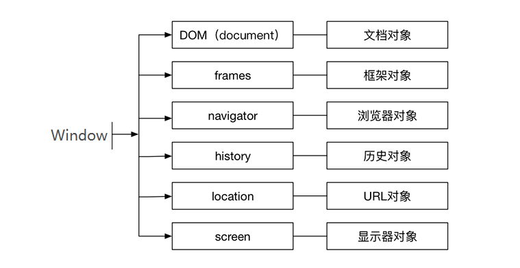 
>>*  所以符合条件的为B选项


## Ⅱ - 不定项选择

### 1、下面哪些方式在同一个窗口下能够检测一个js对象是数组类型？

>```js
>Array.isArray()
>instanceof
>typeof
>Object.prototype.toString.call()
>```
>
>##### 知识点梳理
>
>>* **Array.isArray()** 用于确定传递的值是否是一个 [Array](https://developer.mozilla.org/zh-CN/docs/Web/JavaScript/Reference/Global_Objects/Array)。
>>* **instanceof** 运算符用来判断一个构造函数的prototype属性所指向的对象是否存在另外一个要检测对象的原型链上.其内部机制是通过判断对象的原型链中是不是能找到类型的 prototype 。
>>* **typeof** 操作符返回一个字符串，表示未经计算的操作数的类型。
>>* **Object.prototype.toString.call()** 常用于判断浏览器内置对象。 
>
>##### 答案解析
>
>1. A选项没啥好说的,原生支持的方法
>
>   >  
>
>2. B选项 **instanceof** 运算符返回一个布尔值，表示对象是否为某个构造函数的实例,这时可能就有同学要提出疑问了:
>
>   - 我用这个方法,似乎无法分辨数组与对象的区别啊, arr instanceof Array/Object 似乎都会返回 **true** !这不是不严谨吗?
>   - 注意审题:检测一个JS对象是数组类型,既定的事实是我们当前是一个对象,然后要判断它是否为数组,不懂直接看图解 
>   - 
>
>3. C选项 **typeof** 能判断类型有：number、string、boolean、symbol、undefined、function； 
>
>   -  **object、array、null**的变量都返回 object,所以错
>
>4. D选项直接上图
>
>   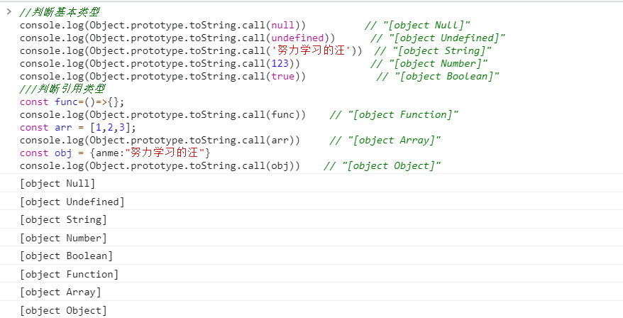 

### 2、对于代码 var a = 10.42; 取出 a 的整数部分，以下代码哪些是正确的？

>```js
>parseInt(a);
>Math.floor(a);
>Math.ceil(a);
>a.split('.')[0];
>```
>
>##### 答案解析
>
>>1.  A. parseInt转换为整数，默认为10进制，结果为10 
>>2.  B. floor向下取整，结果为10 
>>3. C. ceil向上取整，结果为11 
>>4.  D. split操作数必须为**正则或字符串**，结果为TypeError
>>   - 这是String方法
>>   - 如果想正确修改需要这样调用: String.prototype.split.call(a,'.')[0]

# 六、this指向相关

> 此处知识点不懂的可以看本人 [JS进阶笔记函数的this部分](https://gitee.com/hongjilin/hongs-study-notes/tree/master/%E7%BC%96%E7%A8%8B_%E5%89%8D%E7%AB%AF%E5%BC%80%E5%8F%91%E5%AD%A6%E4%B9%A0%E7%AC%94%E8%AE%B0/HTML+CSS+JS%E5%9F%BA%E7%A1%80%E7%AC%94%E8%AE%B0/JavaScript%E7%AC%94%E8%AE%B0#%E2%85%B4-%E5%87%BD%E6%95%B0%E4%B8%AD%E7%9A%84this),本人给出了详细的笔记梳理

## Ⅰ- 单选题

>```js
>var user = {
>count : 1,
>getCount: function(){
>return this.count;
>}
>}
>var func = user.getCount
>console.log(func())
>//以下是选项
>this.count
>1
>报错
>undefined
>```
>
>##### 知识点梳理
>
>1. 调用对象未声明的属性会返回 undefined
>
>   >   ```js
>   >   const user={};
>   >   console.log(user.name);//undefined
>   >   ```
>
>2. 使用未赋值只声明的基本数据类型会返回 undefined
>
>   >   ```js
>   >   const one;
>   >   console.log(one);//undefined
>   >   ```
>
>3. 使用未声明的变量会报错
>
>   >   ```js
>   >   console.log(two);// Uncaught ReferenceError: two is not defined
>   >   ```
>
>4. this对象在运行的时候是基于 **函数执行的环境** 绑定的：在全局环境中this等于window，而函数被作为某个对象的方法调用时，this等于那个对象。
>
>##### 答案解析
>
>1. 在本题中，this指向的是window,window对象已经自动被浏览器声明了，只是还没有声明count属性，所以也是undifned
>
>2. 可能有小伙伴会问:这个this不是应该指向user吗？想问下为啥指向window呢？
>
>  >因为func=user.getCount只是保存了getCount函数，并没有执行，该函数是在console里面执行，func()就相当于user.getCount()，一看是像user调用，其实func()就相当于一个全局的函数，实际上是window.func() ,也就是window.user.getCount()  
>
>3. 综上所述可以得知,结果为undefined

## Ⅱ - 不定项选择

### 1、下面this对象的理解正确的是 ()

>```js
>在不改变this指向的前提下，this总是指向函数的直接调用者
>如果有new关键字，this指向new出来的那个对象
>this总是指向函数的非间接调用者
>IE中attachEvent中的this总是指向全局对象Window
>```
>
>##### 答案解析:
>
>1. A选项可能有同学提出一个疑惑:那我如果在对象方法中声明一个箭头函数,那即便我用这个对象的实例去调用,指向仍是window怎么是对的?
>
>   >这里需要澄清一个事情: 箭头函数原则上是没有this的，我们口中的this只是一种解释原型链的东西，但是官方是没有this的，所以，这二者怎么能相提并论呢？所以这种情况是不考虑进来的
>   >
>   >
>   >
>   >如果对于此处仍有疑虑的同学,可以看本人   [JS进阶笔记函数的this部分](https://gitee.com/hongjilin/hongs-study-notes/tree/master/%E7%BC%96%E7%A8%8B_%E5%89%8D%E7%AB%AF%E5%BC%80%E5%8F%91%E5%AD%A6%E4%B9%A0%E7%AC%94%E8%AE%B0/HTML+CSS+JS%E5%9F%BA%E7%A1%80%E7%AC%94%E8%AE%B0/JavaScript%E7%AC%94%E8%AE%B0#%E2%85%A4-%E5%87%BD%E6%95%B0%E4%B8%AD%E7%9A%84this),我会在此处给出详细记录解释
>
>2. 有new关键字指的就是构造函数生成的实例,所以是对的
>
>3. C选项错在 ”**总是**“，apply,call就可以改变this指向
>
>4. D选项: Window.attachEvent就是window调用,所以指向就是window
>
>5. 所以选择ABD

# 七、闭包相关

> 此部分知识点如果不够梳理,可以看本人JS笔记中对于  [闭包的详细描述](https://gitee.com/hongjilin/hongs-study-notes/tree/master/%E7%BC%96%E7%A8%8B_%E5%89%8D%E7%AB%AF%E5%BC%80%E5%8F%91%E5%AD%A6%E4%B9%A0%E7%AC%94%E8%AE%B0/HTML+CSS+JS%E5%9F%BA%E7%A1%80%E7%AC%94%E8%AE%B0/JavaScript%E7%AC%94%E8%AE%B0#5%E9%97%AD%E5%8C%85)  

## Ⅰ - 单选题

### 1、下面这个JS程序的输出是什么：

>```js
>function Foo() {
>var i = 0;
>return function() {
>console.log(i++);
>}
>}
>var f1 = Foo(), f2 = Foo();
>f1();
>f1();
>f2();
>//以下是选项
>0 1 0
>0 1 2
>0 0 0
>0 0 2
>```
>
>##### 知识点梳理
>
>1. Function是引用类型：保存在堆中，变量f1,f2是保存在栈中； 
>2. 闭包：一个函数（产生新的作用域）定义的局部变量、子函数的作用域在函数内， 但是一旦离开了这个函数，局部变量就无法访问   -->  [关于闭包详细笔记请看](https://gitee.com/hongjilin/hongs-study-notes/tree/master/%E7%BC%96%E7%A8%8B_%E5%89%8D%E7%AB%AF%E5%BC%80%E5%8F%91%E5%AD%A6%E4%B9%A0%E7%AC%94%E8%AE%B0/HTML+CSS+JS%E5%9F%BA%E7%A1%80%E7%AC%94%E8%AE%B0/JavaScript%E7%AC%94%E8%AE%B0#5%E9%97%AD%E5%8C%85)  
>3. 作用域:篇幅较长,所以放一个索引,需要的同学可以去查阅 -->  [作用域相关知识点笔记](https://gitee.com/hongjilin/hongs-study-notes/tree/master/%E7%BC%96%E7%A8%8B_%E5%89%8D%E7%AB%AF%E5%BC%80%E5%8F%91%E5%AD%A6%E4%B9%A0%E7%AC%94%E8%AE%B0/HTML+CSS+JS%E5%9F%BA%E7%A1%80%E7%AC%94%E8%AE%B0/JavaScript%E7%AC%94%E8%AE%B0#3%E4%BD%9C%E7%94%A8%E5%9F%9F%E4%B8%8E%E4%BD%9C%E7%94%A8%E5%9F%9F%E9%93%BE)
>4. 运算符: i++与++i的区别:
>
>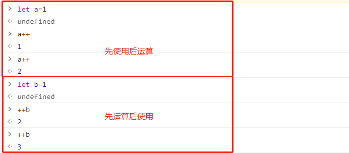 
>
>##### 答案解析
>
>>var f1, f2=Foo()中，先执行Foo():i=0 ; return返回一个函数给f1、f2
>
>* 第一次f1() :   (f1指向子函数 :**f1()=function(){console.log(i++)},**  因为子函数没有定义i，所以向上找到父函数定义的 i:   )并执行子函数 输出i=0,再自加 i =1(覆盖了父函数Foo 的 i值);
>* 第二次f1() :   执行的是子函数 **Function(){console.log(i++)}**,输出的是父函数 的 i=1,再自加 i =2;
>* 第一次f2() :  此处同**第一次f1()**,不同的是 f2指向堆中一个新的对象 function(){ ...},所以此i非彼i,输出i=0;如果如果再次f2(),那么和第二次f1(),一样输出i=1; 
>* 所以答案为0 1 0

### 2、下面的输出结果是?

>```js
>(function() {
> var a = b = 5;
>})();   
>console.log(b);
>console.log(a);
>```
>
>##### 知识梳理
>
>> * 连续的赋值运算符表达式，是从右往左
>> * JS声明变量与不声明变量直接使用的区别 -->  **[点我传送 ](https://gitee.com/hongjilin/hongs-study-notes/tree/master/编程_前端开发学习笔记/HTML+CSS+JS基础笔记/JavaScript笔记/JS声明变量与不声明变量直接使用的区别.md)** 
>> * 闭包、自执行函数相关知识点   -->  [关于闭包详细笔记请看](https://gitee.com/hongjilin/hongs-study-notes/tree/master/%E7%BC%96%E7%A8%8B_%E5%89%8D%E7%AB%AF%E5%BC%80%E5%8F%91%E5%AD%A6%E4%B9%A0%E7%AC%94%E8%AE%B0/HTML+CSS+JS%E5%9F%BA%E7%A1%80%E7%AC%94%E8%AE%B0/JavaScript%E7%AC%94%E8%AE%B0#5%E9%97%AD%E5%8C%85)  
>
>##### 答案解析
>
>1. 考点一: JS声明变量与不声明变量直接使用的区别
>
>   - ```js
>     var a = b = 5 //相当于拆解成  ==> b = 5; var a = b; 
>     ```
>
>   - **b = 5** 前面没有var，相当于声明为全局变量（这种方式在严格模式下会报错，此题不考虑)
>
>   - ```js
>     //所以就相当于
>     (function(){
>         window.b = 5; 
>         var a = b; //当前作用域下找不到 [ b ] 就会一层层往上找,直到找到最顶层对象 [ window.b]
>     })(); wang
>     console.log(b); //5
>     console.log(a); //报错,因为找不到  -->原因是考点二
>     ```
>
>2. 考点二:闭包知识点相关
>
>   而这里a因为是在函数内，所以函数运行后会自动销毁变量 [ a ] ;所以在外部打印 [ a ] 时找不到此变量,在window上也找不到,就报错了
>
>3. 陷阱:
>
>   - 在函数表达式中有两个赋值，但a是用关键字var 来声明的，这意味着a是局部变量，而b则被赋予为全局变量。
>
>   - 它并没有使用 **严格模式(use  strict)**。在函数里面，如果启用了严格模式，代码就会报错：“Uncaught ReferenceError: b is not  defined”。请记住，严格模式需要你显式地引用全局作用域，代码应该写成
>
>     ```js
>     (function() {
>     'use strict';
>     var a = window.b = 5;
>     })();
>     console.log(b);
>     ```

# 八、ES系列相关

> 关于ES系列详细笔记可以看这里  --> **[ES6及后续版本学习笔记](https://gitee.com/hongjilin/hongs-study-notes/tree/master/编程_前端开发学习笔记/ES6及后续版本学习笔记)** 

## Ⅰ - 单选题

### 1、以下符合 ES6 写法的有：

>```js
>/*-------A-----*/
>class Foo
>{
>	constructor() {return Object.create(null);}
>}
>Foo()
>/*-------B-----*/
>var m=1;
>export m;
>/*-------C-----*/
>export var firstName=’Michael’;
>/*-------D-----*/
>在A模块中 export{ readFile } 后
>在B模块中 import readFile from 'A' 可以获取到 readFile
>```
>
>##### 知识梳理
>
>> * 详细知识点主要在ES6的  导入导出 class相关部分,查阅详情请看 --> **[ES6及后续版本学习笔记](https://gitee.com/hongjilin/hongs-study-notes/tree/master/编程_前端开发学习笔记/ES6及后续版本学习笔记)** 
>> * constructor方法是类的默认方法，通过new命令生成对象实例时，自动调用该方法。一个类必须有 **constructor** 方法，如果没有显式定义，一个空的 **constructor** 被默认添加。
>
>##### 答案解析
>
>1. A: FOO是一个类, 类必须使用new调用，否则会报错。这是它跟普通构造函数的一个主要区别，后者不用new也可以执行。
>
>2. B: **export** 命令规定的是对外的接口，必须与模块内部的变量建立一一对应关系。
>
>  - 错误写法:
>
>    >```js
>    >// 报错
>    >export 1;
>    >// 报错
>    >var m = 1;
>    >export m;
>    >```
>    >
>    >上面两种写法都会报错，因为没有提供对外的接口。第一种写法直接输出 1，第二种写法通过变量m，还是直接输出 1。1只是一个值，不是接口
>
>  - 正确写法:
>
>    >```js
>    >// 写法一
>    >export var m = 1;
>    >// 写法二
>    >var m = 1;
>    >export {m};
>    >// 写法三
>    >var n = 1;
>    >export {n as m};
>    >```
>
>3. C: 正确项
>
>4. D: A模块对外暴露了一个对象，引入的时候需要使用解构赋值
>
>  - >```js
>    >在A模块中 export{ readFile } 后
>    >在B模块中 import { readFile } from 'A' 可以才获取到 readFile
>    >//或者使用默认导入的方式
>    >在A模块中 export default  readFile  后
>    >在B模块中 import  readFile  from 'A' 可以才获取到 readFile
>    >```

# 九、原型、原型链相关

## Ⅰ - 单选题

### 1、下方x的值是?

>```js
>function A() {
>    this.do=function() {return 'foo';};
>}
>A.prototype=function() {
>    this.do=function() {return 'bar'};
>};
>var x=new A().do();
>```
>
>##### 知识点梳理
>
>* 原型与原型链相关知识点,此部分不太熟悉的同学可以看本人笔记 -->  **[JavaScript进阶笔记的原型链部分](https://gitee.com/hongjilin/hongs-study-notes/tree/master/编程_前端开发学习笔记/HTML+CSS+JS基础笔记/JavaScript笔记#1原型与原型链)** 
>
>* **重写原型对象会切断现有原型与任何之前已经存在的实例之间的联系，他们引用的仍然是实例化时的原型**, 这部分比较绕,可以看图例,这部分比较绕,可以看图例
>
>  > 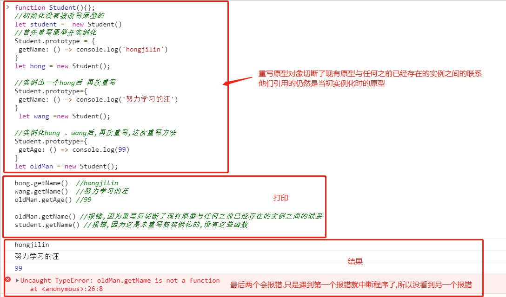 
>
>* 题目中重写方式其实是还是很奇怪的,通常我们都是 **A.prototype.do=function() {  }** 这样修改原型**对象**的,而不是直接将原型给直接赋成函数
>
>##### 答案解析
>
>1. 实际上本题的答案跟上方是否重写没有很大关系,因为首先调用时会先在自身实例上找方法,恰好本身就有 **do** 方法,所以本身就不会再往原型上找了,所以可以直接得到答案是 `foo`
>2. 但也是恰好是因为实例上有此属性方法(do),那如果没有呢?那他就会往上的原形对象找,但此时原型对象已经被赋值为一个函数,所以会找不到然后报错.
>3. 如果想要调用 prototype 上写的方法 应该这样调用 **new A.prototype().do()**

### 2、以下代码执行后，a.x 和 b.x 的结果分别是？  

>```js
>function A(x){
>	this.x = x;
>}
>A.prototype.x = 1; 
>
>function B(x){
>	this.x = x;
>}
>B.prototype = new A(); 
>var a = new A(2), b = new B(3);
>delete b.x; 
>console.log(a.x,b.x)
>//以下是选项
>2, 3
>2, 1
>2, undefined
>其他几项都不对
>```
>
>##### 知识点梳理
>
>>* 原型与原型链相关知识点,此部分不太熟悉的同学可以看本人笔记 -->  **[JavaScript进阶笔记的原型链部分](https://gitee.com/hongjilin/hongs-study-notes/tree/master/编程_前端开发学习笔记/HTML+CSS+JS基础笔记/JavaScript笔记#1原型与原型链)** 
>>* 如果有x但是没有赋值，则是undefined,相当于x=undefined. 就不会进入原型链
>
>##### 答案解析
>
>>```js
>>function A(x){
>>	this.x = x;
>>}
>>A.prototype.x = 1; //将A原型上的x设置为1
>
>>function B(x){
>>	this.x = x;
>>}
>>B.prototype = new A(); //将B原型上的x设置为 A的一种object. 所以B实例出来object的prototype就是{x:undefined}
>>var a = new A(2),//a.x首先要在自己的构造函数中查找，没有采取原型上找，这里有this.x = x.所以a.x = 2;
>>b = new B(3);//此时 b.x = 3 ;但是因为上面[B.prototype = new A()],所以形成原型链,其父级prototype={x:undefined}
>>delete b.x; //删除实例b上的[x]属性,但是delete只能删除自己的x不能删除父级的x. 
>>console.log(a.x,b.x)
>>
>>```
>
>>* **var a = new A(2)** 很容易理解,就是 a.x==2
>>* 看上面代码可以得知,在进行到 **b = new B(3)** 这步的时候 b的原型 **prototype={x:undefined}**
>>* delete b.x; 删除实例b上的[x]属性,但是delete只能删除自己的x不能删除父级的x. 所以我们查看b.x时会走到b的原型上就是 **{x:undefined}** 这里也是很容易踩到的陷阱,只要有这个属性,即便是undefined也不会在往上找了
>
>##### 陷阱:
>
>>选择 **2, 1** 选项的同学就是踩到陷阱咯
>
>>* B的prototype=new A(), 想错的可能都认为构造函数的 [ **x **] 没有传值进去,**this.x**赋值为**undefined**, 所以还会去A的prototype原型上找,找到 x = 1  --> `错误`
>>* 实际上是:如果构造函数 **没有x** 才会去原型下找
>>* 如果有x但是没有赋值，则是undefined,相当于x=undefined. 就不会进入原型链了


# 十、拓充知识点

## Ⅰ- 单选题

### 1、白屏时间first paint和可交互时间dom ready的关系是？

>```js
>先触发first paint ，后触发dom ready
>先触发dom ready，后触发first paint
>一起触发
>没关系
>```
>
>##### 知识点梳理
>
>页面的性能指标详解：
>
>* 白屏时间（first Paint Time）——用户从打开页面开始到页面开始有东西呈现为止
>* 首屏时间——用户浏览器首屏内所有内容都呈现出来所花费的时间
>* 用户可操作时间(dom Interactive)——用户可以进行正常的点击、输入等操作，默认可以统计domready时间，因为通常会在这时候绑定事件操作
>* 总下载时间——页面所有资源都加载完成并呈现出来所花的时间，即页面 onload 的时间
>
>##### 答案解析
>
>两者的触发时间可以认为是一致的，没有明确的先后顺序。
>
>- 这里的dom ready指的是dom元素都已经被解析。只有dom树渲染完毕后，才会有元素，不然就会一片空白，而影响dom ready的因素也有很多，才会有那么多的性能化策略。
>- 另一方面，在解析script时，dom加载会被阻塞。假如在dom加载之前出现alert提示框，在关闭提示框之前，页面都是一片空白。
>
>本人刚开始选择是D,但答案是A,查阅了下解析之类的也没啥靠谱的回答,只能盲推可能是在DOM加载时已经是白屏了,所以先白屏,后dom ready

### Ⅱ - 下面的语言中哪些语言是动态语言(  )

>```js
>C
>JavaScript
>C++
>CSS
>Java
>Objective-C
>```
>
>##### 知识点梳理:
>
>* 动态类型语言（弱类型语言）：
>
>  > 动态类型语言是指在运行期间才去做数据类型检查的语言，也就是说，在用动态类型的语言编程时，永远也不用给任何变量指定数据类型，该语言会在你第一次赋值给变量时，在内部将数据类型记录下来。Python 和 Ruby 就是一种典型的动态类型语言，其他的各种脚本语言如 JavaScript 也属于动态类型语言。 
>
>* 静态类型语言（强类型语言）：
>
>  > 静态类型语言与动态类型语言刚好相反，它的数据类型是在编译其间检查的，也就是说在写程序时要声明所有变量的数据类型，C/C++ 是静态类型语言的典型代表，其他的静态类型语言还有 C#、JAVA 等。
>
>##### 答案解析:
>
>> css是一种**层叠样式表**,所以不算 , 答案只有JavaScript.    
>>


# 十一、具有一定迷惑性的js题

> 此处收集一些具有一定迷惑性的js题，主要考察的是类型判断、作用域、this指向、原型、事件循环等知识点

## 第1题

>```js
>let a = 1
>function b(a) {
>  a = 2
>  console.log(a)
>}
>b(a)
>console.log(a)
>```
>
>**答案**
>
>2、1
>
>**解析**
>
>首先基本类型数据是按值传递的，所以执行b函数时，b的参数a接收的值为1，参数a相当于函数内部的变量，当本作用域有和上层作用域同名的变量时，无法访问到上层变量，所以函数内无论怎么修改a，都不影响上层，所以函数内部打印的a是2，外面打印的仍是1

## 第2题

>```js
>function a (b = c, c = 1) {
>  console.log(b, c)
>}
>a()
>```
>
>**答案**
>
>报错
>
>**解析**
>
>给函数多个参数设置默认值实际上跟按顺序定义变量一样，所以会存在暂时性死区的问题，即前面定义的变量不能引用后面还未定义的变量，而后面的可以访问前面的。

## 第3题

>```js
>let a = b = 10
>;(function(){ 
>  let a = b = 20 
>})()
>console.log(a)
>console.log(b)
>```
>
>**答案**
>
>10、20
>
>**解析**
>
>连等操作是从右向左执行的，相当于b = 10、let a = b，很明显b没有声明就直接赋值了，所以会隐式创建为一个`全局变量`，函数内的也是一样，并没有声明b，直接就对b赋值了，因为作用域链，会一层一层向上查找，找了到全局的b，所以全局的b就被修改为20了，而函数内的a因为重新声明了，所以只是局部变量，不影响全局的a，所以a还是10。

## 第4题

>```js
>var a = {n:1}
>var b = a
>a.x = a = {n:2}
>console.log(a.x)
>console.log(b.x)
>```
>
>**答案**
>
>undefined、{n: 2}
>
>**解析**
>
>反正按照网上大部分的解释是因为.运算符优先级最高，所以会先执行a.x，此时a、b共同指向的{n: 1}变成了{n: 1, x: undefined}，然后按照连等操作从右到左执行代码，a = {n: 2}，显然，a现在指向了一个新对象，然后a.x = a，因为a.x最开始就执行过了，所以这里其实等价于：({n: 1, x: undefined}).x = b.x = a = {n: 2}。
>
>>1. 第1、2行操作中，b和a同时指向了 `{n:1}` 这个对象
>>2. 第3行 中运算符先进行编译，从左往右编译，随后再从右往左赋值：`{n:1}.x= a = {n:2} `
>>   * 其中 {n:1}是b一直指向的对象，
>>   * a 在第二个等号处`a = {n:2}`时被指向了新的对象地址即`{n:2}`
>>   * 最后再运算到第一个等号，将`{n:2}`的地址赋值给 `{n:1}`这个对象的`X`属性中，即 `{n:1，x:{n:2}}`
>>   * 这时，a指向的是`{n:2}`  ，b指向的是`{n:1，x:{n:2}}`

## 第5题

>```
>var arr = [0, 1, 2]
>arr[10] = 10
>console.log(arr.filter(function (x) {
>  return x === undefined
>}))
>```
>
>**答案**
>
>[]
>
>**解析**
>
>这题比较简单，arr[10]=10，那么索引3到9位置上都是undefined，arr[3]等打印出来也确实是undefined，但是，这里其实涉及到ECMAScript版本不同对应方法行为不同的问题，ES6之前的遍历方法都会跳过数组未赋值过的位置，也就是空位，但是ES6新增的for of方法就不会跳过。
>
>

## 第6题

>```
>var name = 'World'
>;(function () {
>  if (typeof name === 'undefined') {
>    var name = "Jack"
>    console.info('Goodbye ' + name)
>  } else {
>    console.info('Hello ' + name)
>  }
>})()
>```
>
>**答案**
>
>Goodbye Jack
>
>**解析**
>
>这道题考察的是变量提升的问题，var声明变量时会把变量自动提升到当前作用域顶部，所以函数内的name虽然是在if分支里声明的，但是也会提升到外层，因为和全局的变量name重名，所以访问不到外层的name，最后因为已声明未赋值的变量的值都为undefined，导致if的第一个分支满足条件。

## 第7题

>```
>console.log(1 + NaN)
>console.log("1" + 3)
>console.log(1 + undefined)
>console.log(1 + null)
>console.log(1 + {})
>console.log(1 + [])
>console.log([] + {})
>```
>
>**答案**
>
>NaN、13、NaN、1、1[object Object]、1、[object Object]
>
>**解析**
>
>这道题考察的显然是+号的行为：
>
>1. 如果有一个操作数是字符串，那么把另一个操作数转成字符串执行连接
>
>2. 如果有一个操作数是对象，那么调用对象的valueOf方法转成原始值，如果没有该方法或调用后仍是非原始值，则调用toString方法
>
>3. 其他情况下，两个操作数都会被转成数字执行加法操作
>4. null隐式转换成空字符串，undefined无法转换

## 第8题

>```
>var a={},
>    b={key:'b'},
>    c={key:'c'}
>a[b]=123
>a[c]=456
>console.log(a[b])
>```
>
>**答案**
>
>456
>
>**解析**
>
>对象有两种方法设置和引用属性，obj.name和obj['name']，方括号里可以字符串、数字和变量设置是表达式等，但是最终计算出来得是一个字符串，对于上面的b和c，它们两个都是对象，所以会调用toString()方法转成字符串，对象转成字符串和数组不一样，和内容无关，结果都是[object Obejct]，所以a[b]=a[c]=a['[object Object]']。

## 第9题

>```js
>var out = 25
>var inner = {
>  out: 20,
>  func: function () {
>    var out = 30
>    return this.out
>  }
>};
>console.log((inner.func, inner.func)())
>console.log(inner.func())
>console.log((inner.func)())
>console.log((inner.func = inner.func)())
>```
>
>**答案**
>
>25、20、20、25
>
>**解析**
>
>这道题考察的是this指向问题：
>
>1.逗号操作符会返回表达式中的最后一个值，这里为inner.func对应的函数，注意是函数本身，然后执行该函数，该函数并不是通过对象的方法调用，而是在全局环境下调用，所以this指向window，打印出来的当然是window下的out
>
>2.这个显然是以对象的方法调用，那么this指向该对象
>
>3.加了个括号，看起来有点迷惑人，但实际上(inner.func)和inner.func是完全相等的，所以还是作为对象的方法调用
>
>4.赋值表达式和逗号表达式相似，都是返回的值本身，所以也相对于在全局环境下调用函数
>
>

# 第10题

```
let {a,b,c} = { c:3, b:2, a:1 }
console.log(a, b, c)
复制代码
```

**答案**

1、2、3

**解析**

这题考察的是变量解构赋值的问题，数组解构赋值是按位置对应的，而对象只要变量与属性同名，顺序随意。

# 第11题

```
console.log(Object.assign([1, 2, 3], [4, 5]))
复制代码
```

**答案**

[4, 5, 3]

**解析**

是不是从来没有用assign方法合并过数组？assign方法可以用于处理数组，不过会把数组视为对象，比如这里会把目标数组视为是属性为0、1、2的对象，所以源数组的0、1属性的值覆盖了目标对象的值。

# 第12题

```
var x=1
switch(x++)
{
  case 0: ++x
  case 1: ++x
  case 2: ++x
}
console.log(x)
复制代码
```

**答案**

4

**解析**

这题考查的是自增运算符的前缀版和后缀版，以及switch的语法，后缀版的自增运算符会在语句被求值后才发生，所以x会仍以1的值去匹配case分支，那么显然匹配到为1的分支，此时，x++生效，x变成2，再执行++x，变成3，因为没有break语句，所以会进入当前case后面的分支，所以再次++x，最终变成4。

# 第13题

```
console.log(typeof undefined == typeof NULL)
console.log(typeof function () {} == typeof class {})
复制代码
```

**答案**

true、true

**解析**

1.首先不要把NULL看成是null，js的关键字是区分大小写的，所以这就是一个普通的变量，而且没有声明，typeof对没有声明的变量使用是不会报错的，返回'undefined'，typeof对undefined使用也是'undefined'，所以两者相等

2.typeof对函数使用返回'function'，class只是es6新增的语法糖，本质上还是函数，所以两者相等

# 第14题

```
var count = 0
console.log(typeof count === "number")
console.log(!!typeof count === "number")
复制代码
```

**答案**

true、false

**解析**

1.没啥好说的，typeof对数字类型返回'number'。

2.这题考查的是运算符优先级的问题，逻辑非!的优先级比全等===高，所以先执行!!typeof count，结果为true，然后执行true === 'number'，结果当然为false，可以点击这里查看优先级列表：**点我**[1]。

# 第15题

```
"use strict"
a = 1
var a = 2
console.log(window.a)
console.log(a)
复制代码
```

**答案**

2、2

**解析**

var声明会把变量提升到当前作用域顶部，所以a=1并不会报错，另外在全局作用域下使用var声明变量，该变量会变成window的一个属性，以上两点都和是否在严格模式下无关。

# 第16题

```
var i = 1
function b() {
  console.log(i)
}
function a() {
  var i = 2
  b()
}
a()
复制代码
```

**答案**

1

**解析**

这道题考察的是作用域的问题，作用域其实就是一套变量的查找规则，每个函数在执行时都会创建一个执行上下文，其中会关联一个变量对象，也就是它的作用域，上面保存着该函数能访问的所有变量，另外上下文中的代码在执行时还会创建一个作用域链，如果某个标识符在当前作用域中没有找到，会沿着外层作用域继续查找，直到最顶端的全局作用域，因为js是词法作用域，在写代码阶段就作用域就已经确定了，换句话说，是在函数定义的时候确定的，而不是执行的时候，所以a函数是在全局作用域中定义的，虽然在b函数内调用，但是它只能访问到全局的作用域而不能访问到b函数的作用域。

# 第17题

```
var obj = {
  name: 'abc',
  fn: () => {
    console.log(this.name)
  }
};
obj.name = 'bcd'
obj.fn()
复制代码
```

**答案**

undefined

**解析**

这道题考察的是this的指向问题，箭头函数执行的时候上下文是不会绑定this的，所以它里面的this取决于外层的this，这里函数执行的时候外层是全局作用域，所以this指向window，window对象下没有name属性，所以是undefined。

# 第18题

```
const obj = {
  a: {
    a: 1
  }
};
const obj1 = {
  a: {
    b: 1
  }
};
console.log(Object.assign(obj, obj1))
复制代码
```

**答案**

{a: {b: 1}}

**解析**

这道题很简单，因为assign方法执行的是浅拷贝，所以源对象的a属性会直接覆盖目标对象的a属性。

# 第19题

```
console.log(a)
var a = 1
var getNum = function() {
  a = 2
}
function getNum() {
  a = 3
}
console.log(a)
getNum()
console.log(a)
复制代码
```

**答案**

undefined、1、2

**解析**

首先因为var声明的变量提升作用，所以a变量被提升到顶部，未赋值，所以第一个打印出来的是undefined。

接下来是函数声明和函数表达式的区别，函数声明会有提升作用，在代码执行前就把函数提升到顶部，在执行上下文上中生成函数定义，所以第二个getNum会被最先提升到顶部，然后是var声明getNum的提升，但是因为getNum函数已经被声明了，所以就不需要再声明一个同名变量，接下来开始执行代码，执行到var getNum = fun...时，虽然声明被提前了，但是赋值操作还是留在这里，所以getNum被赋值为了一个函数，下面的函数声明直接跳过，最后，getNum函数执行前a打印出来还是1，执行后，a被修改成了2，所以最后打印出来的2。

# 第20题

```
var scope = 'global scope'
function a(){
  function b(){ 
    console.log(scope)
  }
  return b
  var scope = 'local scope'
}
a()()
复制代码
```

**答案**

undefined

**解析**

这题考查的还是变量提升和作用域的问题，虽然var声明是在return语句后面，但还是会提升到a函数作用域的顶部，然后又因为作用域是在函数定义的时候确定的，与调用位置无关，所以b的上层作用域是a函数，scope在b自身的作用域里没有找到，向上查找找到了自动提升的并且未赋值的scope变量，所以打印出undefined。

# 第21题

```
function fn (){ 
  console.log(this) 
}
var arr = [fn]
arr[0]()
复制代码
```

**答案**

打印出arr数组本身

**解析**

函数作为某个对象的方法调用，this指向该对象，数组显然也是对象，只不过我们都习惯了对象引用属性的方法：obj.fn，但是实际上obj['fn']引用也是可以的。

# 第22题

```
var a = 1
function a(){}
console.log(a)

var b
function b(){}
console.log(b)

function b(){}
var b
console.log(b)
复制代码
```

**答案**

1、b函数本身、b函数本身

**解析**

这三小题都涉及到函数声明和var声明，这两者都会发生提升，但是函数会优先提升，所以如果变量和函数同名的话，变量的提升就忽略了。

1.提升完后，执行到赋值代码，a被赋值成了1，函数因为已经声明提升了，所以跳过，最后打印a就是1。

2.和第一题类似，只是b没有赋值操作，那么执行到这两行相当于都没有操作，b当然是函数。

3.和第二题类似，只是先后顺序换了一下，但是并不影响两者的提升顺序，仍是函数优先，同名的var声明提升忽略，所以打印出b还是函数。

# 第23题

```
function Foo() {
  getName = function () { console.log(1) }
  return this
}
Foo.getName = function () { console.log(2) }
Foo.prototype.getName = function () { console.log(3) }
var getName = function () { console.log(4) }
function getName() { console.log(5) }

//请写出以下输出结果：
Foo.getName()
getName()
Foo().getName()
getName()
new Foo.getName()
new Foo().getName()
new new Foo().getName()
复制代码
```

**答案**

2、4、1、1、2、3、3

**解析**

这是一道综合性题目，首先getName函数声明会先提升，然后getName函数表达式提升，但是因为函数声明提升在线，所以忽略函数表达式的提升，然后开始执行代码，执行到var getName= ...时，修改了getName的值，赋值成了打印4的新函数。

1.执行Foo函数的静态方法，打印出2。

2.执行getName，当前getName是打印出4的那个函数。

3.执行Foo函数，修改了全局变量getName，赋值成了打印1的函数，然后返回this，因为是在全局环境下执行，所以this指向window，因为getName已经被修改了，所以打印出1。

4.因为getName没有被重新赋值，所以再执行仍然打印出1。

5.new操作符是用来调用函数的，所以new Foo.getName()相当于new (Foo.getName)()，所以new的是Foo的静态方法getName，打印出2。

6.因为点运算符（.）的优先级和new是一样高的，所以从左往右执行，相当于(new Foo()).getName()，对Foo使用new调用会返回一个新创建的对象，然后执行该对象的getName方法，该对象本身并没有该方法，所以会从Foo的原型对象上查找，找到了，所以打印出3。

7.和上题一样，点运算符（.）的优先级和new一样高，另外new是用来调用函数的，所以new new Foo().getName()相当于new ((new Foo()).getName)()，括号里面的就是上一题，所以最后找到的是Foo原型上的方法，无论是直接调用，还是通过new调用，都会执行该方法，所以打印出3。

# 第24题

```
const person = {
 address: {
  country:"china",
  city:"hangzhou"
 },
 say: function () {
  console.log(`it's ${this.name}, from ${this.address.country}`)
 },
 setCountry:function (country) {
  this.address.country=country
 }
}

const p1 = Object.create(person)
const p2 = Object.create(person)

p1.name = "Matthew"
p1.setCountry("American")

p2.name = "Bob"
p2.setCountry("England")

p1.say()
p2.say()
复制代码
```

**答案**

it's Matthew, from England

it's Bob, from England

**解析**

Object.create方法会创建一个对象，并且将该对象的__proto__属性指向传入的对象，所以p1和p2两个对象的原型对象指向了同一个对象，接着给p1添加了一个name属性，然后调用了p1的setCountry方法，p1本身是没有这个方法的，所以会沿着原型链进行查找，在它的原型上，也就是person对象上找到了这个方法，执行这个方法会给address对象的country属性设置传入的值，p1本身也是没有address属性的，但是和name属性不一样，address属性在原型对象上找到了，并且因为是个引用值，所以会成功修改它的country属性，接着对p2的操作也是一样，然后因为原型中存在引用值会在所有实例中共享，所以p1和p2它们引用的address也是同一个对象，一个实例修改了，会反映到所有实例上，所以p2的修改会覆盖p1的修改，最终country的值为England。

# 第25题

```
setTimeout(function() {
  console.log(1)
}, 0)
new Promise(function(resolve) {
  console.log(2)
  for( var i=0 ; i<10000 ; i++ ) {
    i == 9999 && resolve()
  }
  console.log(3)
}).then(function() {
  console.log(4)
})
console.log(5)
复制代码
```

**答案**

2、3、5、4、1

**解析**

这道题显然考察的是事件循环的知识点。

js是一门单线程的语言，但是为了执行一些异步任务时不阻塞代码，以及避免等待期间的资源浪费，js存在事件循环的机制，单线程指的是执行js的线程，称作主线程，其他还有一些比如网络请求的线程、定时器的线程，主线程在运行时会产生执行栈，栈中的代码如果调用了异步api的话则会把事件添加到事件队列里，只要该异步任务有了结果便会把对应的回调放到【任务队列】里，当执行栈中的代码执行完毕后会去读取任务队列里的任务，放到主线程执行，当执行栈空了又会去检查，如此往复，也就是所谓的事件循环。

异步任务又分为【宏任务】（比如setTimeout、setInterval）和【微任务】（比如promise），它们分别会进入不同的队列，执行栈为空完后会优先检查微任务队列，如果有微任务的话会一次性执行完所有的微任务，然后去宏任务队列里检查，如果有则取出一个任务到主线程执行，执行完后又会去检查微任务队列，如此循环。

回到这题，首先整体代码作为一个宏任务开始执行，遇到setTimeout，相应回调会进入宏任务队列，然后是promise，promise的回调是同步代码，所以会打印出2，for循环结束后调用了resolve，所以then的回调会被放入微任务队列，然后打印出3，最后打印出5，到这里当前的执行栈就空了，那么先检查微任务队列，发现有一个任务，那么取出来放到主线程执行，打印出4，最后检查宏任务队列，把定时器的回调放入主线程执行，打印出1。

# 第26题

```
console.log('1');

setTimeout(function() {
  console.log('2');
  process.nextTick(function() {
    console.log('3');
  });
  new Promise(function(resolve) {
    console.log('4');
    resolve();
  }).then(function() {
    console.log('5');
  });
}); 

process.nextTick(function() {
  console.log('6');
});

new Promise(function(resolve) {
  console.log('7');
  resolve();
}).then(function() {
  console.log('8');
});

setTimeout(function() {
  console.log('9');
  process.nextTick(function() {
    console.log('10');
  }) 
  new Promise(function(resolve) {
    console.log('11');
    resolve();
  }).then(function() {
    console.log('12')
  });
})
复制代码
```

**答案**

1、7、6、8、2、4、9、11、3、10、5、12

**解析**

这道题和上一题差不多，但是出现了process.nextTick，所以显然是在node环境下，node也存在事件循环的概念，但是和浏览器的有点不一样，nodejs中的宏任务被分成了几种不同的阶段，两个定时器属于timers阶段，setImmediate属于check阶段，socket的关闭事件属于close callbacks阶段，其他所有的宏任务都属于poll阶段，除此之外，只要执行到前面说的某个阶段，那么会执行完该阶段所有的任务，这一点和浏览器不一样，浏览器是每次取一个宏任务出来执行，执行完后就跑去检查微任务队列了，但是nodejs是来都来了，一次全部执行完该阶段的任务好了，那么process.nextTick和微任务在什么阶段执行呢，在前面说的每个阶段的后面都会执行，但是process.nextTick会优先于微任务，一图胜千言：

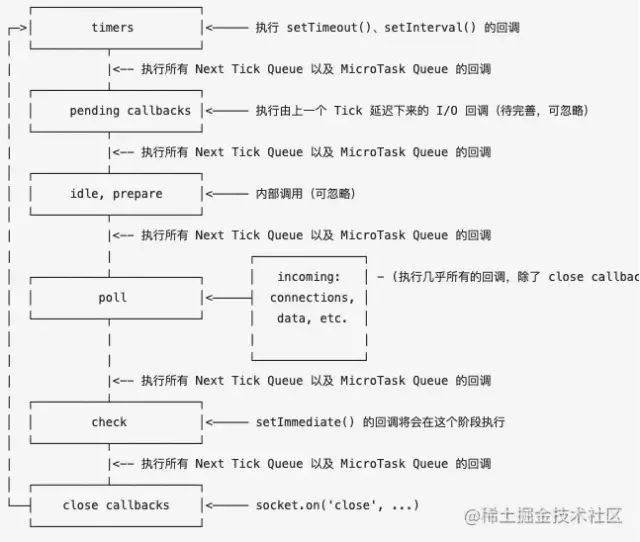

理解了以后再来分析这道题就很简单了，首先执行整体代码，先打印出1，setTimeout回调扔进timers队列，nextTick的扔进nextTick的队列，promise的回调是同步代码，执行后打印出7，then回调扔进微任务队列，然后又是一个setTimeout回调扔进timers队列，到这里当前节点就结束了，检查nextTick和微任务队列，nextTick队列有任务，执行后打印出6，微任务队列也有，打印出8，接下来按顺序检查各个阶段，check队列、close callbacks队列都没有任务，到了timers阶段，发现有两个任务，先执行第一个，打印出2，然后nextTick的扔进nextTick的队列，执行promise打印出4，then回调扔进微任务队列，再执行第二个setTimeout的回调，打印出9，然后和刚才一样，nextTick的扔进nextTick的队列，执行promise打印出11，then回调扔进微任务队列，到这里timers阶段也结束了，执行nextTick队列的任务，发现又两个任务，依次执行，打印出3和10，然后检查微任务队列，也是两个任务，依次执行，打印出5和12，到这里是有队列都清空了。


