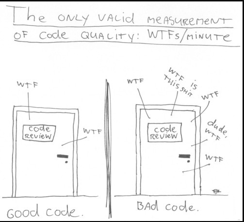

## #说明

>实际上,网络上关于 **JavaScript** 代码规范的好文章有很多,大家大可自行去查阅,此处将为本人梳理摘录的规范笔记,实际上会对查阅地多个资料进行摘录整合且以我的语言描述,梳理成方便本人查阅的样子, **仅供本人学习使用**.
>
>当然,**很多资料都是英文**,如果同学们看英文资料相对吃力的话还是可以看我的笔记,本人对于自己的语言组织能力还是有点信心的.
>
>查阅借鉴的资料: 首先分享个很多前辈推荐我去阅读学习的 **JavaScript** 代码规范文章: [clean-code-javascript ](https://github.com/ryanmcdermott/clean-code-javascript) 大家大可直接阅读这个文章.
>
>除此笔记外大家可以看我其他笔记 :**[全栈笔记](https://gitee.com/hongjilin/hongs-study-notes/tree/master)**、**[数据结构与算法](https://gitee.com/hongjilin/hongs-study-notes/tree/master/编程_算法及课程基础学习笔记/数据结构与算法)**、**[编程_前端开发学习笔记](https://gitee.com/hongjilin/hongs-study-notes/tree/master/编程_前端开发学习笔记)**、**[编程_后台服务端学习笔记](https://gitee.com/hongjilin/hongs-study-notes/tree/master/编程_后台服务端学习笔记)** 、**[Java](https://gitee.com/hongjilin/hongs-study-notes/tree/master/编程_后台服务端学习笔记/Java)** 、**[Nodejs](https://gitee.com/hongjilin/hongs-study-notes/tree/master/编程_后台服务端学习笔记/Nodejs)** 、**[JavaScript笔记](https://gitee.com/hongjilin/hongs-study-notes/tree/master/编程_前端开发学习笔记/HTML+CSS+JS基础笔记/JavaScript笔记)**、**[编程工具使用笔记](https://gitee.com/hongjilin/hongs-study-notes/tree/master/编程_前端开发学习笔记/A_前端工具使用笔记)** 、**[前端代码规范](https://gitee.com/hongjilin/hongs-study-notes/tree/master/编程_前端开发学习笔记/A_前端代码规范)** 、**[ES6及后续版本学习笔记](https://gitee.com/hongjilin/hongs-study-notes/tree/master/编程_前端开发学习笔记/ES6及后续版本学习笔记)** 、**[Vue笔记整合](https://gitee.com/hongjilin/hongs-study-notes/tree/master/编程_前端开发学习笔记/Vue笔记整合)** 、**[React笔记](https://gitee.com/hongjilin/hongs-study-notes/tree/master/编程_前端开发学习笔记/React笔记)**、**[微信小程序学习笔记](https://gitee.com/hongjilin/hongs-study-notes/tree/master/编程_前端开发学习笔记/微信小程序学习笔记)**、**[Chrome开发使用及学习笔记](https://gitee.com/hongjilin/hongs-study-notes/tree/master/编程_前端开发学习笔记/Chrome开发使用及学习笔记)** 以及许多其他笔记就不一一例举了


## 前言

>此处引用一下  [clean-code-javascript ](https://github.com/ryanmcdermott/clean-code-javascript)  中的一张图片能更形象的形容干净的代码与不干净的代码的区别:
>
> 
>
>这个文章中有一段话我觉得说的特别好:
>
>>* 了解这些不会立即使您成为更好的软件开发人员，与他们一起工作多年并不意味着您不会犯错误。每一段代码都是从初稿开始的，就像湿粘土被塑造成最终形式一样。
>>* 最后，当我们与同行一起回顾时，我们会剔除不完美之处。
>>* `不要为需要改进的初稿而自责。而是打败代码！`
>
>##### **不要为需要改进的初稿而自责。而是打败代码！** 

------


## 一、变量

### 1、 使用有意义且可发音的变量名  

>```js
>//坏的
>const yyyymmdstr = moment().format("YYYY/MM/DD");
>//好的
>const currentDate = moment().format("YYYY/MM/DD");
>```

### 2、 尽量对相同类型的变量使用相同的词汇

>```js
>//坏的-->同样是获取用户信息,取了三种名字,这样容易造成混淆且不易理解
>getUserInfo();
>getClientData();
>getCustomerRecord();
>
>//好的
>getUser();
>```

### 3、使用可搜索的名称

>* 我们将阅读的代码比我们编写的代码多。
>* 重要的是我们编写的代码可读和可搜索。
>* 通过不命名最终对理解我们的程序有意义的变量，我们伤害了我们的读者。
>* 使您的姓名可搜索。[ **buddy.js** ]和 [ **ESLint** ] 等工具 可以帮助识别未命名的常量。
>
>```js
>//坏的 --> 到底是干什么用的？
>setTimeout(blastOff, 86400000);
>
>//好的  -->  将它们声明为大写的命名常量
>const MILLISECONDS_PER_DAY = 60 * 60 * 24 * 1000; //86400000;
>setTimeout(blastOff, MILLISECONDS_PER_DAY); //这样我们就能很清晰地知道这串数字是什么作用了
>```

### 4、使用解释变量

>###### 坏的代码
>
>```js
>const address = "One Infinite Loop, Cupertino 66666";
>const cityZipCodeRegex = /^[^,\\]+[,\\\s]+(.+?)\s*(\d{5})?$/;
>//address.match(cityZipCodeRegex) 会得到一个数组,里面放置的是被匹配到的字符串
>saveCityZipCode(
>  address.match(cityZipCodeRegex)[1],//这里直接将匹配到的数组用下标直接取出来
>  address.match(cityZipCodeRegex)[2]
>);
>```
>
>###### 好的代码
>
>```js
>const address = "One Infinite Loop, Cupertino 66666";
>const cityZipCodeRegex = /^[^,\\]+[,\\\s]+(.+?)\s*(\d{5})?$/;
>//这句话意思是, 将 address.match(cityZipCodeRegex) 匹配得到的数组结果
>//第0位赋值给 _ ; 第一位赋值给 city ; 第二位赋值给 zipode , 这就是解释变量
>const [_, city, zipCode] = address.match(cityZipCodeRegex) || [];
>//这时候再将变量传入,这样的代码更容易阅读
>saveCityZipCode(city, zipCode);
>```
>
>
>
>如果这个解构看不懂的回头要去学习一下 ES6 相关知识点,现在已经是必备技能了 --> **[ES6及后续版本学习笔记](https://gitee.com/hongjilin/hongs-study-notes/tree/master/编程_前端开发学习笔记/ES6及后续版本学习笔记)** 

### 5、避免心理映射

>###### **显式优于隐式**
>
>```js
>const locations = ["深圳", "杭州", "厦门"];
>locations.forEach(l => {
>  doStuff();
>  doSomeOtherStuff();
>  dispatch(l);  //等等，`l` 又是什么？ 如果不去看上面代码我们很难猜出
>});
>
>//好的
>const locations = ["深圳", "杭州", "厦门"];
>locations.forEach(location => {
>  doStuff();
>  doSomeOtherStuff();
>  dispatch(location); //这样就算不去看上面代码,我们已经能大致猜出是什么了
>});
>```

### 6、 不要添加不需要的上下文

>**如果您的类/对象名称告诉您一些信息，请不要在您的变量名称中重复**
>
>```js
>//坏代码
>const Farmers = {
>  farmersProfession: "程序员", //实际上类名已经说明了这是个 `农民` 了,没必要再强调
>  farmersName: "努力学习的汪",
>};
>function paintCar(farmers, name) {
>  farmers.farmersName = name; 
>}
>
>//好的  --> 会相对更简洁点
>const Farmers = {
>  profession: "程序员",
>  name: "努力学习的汪",
>};
>
>function paintCar(farmers, name) {
>  farmers.name = name;
>}
>```

### 7、使用默认参数而不是短路或条件

>默认参数通常比短路更干净。请注意，如果您使用它们，您的函数将仅提供`undefined` 参数的默认值。其他“falsy”的价值观，如`''`，`""`，`false`，`null`，`0`，和 `NaN`，不会被默认值代替。
>
>```js
>//坏代码
>function createMicrobrewery(name) {
>  const breweryName = name || "努力学习的汪";
>}
>//好代码
>function createMicrobrewery(name = "努力学习的汪") {
>  const breweryName = name 
>}
>```

### 8、使用  const  或者  let  来定义变量

>使用 `const` 或者 `let` 来定义变量。 不这样做将创建一个全局变量。 我们希望避免污染全局命名空间。 Captain Planet 警告过我们。 eslint: [`no-undef`](https://eslint.org/docs/rules/no-undef) [`prefer-const`](https://eslint.org/docs/rules/prefer-const)
>
>```js
>// 坏的
>superPower = new SuperPower();
>
>// 好的
>const superPower = new SuperPower();
>```

### 9、使用  const  或者  let 声明每一个变量

>* 这样更容易添加新的变量声明
>* 而且你不必担心是使用 `;` 还是使用 `,` 或引入标点符号的差别。
>*  你可以通过 debugger 逐步查看每个声明，而不是立即跳过所有声明
>
>```js
>// 坏的写法 
>const items = getItems(),
>    goSportsTeam = true,
>    dragonball = 'z';
>// 坏的写法
>const items = getItems(),
>    goSportsTeam = true; //此处使用了分号,实际上会导致 [ dragonball ] 并没有用const声明
>    dragonball = 'z';    //变成了全局变量
>
>// 好的代码
>const items = getItems();
>const goSportsTeam = true;
>const dragonball = 'z';
>```
>
>
