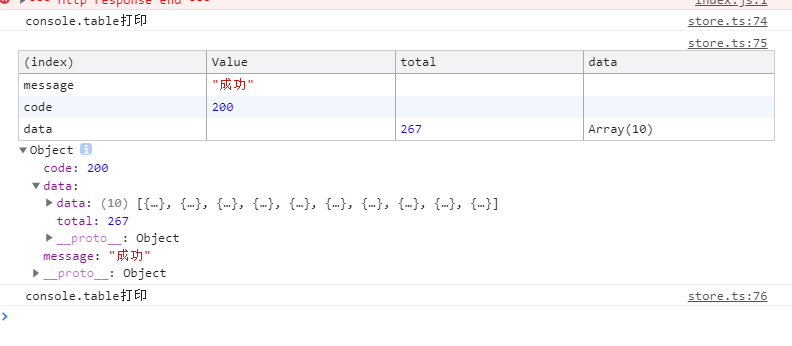
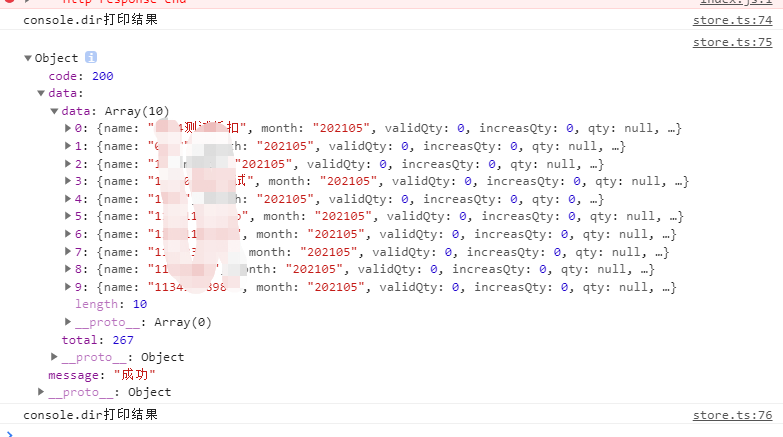
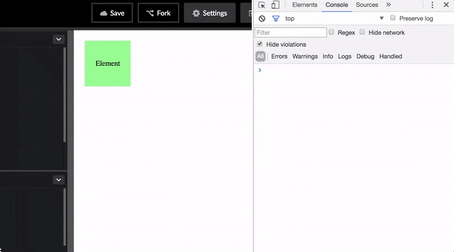

## #说明

>此笔记为截取上方`ChromeDevTools使用详解笔记`的 [ 前端调试技巧 ] 部分笔记的部分知识点至此,方便阅读
>
>> ###### 更多笔记看上方 ChromeDevTools 使用详解笔记
>
>除此笔记外大家可以看我其他笔记 :**[全栈笔记](https://gitee.com/hongjilin/hongs-study-notes/tree/master)**、**[数据结构与算法](https://gitee.com/hongjilin/hongs-study-notes/tree/master/编程_算法及课程基础学习笔记/数据结构与算法)**、**[编程_前端开发学习笔记](https://gitee.com/hongjilin/hongs-study-notes/tree/master/编程_前端开发学习笔记)**、**[编程_后台服务端学习笔记](https://gitee.com/hongjilin/hongs-study-notes/tree/master/编程_后台服务端学习笔记)** 、**[Java](https://gitee.com/hongjilin/hongs-study-notes/tree/master/编程_后台服务端学习笔记/Java)** 、**[Nodejs](https://gitee.com/hongjilin/hongs-study-notes/tree/master/编程_后台服务端学习笔记/Nodejs)** 、**[JavaScript笔记](https://gitee.com/hongjilin/hongs-study-notes/tree/master/编程_前端开发学习笔记/HTML+CSS+JS基础笔记/JavaScript笔记)**、**[编程工具使用笔记](https://gitee.com/hongjilin/hongs-study-notes/tree/master/编程_前端开发学习笔记/A_前端工具使用笔记)** 、**[ES6及后续版本学习笔记](https://gitee.com/hongjilin/hongs-study-notes/tree/master/编程_前端开发学习笔记/ES6及后续版本学习笔记)** 、**[Vue笔记整合](https://gitee.com/hongjilin/hongs-study-notes/tree/master/编程_前端开发学习笔记/Vue笔记整合)** 、**[React笔记](https://gitee.com/hongjilin/hongs-study-notes/tree/master/编程_前端开发学习笔记/React笔记)**、**[微信小程序学习笔记](https://gitee.com/hongjilin/hongs-study-notes/tree/master/编程_前端开发学习笔记/微信小程序学习笔记)**、**[Chrome开发使用及学习笔记](https://gitee.com/hongjilin/hongs-study-notes/tree/master/编程_前端开发学习笔记/Chrome开发使用及学习笔记)** 以及许多其他笔记就不一一例举了
>
>更多Chrome开发笔记: **[Chrome开发使用及学习笔记](https://gitee.com/hongjilin/hongs-study-notes/tree/master/编程_前端开发学习笔记/Chrome开发使用及学习笔记)** 

## 三、前端调试技巧

>编写代码其实只是开发者的一小部分工作。为了让工作更有效率，我们还必须精通 debug。我发现，花一些时间学习新的调试技巧，往往能让我能更快地完成工作，对我的团队做出更大的贡献  -->我也是因为想学调试,结果找不到很全的博客,却找了这么几十篇资料全学了然后整理,只为了学这个调试啊啊啊啊啊啊
>
>前端调试中最少你要看前面九大面板中的 JS调试:[`Console 面板`](#2、Console 面板)、[`Sources 面板`](#3、Sources 面板);网络调试: [`Network 面板`](#4、Network 面板); 样式调试: [`Elements 面板`](#1、Elements 面板);  至于性能调优:哥,都到能调优的水准了,那不得都会啊? --> [`九大功能模块面板详解`](#一、九大功能模块面板详解)
>
>查阅参考的资料:[Debugging Tips and Tricks](https://css-tricks.com/debugging-tips-tricks/)、腾讯云中腾讯技术工程官方号的[大型前端项目的断点调试共享化和复用化实践](https://cloud.tencent.com/developer/article/1711214?from=article.detail.1471757)

### 1、主要概念

#### Ⅰ- 隔离问题

>隔离问题大概是 debug 中最重要的核心概念。我们的代码库是由不同的类库、框架组成的，它们有着许多的贡献者，甚至还有一些不再参与项目的人，因此我们的代码库是杂乱无章的。隔离问题可以帮助我们逐步剥离与问题无关的部分以便我们可以把注意力放在解决方案上。
>
>例如我们古老，好用的 `console.log` 是就是一种隔离的方法,至于为何请看下方详解

##### 1)  隔离问题的好处

>隔离问题的好处包括但不限于以下几条：
>
>- 能够弄清楚问题的根本原因是否是我们想的那样，还是存在其它的冲突。
>- 对于时序任务，能判断是否存在时序紊乱。
>- 严格审查我们的代码是否还能够更加精简，这样既能帮助我们写代码也能帮助我们维护代码。
>- 解开纠缠在一起的代码，以观察到底是只有一个问题还是存在更多的问题。
>- 让BUG更容易复现查到问题所在

##### 2) 对问题进行隔离的方法

###### ① 在代码中写入*`debugger`*

>- 你可以在你代码中写上 `debugger;`，这样你可以看到当时这一小块代码做了什么
>- 你还可以在 Chrome 开发者工具中进一步进行调试，单步跟踪事件的发生。你也可以用它选择性地观察指定的事件监听器。-->[详情看前面九大功能面板中的Sources](#Ⅰ- Sources 面板图解)

###### ②  `console.log`

>建议看上面[`Console 面板`](#2、Console 面板)
>
>古老，好用的 `console.log` 是另一种隔离的方法。（nodejs中也是`console`,java 中是 `printf`...）。你可以一小片一小片地执行代码并对你的假设进行测试，或者检查看有什么东西发生了变化。这可能是最耗费时间的测试方式了。但是无论你的水平如何高，你还是得乖乖用它。ES6 的箭头函数也可以加速我们的 debug 游戏，它让我们可以在控制台中更方便地写单行代码。
>
>`console.table` 函数也是我最喜欢的工具之一。当你有大量的数据（例如很长的数组、巨大的对象等等）需要展示的时候，它特别有用。
>
> 
>
>`console.dir` 函数也是个不错的选择。它可以把一个对象的属性以可交互的形式展示出来。
>
> 

#### Ⅱ- 保持条理清晰

>1. 编写(或改写)代码时如果一次性改动大量代码后再去调试---然后出了某些问题，我们不知道到底是改的哪一部分导致了问题的出现。接着为了 debug，我们又一次改很多代码，`最后迷失在寻找哪里能正常运行、哪里不能正常运行中`(如果你没有用分支工具,相信我,你此时最大的奢求就是能复原到修改前的样子)
>2. 其实我们或多或少都在这么做。当我们对一个工具越来越熟练时，我们会在没有对设想的情况进行测试的情况下写越来越多的代码。但是当你刚开始用一个语法或技术时，你需要放慢速度并且非常谨慎。你将能越来越快地处理自己无意间造成的错误。其实，当你弄出了一个问题的时候，一次调试一个问题可能会看起来慢一些，但其实要找出哪里发生了变化以及问题的所在是没法快速解决的。我说以上这些话是想告诉你：`欲速则不达`(特别是前端要有耐心)。
>3. **你还记得小时候父母告诉你的话吗？“如果你迷路了，待在原地别动(很有道理!!)“** 至少我的父母这么说了。这么说的原因是如果他们在到处找我，而我也在到处跑着找他们的话，我们将更难碰到一起。代码也是这样的。你每次动的代码越少就越好，你返回一致的结果越多，就越容易找到问题所在。所以当你在调试时，请尽量不要安装任何东西或者添加新的依赖。`如果本应该返回一个静态结果的地方每次都出现不同的错误`，你就得特别注意了！

### 2、辅助工具

>人们开发了无数的工具用于解决各种各样的问题。下面部分会放我接触到的觉得可的工具,此部分可能是慢慢补充的那种

#### Ⅰ- [React DevTools](https://chrome.google.com/webstore/detail/react-developer-tools/fmkadmapgofadopljbjfkapdkoienihi) 

>如果你工作中使用 React，[React DevTools](https://chrome.google.com/webstore/detail/react-developer-tools/fmkadmapgofadopljbjfkapdkoienihi) 是你必不可少的工具，你可以通过它观察虚拟 DOM。

#### Ⅱ- [Vue DevTools](https://chrome.google.com/webstore/detail/vuejs-devtools/nhdogjmejiglipccpnnnanhbledajbpd)

>当你使用 Vue 时，同上。

#### Ⅲ- 开发者工具

> 这就不必说了,把上面整理的笔记看完就差不多了


### 3、各种调试小技巧

>这是我看他人博客(如[Debugging Tips and Tricks](https://css-tricks.com/debugging-tips-tricks/))觉得好的就摘录下来或者自己觉得OK的分享出来

#### Ⅰ- 调试css

>[@sarah_edo](https://twitter.com/sarah_edo)：对于 CSS，我通常会给有问题的元素加上一个 .debug 的 class，这个 class 定义了红色的 border。
>
>— Jeremy Wagner (@malchata) [2017年3月15日](https://twitter.com/malchata/status/842029469246324736)

#### Ⅱ- 检测 React 的 State

>[@sarah_edo](https://twitter.com/sarah_edo)：
>
>```js
>{JSON.stringify(this.state, null, 2)}
>```
>
>— MICHAEL JACKSON (@mjackson) [2017年3月15日](https://twitter.com/mjackson/status/842041642760646657)

#### Ⅲ- 动画

>[@sarah_edo](https://twitter.com/sarah_edo)[@Real_CSS_Tricks](https://twitter.com/Real_CSS_Tricks)： 会在调试时减慢动画速度：
>
>```css
>{ animation-duration: 10s !important; }
>```
>
>— Thomas Fuchs (@thomasfuchs) [2017年3月15日](https://twitter.com/thomasfuchs/status/842029720820695040)

#### Ⅳ- 设置定时 Debugger

>这一条是 Chris 提供的。详情-->[点我传送](https://css-tricks.com/set-timed-debugger-web-inspect-hard-grab-elements/)
>
>```css
>setTimeout(function() {
>debugger;
>}, 3000);
>```
>
>它与我之前提到的 `debugger;` 工具很类似，不过你可以把它放在 setTimeout 函数中，得到更多详细的信息。
>
>此方法可以用在很多地方而不仅仅是调试样式,包括js都可以
>
> 
>
>`ps`:该动图来自[Chris Coyier的Set a Timed Debugger To Web Inspect Hard-To-Grab Elements文章中](https://css-tricks.com/set-timed-debugger-web-inspect-hard-grab-elements/) 


### 4、打断点的几种方式

#### Ⅰ- 使用Sources面板打断点

>这种方式是比较常用的方式，在浏览器开发工具找到对应源码，在script脚本节点里面的代码行断点
>
>具体打断点方法在此部分有详细叙述,便不赘述  --> [点我传送](#Ⅲ- 中间代码展示面板详解)

#### Ⅱ- 在需要调试的地方加debugger关键字

>- 这种方式很粗暴，在需要调试的地方加debugger关键字，代码运行到的时候会自动停下，进入调试模式。
>- 此方法不需要手动断点，但是麻烦的是可能你调试一次就不用再调试了，但是每次运行到那里都会停下，必须移除这个代码才行。
>- 这玩意我在不少网站也见到有人用，不想让人家方便的查看到网站源码，一打开控制台就自动debugger。

### 5、大型前端项目的断点调试共享化和复用化实践

>发现的一篇很好的文章,是腾讯工程师enoyao写的.此处直接给出链接  -->[点我传送](https://cloud.tencent.com/developer/article/1711214?from=article.detail.1471757)
>
>下面给出文章简述:
>
>随着我们项目越来越大，我们有可能需要维护很多的模块，我们腾讯文档 Excel 项目大模块有 10 几个，而每个大模块分别有 N 个小模块，每个大模块下的小模块都有主要的负责人在跟进模块问题。这就会导致一个很大的问题是，模块负责人大部分情况只会关注自己模块的问题，而不甚了解其他负责人手上模块的具体问题。
>
>然后博主针对此问题进行了方案的提出与总结

------

# `更多知识点看上方具体笔记`