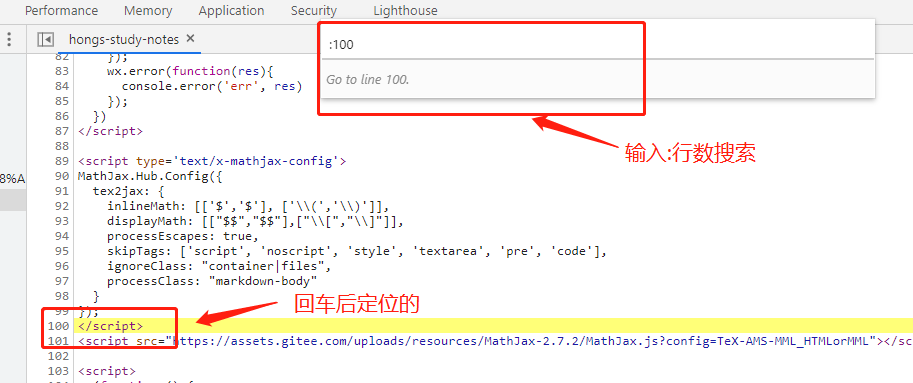
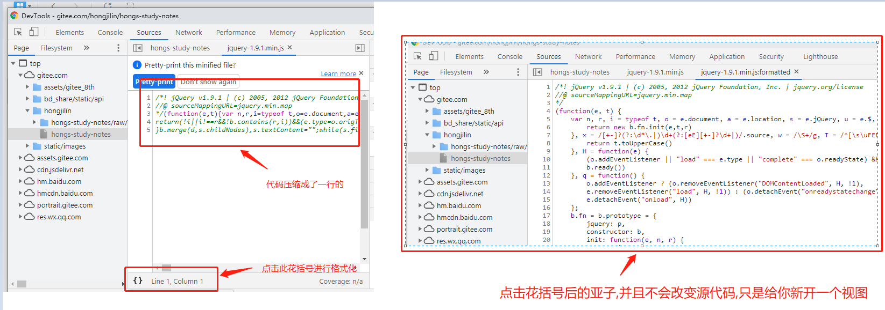
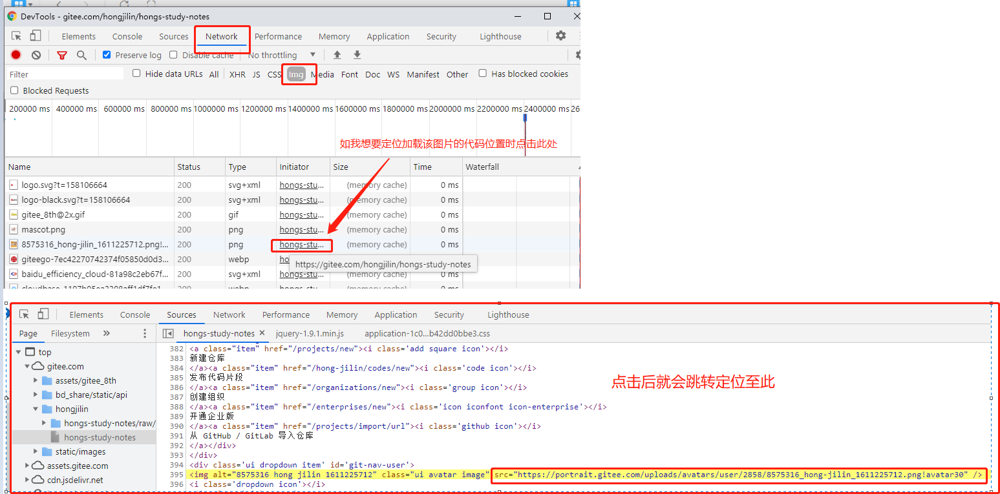

# #说明

> 作为开发人员，平时用的最多的就是[`Chrome devtools`](https://developer.chrome.com/docs/devtools)了此笔记将整理平时用的比较多的一些调试小技巧、网上或者别人教的好用的技巧
>
> 这个真的很有必要,对于此工具的使用从侧面也体现了一个前端程序员的经验(本人看到前辈流畅的使用这个工具的时候内心独白:6啊老铁,还能这样的?),对于前端来说会使用DevTools真的是一项必备技能了
>
> 此笔记将结合[官方文档](https://developer.chrome.com/docs/devtools/javascript/)、查阅的博客如:segmentfault中`CompileYouth`的博客等、以及自己的理解进行整理与撰写,不是文档翻译哦
>
> 测试页面截图也都直接按照本人gitee为模板
>
> 本人[全部笔记地址](https://gitee.com/hongjilin/hongs-study-notes)

# #目录

>[TOC]

# Chrome DevTools 使用详解

>Chrome DevTools（Chrome 开发者工具） 是内嵌在 Chrome 浏览器里的一组用于网页制作和调试的工具。官网还推荐一款叫做 [Chrome 金丝雀版本（Chrome Canary）](https://www.google.com/intl/en/chrome/browser/canary.html)的 Chrome 浏览器，从这里你可以获得最新版本的 DevTools。为什么 Google 称之为金丝雀呢，因为金丝雀早期在矿井中被用来预警，而该版本的 Chrome 一定程度上也能起到该作用。不用担心 Chrome Canary 会覆盖原本的 Chrome,它们是两个不同的软件

## 一、九大功能模块

>DevTools 是很多功能的集合，而在窗口顶部的工具栏是对这些功能的分组。最新的 Chrome 主要有 9 个功能组，分别对应了 9 个面板：
>
>- **Elements**：在 Elements 面板中可以通过 DOM 树的形式查看所有页面元素，同时也能对这些页面元素进行所见即所得的编辑
>- **Console**：一方面用来记录页面在执行过程中的信息（一般通过[各种 console 语句](https://github.com/CompileYouth/front-end-study/blob/master/js/console/JavaScript 中的 console.md)来实现），另一方面用来当做 shell 窗口来执行脚本以及与页面文档、DevTools等进行交互
>- **Sources**：Sources 面板主要用来调试页面中的 JavaScript
>- **Network**：在 Network 面板中可以查看通过网络来请求来的资源的详细信息以及请求这些资源的耗时
>- **Performance**：在 Performance 面板可以查看页面加载过程中的详细信息，比如在什么时间开始做什么事情，耗时多久等等。有人会问，这个跟上面的 Network 有什么区别呢，上面也能显示耗时信息。在 Performance 面板中，你不仅可以看到通过网络加载资源的信息，还能看到解析 JS、计算样式、重绘等页面加载的方方面面的信息
>- **Memory**：Memory 面板主要显示页面 JS 对象和相关联的 DOM 节点的内存分布情况
>- **Application**：记录网页加载的所有资源，包括存储信息、缓存信息以及页面用到的图片、字体、脚本、样式等信息
>- **Security**：用于检测当面页面的安全性
>- **Audits**：审计面板会对页面的加载进行分析，然后给出提高页面性能的建议，官网建议查看 [PageSpeed Insights](https://developers.google.com/speed/pagespeed/insights/) 来获得更多的页面加载建议。
>
>`ps`:有的 Chrome 上面没有 Performance 和 Memory，而是 Timeline 和 Profiles，是不是我写错了呢？不是的，而是 Chrome 到 v57 后，便将 Timeline 更名为 Performance，将 Profiles 更名为 Memory。目前来看，Google 仅仅是更名以及调整了部分功能所属的面板而已，并没有功能上的增删

## 二、常用操作及快捷键

### Ⅰ-打开 Chrome DevTools

>1. 鼠标点击
>
>- 选择右上角Chome 菜单，然后选择更多工具 -> 开发者工具
>- 右键，选择检查/审查元素
>
>2. 当然，比较推荐利用快捷键来打开：
>
>- `Ctrl + Shift + I, F12 / Cmd + Opt + I`，打开 DevTools
>- `Ctrl + Shift + J / Cmd + Opt + J`，打开 DevTools，并且定位到控制台面板
>
>3. 上面两种方式不仅可以打开 DevTools，还可以关闭 DevTools。当然，还有一种方式可以打开 DevTools。
>
>- `Ctrl + Shift + C / Cmd + Opt + C`，打开 DevTools，并且开启审查元素模式（相当于点击了 DevTools 左上角的图标： )

### Ⅱ-刷新页面与强制刷新

>- `F5, Ctrl + R / Cmd + R`，刷新页面
>- `Ctrl + F5, Ctrl + Shift + R / Cmd + Shift + R`，刷新页面并忽略缓存

### Ⅲ-缩放DevTools

>- `Ctrl + '+' / Cmd + Shift + '+'`，放大 DevTools
>- `Ctrl + '-' / Cmd + Shift + '-'`，缩小 DevTools
>- `Ctrl + 0 / Cmd + 0`，DevTools 恢复大小

### Ⅳ-切换设备

>`Ctrl+Shift+M`切换设备 或者直接点击机身图标
>
>具体操作如下:
>

### Ⅴ-禁用缓存

>1. 应用场景:如有时要多次查看第一次进入该网页时加载的资源时会用到,防止有的数据走缓存导致下次刷新查看不到
>2. 操作:切换到“Network”网络面板,勾选“Disable cache”项
>
>

### Ⅵ-手动清理网站缓存

>1. 应用场景:此操作能清空Cookies、WebSQL、Service Workers、Cache Storage、IndexedDB、Local Storage、Application Cache
>
>2. 操作:
>
>   1) 按 command + shift + p （windows 按 Ctrl + shift + p），弹出命令输入框
>
>   2) 输入 “clear site data” 敲回车
>
>3. 效果图
>
>   

### Ⅶ-强制设置元素的状态

>1. 应用场景:当我要看如点击状态下的某个元素的样式,可以勾选点击状态,那么页面上该元素就会呈现此状态下的样式
>
>2. 操作:
>
>   1) 选中元素
>
>   2) 点击Style面板下的`:hov`按钮
>
>   3) 勾选要设置的状态,那么页面该元素就会呈现该选中状态下的样式
>
>

### Ⅷ-查找某元素绑定的事件

>1. 应用场景举例:当你想要查找某个元素绑定的点击事件,就可以通过该方法直接定位到代码中
>
>2. 操作:
>
>   1) 切换 “Elements" 元素面板,点击文档节点
>
>   2) 选择 “Event Listeners” 页签
>
>   3) 展开相应的事件名,如“click”
>
>   4) 对 “handler” 点击右键,选择 “Show funciton definition”
>
>   5) 点击后就会自动定位
>
>3. 示例图
>
>   

### Ⅸ-打开某个资源文件及定位源代码行数

>1. 打开某个资源文件
>
>   1) 按 command p (windows 按 Ctrl p),弹出文件搜索框,输入文件名回车即可定位
>
>   2) 效果图
>
>2. 快速定位源代码行数
>
>   1) 按 command p (windows 按 Ctrl p),弹出文件搜索框
>
>   2) 输入 :行数,如 “:480”,回车即可
>
>   3) 效果图:

### Ⅹ-格式化代码

>1. 应用场景:当你打开的源码是压缩过或者格式很乱的,影响阅读时可以使用
>2. 操作:点击已打开文件的`左下角花括号`
>3. 效果图:

### ⅩⅠ-查找加载图片的代码-(其他资源同理)

>1. 应用场景:当你要查找加载图片(其他资源)的代码时
>
>2. 操作
>
>   1) 切换 “`Network`” 网络面板,选中`Img`
>
>   2) 点击 “Initiator” 列下的文件名即会跳转至代码处
>
>3. 效果图

### ⅩⅡ-全局查询请求头和响应体

>1. 应用场景:
>
>2. 操作:
>
>   1) 切换 “Network” 页签
>
>   2) 点击左上角的“放大镜”按钮
>
>   3) 在弹出的搜索框中输入要查询的内容,敲回车键
>
>   4) 选择想要查看的请求点击,就能查阅其请求头与响应体
>
>3. 效果图
>
>   
>
>

### ⅩⅢ-切换网络模式及限制网速

>1. 应用场景:当你想要测试`无网络`、`快速的3G`、`卡顿的3G`、`限速的网络`环境时自己软件的表现时
>
>2. 切换网络模式操作:
>
>   1) 切换 Network 网络面板,点击 “ online ” 下拉面板,选择想要的模式
>
>   2) 效果图
>
>   
>
>3. 限制网速操作:
>
>   1) 切换 Network 网络面板 点击 “ online ” 下拉面板 选择 “ add.. ” 选项
>
>   2) 点击 “ Add custom profile… ” 按钮 依次输入“Profile Name”、“Download”、“Upload”等输入项设置网速,再点击 “Add” 按钮
>
>   3) 回到 Network 网络面板切换所新增的网络模式
>
>   4) 效果图:第一步操作同上切换网络操作
>
>   

