# #说明

> 此笔记为 本人洪详细学习Git阶段记录笔记,本笔记将记录 较深入的学习git知识点
>
> 如果仅仅简单使用,可先只看(必看)本笔记的:①高层命令 ②分支部分 ③数据恢复 ④远程操作
>
> 但是git知识是一个整体,系统的学习下来在之后使用也能更加得心应手
>
> 除此笔记外大家可以看我其他笔记 :**[全栈笔记](https://gitee.com/hongjilin/hongs-study-notes/tree/master)**、**[数据结构与算法](https://gitee.com/hongjilin/hongs-study-notes/tree/master/编程_算法及课程基础学习笔记/数据结构与算法)**、**[编程_前端开发学习笔记](https://gitee.com/hongjilin/hongs-study-notes/tree/master/编程_前端开发学习笔记)**、**[编程_后台服务端学习笔记](https://gitee.com/hongjilin/hongs-study-notes/tree/master/编程_后台服务端学习笔记)** 、**[Java](https://gitee.com/hongjilin/hongs-study-notes/tree/master/编程_后台服务端学习笔记/Java)** 、**[Nodejs](https://gitee.com/hongjilin/hongs-study-notes/tree/master/编程_后台服务端学习笔记/Nodejs)** 、**[JavaScript笔记](https://gitee.com/hongjilin/hongs-study-notes/tree/master/编程_前端开发学习笔记/HTML+CSS+JS基础笔记/JavaScript笔记)**、**[ES6及后续版本学习笔记](https://gitee.com/hongjilin/hongs-study-notes/tree/master/编程_前端开发学习笔记/ES6及后续版本学习笔记)** 、**[Vue笔记整合](https://gitee.com/hongjilin/hongs-study-notes/tree/master/编程_前端开发学习笔记/Vue笔记整合)** 、**[React笔记](https://gitee.com/hongjilin/hongs-study-notes/tree/master/编程_前端开发学习笔记/React笔记)**、**[微信小程序学习笔记](https://gitee.com/hongjilin/hongs-study-notes/tree/master/编程_前端开发学习笔记/微信小程序学习笔记)**、**[Chrome开发使用及学习笔记](https://gitee.com/hongjilin/hongs-study-notes/tree/master/编程_前端开发学习笔记/Chrome开发使用及学习笔记)** 以及许多其他笔记就不一一例举了

# Git详细学习

# #目录

>[TOC]

# Ⅰ-Git操作

## 一、初始化

> 该处是用来提交时当作签名使用的

```shell
git config --global user.name "我的用户名"
git config --global user.email "我的邮箱"
#删除配置信息
git config --global --unset user.name
git config --global --unset user.email
```

## 二、Git工作流程与区域

### 1、区域

1. 工作区

   > 平时写代码的文件目录

2. 暂存区

   > git add 后提交暂存的地方

3. 版本库

   > git commit 后给你生成版本的地方,注意push是提交到远程仓库而不是版本库,请勿混淆

### 2、工作流程

> 每个项目都有一个Git目录(.git)他是Git用来保存元数据和对象数据库的地方.该目录非常重要,每次克隆镜像仓库的时候,实际拷贝的就是这个目录里的数据

##### ①、在工作目录中修改某些文件

>从项目中取出某个版本的所有文件和目录,用以开始后续工作的叫做工作目录,这些文件实际上都是从Git目录中的压缩对象数据库中提取出来的,接下去就可以在工作目录中对这些文件进行编辑

##### ②、保存到暂存区域,对暂存区做快照

> 暂存区域只不过是个简单的文件,一般都放在Git目录中,有时候人们会把这个区域的文件叫做索引文件,不过标准说法还是叫暂存区域

##### ③、提交更新

> 将保存区在暂存区域的文件快照永久转储到本地数据库(Git目录)中

我们可以从文件所处位置来判断状态:如果是Git目录中保存着的特定版本文件,就属于提交版本;如果做了修改并已放入暂存区域,就属于已暂存状态;如果自上次去除后,做了修改但还没有放到暂存区域,就是已修改状态

## 三、对象详解(底层命令)

### 1、git对象

> 1. key:val 组成的键值对(key是val相应的hash)
>
> ​		键值对在git内部是blob类型(git特有)
>
> 2. 存储数据文件内容,也称为数据对象

##### ① 直接写入git对象方法与读取(存入".git/objects")

```shell
#将打印内容写入对象(git数据库)并且返回其相应哈希值
echo "写入的对象内容" | git hash-object -w --stdin 
#读取内容并不能直接cat读取,因为git存入时已经加密,需要如下代码 -p:内容  -t:类型
git cat-file -p 存入对象的哈希值(此值可以由上一步得到) 
#将文件写入git对象,即我们常见的版本控制中出现的
git hash-object -w ./test.txt
#查看Git存储的数据  返回其文件夹内的所有哈希文件
find .git/objects -type f 
```

### 2、树对象

> 树对象是存储键值 作用为控制版本,如我们的版本前回退 就是在操作这个对象的(指向改变)
>
> 作用就是生成快照
>
> 这个也是git的必杀特性,因为他的切换分支与版本都很快 只是指针切换

#### 构建树对象

> 我们可以通过 update-index , write-tree , read-tree 等命令来构建树对象并且塞到暂存区

##### ① 利用 `update-index` 命令 创建暂存区

>利用 `update-index` 命令 为test.txt文件的首个版本创建一个暂存区,并通过`write-tree`命令生成树对象

```shell
#1生成一个树对象
git update-index --add --cacheinfo 100664(文件状态码:普通文件) 哈希值 对应文件名
#生成快照(树对象)
git write-tree
#2 将第一个树对象加入第二个树对象,使其成为新的树对象
git read-tree -prefix=bak 哈希值(树对象的)  
git write-tree
```

##### ② 查看暂存区当前样子

```shell
git ls-files -s
```

### 3、提交对象

> 1. 通过上述两个对象操作后,你会发现你已经生成了不同项目的快照,但是问题是:如果想重用这些快照,你必须记住所有三个 SHA-1(快照)哈希值 .但是,你也完全不知道是谁保存了这些快照,在什么时刻保存的,以及为什么保存这些快照.而以上这些,正是提交对象(commit object)能为你保存的基本信息
> 2. 我们可以通过调用commit-tree命令创建一个提交对象,为此需要指定一个树对象的SHA-1值,为此需要指定一个树对象的SHA-1值 , 以及该提交的父提交对象(如果有的话,第一次将暂存区做快照就没有父对象)
> 3. 真正的一个版本其实就是提交对象

##### ① 创建提交对象

```shell
echo "first commit" |git commit-tree 树对象的哈希值
```

②指定一个树对象的SHA-1值 , 以及该提交的父提交对象

```shell
echo "second commit" | git commit-tree 提交的树对象哈希值 -p 父亲树对象哈希值
```

## 四、高层命令

### 1、git add  .

>1. 会将工作目录的修改,保存成git对象 `先到版本库,再到暂存区`,而不是直接到暂存区
>
>2. 在工作目录修改几个文件,就会生成几个git对象(一个文件对应一个git文件)
>
>3. 同一个文件,每次修改再add的时候都会生成一个新的git对象,是`增量`而不是覆盖
>4. 所以说git是绝对安全的,就算我只存到暂存区没有提交 git也会给我保存
>5. 只有后面提交的时候,才会根据暂存区内容给我生成树对象并存入版本区,然后加上我们的提交信息,才生成提交对象存入版本库

```shell
#相当于以下两个命令集合
git hash-object -w 文件名(修改了多少个工作目录中的文件,就要被执行几次)
git update-index ...
```

### 2、git  commit -m "注释内容"

> 将暂存区提交到版本库

```shell
git write-tree
git commit-tree
```

> 跳过暂存区存入(之前add过的,直接提交)

```shell
git commit -a -m ""
```

### 3、git init 

> 初始化仓库 初始化后,在当前目录下出现一个名为.git的文件夹

### 4、git status

> 查看文件的状态

### 5、git diff

1. 当前做的那些更新没有暂存?

   命令:`git diff`(不加参数直接输入git diff)

2. 有哪些更新已经暂存起来准备好了下次提交

   命令:`git diff --cached`或者`git diff --staged(1.6.1以上版本)`

### 6、git log

> 1. `git log`(不带参数)
>
>    `空格键`往下翻页 `b`向上翻页 `q`退出日志查阅
>
> 2. git log --oneline 
>
>    将日志信息拍成一行显示
>
> 3. git reflog
>
>    所有的日志信息
>
> 4. git log --oneline --decorate --graph --all
>
>    查看所有的分支信息命令

### 7、git rm 

> 删除工作目录对应的文件,再将修改添加到暂存区(如同删除后给你用了 `git add 文件名`)

```shell
#删除命令
git rm 文件名 
#直接提交修改,因为rm命令帮你提交到暂存区了
git commit -m "xxx"
```

### 8、git mv

>将工作目录中的文件进行重命名,再将修改添加到暂存区

```shell
git mv 原文件名  新文件名
```

## 五、配别名

> Git并不会在你输入部分命令时自动推断出你想要的命令,如果不想每次都输入完整的Git命令,可以通过git config 文件来轻松为每一个命令设置一个别名
>
> 此处运行后将会写入你的配置文件,可以进入配置文件直接删除

```shell
git config --global alias.自定义命令 " `git` 命令后面的指令 "
#如配置查看分支信息 "git log --oneline --decorate --graph --all"
git config --global alias.logbranch "log --oneline --decorate --graph --all"
#配置切换分支
git config --global alias.co checkout
#使用方式
git logbranch
```

## 六、分支

> 1. 前言:
>
>    几乎所有的版本控制系统都以某种形式支持分支.使用分支意味着你可以把你的工作从开发主线上分离开来,以免影响开发主线.在很多版本控制系统中,这是略微低效的过程--常常需要完全创建一个源代码目录的副本,对于大项目来说,这会耗费很多时间,而Git的分支模型极其的高校轻量,是Git的必杀特性,也正因为这一特性,是的Git从众多版本控制系统中脱颖而出
>
> 2. 分支的本质:
>
>    `Git的分支,其实本质上是提交对象`,,所有的分支都有机会被HEAD引用(`HEAD一个时刻只会指向一个分支`),当我们有新的提交的时候 HEAD会携带当前持有的分支向前移动
>
>    Git的默认分支名字是master,在多次提交后,你其实已经有一个指向最后那个提交对象的master分支.他会在每次的提交操作中自动向前
>
>    注意:Git的"master"分支并不是一个特殊分支.她就跟其他分支完全没有区别.之所以几乎每个仓库都有master分支,是因为`git init`命令默认创建它,并且大多数人懒得区改动它
>
> 3. 分支的原理:
>
>    1. `.git/refs`目录中保存了分支及其对应的提交对象
>
>    2. 当运行类似于`git branch (branchname)`这样的命令时,Git会取得当前所在分支最新提交对应的SHA-1值,并将其加入你想要创建的任何新分支中
>
>    3. 当你执行`git branch (branchname)`时,Git如何知道最新提交的SHA-1值呢?答案是HEAD文件
>
>       `HEAD文件`是一个符号引用(stmbolic reference),指向目前所在的分支.所谓符号医用,意味着它并不像普通引用那样包含一个SHA-1值.它时一个指向其他引用的指针

### 1、git branch 

> 1. git branch(不加参数)
>
>    作用:`显示所有分支`信息
>
> 2. git branch 分支名
>
>    作用:`创建分支`
>
> 3. git branch -v
>
>    作用:查看每一个分支最后一次提交
>
> 4. git branch -d(-D强制删除) 分支名
>
>    作用:`删除分支`,小d需要你这个分支是干净的才能删除(如已合并)
>
> 5. git branch --merged 
>
>    作用:查看那些分支已经合并到当前分支
>
>    在这个列表中的分支名字前没有*号的分支通常可以使用`git branch -d` 删除掉
>
> 6. git branch --no-merged
>
>    作用:查看所有包含未合并工作的分支
>
>    尝试使用`git branch -d`命令删除在这个列表中的分支时会失败,如果真的想要删除分支并丢掉哪些工作,可以使用`-D` 选项爱强制删除它
>
> 7. git log --oneline --decorate --graph --all
>
>    作用:查看所有的分支信息命令
>
> 8. git branch 分支名 commitHash
>
>    作用:新建一个分支,并且使分支指向对应的提交对象(版本穿梭`可以替代撤销与重置`)

### 2、git checkout 分支名

> 作用:`切换分支`  checkout还有其他作用,后面会提到
>
> 它会动三个地方:HEAD(指针) 暂存区 工作目录

> 1. `注意`:分支切换会改变你工作目录中的文件,所以在切换分支时,一定要注意你的工作目录里的文件会被改变,如果时切换到一个比较旧的分支,你的工作目录会回复到该分支最后一次提交的样子,如果Git不能干净利落的完成这个任务,它将禁止切换分支
>
> 2. `坑`:在切换分支时, 如果当前分支上由未暂存的修改(`第一次`) 或者 有未提交的暂存`(第一次`) 分支可以切换成功,但是这种操作可能会污染其他分支
>
>    ps:`第一次`--当前分支如果已经提交过一次,将不让你切换,但是第一次没有提交过,git会帮你保存文件 但是它并不知道新增修改是属于哪个分支,所以会带回当前分支
>
> 3. 最佳操作方式:`每次在切换分支前,需要提交一下当前分支(先使用status查看状态)`

### 3、git checkout -b "新的分支名"

> 创建并进入该分支,类似于上面两个命令集合

### 4、模拟实战流程

>1. 需要解决主程序的的一个小BUG,所以使用`git  checkout -b "iss_bug"`新建分支并在这个分支进行bug调修
>
>2. 当你再`iss_bug`分支上开发到一半,这时,在主程序发现了一个紧急BUG需要你放下这个重要性为次要的bug进行修改.你老板都给你打了紧急电话,所以你需要先将写到一半的bug进行保存提交(`commit`提交或者储存  到暂存区,并不是提交合并到主分支,也不是push提交),确定status是干净的时候,切换回主分支,再用第一步的方法创建`hot_bug`分支(这时候`hit_bug`的版本是master没有进行`iss_bug`调修的版本),进行修复
>
>3. 当你将紧急bug修复后,进行提交,确定status干净后切换回master分支,进行合并:代码如下
>
> ```shell
> git checkout master
> git merge hit_bug
> ```
>
>4. 修改完后再查看status(这是个好习惯,防止偶尔记忆混淆造成不必要的麻烦),再切换至普通bug分支`iss_bug`进行修改,成功后切换回去合并
>5. 如果出现冲突,去出现冲突的文件手动修改(决定保留那部分代码),再进行`git add`表示冲突解决,在进行提交 

### 5、合并分支

> 命令: `git merge branchname`(分支名)
>
> 注意:合并分支时要先切换到`主要分支`(即下面的被合并分支),在这个分支上进行合并新分支,使得这个分支进行版本更新
>
> 1. 快进合并-->不会产生冲突
>
>    ​		指被合并分支并没有进行修改,停留在原地,只有新分支进行修改更新,更		新完成后进行合并,原版本相当于直接前进版本,称为快进合并
>
> 2. 典型合并-->有可能产生冲突
>
>    ​		指被合并分支在新分支进行开发时,本身也进行修改开发,可能会改动到同		一代码或者文件而产生重复修改
>
> 3. 解决冲突:`打开冲突的文件`  进行修改 ,修改完成后进行:`add标记修改完成`,然后commit进行提交

>`git 在pull或者合并分支`的时候有时会遇到一个第一段是黄色,下面文字是青色(偏蓝色)。可以不管(直接下面3,4步)，如果要输入解释的话就需要:
>
>1.按键盘字母 i 进入insert模式
>
>2.修改最上面那行黄色合并信息,可以不修改
>
>3.按键盘左上角"Esc"
>
>4.输入":wq",注意是冒号+wq,按回车键即可

## 七、存储

> 1. 需求背景:
>
>    有时,当你在项目的一部分上已经工作了一段时间后,所有东西都进入了混乱的状态,而这时你想要切换到另一个分支做一点别的事情.问题是,你不想仅仅因为过会儿回到这一点而做了一半的工作创建一次提交
>
> 2. 解决:
>
>    针对这个问题的答案是 `git stash` 命令(当然,直接提交`commit`也可以,这个是用来不想生成提交对象而用)
>
> 3. 原理:
>
>    git切换分支之所以保留你的未提交的修改文件,是因为它不想你因为误操作使得之前代码报废所以会当你status不干净时组织你切换分支(`ps`:如果是第一次创建的文件没有追踪过,它不认识是属于那份分支将会带到你切换后的分支造成污染),
>
>    而你将其保存到栈上(`ps`:换句话说将这部分内容抽取到一个类似共有的栈上,你在哪个分支都能够通过命令取到),git就知道你这个内容已经储存并不会造成切换分支使得你写的代码丢失,便不会阻止你切换分支或者切换带文件污染分支

### 1、git stash

> `git stash`命令会将未完成的修改保存到一个栈上,而你可以在任何时候重新应用这些改动(`git stash apply`),
>
> `注意!!!!!`:使用前你要先`git add .`,否则你会发现,你执行此命令后,没有追踪的部分全部消失了

### 2、git stash list 

> 查看存储

### 3、git stash pop

> 来应用储藏然后立即从栈上扔掉它 `这是最推荐的使用`

### 4、git stash apply stash@{2}

> 如果不指定一个储藏,git认为指定栈顶`不常用`

### 5、git stash drop "储藏的名字"

>加上要储藏的名字移除他 `不常用`

### 6、git stash clear 

> 在查看存储后,运行此命令  清空stash栈

## 八、撤销与重置

> 特别是重置部分理解即可(用到了再去查),撤销尽量可以掌握

### Ⅰ- 撤销

#### 1、git commit --amend

> 1. 这个命令会将暂存区中的文件提交,修订提交(`不是撤销而是重新提交`)
>
> 2. 如果自上次提交以来你还未做任何修改(如:在上次提交后马上执行此命令),那么快照会保持不变,而你修改的只是提交信息
>
> 3. 如果你提交后发现忘记了暂存某些需要的修改,可以像下面这样操作
>
>    ```shell
>    git commit -m "错误的注释" #或者commit了错误的修改
>    git add "文件名或者."  #重新add正确的文件
>    git commit --amend		#进行重新提交
>    ```
>
>    最终你只会有一个提交 (第二次提交将会替代第一次提交)
>
> 4. 可以修改上次提交的文件与注释

#### 2、git reset 

>1. 一般我们写完代码后,是这样提交的:
>   - git add . //添加追踪所有文件
>   - git commit -m "feat(前端-Git学习详细笔记):更新撤销commit操作" //添加commit提交信息
>2. 但是commit写完提交信息后,突然想到还有一个地方代码没改到/保存,如果放到下一个commit却不合适(同一个功能修改,分成两个commit),原因详见下方的 [版本控制工具的使用基本原则](https://gitee.com/hongjilin/hongs-study-notes/tree/master/编程_前端开发学习笔记/Git学习笔记#Ⅳ-版本控制工具的使用基本原则) 
>3. 执行此命令命令:`git reset --soft HEAD^`
>   - HEAD^的意思是上一个版本，也可以写成HEAD~1
>   - 如果你进行了2次commit，想都撤回，可以使用HEAD~2
>   - 详见下方 [reset三部曲](https://gitee.com/hongjilin/hongs-study-notes/tree/master/编程_前端开发学习笔记/Git学习笔记#reset三部曲)
>
>作用:将文件从`暂存区中撤回`到工作目录中(仅仅是撤回commit操作，你写的代码仍然保留)

#### 3、git checkout

>是的,你没看错,这个是切换分支的命令,但是他也能用来`撤销文件修改`
>
>命令:`git checkout --文件名`
>
>将在工作目录中对文件的修改撤销
>
>`注意`:这是一个危险的命令,这很重要.你对那个文件做的任何修改都会消失--你只是拷贝了另一个文件(原来版本的文件)来覆盖它.除非你确实秦楚不想要那个文件了,否则不要使用这个命令

### Ⅱ - 重置reset

> 注意:`--hard`标记是`reset`命令唯一的`危险用法`,也是Git真正的销毁数据的几个仅有操作之一.其他任何形式的`reset`调用都可以轻松撤销,但是`--hard`选项不能,因为它强制覆盖了工作目录中的文件.
>
> 如在这种特殊情况:我们的Git数据库中的一个提交内还留有该文件的几个版本,我们可以通过`reflog`来找回它,但若是该文件还未提交,Git仍会覆盖他导致它无法恢复

#### reset三部曲

>第一部:git reset --soft HEAD~(等于之前的--amend,后面如果跟随数字,就是回退几个版本,默认1个)
>
>​	移动HEAD (但带着分支一起移动,与checkout不同(它只动HEAD))  -->相当于回到你没有 [ commit ]的时候,代码仍在
>
>第二部:git reset --mixed HEAD~
>
>​	移动HEAD 并且动了了暂存区
>
>第三部:git reset --hard HEAD~
>
>​	移动HEAD 并且动了了暂存区 动了工作目录 ( 你的提交的代码也会没掉 )

### Ⅲ -  错误的git push提交成功后如何撤销回退

>我们在使用Git进行版本控制时，有可能会出现这种情况。git push后发现提交的内容不是想要的，这时候我们怎么做呢，提交上去的内容是没有删除按钮的（比如github，或码云）。所以我们需要一些手段将提交上去内容撤销下来。
>
>而要撤销,就要用到上面所学的 `git reset`

#### 1、错误场景示范

>Ⅰ- 当我撰写 [ commit ] 信息没注意到,以为是对的时候直接提交 --> 因为本人提交笔记时喜欢按 [ ↑ ] 找到之前的提交信息进行修改
>
> 
>
>Ⅱ- 此时可以看到,错误的 [ commit ] 已经提交了 (当然,适用场景不只是commit ,也可错误代码之类的)
>
> 

#### 2、回退操作

>咱们操作稳重一点,使用git reset --soft HEAD~就好了(如果回退后代码也不想要,可以用`git stash`,暂存,达到代码也回退的效果)

##### ① git reflog

>commits，它在git中扮演了一个重要角色，我们平常用的一些操作git clone ,git commit 都会产生commits，通俗的讲这个就是版本号，但是git reset并不会产生commits（不是不会产生，而是会产生 但是都是一样的），我们可以先看看自己项目中的commits，使用如下命令:`git reflog`
>
> 

##### ②  git  reset --soft HEAD~

>运行此代码后,我们的 [ HEAD ] 指向了上一个 [ commits ]
>
> 

##### ③  查看缓存

> * 此时你可以用`stash staus`查看,会发现,之前提交的代码已经放回缓存区了
>
> * 如果你不想要此次提交所有代码,可以使用`git stash` ,然后再去清空即可(当然,本人此处还是需要的,所以要留下)
>
>    

##### ④ 重新撰写 [ commit ]信息

> 

##### ⑤ 强制提交

>如果你重新撰写 [ commit ] 后马上重新push,你会发现无法提交: 因为我们当前落后远程一个版本!
>
>所以此时直接强制提交即可,就能覆盖远程提交记录
>
>>`git push -f`
>
> 

#### 3、成功展示

>* 在网站工作台首页能看到已经将更改后的 [ coommit ] 强制推送上来了
>
>  也许你会奇怪:为啥工作台上还能看到? 其实已经删了!!!你看下方
>
> 
>
>* 但是你查看提交记录,会发现之前错误的commit已经被覆盖
>
>

## 九、数据恢复

> 在你使用Git的时候,你可能会意外丢失一次提交:
>
> ①通常这是因为你强制删除了正在工作的分支,但是最后你却需要这个分支;②抑或是你硬重置了一个分支,放弃了你想要的提交.
>
> 如果这些事情已经发生,该如何找回你的提交呢?

### 实例

> 推荐方法最好是`直接看恢复`,上面实例时当你使用硬重置回当初未删除版本进行恢复,出现的一系列问题解决

>1. 假设你已经提交了五次,而现在,我们将master分支硬重置到了第三次提交来找回当时删除的分支.但是这时候你会发现一个事情:
>
> 现在顶部的两个提交已经丢失了-没有分支指向这些提交(因为你将指针移到了第三个,那么前面两个就找不到了)
>
>2. 你现在已经得到并且恢复当时第三次还存在的的提交了(`恢复方法在下面,恢复文件到这步,下面3、4是回到最新版本`)
>
> 现在准备回到当初最新的版本时,你发现你进行打印竟然没有前面两次提交信息(你需要他的哈希值进行版本穿梭或者重置),你需要最新一次提交的哈希值,但是你估计想不起来了,对吗?
>
>3. 最方便,也是最常用的方法,是使用一个名叫`log reflog`的工具(前面高层命令提过),当你在工作时,Git会默默记录每一次你改变的HEAD时它的值,每一次你提交或者改变分支,引用日志都会被刷新
>
>4. 如果`git reflog`显示的内容你觉得不足够多,可以执行`git log -g`,这个命令会以标准日志的格式输出引用日志

### 恢复 `推荐的`

> 1. 通过`git reflog`找到你需要的文件还未删除的版本哈希值,那个就是你丢失的提交,你可以通过创建一个新的分支指向这个提交来恢复它.
>
>    例如:你可以创建一个名为`recover-branch`的分支执行这个提交
>
>    ```shell
>    git branch recover-branch 当前需要恢复(之前丢失的)的提交哈希值
>    ```
>
> 2. 现在有一个名为`recover-branch`的分支是你的`master`分支曾经指向的地方(即当时你删除该需要的文件的前的那个版本),这样你在这次提交的版本后,也能通过切换这个分支得到曾丢失的文件
>
> 3. 这个分支功能能帮你做很多东西,善用分支,Git最强功能

## 十、打tag

> Git可以给历史中的某一次提交打上标签,表示重要.比较有代表性的是人们会用这个功能来`标记发布节点`(v1.0等等)

### 1、列出标签

>命令:`git tag` 或者 `git tag -l 'v1.*'`
>
>​	前者列出所有,后者列出以`v1.`开头的所有

### 2、创建标签

> git使用两种主要类型的标签:轻量标签 与 附注标签

##### ①轻量标签

> 轻量标签很像一个不会改变的的分支(他只是一个特定提交的引用),直接在提交前使用命令即可给当前分支打上标签

```shell
git tag v1.0
#或者下面的
git tag v1.0 提交对象哈希
```

##### ②附注标签

> 附注标签是存储在Git数据库中的一个完整对象.他们是可以被校验的,其中包含打标签者的名字、电子邮件地址、日期时间;通常`建议创建复制标签`,这样你可以拥有以上所有信息,但如果只是想用一个临时标签,或者由于某些原因不想表村那些信息,轻量标签也是可用的

```shell
git tag -a v1.0
git tag -a v1.0 提交对象哈希
git tag -a v1.0 提交对象哈希 -m "我的注释信息"
```

### 3、查看特定标签

> `git show` 可以显示任意类型的对象(git对象 树对象 提交对象 tag对象)
>
> 命令: `git show tagname`

### 4、删除标签

> 1. 删除标签 要删除你在本地仓库上的标签,可以使用命令 `git tag -d <tagname>`如下:
>
>    ```shell
>    git tag -d v1.0
>    ```
>
> 2. 应该注意上述命令并不会从任何远程仓库中移出这个标签,你必须使用`git push <tamote>:refs/tags/<tagname>`来更新你的远程仓库,如下
>
>    ```shell
>    git push origin :refs/tags/v1.0
>    # origin是你配置的远程仓库地址别名,你可以直接用远程仓库地址
>    ```

### 5、捡出标签

> 1. 如果说你想查看某个标签所指向的文件版本,可以使用`git checkout`命令
>
>    ```shell
>    git checkout tagname
>    ```
>
> 2. 虽然说这会使得你的仓库处于"分离 头指针(deacthed HEAD)"状态.在"分离头指针"状态下,如果你做了某些更改然后提交它们,标签不会发生变化,但你的新提交将不属于任何分支,并且将无法访问,除非访问确切的提交哈希,因此你如果需要进行更改--比如说你需要`修复旧版本`的错误--这通常需要创建一个新的分支(捡出后创建,就会默认将当前捡出的版本作为新分支的第一版本-前面分支提到过)
>
>    这样就可以修改到旧版本的代码(如同vue的尤雨溪在vue3.x会更新vue1.0版本生态)
>
>    ```shell
>    git checkout -b version(新的分支)
>    ```

# Ⅱ-代码风格

## 1、Eslint

> ESlint是一个开源的JavaScript代码检查工具,由红宝书作者创建
>
> 初衷是为了让程序员可以创建自己的检测规则.ESLint的所有规则都被设计成可插入的
>
> ESLint使用Node.js编写,这样既可以有一个快速的运行环境同时也便于安装
>
> 此处引入概念,具体学习之后将开新的笔记

## 2、commit提交规范

>1. [参考自阮一峰老师的文章](http://www.ruanyifeng.com/blog/2016/01/commit_message_change_log.html)
>
>2. Header
>
> Header部分只有一行，包括三个字段：`type`（必需）、`scope`（可选）和`subject`（必需）。
>
> **（1）type**
>
> `type`用于说明 commit 的类别，只允许使用下面几个标识。
>
> > ```js
> > feat：新功能（feature）。
> > fix/to：修复bug，可以是QA发现的BUG，也可以是研发自己发现的BUG。
> > fix：产生diff并自动修复此问题。适合于一次提交直接修复问题
> > to：只产生diff不自动修复此问题。适合于多次提交。最终修复问题提交时使用fix
> > docs：文档（documentation）。
> > style：格式（不影响代码运行的变动）。
> > refactor：重构（即不是新增功能，也不是修改bug的代码变动）。
> > perf：优化相关，比如提升性能、体验。
> > test：增加测试。
> > chore：构建过程或辅助工具的变动。
> > revert：回滚到上一个版本。
> > merge：代码合并。
> > sync：同步主线或分支的Bug。
> > ```
>
> 如果`type`为`feat`和`fix`，则该 commit 将肯定出现在 Change log 之中。其他情况（`docs`、`chore`、`style`、`refactor`、`test`）由你决定，要不要放入 Change log，建议是不要。
>
> **（2）scope**
>
> `scope`用于说明 commit 影响的范围，比如数据层、控制层、视图层等等，视项目不同而不同。
>
> **（3）subject**
>
> `subject`是 commit 目的的简短描述，不超过50个字符。
>
> > - 以动词开头，使用第一人称现在时，比如`change`，而不是`changed`或`changes`
> > - 第一个字母小写
> > - 结尾不加句号（`.`）

# Ⅲ-远程操作

>三个必须懂的概念
>
>1. 本地分支
>
>   工作目录中的分支
>
>2. 远程跟踪分支
>
>   当你往远程分支`push`(还有克隆)的时候会创建远程跟踪分支
>
>3. 远程分支
>
>   指保存在git网站上的那个远程仓库中的分支

### 1、团队协作流程

>1. 项目经理初始化远程仓库
>
>     一定要初始化一个空的仓库:再github上操作
>
>2. 项目经理创建本地仓库
>
>     1. `git remote 别名 仓库地址`
>     2. `git --init`,然后将源码复制进来
>     3. 修改用户名 修改邮箱(双账号的才需要这步)
>     4. `git  add` 和 `git commit`
>
>3. 项目经理推送到本地仓库到远程仓库
>
>     1. 清理window凭据
>     2. `git push 别名 分支`(输入账号密码;推完之后会附带生成远程跟踪分支) 
>
>4. 项目邀请成员&&成员接受邀请
>
>     在git网站上操作
>
>5. 成员克隆远程仓库
>
>     `git clone 仓库地址`
>
>     只有在克隆的时候 本地分支master 和 远程跟踪分支别名/master 是有同步关系的(可以直接pull或者push后面不用加origin)
>
>     原因是,每次你push的时候是你远程跟踪分支替换掉(同步)你的远程分支，如果你想要新分支能直接push，需要本地分支去追踪远程追踪分支
>
>6. 成员做出贡献
>
>     1. 修改源代码文件
>     2. `git add -> commit -> push`
>
>7. 项目经理更新修改
>
>     1. `git fetch 别名`(将修改同步到远程跟踪分支上)
>     2. git merge 远程跟踪分支

### 2、远程库

> 正常的数据推送 和 拉取步骤
>
> 1. 确保本地分支已经跟踪了远程跟踪分支
> 2. 拉取上传数据： git `pull` or `push`

####  Ⅰ-远程跟踪分支

> 流程与释义:
>
> 1. `远程跟踪分支`是远程分支状态的引用。它们是你不能移动的本地分支。当你做任何网络通信操作时，它们会自动移动
>
> 2. 它们以（remote）/(branch)形式命名，如果你想要看你最后一次与远程仓库origin时master分支的状态，可以查看origin/master分支
>
> 3. 当`克隆`一个仓库时,它通常会自动的创建一个跟踪`origin/master`的master分支（所以你可以不跟踪直接pull与push后面不跟origin）
> 4. 当我克隆之后，别人新建了一个分支push上去，我这时候想要或者并且跟踪这个新分支，我需要先`git fetch origin`获取下来，获取下来后想要切换并且跟踪这个分支时使用命令`git checkout --track 远程跟踪分支名(origin/分支名)`

##### 做跟踪:

>1. 克隆仓库时,会自动为master做跟踪
>
>2. 本地没有分支,要新建分支且追踪
>
>   ```shell
>   git checkout --track 远程跟踪分支(remote/分支名)
>   ```
>
>3. 本地已经创建了分支,
>
>   ```shell
>   git branch -u 远程跟踪分支(remote/分支名)
>   ```

#### Ⅱ-本地分支怎么跟踪远程跟踪分支

> 1. 当克隆的时候 会自动生成一个master本地分支（已经跟踪了对应的远程跟踪分支）
>
> 2. 在新建其他分支时，可以指定想要跟踪的远程跟踪分支
>
>    ```shell
>    git checkout -b 本地分支名 远程跟踪分支名
>    #简写形式
>    git checkout --track 远程跟踪分支名(origin/分支名)
>    ```
>
> 3. 将一个已经存在的本地分支 改成 一个跟踪分支
>
>    ```shell
>    git branch -u 远程跟踪分支名
>    ```

#### Ⅲ-冲突

>1. git本地操作会不会有冲突？
>
>   典型合并的时候（如新建分支合并时）
>
>2. git远程协作的时候会不会有冲突
>
>   `push`与`pull`

>解决流程：
>
>1. 假设你修改了a.js的代码，已经`add &&commit`（必须先这样才能提交，才能触发冲突）
>
>2. 但是这时别人也改了a.js同一行代码并且已经push上去了，你这时候进行push将会报错
>
>3. 这时候你需要先将其pull下来，这时候你会发现你的git将会给你提示，并且在本地的a.js中文件代码中，保留了你们两个的代码（并且会给你标注出来）
>
>4. 这时候一定要去与`与你冲突的开发人员交流`,讨论保留哪一个人的代码，或者进行修改（直接在你pull后的本地目录中修改），修改完成后使用`git add .`标记解决冲突然后`push`提交，这样别人pull的时候git就知道这部分时保留哪部分代码，直接覆盖（即在一个地方更改然后标记提交即可）
>
>5. 如果你发生冲突`不进行沟通`，将别人代码`直接注释掉`，让自己代码能跑，那么--真的很爽
>
>   但是别人功能可能就炸了，这时候你会被暴打:smirk:
>
>   因为你解决冲突后（git add .）别人pull的时候并不会提示冲突，因为你用`add`标记解决了冲突，git认出来后会直接默认`覆盖`他的代码，不知不觉，你可能就毁了另外一个程序员美好的一天（莫名其妙的BUG导致加班），如果他没反应过来，可能就是两天甚至...，你到时候住院的时间也与这个成正比:smirk:

#### Ⅳ- pull request 流程

> ​	`如果你想要参加某个项目，但是并没有推送权限`，这时候可以对这个项目进行”派生“（`Fork`),派生是指GitHub将在你的空间创建一个完全属于你的项目副本,且你对其有推送权限.通过这种方式,项目的管理者不再需要忙着把用户添加到贡献者列表并给予它们推送权限.人们可以派生这个项目,将修改推送到派生出的项目副本中,并通过创建合并请求(pull request)让它们改动进入原版本库
>
> 基本流程:
>
> 1. 自己在git网站上fork的项目到自己空间中,下面的操作都是基于这个fork的项目
> 2. 从master分支中创建一个新的分支
> 3. 提交一些修改来改进项目
> 4. 将这个分支推送到git上
> 5. 创建一个`合并`请求(在网站上点击发送信息)
> 6. 在网站上进行讨论,并且根据实际情况继续修改
> 7. 项目的拥有者合并或者关闭你的合并请求
>
> 注意:
>
>  每次在发起新的`Pull Request`时 要去拉去最新的原仓库的代码 而不是自己fork的那个仓库
>
> ```sh
> git remote add <源仓库名字（自己定义）> <仓库地址链接>
> git fetch 远程仓库名字
> git merge 对应的远程跟踪分支
> ```

------


# Ⅳ-版本控制工具的使用基本原则

## 1、精准的提交

每次提交都是一个小儿完整的功能或者一个BUG的修复。不应该出现多个功能点一块提交或者多个BUG一起修复的情况。如果一旦发现提交的代码有问题，可以方便的会滚到改动之前的正确状态，不会影响到其他协作者开发进程。

## 2、频繁的提交

尽可能频繁的提交你的改动到远程仓库，这样，可以避免将来合并代码的时候产生大量的冲突以至于难以解决。同时，也可以让其他同事比较快的共享你的改动。

## 3、不要提交不完整的功能

如果你正在开发的新功能比较庞大，那么可以讲这个功能尽可能拆分为几个逻辑模块，并且要保证分次提交的逻辑模块不会影响到整个系统的正确性。如果你只是因为临时的一些事情需要切到别的分支或者是临时需要中断开发（比如说下班）,那么应该使用`Stash`储藏功能来保存你的更改。   -->[相关知识点部分我跳转](#七、存储)

## 4、提交前进行测试

不要想当然的认为自己的代码是正确的，提交之前应该经过充分的测试才能提交，即使是提交到本地仓库，也应该进行测试，因为这些代码在未来会被推送到远程共享给你的同事。

## 5、高质量的提交注释

每次提交都应该包含完整的注释。团队成员应当遵循统一的提交规则，一般应当明确的体现出提交的类型以及具体的事情，例如 feat: add message list;

## 6、遵循统一的流程规范

Git 可以支持很多不同的工作流程：长期分支、功能分支、合并以及 rebase、git-flow 等等。选择什么样的开发流程要取决如下一些因素：项目开发的类型，部署模式和（可能是最重要的）开发团队成员的个人习惯。不管怎样，选择什么样的流程都需要得到所有开发成员的一致认可，并且一直遵循它。


# Ⅴ- 实际遇到的问题与解决Mark

## 1、将本地已有的一个项目上传到新建的git仓库的方法

将本地已有的一个非git项目上传到新建的git仓库的方法一共有两种。

### Ⅰ-  克隆+拷贝

>第一种方法比较简单，直接用把远程仓库拉到本地，然后再把自己本地的项目拷贝到仓库中去。然后push到远程仓库上去即可。**此方法适用于本地项目不是一个git仓库的情况。**
>
>具体步骤如下：
>
>#### 1、首先克隆
>
>```bash
>git clone git@github.com:yuanmingchen/tensorflow_study.git
>```
>
>#### 2、然后复制自己项目的所有文件(除了`.git`文件)到刚刚克隆下来的仓库中
>
>#### 3、最后push到远程仓库上面去：
>
>```bash
>git push -u origin master
>```

### Ⅱ-  强行合并两个仓库

>第二种方法就是先将本地的项目初始化为一个git仓库，然后再强行合并本地仓库和远程仓库，由于这两个仓库是完全不同的两个仓库，所以直接pull都会报错，需要在pull的时候假加上–allow-unrelated-histories才可以pull成功。**此方法适用于本地项目已经是一个git仓库的情况。**
>
>具体步骤如下：
>
>#### 1、新建git仓库，将本地项目设置为一个git仓库。如果本地项目已经是一个git仓库了，请跳过这一步。在项目根目录下：
>
>```bash
>git init
>```
>
>#### 2、把当前目录下的已有文件(除了`.git`文件)全部加到刚刚新建的git仓库中：
>
>```bash
>git add .
>```
>
>#### 3、保存刚刚加入的文件，并书写保存信息：
>
>```bash
>git commit -m "push current files"
>```
>
>#### 4、将本地仓库与远程仓库关联起来：
>
>```bash
>git remote add origin git@github.com:yuanmingchen/tensorflow_study.git
>```
>
>#### 5、pull远程仓库的内容，更新本地仓库，使用–allow-unrelated-histories忽略本地仓库和远程仓库的无关性，强行合并（关键）：
>
>```bash
>git pull origin master --allow-unrelated-histories
>```
>
>#### 6、把本地仓库的内容push到远程仓库：
>
>```bash
>git push -u origin master
>```
>
>然后就ok了。

### Ⅲ- 其他git命令

>最后附上git的一些其他命令：
>1、删除已将关联的远程主机
>
>```bash
>git remote rm origin
>```
>
>2、查看所有本地分支
>
>```bash
>git branch -a
>```
>
>3、新建一个分支，名字叫xf
>
>```bash
>git branch xf
>```
>
>4、切换分支到xf分支
>
>```bash
>git checkout xf
>```
>
>5、把远程分支的代码pull到本地分支：git pull <远程主机名> <远程分支名>:<本地分支名>
>如：取回origin主机的master分支，与本地的xf分支合并，输入命令：
>
>```bash
>git pull origin master:xf
>```
>
>6、推送当前的分支，git push <远程主机名> <本地分支名>:<远程分支名>
>PS:注意，分支推送顺序的写法是<来源地>:<目的地>，所以git pull是<远程分支>:<本地分支>，而git push是<本地分支>:<远程分支>。
>如：把本地的xf分支推送到origin主机的master分支，输入命令：
>
>```bash
>git push origin xf:master
>```


## 2、解决同一台电脑生成两份或多份ssh密钥、公钥映射两个或多个GitHub账号

> 此解决方案由百度多个方案结合而来,截取对我有用部分

### Ⅰ- 需求分析

> 本人注册一个GitHub账户，用来分享本人自己的开源项目或者代码，同时，公司注册了一个GitHub账户，用来分享公司的开源项目。如果按照单个ssh公钥生成的方法则会把之前的公钥覆盖掉，这样将导致其中一方在下一次上传代码，本机和GitHub无法映射成功。
>
> 解决这个问题首先要明确如何生成单个ssh公钥。
> ssh生成单个公钥命令：`ssh-keygen -t rsa -b 4096 -C "your_email@example.com"`。[如何生成ssh公钥](https://blog.csdn.net/mynameissls/article/details/50528048)
> 上述命令会在当前`~/.ssh`目录下生成`id_rsa`和`id_rsa.pub`两个文件。其中`id_rsa`是私钥文件，`id_rsa_.pub`是公钥文件。
> `id_rsa`和`id_rsa_.pub`文件都是通过一个邮箱号生成的，同一个公钥文件不可以配置两个不同GitHub账户（已测试）。
> 那么两个GitHub账户就需要两个不同的邮箱号，来生成两组不同的公钥文件。

### Ⅱ- 解决方案思路

>命令：`ssh-keygen -t rsa -C "your_email@example.com" -f ~/.ssh/id_rsa_example`
>示例：分别以791815567@qq.com和galaxysoft@sina.cn两个邮箱在`~/.ssh`目录下生成两级不同的公钥文件。
>791815567@qq.com邮箱：`ssh-keygen -t rsa -C "791815567@qq.com" -f ~/.ssh/id_rsa_me`
>galaxysoft@sina.cn邮箱：`ssh-keygen -t rsa -C "galaxysoft@sina.cn" -f ~/.ssh/id_rsa_galaxysoft`
>生成过程可参考[如何生成单个ssh公钥](https://blog.csdn.net/mynameissls/article/details/50528048) 这篇文章。
>执行完成后，会以`~/.ssh`目录下看791815567@qq.com邮箱对应的私钥文件`id_rsa_me`、公钥文件`id_rsa_me.pub`和galaxysoft@sina.cn邮箱对应的私钥文件`id_rsa_galaxysoft`、公钥文件`id_rsa_galaxysoft.pub`
>分别在两个GitHub账户中添加对应的公钥信息即可，可参考[如何生成单个ssh公钥](https://blog.csdn.net/mynameissls/article/details/50528048) 这篇文章

### Ⅲ- 生成新ssh key

> 如果我们电脑上已经存在了一个ssh key，那么我们需要在我们电脑上生成第二个你想在本电脑上使用的id_rsa，使用命令：`ssh-keygen -t rsa -C "你的github注册邮箱"`。
>
> 下图红色标注部分会提示你把新生成的id_rsa存放到哪里，此处默认会存放在c盘的用户名下的.ssh文件夹下（即你第一个github用户ssh key存放的目录），因此我们需要输入路径/c/Users/DodoMonster/.ssh（注意此路径是你的系统盘下用户目录安放ssh密钥的目录，请使用自己电脑上相对应的目录），最后我以“id_rsa_me”重新命名了ssh key防止默认与已有的ssh key重复。
>
> > 在输入了路径后，会提示你输入提交项目时输入的验证密码，不输则表示不用密码，这是为了防止别人随便在你的项目上push东西，所以最好还是输入以下你的密码。回车，再重复输入确认回车即可。

### Ⅳ- 添加新ssh key

>默认SSH只会读取id_rsa，所以为了让SSH识别新的私钥，需要将其添加到SSH agent
>使用命令：`ssh-add ~/.ssh/id_rsa_me`(后面的是自己取的名字)
>
>如果报错：Could not open a connection to your authentication agent.无法连接到ssh agent
>可执行`ssh-agent bash`命令后再执行`ssh-add`命
>
>然后将公钥添加到git账号中 https://github.com/settings/keys

### Ⅴ- 配置config文件

> 查看.ssh文件中是否存在config文件
>
> 如果已存在则直接编辑config文件，命令：`vim config` #这是linux的命令，进入了vim界面后按`a或i或A或I`进入编辑模式，编辑完成后按esc键输入`:wq` 保存文件退出
>
> 如果不存在则需要创建config文件，命令：`touch config`，再对config文件进行编辑
>
> 对config文件进行配置填写：
>
> ```bash
> #Default 第一个账号(123456@xxxx.com)
> 
> Host gsgit
>     HostName gitee.com
>     PreferredAuthentications publickey
>     IdentityFile ~/.ssh/id_rsa_me
>     
>    
> #second 第二个账号（38894403@xxxx.com）
>     
> Host mygit
>      HostName gitee.com
>     PreferredAuthentications publickey
>     IdentityFile ~/.ssh/id_rsa
> ```
>
> > 其中Host 后的名字可以随意方便自己记忆，但HostName必须为`github.com(或者其它git地址)。`

### Ⅵ- 测试是否配置成功

>使用命令：
>
>```bash
>ssh -T git@zc
>```
>
>出现欢迎语则为配置成功。
>
>注意：配置完成后，在连接Host不是github.com的github仓库时，远程库的地址要对应地做一些修改：
>
>而并非原来的git@github.com
>
>```shell
>git clone git@gitee.com:hongjilin/cx.git
>//改为
>git clone git@mygit:hongjilin/cx.git
>```
>
>这样每次连接都会使用id_rsa_me与服务器进行连接。
>
>配置至此，大功告成！

###  Ⅶ- 问题Mark

> 当我切换到另外一个账号提交时 commit的提交者仍寻找全局配置中的username作为签名 而不是当前本地库绑定提交账号的用户名(所以我用公司账号的`.ssh`配置绕过了组织检测,但是署名却用的是个人账户)
>
> 别小看这个BUG,挺恐怖的,下面举个我的栗子:
>
> 
>
> 到这时候你可能觉得好像也没啥吧?但是我个人账号不是公司组织里面的(也不好解释)、计算公司个人绩效时也无法统计、之前版本还无法用搜索条件查找我个人账号(因为本身个人账号就不是组织里面的)的提交.....问题可大可小
>
> 所以此处`Mark`,留待后续学习生活解决

#### 此问题解决

> 之前只是将此问题Mark,但是未将解决方式具体写下,现将其更新
>
> 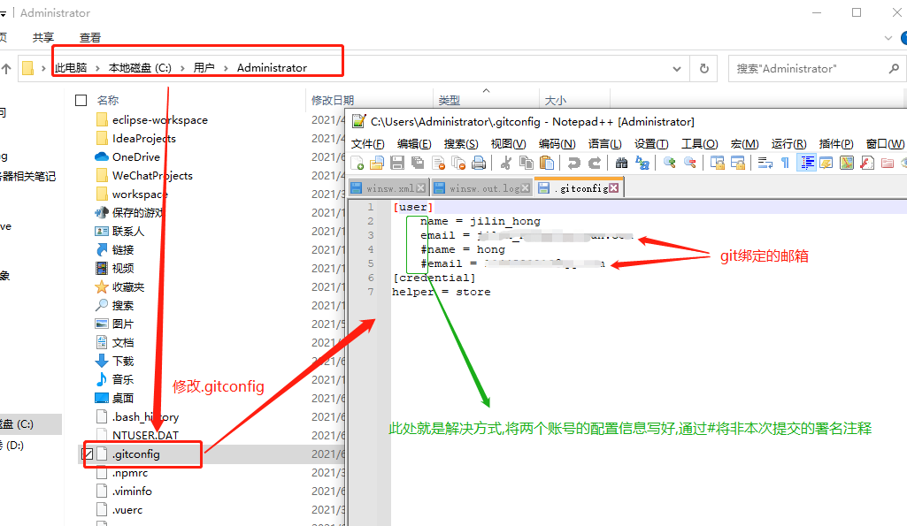
>
> 或者可以直接写个python小脚本来修改:如果根据该仓库clone时的账号来进行切换是否更合理,这是个好办法... 

## 3、commit报错无法提交

>```shell
>> running pre-commit hook: lint-staged
>[STARTED] Preparing...
>[FAILED] warning: LF will be replaced by CRLF in sh.exe.stackdump.
>[FAILED] The file will have its original line endings in your working directory.
>[STARTED] Running tasks...
>[SKIPPED] Skipped because of previous git error.
>[STARTED] Applying modifications...
>[SKIPPED]
>[SKIPPED]   × lint-staged failed due to a git error.
>
>  × lint-staged failed due to a git error.
>[STARTED] Cleaning up...
>[SKIPPED]   × lint-staged failed due to a git error.
>  Any lost modifications can be restored from a git stash:
>
>
>pre-commit hook failed (add --no-verify to bypass)
>```
>
>解决方式
>
>```shell
>执行npm run lint， 根据提示修改错误（推荐）
>git commit -m "" --no-verify 绕过了lint的检查
>```


## 4、Git提交时出现(`合并提示`)`Merge branch 'master' of ...`之解决方法

>多人协作开发项目，在上传代码时通常会先pull一下远程代码，使本地与远程同步更新，但是如果远程此时与自己代码存在冲突，在解决冲突后提交有时会出现“Merge branch ‘master’ of …”这条信息。这是因为pull其本质是fetch+Merge的结合。通常会分为以下两种情况：
>
>1.如果远程分支超前于本地分支，并且本地也没有commit操作，此时pull会采用’fast-forward’模式，该模式不会产生合并节点，也即不产生"Merge branch ‘master’ of …"信息。
>
>2.如果本地有commit提交，此时若存在冲突，pull拉取代码时远程和本地会出现分叉，会进行分支合并，就会产生"Merge branch ‘master’ of …"信息。
>
>**解决方法**
>
>>使用`git pull --rebase`命令，如果没有冲突,则会直接合并，如果存在冲突，手动解决冲突即可，不会再产生那条多余的信息。如果你不想每次都rebase，可以在git bash里执行
>>
>>```shell
>>git config --global pull.rebase true
>>```
>>
>>这个配置就是告诉git在每次pull前先进行rebase操作。

### ① 可能出现的相关报错`error:Cannot pull with rebase`

>1. git 执行`git pull –rebase`后报错误如下：
>
>   ```sh
>   error: cannot pull with rebase: Your index contains uncommitted changes.
>   error: please commit or stash them.
>   ```
>
>2. 原因：如果有未提交的更改，是不能git pull的
>
>3. 解决：
>
>   - 先执行`git stash`    -->#可用来暂存当前正在进行的工作
>   - 再执行`git pull –-rebase`
>   - 最后再执行`git stash pop`  -->#从Git栈中读取最近一次保存的内容
>
>4. 截图示例
>
>   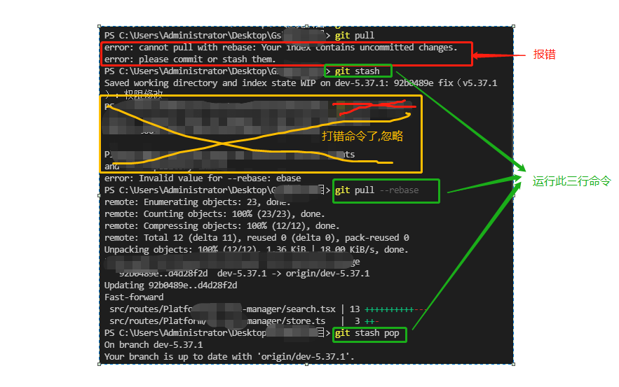

### ② *防止冲突的有效操作*

>不要直接用`git pull`拉取,而是分开操作,先拉取代码(拉取后可以先查看冲突部分取解决).随后再去合并
>
>1. `git fetch 别名`(将修改同步到远程跟踪分支上)
>2. git merge 远程跟踪分支

## 5、Git删除误提交的大文件历史记录

>1. 应用场景:在我们日常使用Git的时候，一般比较小的项目，我们可能不会注意到.git 这个文件。其实.git文件主要用来记录每次提交的变动，当我们的项目越来越大的时候，我们发现.git文件越来越大。很大的可能是因为提交了大文件，如果你提交了大文件，那么即使你在之后的版本中将其删除，但是`实际上记录中的大文件仍然存在`。
>2. 原因分析:为什么呢？仔细想一想，虽然你在后面的版本中删除了大文件，但是Git是有版本倒退功能的吧，那么如果大文件不记录下来，git拿什么来给你回退呢？
>3. 导致的问题:.git文件越来越大导致的问题是--每次拉项目都要耗费大量的时间，并且每个人都要花费那么多的时间。
>4. git给出了解决方案，使用git branch-filter来遍历git history tree, 可以永久删除history中的大文件，达到让.git文件瘦身的目的。
>
>下面给出步骤（以下步骤非常危险，`操作需谨慎!`,最好最好不要在公司项目中使用）

### Ⅰ-列出仓库中最大的几个对象及其文件名

>列出所有仓库中的对象（包括SHA值、大小、路径等），并按照大小降序排列，列出TOP 5(本人示例,你也可多展示)
>
>1. 命令示例
>
>   ```bash
>   git rev-list --all --objects | grep "$(git verify-pack -v .git/objects/pack/*.idx | sort -k 3 -n | tail -n 5 | awk -F ' '  '{print $1}')"
>   ```
>
>2. 图示
>
>   

### Ⅱ-将某文件从历史记录中删除

>既然文件找到了(此处删除`杂记_其他(如破解与配置)的碎片化笔记/Typora笔记软件分享/tools/软件包/Typora.dmg`)，那么得将该文件从历史记录中删除，执行以下命令：
>
>1. 命令示例:
>
>   ```bash
>   git log --pretty=oneline --branches -- "杂记_其他(如破解与配置)的碎片化笔记/Typora笔记软件分享/tools/软件包/Typora.dmg"
>   ```
>
>2. 图示
>
>   

### Ⅲ-重写所有 commit，将该文件从 Git 历史中完全删除

>上面的命令执行后只是从历史记录中移除，还没有完全删除它，我们需要重写所有 commit，将该文件从 Git 历史中完全删除：
>
>1. 代码示例:
>
>   ```bash
>   git filter-branch --index-filter 'git rm --cached --ignore-unmatch  "杂记_其他(如破解与配置)的碎片化笔记/Typora笔记软件分享/tools/软件包/Typora.dmg"' -- --all
>   ```
>
>2. 图示
>
>   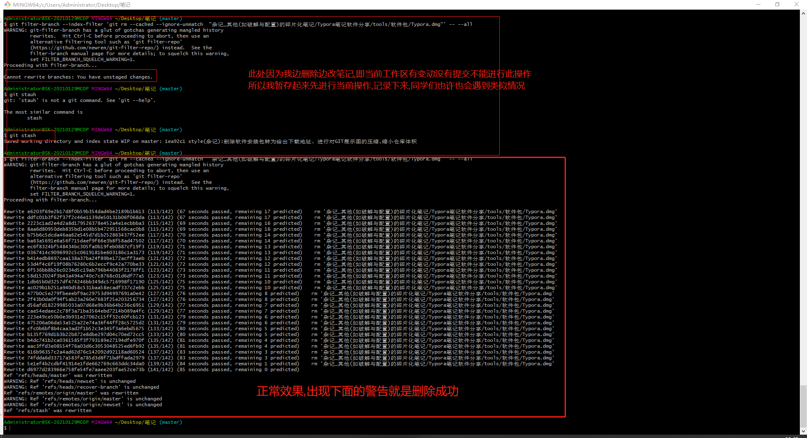
>
>3. 补充注意点:
>
>   如果你像我一样,工作区有新写的内容没有追踪与提交导致无法进行删除操作时,千万不要直接暂存`stash`,否则这些没有暂存的内容就没了,要记得先`git add .`

### Ⅳ-把该文件的引用完全删除

>上面的命令执行后，此时历史记录中已经没有该文件了，此时是真正删除了它。 不过我们运行 filter-branch 产生的日志还是会对该文件有引用，所以我们还需要运行以下几条命令，把该文件的引用完全删除：
>
>1. 命令示例:
>
>  ```bash
>  rm -rf .git/refs/original/
>  git reflog expire --expire=now --all
>  git gc --prune=now
>  git gc --aggressive --prune=now
>  ```
>
>2. 图示
>
>  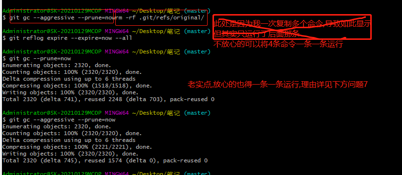
>
>3. 果真编程其实殊途同归,该学的都得学,这里就暴露的Linux没学好的弊端,所以暗下决心,争取今年内将linux系统学习一遍

### Ⅴ-强制提交

>现在我们再看 .git 文件的大小明显变小了，少了那个大文件，说明我们之前误提交的大文件已经删除了。 最后一步就是 push 代码了，不过就是需要强制 push
>
>1. 命令示例
>
>   ```bash
>   git push --force
>   ```
>
>2. 图示
>
>   

### Ⅵ-远程仓库GC

>网上所能百度的方法中都没有说到要进行远程存储库GC,但是本人操作后发现,明明命令行中运行了`git gc`,但你的远程仓库仍然会非常庞大甚至更加庞大,也许你本地已经删减至几十兆,但是远程仓库已经"爆仓"达到`1300+兆`,详见`问题7`
>
>
>
>

### Ⅶ-删除前后`.git`大小对比

>本人此时测试删除的文件正好为10M,成功删除
>
>1. 删除前截图
>
>  
>
>2. 删除后截图
>
>  
>
>3. 删除多个文件后
>
>   

## 6、git出现文件夹后面跟`@+数字`问题

>1. 问题出现场景:本人欲将两个仓库代码合到一个仓库中,但是原本文件夹内还有.git，导致这些文件夹push后变成了子模块
>
>2. 问题场景图例-->具体出问题时并没有截图,此处截图提交时差别(原本应该是一大堆V1.0的文件,结果只有一个文件夹,后面跟着哈希值)
>
>   
>
>3. 解决思路
>
>   >删除原来的子文件夹的.git  -->`rm -r .git`,当然也可以手动删除
>   >
>   >删除本地git缓存  -->`git rm -r --cached fileName`
>   >
>   >重新add，push 
>
>4. 解决结果截图
>
>   

## 7、远程仓库过大导致无法push

>问题出现场景:在前两天本人发现笔记仓库过大 已经达到600M的时候,本人花了一些时间将无用的大文件删除(详见`问题5`),并且减小到了100M+,然后推送上了gitee上,但是今天push的时候突然报错仓库过大无法推送
>
>1. 问题报错截图
>
>2. 本人就产生很大的疑惑,明明我本地仓库才100+M,`.git`文件也才86M,但是远程仓库竟然达到了恐怖的1300M+(当时急于寻找解决方案,没有截图)
>
>   本人推测(不确定,也找不到人问,朋友都没经历过这个情况,所以引出记录待定,如果有小伙伴知道了希望可以发在评论区或者私信我)
>
>   1. 当时我是将多条命令一起复制进去运行,可能导致`git gc`命令没有运行到(可能性极小,但还是留下悔恨的泪水)
>
>   2. 也许本地的gc命令只是清理了本地仓库的,远程也要清理,但这个并不重要,知道了这个点后我们能进行解决了
>
>       
>
>3. 问题解决:
>
>    
>
>    GC后内存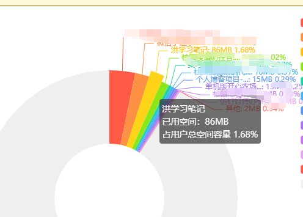
>
>   4. GC详解
>
>   >Git的底层并没有采用 CVS、SVN 底层所采用的那套增量式文件系统，而是采用一套自行维护的存储文件系统。当文件变动发生提交时，该文件系统存储的不是文件的差异信息，而是文件快照，即整个文件内容，并保存指向快照的索引。这种做法，提高 Git 分支的使用效率；但也容易导致代码仓库中内容重复程度过高，从而仓库体积过大。当遇到这种情况时，或者需要将仓库推送到远程主机时，就需要Git中的gc（garbage collect）功能，也就是`垃圾回收功能`。
>   >
>   >大体来说，当运行 "git gc" 命令时，Git会收集所有松散对象并将它们存入 packfile，合并这些 packfile 进一个大的 packfile，然后将不被任何 commit 引用并且已存在一段时间 (数月) 的对象删除。 此外，Git还会将所有引用 (references) 并入一个单独文件。
>   >
>   >就细节而言，Git做了这几件事：
>   >
>   >pack_refs 过程
>   >reflog expire 过程
>   >repack 过程
>   >prune 过程
>   >rerere 过程
>   >
>   >pack_refs 过程相当于执行"git pack-refs --all --prune"，它会将$GIT_DIR/refs目录下的所有heads和tags打包成一个文件并保存为$GIT_DIR/packed-refs下。
>   >
>   >reflog expire 过程相当于执行"git reflog expire --all"，它会将删除所有超过期限而且没有被refs涉及的reflog条目。
>   >
>   >repack 过程相当于执行"git repack -d -l"，一般情况下还会包括"-A"选项，它会将所有未被包含在一个pack的松散对象连结成一个pack，也会将现有的pack重新组织为一个新的更有效率的pack，并删除冗余的pack（如果她们中存在不可达的松散对象，会先把这些对象释放出来）。
>   >
>   >prune 过程相当于执行"git prune --expire"，他会删除所有过期的、不可达的且未被打包的松散对象。
>   >
>   >rerere 过程相当于执行"git rerere gc"，这种情形下似乎没什么用。
>   >
>   >所以本人推测应该是进行了`问题5`操作后还需要`进行一次GC操作`

## 8、Git GUI中文乱码问题解决方法

>当我们使用Git GUI的查看代码的时候，有时候会出现中文乱码：
>
>1. 解决方案1:直接在`GIT GUI`中操作
>
>   **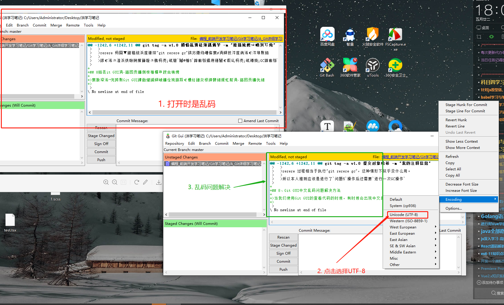 
>
>2. 解决方案2:命令行
>
>   ```sh
>   git config --global gui.encoding utf-8
>   ```
>
>3. 解决方案3:直接修改配置文件
>
>   >在软件的安装目录下，在`Git\mingw32\etc\gitconfig`文件末尾添加：
>   >
>   >```sh
>   >[gui]encoding=utf-8
>   >```

## 9、Git 切换远程仓库地址

>在公司开发中,也许会遇到公司项目地址迁移的问题(本人就遇到了) : 比如从码云gitee上将项目迁移到gitLab上,那么我们本地怎么切换远程仓库地址呢? 很简单!
>
>1. 切换远程仓库地址
>
>   - **方式一：修改远程仓库地址**
>
>     ```sh
>     git remote set-url origin URL #更换远程仓库地址，URL为新地址。一步到胃
>     ```
>
>   - **方式二：先删除远程仓库地址，然后再添加**
>
>     ```sh
>     git remote rm origin #删除现有远程仓库
>     git remote add origin url #添加新远程仓库
>     ```
>
>2. 查看远程仓库地址
>
>   > 没错,改完了,很简单是吧,但是你怎么确定自己是否修改成功了呢?
>   >
>   > ```sh
>   > git remote -v  #查看远程仓库的地址
>   > ```
>
>3. 截图示例
>
>   > 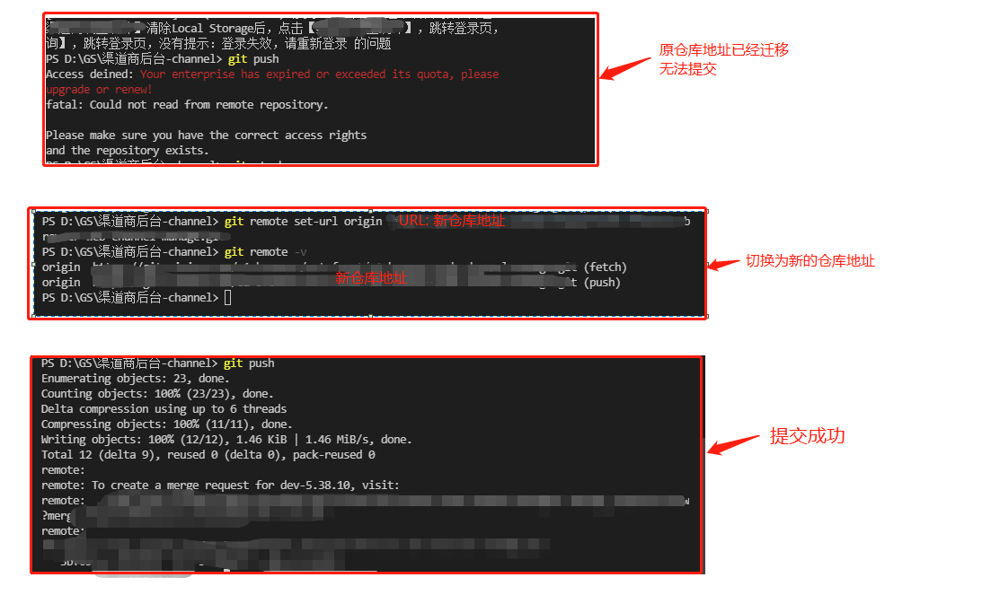

## 10、如何撤销 commit 提交

>1. 一般我们写完代码后,是这样提交的:
>   - git add . //添加追踪所有文件
>   - git commit -m "feat(前端-Git学习详细笔记):更新撤销commit操作" //添加commit提交信息
>2. 但是commit写完提交信息后,突然想到还有一个地方代码没改到/保存,如果放到下一个commit却不合适(同一个功能修改,分成两个commit),原因详见上方的 [版本控制工具的使用基本原则](https://gitee.com/hongjilin/hongs-study-notes/tree/master/编程_前端开发学习笔记/Git学习笔记#Ⅳ-版本控制工具的使用基本原则) 
>3. 执行此命令命令:`git reset --soft HEAD^`
>   - HEAD^的意思是上一个版本，也可以写成HEAD~1
>   - 如果你进行了2次commit，想都撤回，可以使用HEAD~2
>   - 详见 [reset三部曲](https://gitee.com/hongjilin/hongs-study-notes/tree/master/编程_前端开发学习笔记/Git学习笔记#reset三部曲)
>
>作用:将文件从`暂存区中撤回`到工作目录中(仅仅是撤回commit操作，你写的代码仍然保留)

## 11、错误的git push提交成功后如何撤销回退

>我们在使用Git进行版本控制时，有可能会出现这种情况。git push后发现提交的内容不是想要的，这时候我们怎么做呢，提交上去的内容是没有删除按钮的（比如github，或码云）。所以我们需要一些手段将提交上去内容撤销下来。
>
>而要撤销,就要用到上面所学的 `git reset`

### 1、错误场景示范

>Ⅰ- 当我撰写 [ commit ] 信息没注意到,以为是对的时候直接提交 --> 因为本人提交笔记时喜欢按 [ ↑ ] 找到之前的提交信息进行修改
>
> 
>
>Ⅱ- 此时可以看到,错误的 [ commit ] 已经提交了 (当然,适用场景不只是commit ,也可错误代码之类的)
>
> 

### 2、回退操作

>咱们操作稳重一点,使用git reset --soft HEAD~就好了(如果回退后代码也不想要,可以用`git stash`,暂存,达到代码也回退的效果)

#### ① git reflog

>commits，它在git中扮演了一个重要角色，我们平常用的一些操作git clone ,git commit 都会产生commits，通俗的讲这个就是版本号，但是git reset并不会产生commits（不是不会产生，而是会产生 但是都是一样的），我们可以先看看自己项目中的commits，使用如下命令:`git reflog`
>
> 

#### ②  git  reset --soft HEAD~

>运行此代码后,我们的 [ HEAD ] 指向了上一个 [ commits ]
>
> 

#### ③  查看缓存

> * 此时你可以用`stash staus`查看,会发现,之前提交的代码已经放回缓存区了
>
> * 如果你不想要此次提交所有代码,可以使用`git stash` ,然后再去清空即可(当然,本人此处还是需要的,所以要留下)
>
>    

#### ④ 重新撰写 [ commit ]信息

> 

#### ⑤ 强制提交

>如果你重新撰写 [ commit ] 后马上重新push,你会发现无法提交: 因为我们当前落后远程一个版本!
>
>所以此时直接强制提交即可,就能覆盖远程提交记录
>
>>`git push -f`
>
> 

### 3、成功展示

>* 在网站工作台首页能看到已经将更改后的 [ coommit ] 强制推送上来了
>
> 也许你会奇怪:为啥工作台上还能看到? 其实已经删了!!!你看下方
>
> 
>
>* 但是你查看提交记录,会发现之前错误的commit已经被覆盖
>
>

## 12、如何删除指定的某个commit提交（连带提交的内容一起删除）

>如果我们提交了错误的某个提交，例如提交错了分支，但是在你提交后已经有别人再进行了提交，这时候你如果只想撤回自己的提交而不影响其他人的话，就可以用这种操作
>
>比如我的提交历史如下，我现在想删除`commit_这是你的错误提交`，但是不影响`commit_这是你的错误提交`之后的提交历史
>
>```js
>commit_这是别人的提交 
>commit_这是别人的提交2
>commit_这是你的错误提交
>commit_这是更早之前的提交
>```

### 1、全部操作

>1. git log获取commit信息 --需要拿需要删除的commit的id
>2. git rebase -i (要删除的commit的下一个commit号，这个很重要不懂的看下面示例 ) 
>3. 编辑文件，将要删除的commit之前的单词改为drop （vim编辑器要按 i 键进入插入模式）
>4. 保存文件退出（vim编辑器 :wq 退出）
>5. git log查看（此时commit记录已经删除）
>6. 确认无误后输入`git push origin HEAD --force`推送到远程仓库

### 2、操作示例

#### Ⅰ - 模拟场景

>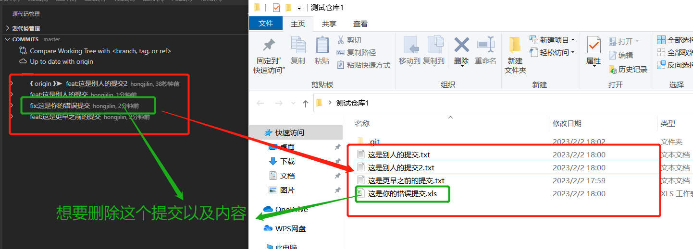

#### Ⅱ - git log获取commit信息

>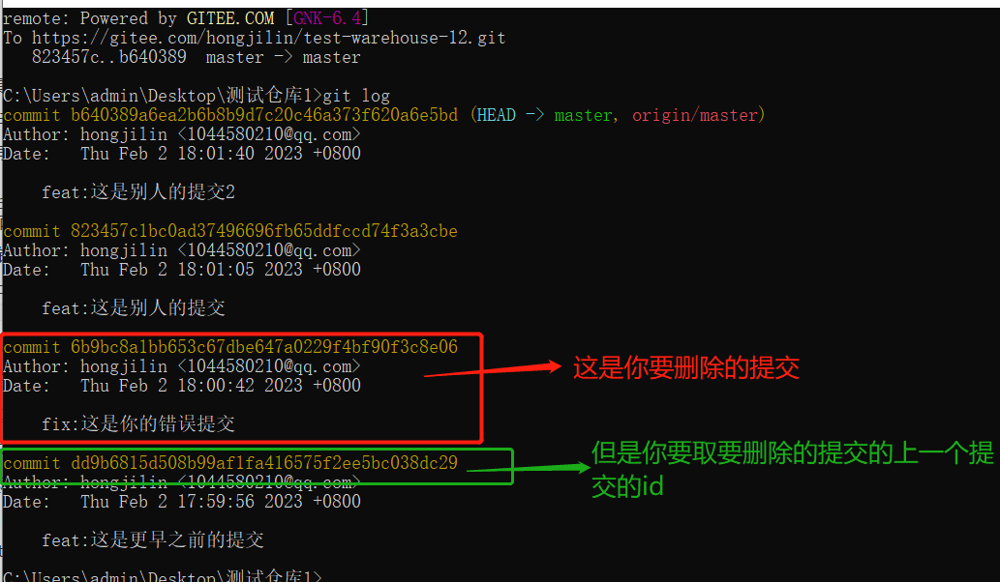

#### Ⅲ -` git rebase -i 要删除的提交的上一个提交的id`

>这里要注意，是上一个提交的id，在步骤Ⅱ中已经进行了图例，输入下面的指令后回车进入
>
>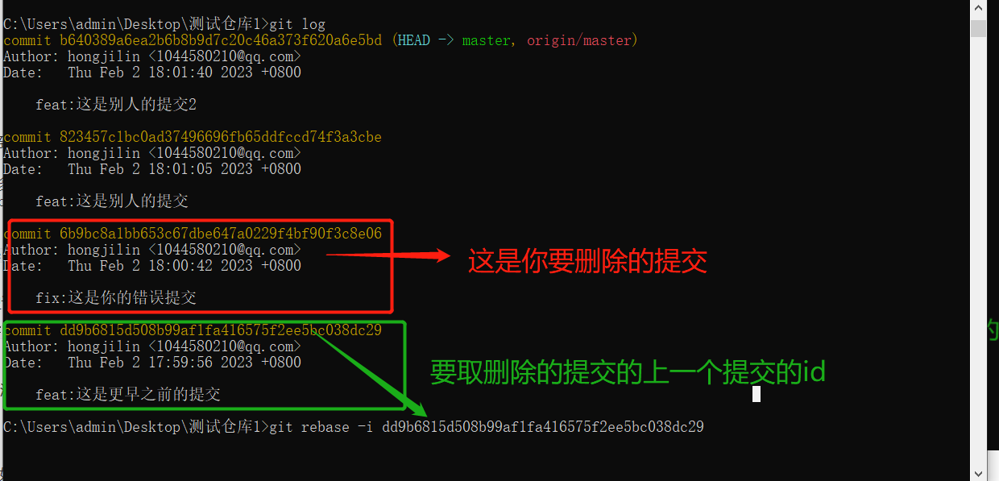
>
>这样就会进入这样一个界面：
>
>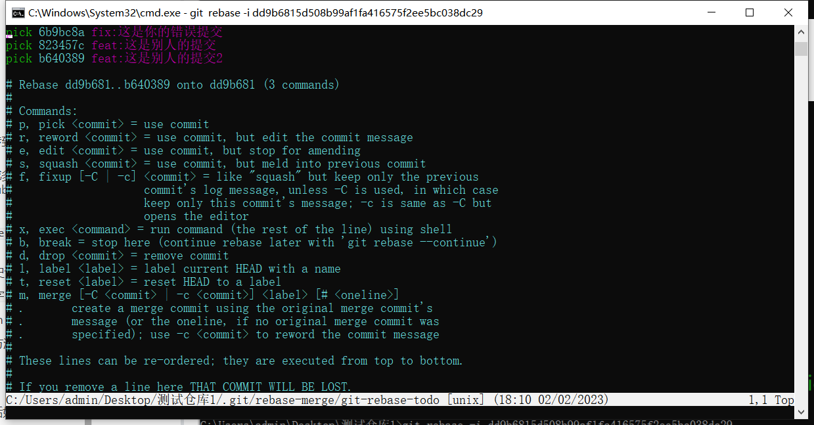

#### Ⅳ- 编辑文件，将要删除的commit之前的单词改为drop 

>vim编辑器要按 i 键进入插入模式,将要删除的commit之前的单词改为drop 
>
>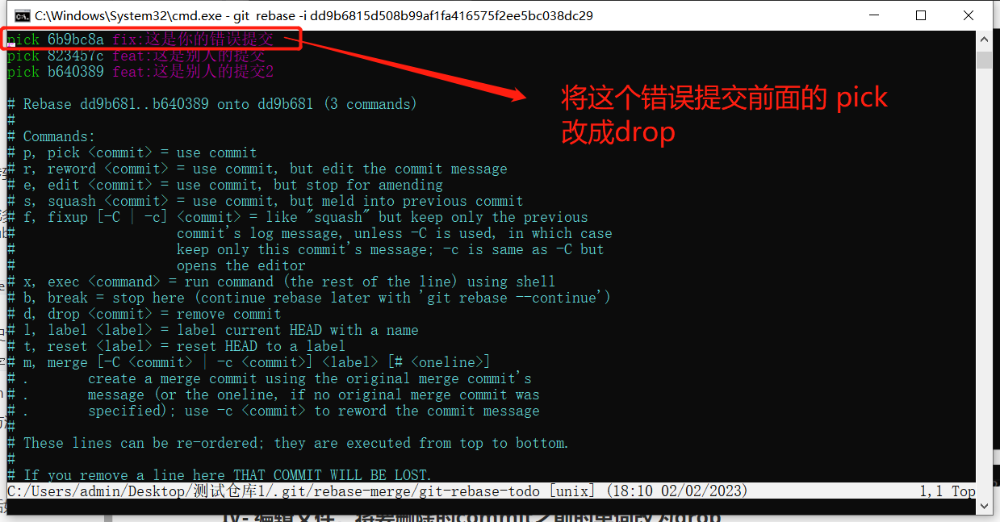
>
>退出并保存
>
>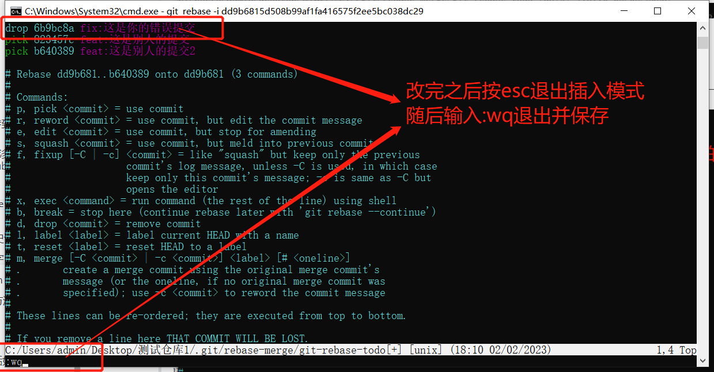

#### Ⅴ-查看是否成功

>此时查看本地提交记录以及文件，应该已经删除了
>
>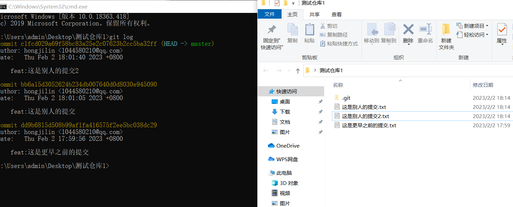

#### Ⅵ-确认无误后提交

>确认无误后输入`git push origin HEAD --force`推送到远程仓库
>
>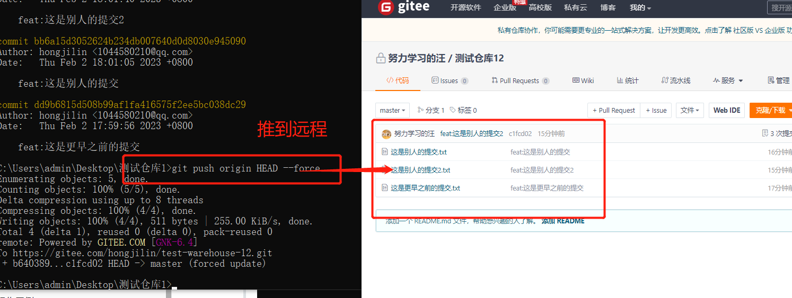

## 13、如何让.git文件只有一个分支代码并且无其他分支（让git仓库只关联一个分支）

>遇到一个难搞的甲方，要求除了源码给出去，还要求.git文件提供出去，但是此项目有许多别的分支，不同分支还有其他项目的源码，不可以都给出去
>于是就有了下面的操作
>由于现在公司使用gitlab，所以此处用gitlab为例

### 1、全部操作

>1. gitlab上创建一个新仓库，随便什么仓库都可以，然后复制这个仓库的远程地址
>2. 在需要给出去的项目分支上，输入命令 git remote add gitlab https://gitlab.ylzpay.com/hongjilin/my-test.git（新仓库地址，这里用本人创建的仓库做例子）
>3. 再输入命令git push gitlab **develop-area**（将此项目当前分支代码以及记录推送到新仓库的develop-area分支）
>4. 这时候去新仓库拉代码 就会发现多了一个**develop-area** 分支，历史commit记录都在，同时不存在别的分支代码
