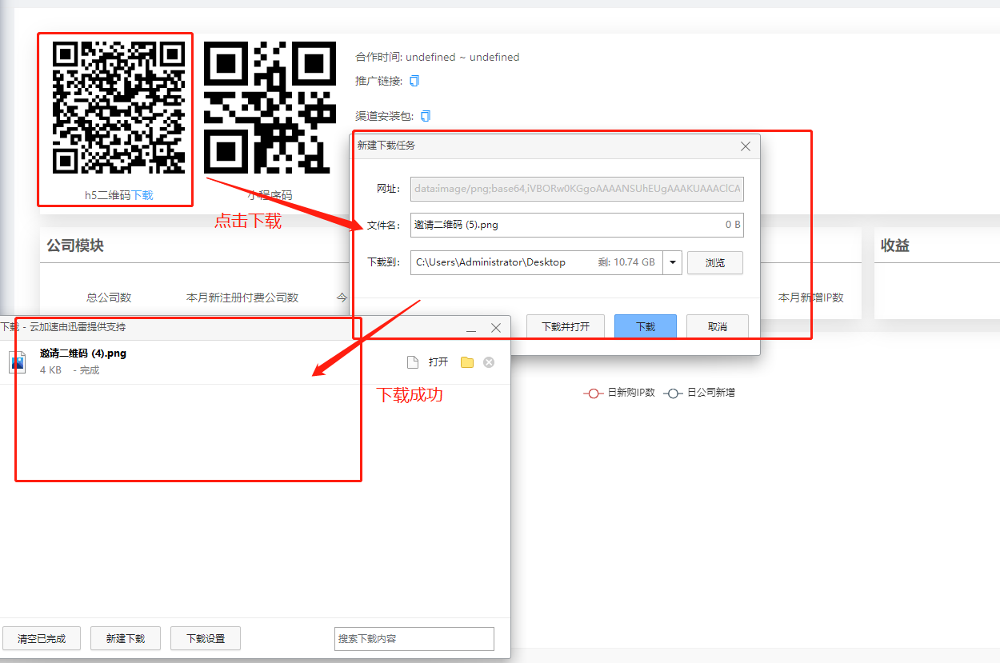
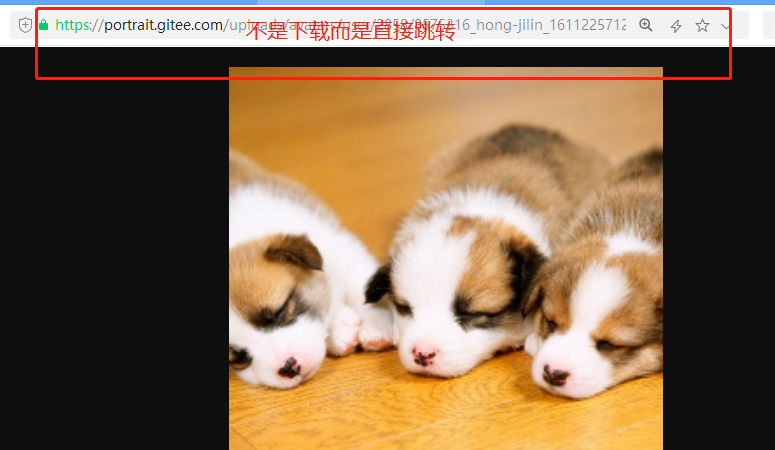

# 前端利用a标签实现文件[图片]下载

>前端实现文件下载（a标签实现文件下载 避免直接打开问题)

# Ⅰ-实现[HTMLCanvasElement]类型图片下载

>1. 需求场景:
>
>   - 注意:此方法只适用[`HTMLCanvasElement`]类型,[img不可用此方法]
>   - 当你需要将如[`二维码`]之类的图片下载时
>
>2. 实现代码
>
>   ```js
>   //调用此函数即可
>   const downCode = (ref) => {
>     const canvas =  document.querySelector(`#${ref}`);
>     downLoad(saveAsPNG(canvas));
>   };
>   const saveAsPNG = (canvas) => {
>     return canvas.toDataURL('image/png');
>   };
>   const downLoad = (url) => {
>     var oA = document.createElement('a');
>     oA.download = '邀请二维码'; // 设置下载的文件名
>     oA.href = url;
>     document.body.appendChild(oA);
>     oA.click();
>     oA.remove(); // 下载之后把创建的元素删除
>   };
>   ```
>
>3. 调用示例:`二维码下载`
>
>   ```tsx
>    <div className={style.codeBox}>
>      <QRCode
>        id="qrid"
>        className={style.code}
>        value={'https://portrait.gitee.com/uploads/avatars/user/2858/8575316_hong-jilin_1611225712.png'}
>        size={165}
>      />
>      <div className={style.codeText}>h5二维码
>        <a onClick={() => downCode('qrid')}>
>          下载
>        </a>
>      </div>
>    </div>
>   ```
>
>4. 结果示例
>
>   

# Ⅱ- a标签+download属性

>当`url`是同源（`同域名、同协议、同端口号`）时，这种情况用 a标签加download属性的方式即可，download属性指示浏览器该下载而不是打开该文件，同时该属性值即下载时的文件名；
>
>`注意`:此方法会导致一个问题,当你下载图片的URL是`远程图片url`时,`将不是下载该文件而是打开该文件`
>
>1. 错误示例代码-->(将远程`url`换成本地图片url即正确)
>
>   ```tsx
>    
>   <div className={style.codeText}>小程序码
>      <a download  target='_black' href='https://portrait.gitee.com/uploads/avatars/user/2858/8575316_hong-jilin_1611225712.png?response-content-type=application/octet-stream' >下载二维码</a>
>      </div>
>   ```
>
>2. 结果:不是下载而是直接打开该url
>
>    
>
>