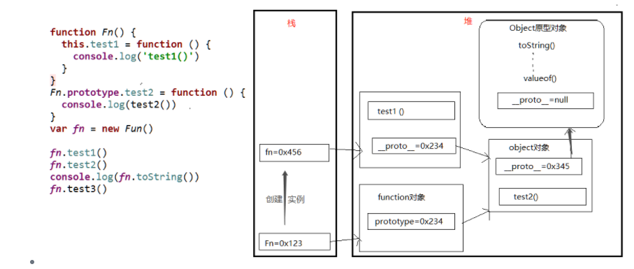
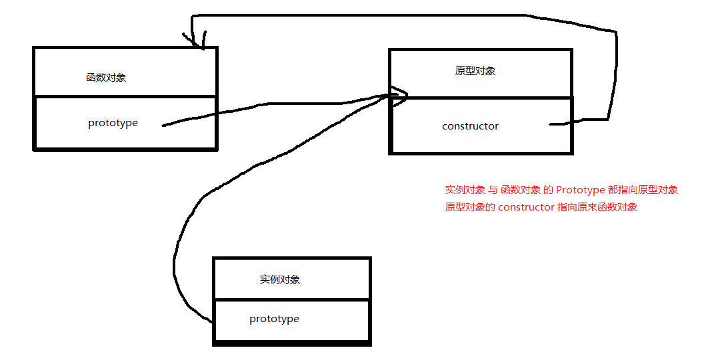

## js基础

> **[JavaScript笔记](https://gitee.com/hongjilin/hongs-study-notes/tree/master/编程_前端开发学习笔记/HTML+CSS+JS基础笔记/JavaScript笔记)** 

### 1、原型与原型链

>本人JS进阶部分有详细分析 -->[点我跳转](https://gitee.com/hongjilin/hongs-study-notes/blob/master/%E7%BC%96%E7%A8%8B_%E5%89%8D%E7%AB%AF%E5%BC%80%E5%8F%91%E5%AD%A6%E4%B9%A0%E7%AC%94%E8%AE%B0/HTML+CSS+JS%E5%9F%BA%E7%A1%80%E7%AC%94%E8%AE%B0/JavaScript%E7%AC%94%E8%AE%B0/A_JavaScript%E8%BF%9B%E9%98%B6%E5%AD%A6%E4%B9%A0%E7%AC%94%E8%AE%B0.md#1%E5%8E%9F%E5%9E%8B%E4%B8%8E%E5%8E%9F%E5%9E%8B%E9%93%BE)
>
>###### 什么是原型呢?
>
>>你可以这么理解: 每一个JS对象(除了Null) 在创建时就会与之关联的另一个对象,这个对象就是我们所说的原型,每一个对象都会从自己的 '原型对象' 中继承属性
>
>>* 每个函数都有一个 prototype 属性,它默认指向一个 Object 空对象(即成为原型对象)
>>* Prototype 对象默认有两个属性: constructor 属性 和 `_proto_`属性
>>* prototype上的 constructor 属性包含了一个指针,指回原函数(`fun.prototype.constructor-->fun`)
>
>###### prototype属性的作用?
>
>>* 给原型对象添加属性(一般都是方法): 函数的所有 实例对象 自动拥有原型中的属性(方法)
>>* 所以说,JS的继承机制就是通过原型对象实现继承的,原型对象的作用就是定义所有实例对象共享的属性与方法
>
>###### 什么是原型链?
>
>>每个对象都可以有一个隐式原型 `_proto_`, 这个原型还可以有它自己的原型,以此类推形成一个原型链:
>
>>* 查找特定属性的时候,我们先去这个对象里面去找
>>* 如果没有的话就去它的原型对象里面去找
>>* 如果还没有就再去原型对象的原型对象里去找..........
>
>>这个操作被委托在整个原型链上,这个就是我们所说的原型链了
>
>###### 原型链结论
>
>>* `_proto_`是原型链查询中实际用到的,它总是指向显式原型 `prototype`
>>* prototype 是函数独有的,在定义构造函数时自动创建,它总是被创建的实例的 `_proto_` 所指
>>* 所有对象都有`_proto_`属性,**函数这个特殊对象** 除了具有`_proto_`属性,还有特有的原型属性`Prototype`(因为它本身也是一种对象)

------


### 2、Prototype 与 `_proto_` 区别与关系

>* 每一个函数 function 都有一个 `prototype` ,即显式原型
>
>* 每个实例对象都有一个 `_proto_` ,即隐式原型
>
>* 对象的 隐式原型(`_proto_`) 的值 为其 对应构造函数的 显示原型(`prototype`) 的值
>
> >可以这样理解 构造函数的prototype <-- 默认创建的Object(指向此地址值) --> 对象的`_proto_`
>
>* 隐式原型为对象独有的,而 显式原型(它是一个对象) 是函数独有的
>
>**总结**
>
>* 函数的 `prototype` 属性: 在定义函数时自动添加的,默认值时一个空Object对象
>* 对象的 `_proto_` 属性: 创建对象时自动添加的, 默认值为 `构造函数的 protopyte 属性值`
>* 程序员 可以直接操作 显式原型 而不能直接操作隐式原型(ES6之前)
>* prototype 属性可以给函数和对象添加可共享(继承)的方法、属性,而`_proto_`是查找某函数或对象的原型链的方法
>
>###### 图
>
>>

------


### 3、如何理解构造函数，原型对象和实例的关系

>* 每个构造函数都有一个原型对象(prototype)
>* 原型对象都包含一个指向构造函数的指针(prototype中有constructor)
>* 而实例都包含一个原型对象的指针(实例的`_proto_` 的值 指向 原型对象prototype 的值)
>
> 
>
>###### 构造函数
>
>>构造函数特点: 1. 函数体内使用this关键字,代表了所要生成的对象实例 2. 生成对象,必须使用 new关键字实例化
>
>###### instanceof 用法:可以忽略 new 用构造函数声明实例
>
>>```js
>>function Person(name) {
>>// 判断this是否指向了当前的实例
>>if (this instanceof Person) {
>> // this指向了当前的实例，外部使用了关键字new
>> this.name = name
>>}else {
>> // this指向window，外部没有使用关键字new
>> return  new Person(name)
>>}
>>}
>>var p1 = new Person("咚咚")
>>var p2 =  Person("锵锵")
>>console.log("p1",p1);
>>console.log("p2",p2);
>>```

------

### 