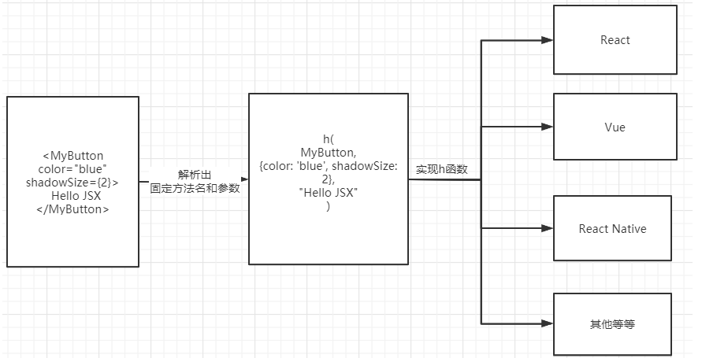
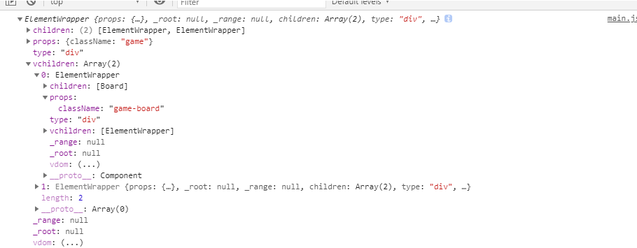

# #说明

>本笔记为本人`洪`深入学习React并尝试阅读理解React源码所记录笔记
>
>建议预备知识:react基础
>
>学习过程及笔记记录时查阅借鉴的相关资料官方文档的[源码概览](https://zh-hans.reactjs.org/docs/codebase-overview.html);ILoveDevelop的[`React 源码解析`](https://react.jokcy.me/);知乎的神马翔[`React专栏`](https://www.zhihu.com/people/song-meng-xiang-95)、[全栈潇晨](https://www.zhihu.com/people/qbtqiuqiu)的React系列文章、[`万字长文+图文并茂+全面解析 React 源码 - render 篇`](https://segmentfault.com/a/1190000022105022);前端桃园的[`Deep In React之浅谈 React Fiber 架构`](https://mp.weixin.qq.com/s?__biz=MzAxODE2MjM1MA==&mid=2651556940&idx=1&sn=d40506db3d4d78da9a94ae6c7dc61af6&chksm=80255b8db752d29bbb8edc79eb40ce4122f3fddca121a53a5c3f859259cf4b1d7402ff676a84&scene=21#wechat_redirect);还有`公司前辈的技术分享`
>
>本人笔记地址分享:[`全部笔记`](https://gitee.com/hongjilin/hongs-study-notes)、[`React笔记`](https://gitee.com/hongjilin/hongs-study-notes/tree/master/%E7%BC%96%E7%A8%8B_%E5%89%8D%E7%AB%AF%E5%BC%80%E5%8F%91%E5%AD%A6%E4%B9%A0%E7%AC%94%E8%AE%B0/React%E7%AC%94%E8%AE%B0)	

# #目录

>		​	
>
>		[TOC]

# 一、React基础知识总结

> 在深入学习前,还是先捋一捋对于React基础知识的理解与总结

## 1、JSX

>这东西不用解释我为啥放在第一位说了吧,基本上我们大部分React开发者都是用jsx进行代码编写的
>
>这里不着重讲解基础语法,只是给出自己的理解与总结,有需要了解基础语法的同学  -->[点我跳转](https://zh-hans.reactjs.org/docs/jsx-in-depth.html)

### Ⅰ-我们认为的JSX是什么? 

> 我们认为的JSX是什么? ===>  ` 类HTML的语法?  React里面的模板语法?  语法糖?`
>
> - 其实应该都算是对的,但是有好像不是完全对.如果只讲里面的一点的话又有所欠缺的感觉
>
>  > JSX是(JavaScript XML)的缩写,其实他本质上还是属于JavaScript,`不一定用在React上`
>
> - 此处借用React中文官网的一句话:
>
>  >React不强制要求使用JSX,但是大多数人发现,在JS代码中将JSX与UI放在一起时,在视觉上会有辅助作用.它还可以使得React显示更多有用的错误和警告信息
>
> - 它本身可以理解为是一个规范,开发者在JSX的帮助下,避免重复地学习不同框架或者库,因为在JSX的规范中,他产生的结果是一致的.用React的思想来说,JSX最终的作用是把模板语法解析成Component、props、children....等等;而具体怎么利用这些产物,就是不同的框架或者库的特性了,比如下面的一个组件它被解析以后其实产生的是一段代码段,并且有固定的参数位置
>
>  > 
>  >
>  > 由上图可以看出JSX的产物(h函数名称和h函数的参数),它很像虚拟DOM

### Ⅱ-JSX的产物

#### ① 简单的JSX产物

>以下是一个最简单的JSX编译后的结果
>
> 
>
>JSX的产物可以理解是基于JSX代码,利用一个函数模板(如同[`Ⅰ`](#Ⅰ-我们认为的JSX是什么? )中图示的[h]函数),生成一段[`调用`]函数模板,然后里面的函数名可能在不同的框架或者库中是不一样的,他没有实现h函数,需要框架或者库自己实现
>
>可以得出一个大胆的结论:`JSX理论上是完全跨平台的,只要有人实现它在对应平台的[h]函数,它甚至可以在任何支持JS语言的平台上运行`

#### ② Rreact中的JSX产物

>- 作为React的官方指定语法,JSX允许用户在JS代码中插入HTML代码.但是这种写法`浏览器是无法解析的`,他们就需要一个转换器
>
>  >`Babel`就充当了这样一个角色，他在JSX代码编译时候将其转换成JS文件，这样浏览器就能解析了。
>
>- JSX有JS和HTMl两种写法，本身就是JS写法的其实是不需要转换的
>
>  >当然也不能说的这么绝对，有时候Babel会为了兼容性的缘故将高版本的语法翻译到低版本，这部分不在讨论范围。我们要关注的其实是HTMl的处理方式

##### 代码转换示例与解析

>1. 比如下面这行代码：
>
>   >```jsx
>   ><div id='name'>Tom and Jerry</div>
>   >
>   >---------------通过Babel转换后生成的代码是：-------------------------
>   >    
>   >React.createElement("div", {
>   >    id: "name"
>   >}, "Tom and Jerry");
>   >```
>   >
>   >HTML语法转变成了JS语法，简单来说，我们所写的JSX最终变成了JS。
>
>2. 复杂点的例子
>
>   >```jsx
>   ><div class='wrapper' id='id_wrapper'>
>   >    <span>Tom</span>
>   >    <span>Jerry</span>
>   ></div>
>   >----------- 通过Babel转换后生成的代码是： ---------------------
>   >    
>   >React.createElement("div", {
>   >    class: "wrapper",
>   >    id: "id_wrapper"
>   >}, React.createElement("span", null, "Tom"), React.createElement("span", null, "Jerry"));
>   >```
>   >
>   >转换规则是比较简单的，React.createElement的第一个参数是节点类型；第二个参数是该节点的属性，以key：value的形式作为一个对象，后面的所有参数都是该节点的子节点。
>
>3. 自定义组件
>
>   >```jsx
>   >function Comp() { return '<div>Tom and Jerry</div>' }
>   ><Comp></Comp>
>   >
>   >-------------- 通过Babel转换后生成的代码是：  ---------------------------------
>   >
>   >function Comp() {  return '<div>Tom and Jerry</div>'; }
>   >React.createElement(Comp, null);
>   >```
>   >
>   >可以看出，React.createElement的第一个参数变成了一个变量，而不是一个字符串，`尝试将函数Comp首字母小写`：
>   >
>   >```jsx
>   >function comp() { return '<div>Tom and Jerry</div>' }
>   ><comp></comp>
>   >
>   >--------------  通过Babel转换后生成的代码是：-------------------------------------------
>   >
>   >function comp() { return '<div>Tom and Jerry</div>'; }
>   >React.createElement("comp", null);
>   >```
>   >
>   >React.createElement的第一个参数又变成了一个字符串。
>   >这也就是我们在React中写组件的时候，`为什么会要求首字母大写的原因`，Babel在编译的时候会将首字母小写的组件视为原生的HTMl节点进行处理，如果我们将自定义组件首字母小写，后续的程序将无法识别这个组件，最终会报错。

### Ⅲ-React为什么选择JSX?

>- 对于一个人喜欢的事物,很多可以用一句话概括:`之所以选择X,是因为Y和Z不好,然后X有一个点能吸引你,那么X就是好的`
>
>- 但是放到技术上,要回答好这个问题,就需要先了解React可选的其他解决方案有什么不好的地方
>
>- 其实相关的方案很多,最直观的就是`模板`:
>
>  > 其实Vue与Angular都是用的模板语法,他们上手简单这是事实,但是`对于React团队来说它并不纯粹!!`
>  >
>  > 它引入了很多新的概念,需要去学习模板指令、模板语法等(如Vue需要理解v-if、v-for等),而JSX就没前者这么复杂,它不需要学习新的开发方式,虽然它也有模板的味道,但它本身能直接支持JS写法(如条件表达式和循环等)

## 2、ReactElement

### Ⅰ-React.createElement函数

>通过Babel编译后的JS代码，频繁出现React.createElement这个函数。这个函数的返回值就是ReactElement，通过上面的示例可以看出，React.createElement函数的入参有三个，或者说三类

#### ① type 

>type指代这个`ReactElement的类型`
>
>1. 字符串比如div，p代表原生DOM，称为HostComponent
>2. Class类型是我们继承自Component或者PureComponent的组件，称为ClassComponent
>3. 方法就是functional Component
>4. 原生提供的Fragment、AsyncMode等是Symbol，会被特殊处理

#### ② config

>参照上面Babel编译后的代码，所有节点的属性都会以Key:Value的形式放到config对象中。

#### ③ children

>子节点不止会有一个，所以children不只有一个，从第二个参数以后的所有参数都是children，它是一个数组

### Ⅱ-ReactElement的结构

>1. [`$$typeof`] 是一个常量，所有通过React.createElement生成的元素都有这个值。一般使用 React 的组件都是挂到父组件的 this.props.children 上面，但是也有例外，比如要实现一个模态框，就需要将模态框挂载到body节点下，这个时候需要使用ReactDOM.createPortals(child, container)这个函数实现，这个函数生成的$$typeof值就是REACT_PORTAL_TYPE。
>2. [`type`]指代这个ReactElement的类型
>3. [`key]`和[`ref`]都是从config对象中找到的特殊配置，将其单独抽取出来，放在ReactElement下
>4. [`props`]包含了两部分，第一部分是去除了key和ref的config，第二部分是children数组，数组的成员也是通过React.createElement生成的对象，示例中省略了这个步骤。
>5. _owner在16.7的版本上是Fiber，Fiber是react16+版本的核心,也是调度算法
>
>```js
>const element = {
>    // 这个标签允许我们唯一地将其标识为React元素  
>    $$typeof: REACT_ELEMENT_TYPE,
>
>    //属于元素的内置属性  
>    type: type,
>    key: key,
>    ref: ref,
>    props: props,
>
>    // 记录负责创建此元素的组件。
>    _owner: owner,
>  };
>```
>
>它就是一个简单的对象，为了看清楚这个对象的创建规则，我们举个例子。 首先是我们写的JSX：
>
>```jsx
><div class='class_name' id='id_name' key='key_name' ref='ref_name'>
>    <span>Tom</span>
>    <span>Jerry</span>
></div>
>```
>
>它会被Babel编译为：
>
>```js
>React.createElement("div", {
>    class: "class_name",
>    id: "id_name",
>    key: "key_name",
>    ref: "ref_name"
>}, React.createElement("span", null, "Tom"), React.createElement("span", null, "Jerry"));
>```
>
>它会生成这样一个Element
>
>```js
>{
>    $$typeof: REACT_ELEMENT_TYPE,
>    type：'div'，
>    key: 'key_name',
>    ref: "ref_name",
>    props: {
>        class: "class_name",
>        id: "id_name",
>        children: [
>            React.createElement("span", null, "Tom"),
>            React.createElement("span", null, "Jerry")
>        ]
>    }
>     _owner: ReactCurrentOwner.current,
>}
>```

## 3、对虚拟DOM的理解

### Ⅰ-什么是虚拟DOM

>- 在React、Vue还没有出现的时候,我们要操作页面上的元素,需要`先找到那个元素`,然后`再进行修改样式、内容或者结构等`-->这很明显性能特别差,也会特别消耗资源!
>
>- 于是就有人会这样思考:如果在操作DOM之前就知道这一次数据更新期望改变的[`节点和`]怎么修改的话,那么这很明显可以提升页面渲染效率
>
>  - > 举个栗子:渲染列表时比如有100条数据,我删除其中一条,那么我只是在`虚拟DOM数据`上删除此条数据,然后剩余的经过diff算法对比,其实只是删除了一条,其余的只是调整了在页面上的位置没有重新渲染;直接操作dom就会导致数据重绘(临时举例不够贴切勿怪)
>
>- 于是[`虚拟DOM`]出现了,`它其实是一个数据结构`,是针对当前DOM构建的一个数据结构
>
>- 以下是一个React的虚拟DOM结构
>
>   

### Ⅱ-为什么需要虚拟DOM

>其实在上面说明[[什么是虚拟DOM](#Ⅰ-什么是虚拟DOM)]的时候就已经大概说明了为什么需要虚拟DOM了.因为`一个新事物只有被需要、能解决某一痛点的时候才会被创造`
>
>- 无脑的渲染是否真的必要?
>
>  - > 很明显不需要.但是在没有虚拟DOM之前,我们能依靠的只有直接操作DOM,尽管我们知道操作DOM而产生的`重绘`会对页面性能产生巨大影响
>
>- 当一个项目大到一种境界的时候,如果还是用查找元素然后进行修改的话,对代码的维护难度会呈现指数级飙升
>
>- 它是Diff算法的技术,也是数据驱动UI的前提
>
>个人理解的虚拟DOM大致流程图(公司前辈讲解的)
>
> 


### Ⅲ- 误区:虚拟DOM比直接操作DOM快?

>- 很多人有这个误区,甚至我在之前很长的一段时间中都是这样认为的.其实不然,通过上面的流程图其实可以很好理解:`直接操作DOM是最快的`.
>- 如果通过虚拟DOM计算出的更新策略是需要重绘10次,而直接操作DOM的次数也是重绘10次,那么直接操作应该是更快的,因为它省去了中间虚拟DOM构建、Diff算法、制定更新策略等;
>- 当然,正常情况下针对一个[`state`(状态)]变化后期望产生结果得出的`更新次数是远小于直接操作DOM`的,预知更新策略比直接无脑操作虽然会花费一部分内存,但是直接操作减少了,性能肯定会更好,做出来的应用的会更加健壮

#### 无图无真相

>网络上有人做了一个操作更新组件各种样式1000次的时间点对比(设定重绘次数一致):
>
>
>
> 可以看出,直接操作DOM是最快的!`但是React需要的渲染时间可能是0`,下限更低,也正是因为计算出来某些[`state`(状态)]不需要更新DOM


