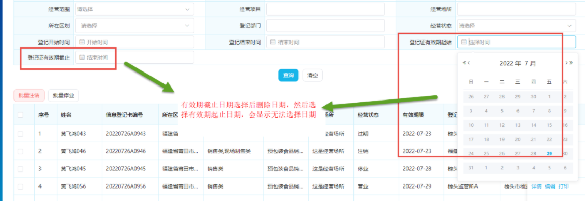
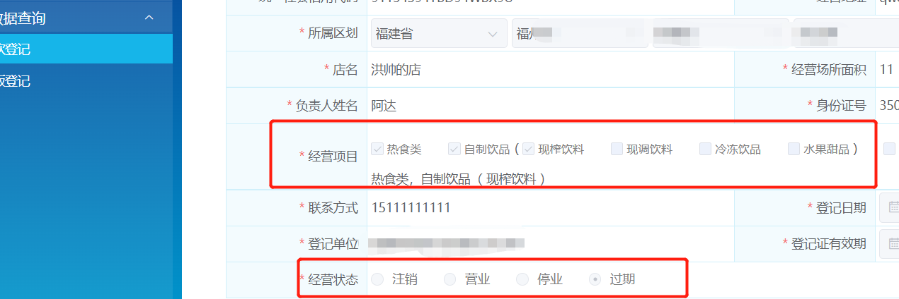

# 一、`el-date-picker`时间控件相关

## 1、开始实现与结束时间选择关联代码实现

>直接上代码，没啥好说的,方便日后自己写类似代码好复制,后面的一些问题就是针对写出这些代码过程中
>
>###### 模板中引用
>
>```html
>             <el-form-item label="登记证有效期起始" prop="validStartDate">
>                  <el-date-picker
>                    v-model="form.validStartDate"
>                    value-format="yyyy-MM-dd [00:00:00]"
>                    :style="{width:'100% '}"
>                    type="date"
>                    placeholder="选择时间"
>                    :picker-options="pickerOptions.validStartDate"
>                  ></el-date-picker>
>                </el-form-item>
>              </el-col>
>           <el-col :span="8">
>                <el-form-item label="登记证有效期截止" prop="validEndDate">
>                  <el-date-picker
>                    v-model="form.validEndDate"
>                    value-format="yyyy-MM-dd [23:59:59]"
>                    :style="{width:'100% '}"
>                    type="date"
>                    placeholder="结束时间"
>                    :picker-options="pickerOptions.validEndDate"
>                  ></el-date-picker>
>                </el-form-item>
>              </el-col>
>```
>
>###### data中的定义
>
>```
>pickerOptions: {
>        // 开始时间限制
>        validStartDate: {
>          disabledDate: (time) => {
>             // 修复截止日期选择后删除日期，然后选择起止日期，会显示无法选择日期的问题
>            if (!this.form.validEndDate) return null
>            return new Date(this.form.validEndDate) ? new Date(this.form.validEndDate) < new Date(time) : null
>          }
>        },
>        // 结束时间限制
>        validEndDate: {
>          disabledDate: (time) => {
>            // elementui时间默认多了8小时,需要消除这8小时的影响
>            const tempDate = new Date(time)
>            const newDate = tempDate.setDate(tempDate.getDate() + 1)
>            return new Date(this.form.validStartDate) ? new Date(this.form.validStartDate) >= new Date(newDate) : null
>          }
>        },
>      },
>```
>
>

## 2、关于日期控件日期少一天的问题

>在我进行前后端联调时,**发现传给服务端的参数比输入选择的日期少一天**,但代码逻辑并没有什么错误
>
>随后经过排查发现是 `el-date-picker日期控件`的问题

### Ⅰ- 问题说明

>1. 代码示例
>
>```vue
><el-form-item label="申请时间" prop="applyDate">
>  <el-date-picker
>    class="eve-common-date-picker"
>    :size="$size"
>    v-model="form.applyDate"
>    type="date"
>    :style="{width:'100% '}"
>    placeholder="请选择申请时间"
>  ></el-date-picker>
></el-form-item>
>```
>
>2. 传参截图
>
>

### Ⅱ- 原因剖析

>**element-ui中时间控件的默认时间为国际标准时间，所以与北京时间差8个小时**

### Ⅲ- 解决方案

>在标签中加上**value-format="yyyy-MM-dd"** 即可,将其转换格式
>
>1. 解决代码
>
>  ```vue
><el-form-item label="申请时间" prop="applyDate">
>   <el-date-picker
>     class="eve-common-date-picker"
>     :size="$size"
>     v-model="form.applyDate"
>     type="date"
>     :style="{width:'100% '}"
>     placeholder="请选择申请时间"
>     value-format="yyyy-MM-dd"      //--------多加这一行代码-----//
>   ></el-date-picker>
></el-form-item>
>  ```
>
>
>
>2. 成功解决
>
> 

## 3、关于时间区间选择 查询边界错误的问题

### Ⅰ - 问题说明

>当我们使用时间选择框选择时间区间时,处于边界的数据往往会得不到 比如 : 
>
>* 选择 1~11号的数据,实际上默认转换成 `1号0时0分~11号0时0分`
>* 这样我们是查不到11号0时到23:59分的数据的

### Ⅱ - 解决方案

>设置两个属性即可
>
>`value-format="yyyy-MM-dd HH:mm:ss"
>:default-time="['00:00:00', '23:59:59']"`
>
>```vue
><el-date-picker
>v-model="form.applyDate"
>value-format="yyyy-MM-dd HH:mm:ss"
>:default-time="['00:00:00', '23:59:59']"
>:style="{width:'100% '}"
>type="daterange"
>range-separator="~"
>start-placeholder="开始日期"
>end-placeholder="结束日期"
>></el-date-picker>
>```

## 4、日期格式转化后限制时间范围picker-options失效的问题

### Ⅰ- 问题说明

>1. 因为element-ui如不指定 `value-format` 就会出现日期数据少一天的问题,所以需要加上这个属性
>
>2. 但是当我们加上格式转换后,原来的`picker-options`就失去了限制时间范围的效果,这是为什么?
>
>  > 实际上是因为格式转换后,我们的时间格式转换成了 **字符串** 格式,所以我们要在`picker-options`对比时间的时候将其转换回来日期格式即可

### Ⅱ - 解决方案

>此处只展示部分代码帮助理解
>
>```vue
><template>
><el-date-picker
>value-format="yyyy-MM-dd"
>v-model="form.applyEndDate"
>type="date"
>:picker-options="pickerOptions.theoryExamEndTime"
>placeholder="选择日期"
>></el-date-picker>
></template>
><script>
>export default {
>data () {
>return {
>		theoryExamEndTime: {
>   	disabledDate: (time) => {
>     		  return new Date(this.form.theoryExamStartTime)
>             ? new Date(this.form.theoryExamStartTime) > new Date(time) 
>            : null }  }   
>}}}
></script>
>```
>
>效果图

## 5、日期选择器设置默认时间 23:59:59 

### Ⅰ - 问题说明

>1. 一般来说,设置默认时间区间可以用`:default-time="['00:00:00', '23:59:59']"` 进行设置,但这个属性要求你的类型`  type="daterange"`
>
>2. 这时我突然有个需求:因为有些用户显示屏较小,导致`type="daterange"`的选择器部分显示内容被隐藏,所以要我拆分成两个字段
>
>  > 
>
>3. 所以这时,原本的`type="daterange"`就要改成`type="date"`,就导致`:default-time="['00:00:00', '23:59:59']"`失效甚至报错

### Ⅱ - 解决方案一

>这个方案是我最初自己想出来的,因为对于Element-ui的不熟悉,就想在最终使用数据的时候将默认时间添加上去
>
>```vue
><el-form-item label="考试结束时间" prop="examEndDate">
><el-date-picker
>v-model="form.examEndDate"
>value-format="yyyy-MM-dd"
>:style="{width:'100% '}"
>type="date"
>placeholder="选择日期"
>  ></el-date-picker>
></el-form-item>
><script>
>//使用数据时
>export default {
>methods: {
>use() {
>   //从form中获取该时间
> let { examEndDate } = this.form
> // 结束时间手动加上 23:59:59  防止查询边界错误
> examEndDate = examEndDate ? examEndDate += ' 23:59:59' : undefined
> //填入请求参数中
>const condition = { ...this.form, examEndDate }
>}
>}
>}
></script>
>```
>
>这样实现是可行的,但是也有缺点,就是如果当你时间选择框特别多时,代码就会变得冗余

### Ⅱ - 解决方案二

>后来觉得Element-ui应该会有相应的处理,不应该这种常见的需求会没有解决方案,果然,在文档中发现了这个
>
> 
>
>所以,实际上我们只要在时间控件中这样写,就不用自己亲自做数据处理了 `value-format="yyyy-MM-dd [23:59:59]"`
>
>```vue
><el-form-item label="考试结束时间" prop="examEndDate">
><el-date-picker
>v-model="form.examEndDate"
>value-format="yyyy-MM-dd [23:59:59]"
>:style="{width:'100% '}"
>type="date"
>placeholder="选择日期"
>  ></el-date-picker>
></el-form-item>
>```

## 6、两个关联时间框无法选择同一天

### Ⅰ- 问题提出

>需求要求,开始时间与结束时间需要可以选择同一天,但突然发现一个BUG,两个时间选择框,当限制开始时间后,结束时间无法选择与开始时间同一天(限制结束时间后却可以选择同一天的开始时间)
>
>
>
>###### 代码展示
>
>```vue
><template>
><el-date-picker
>value-format="yyyy-MM-dd"
>v-model="form.applyEndDate"
>type="date"
>:picker-options="pickerOptions.theoryExamEndTime"
>placeholder="选择日期"
>></el-date-picker>
></template>
><script>
>export default {
>data () {
>return {
>		theoryExamEndTime: {
>	disabledDate: (time) => {
>		  return new Date(this.form.theoryExamStartTime)
>    //此处明明是 >= 为何还不能选择同一天??
>        ? new Date(this.form.theoryExamStartTime) >= new Date(time) 
>       : null }  }   
>}}}
></script>
>```

### Ⅱ - 问题分析

>Element-ui的时间偏差了8小时,所以导致这个判断结束时间错误,所以一个是当天的8小时,一个是当天的0时,就导致了,开始时间可以选择到截止时间的当当天,而反过来却不行
>
>一般来说 我们加个 `value-format="yyyy-MM-dd"` 就可以消除这个问题,就能转换成年月日 然后再转成时间 就是默认0时0分
>我这边这个是要进行范围限制 它默认传入的时间却没有受到我们  value-format 的影响 他就是默认偏差8小时,需要我们将这个传入的time在进行格式转换
>
>###### 所以解决方案理论上会有两种
>
>1. 可以是将默认传入的时间都用 value-format转换成 `yyyy-MM-dd [00:00:00]` 格式(也可以先转成年月日再转换成时间格式,取决于自己),这样就能把超出的8小时去除
>2. 直接操作日期加减一天

### Ⅲ - 代码示例

>这里直接操作日期加减一天,问就是代码简单
>
>```vue
><template>
><el-date-picker
>value-format="yyyy-MM-dd"
>v-model="form.applyEndDate"
>type="date"
>:picker-options="pickerOptions.theoryExamEndTime"
>placeholder="选择日期"
>></el-date-picker>
></template>
><script>
>export default {
>data () {
>return {
>		theoryExamEndTime: {
>	disabledDate: (time) => {
>     // elementui时间默认多了8小时,需要消除这8小时的影响
>       const tempDate = new Date(time)
>       const newDate = tempDate.setDate(tempDate.getDate() + 1)
>       return new Date(this.form.applyStartDate) ? new Date(this.form.applyStartDate) >= new Date(newDate) : null
>} }   
>}}}
></script>
>```

### Ⅳ - 解决

>


## 7、关联选择框限制时间后出现**结束日期选择后删除日期，然后选择开始日期，会显示无法选择日期**的问题

### Ⅰ- 问题提出

>

### Ⅱ- 问题代码与分析

>可以去问题[1]处看正确的完整代码,此处只截取有问题的代码
>
>```js
> pickerOptions: {
>        // 开始时间限制
>        validStartDate: {
>          disabledDate: (time) => {
>            return new Date(this.form.validEndDate) ? new Date(this.form.validEndDate) < new Date(time) : null
>          }
>        },
>  }
>```
>
>根据问题截图操作可以推测,当选中后再重新删除,
>
>* 这时`this.form.validEndDate`就为null,而`new Date(null)`的结果是 `1970年1月1日`--此处不懂的可以百度,很容易查到此处不做科普
>* 而`1970年1月1日`隐式会转换为true,`'1970年1月1日'?'1970年1月1日'<1970年1月1日以及之后的某时刻:null`得到的就是 `''1970年1月1日'<1970年1月1日以及之后的某时刻`
>* 而  `'1970年1月1日'<1970年1月1日以及之后的某时刻`可想而知结果都会是`true`,就导致全部都无法选择了
>
>

### Ⅲ- 解决

>知道了出现问题的地方,就很好解决了,在开始时间的限制处,判断是否结束时间为`null`,如果是`null`,就直接返回`null`,这样组件就不会进行限制
>
>```
> pickerOptions: {
>        // 开始时间限制
>        validStartDate: {
>          disabledDate: (time) => {
>           // 修复有效期截止日期选择后删除日期，然后选择有效期起止日期，会显示无法选择日期的问题
>            if (!this.form.validEndDate) return nu
>            return new Date(this.form.validEndDate) ? new Date(this.form.validEndDate) < new Date(time) : null
>          }
>        },
>  }
>```
>
>


------


# 二、`el-tree`相关

## 1、 el-tree实现超出悬浮显示

>使用`render-content`属性可以进行设置    ---  [文档地址](https://element.eleme.io/#/zh-CN/component/tree#attributes)
>
>###### 模板代码
>
>```vue
>        <el-tree
>          ref="tree"
>          :render-content="renderTreeContent"
>        ></el-tree>
>```
>
>###### Method方法
>
>```js
>
>export default {
>
>  methods: {
>      // 渲染树
>    renderTreeContent(h, { node }) {
>      return (
>        <div >
>          <el-tooltip class="item" effect="dark" content={node.label} placement="top-start">
>            <div>{node.label}</div>
>          </el-tooltip>
>        </div>
>      )
>    }
>  }
>}
>
>```
>
>效果展示：
>
> 

## 2、el-tree点击复选框后的文字也能勾选

>在tree中加上`@node-click`事件进行操作即可
>
>###### 模板代码
>
>```vue
>        <el-tree
>          ref="tree"
>          @node-click="handleRowClick"
>        ></el-tree>
>```
>
>###### Method方法
>
>```js
>export default {
>
>  methods: {
>      // 点击行即可让复选框勾选
>    handleRowClick(data, node) {
>      node.checked = !(node.checked)
>      }
>  }
>}
>
>```


# 三、`el-table`相关

## 1、el-table实现多选变单选

### #需求说明

>需求场景: 要求表格选框显示，但是一次只能操作一个多选框，所以需要把全选框隐藏处理,具体效果变更如下
>
> 

### 1）隐藏表头中的全选框

#### Ⅰ - 添加以下css样式

>```css
><style lang="css" >
>.el-table__header-wrapper  .el-checkbox{
>	display:none
>}
></style>
>```

#### Ⅱ - Vue组件需要加 `/deep/`

>* 一般来说不用加 `/deep/`,就有效果
>* 但是当你将 style设置为scoped的时候,里面的样式是无法影响到子组件的
>* 如果想让某些样式穿透到子组件,能够对子组件都生效,就需要加 `/deep/ (深度选择器)` 
>
>```scss
><style lang="scss" scoped>
>/deep/ .el-table__header-wrapper .el-checkbox {
> display: none;
>}
></style>
>```

#### Ⅲ - 当前效果

>多选框已经删除,但是选项仍可多选
>
> 

### 2）多选变单选思路

#### Ⅰ - 在table组件中添加以下代码

>* `ref="multipleTable"`:此代码方便后续直接操作table选中项显示
>* `@selection-change="handleSelectionChange"`:此代码将绑定后续过滤当前选中项的函数,使其变为单选
>* `@current-change="currentChange"`: 此代码是绑定 勾选当前项 触发的事件,可以做一些自己想要的操作
>
>```vue
><template>
> <el-table
>   ref="multipleTable"
>   @current-change="currentChange"
>   @selection-change="handleSelectionChange"
> ></el-table>
></template>
>```

#### Ⅱ - 在data中定义一个状态

>这个状态将放置我们当前选中项,后续操作中我们需要将此状态渲染到界面选项上
>
>```vue
><script>
>export default {  
>data () {
>return {
> currSelect: {} // 当前选中项-->默认就是一个对象
>}
>},
>}
></script>
>```

#### Ⅲ - 定义过滤当前选中项的函数,使其变为单选

>* 原理时每次选中状态发生变化时,将传入项过滤出最新一次选中属性,赋予之前定义的 `currSelect`
>* 这样我们的 `currSelect` 存放的就是我们当前最新选中项
>
>```vue
><script>
>export default {  
> methods: {
>   // 将多选变成单选 -->每次选中状态变化时,将选中项过滤成最新项赋予 [currSelect]
>   handleSelectionChange (emit) {
>     // 当emit大于2时一般是全选,这时我们清空即可-->如果用第一步去掉了全选框,这个情况可以忽略
>     if (emit.length > 2)  this.currSelect = undefined
>      // 当==2时一般是切换选择的时候,这时候我们保留最新选择的那个
>      else if (emit.length === 2)  this.currSelect = emit?.pop()
>      // 当==1时一般是直接选择的情况
>      else if (emit.length === 1)  this.currSelect = emit?.[0]
>   }
> }
>}
></script>
>```

#### Ⅳ - 监听状态变化

>1. 当我们 `currSelect` 发生变化时,表示我们进行了选择操作,这时对其进行监听
>2. 然后做以下两件事:
>
>  - 清空原有所有选中项
>  - 将当前选中项 渲染到界面上
>
>```vue
><script>
>export default {  
>  watch: {
>   // 监听当前项 -->需要监听到变化后手动清空之前的选中项
>   currSelect () {
>     // 清空原有所有选中项
>     this.$refs.multipleTable.clearSelection()
>     // 将当前选中项 渲染到界面上
>     if (this.currSelect) this.$refs.multipleTable.toggleRowSelection(this.currSelect)
>   }
> },
>}
></script>
>```
>
>`注意`:不能偷懒将监听环节的代码直接放到`handleSelectionChange`函数中,否则会因为触发重绘,然后又触发此函数,如此重复无限循环就卡死了


### 3）完整代码示例

>以下只保留相关代码
>
>```vue
><template>
><el-table
>ref="multipleTable"
>@current-change="currentChange"
>@selection-change="handleSelectionChange"
> ></el-table>
></template>
>
><script>
>export default {
>data () {
>return {
> currSelect: {} // 当前选中项-->默认就是一个对象
>}
>},
>watch: {
>// 监听当前项 -->需要监听到变化后手动清空之前的选中项
>currSelect () {
> // 清空原有所有选中项
> this.$refs.multipleTable.clearSelection()
> // 将当前选中项 渲染到界面上
> if (this.currSelect) this.$refs.multipleTable.toggleRowSelection(this.currSelect)
>}
>},
>methods: {
>// 将多选变成单选 -->每次选中状态变化时,将选中项过滤成最新项赋予 [currSelect]
>handleSelectionChange (emit) {
> // 当emit大于2时一般是全选,这时我们清空即可-->如果用第一步去掉了全选框,这个情况可以忽略
> if (emit.length > 2) {
>   this.currSelect = undefined
> } else if (emit.length === 2) { // 当==2时一般是切换选择的时候,这时候我们保留最新选择的那个
>   this.currSelect = emit?.pop()
> } else if (emit.length === 1) { // 当==1时一般是直接选择的情况
>   this.currSelect = emit?.[0]
> }
>}
>}
>}
></script>
>
><style lang="scss" scoped>
>/deep/ .el-table__header-wrapper .el-checkbox {
>display: none;
>}
></style>
>
>```
>
>


# 四、输入组件相关

## 1、修改`el-input/el-checkbox/el-radio`等禁用状态下颜色

### Ⅰ - 需求分析

>业务中收到了一个问题反馈
>反馈就是禁用状态下的内容灰色难以看清，要求换一个颜色


### Ⅱ- 代码实现

>直接上代码
>
>```css
><style scoped lang="scss">  //scoped是防止影响到其他组件样式
>//checkBox自定义禁用样式
>/deep/ .el-checkbox__input.is-disabled + .el-checkbox__label {  //deep是穿透，必须加这个才能穿透到样式中
>  color: #808080 !important;
>}
>//radio自定义禁用样式
>/deep/ .el-radio__input.is-disabled + .el-radio__label{
>   color: #808080 !important;
>}
></style>
>```
>
>###### 其他一些拓展
>
>```css
>//下面是选中状态下的样式改变
>.el-checkbox__input.is-disabled.is-checked + .el-checkbox__label {
>  color: #1890ff !important;
>}
>
>.el-checkbox__input.is-disabled.is-checked .el-checkbox__inner {
>  background-color: #1890ff !important;
>  border-color: #1890ff !important;
>}
>
>//输入框 还有 textarea 禁用状态下颜色改变
>.el-input.is-disabled .el-input__inner,textarea:disabled{
>  color: #606266 !important;
>}
>```

### Ⅲ - 实现效果

>这里本人是将其颜色变为更深的灰色
>
>

