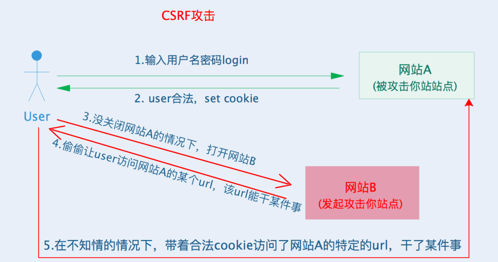

## #说明

> * 随着互联网以及大前端的快速发展,前端安全问题也越来越值得前端开发人员重视学习了; 
> * 相信大家在学习或者工作中也常常会听到一些前端安全相关的名词或者知识点,但基本都是知其名不知其所以
> * 这里我将会学习并梳理几个常见前端安全问题,如果有错误,大家可以私信或者评论指出
>
> 查阅借鉴的资料: 思否的[前端安全编码规范](https://segmentfault.com/a/1190000037657222); 知乎的 [前端安全问题汇总（实战）](https://zhuanlan.zhihu.com/p/83865185); 美团技术团队的 [前端安全部分](https://tech.meituan.com/tags/%E5%89%8D%E7%AB%AF%E5%AE%89%E5%85%A8.html); 掘金的 [常见前端安全问题及解决方案](https://juejin.cn/post/6844903942036389895#heading-0);CSDN的[【安全漏洞】CSRF漏洞攻击：原理、检测、防御、实践](https://blog.csdn.net/kzadmxz/article/details/92076837)
>
> 除此笔记外大家可以看我其他笔记 :**[全栈笔记](https://gitee.com/hongjilin/hongs-study-notes/tree/master)**、**[数据结构与算法](https://gitee.com/hongjilin/hongs-study-notes/tree/master/编程_算法及课程基础学习笔记/数据结构与算法)**、**[编程_前端开发学习笔记](https://gitee.com/hongjilin/hongs-study-notes/tree/master/编程_前端开发学习笔记)**、**[编程_后台服务端学习笔记](https://gitee.com/hongjilin/hongs-study-notes/tree/master/编程_后台服务端学习笔记)** 、**[Java](https://gitee.com/hongjilin/hongs-study-notes/tree/master/编程_后台服务端学习笔记/Java)** 、**[Nodejs](https://gitee.com/hongjilin/hongs-study-notes/tree/master/编程_后台服务端学习笔记/Nodejs)** 、**[JavaScript笔记](https://gitee.com/hongjilin/hongs-study-notes/tree/master/编程_前端开发学习笔记/HTML+CSS+JS基础笔记/JavaScript笔记)**、**[编程工具使用笔记](https://gitee.com/hongjilin/hongs-study-notes/tree/master/编程_前端开发学习笔记/A_前端工具使用笔记)** 、**[ES6及后续版本学习笔记](https://gitee.com/hongjilin/hongs-study-notes/tree/master/编程_前端开发学习笔记/ES6及后续版本学习笔记)** 、**[Vue笔记整合](https://gitee.com/hongjilin/hongs-study-notes/tree/master/编程_前端开发学习笔记/Vue笔记整合)** 、**[React笔记](https://gitee.com/hongjilin/hongs-study-notes/tree/master/编程_前端开发学习笔记/React笔记)**、**[微信小程序学习笔记](https://gitee.com/hongjilin/hongs-study-notes/tree/master/编程_前端开发学习笔记/微信小程序学习笔记)**、**[Chrome开发使用及学习笔记](https://gitee.com/hongjilin/hongs-study-notes/tree/master/编程_前端开发学习笔记/Chrome开发使用及学习笔记)** 以及许多其他笔记就不一一例举了

## 一、常见前端安全问题

>###### 按常见程度排序
>
>1. **XSS(跨站脚本攻击)**
>2. **CSRF(跨站请求伪装)**
>3. **ClickJacking(点击劫持)**
>4. HSTS(HTTP严格传输安全)
>5. CND劫持
>6. iframe
>7. opener

## 二、XSS (跨站脚本攻击)

>###### **XSS全称 ( CRoss Site Scripting ) 跨站脚本攻击**,是前端最常见的安全问题
>
>* XSS 是一种在web应用中的计算机安全漏洞,它允许恶意web用户将代码植入到提供给其他用户使用的页面中
>* 攻击者通过注入非法的 **html标签** 或者 **JavaScrpipt代码**, 从而当用户浏览该网页时,控制用户浏览器

### Ⅰ -  DOM类型 xss

>###### 利用DOM本身存在的缺陷进行攻击
>
>举个🌰:
>
>```html
>//正常写代码
>
>//xss攻击  -->将其绑定的src弄成错误的,这样就会走到 innerror中的代码
>
>```

### Ⅱ -  反射型xss

>* **反射型xss也被称为`非持久性XSS`**, 是现在最容易出现的一种XSS漏洞
>* XSS代码出现在URL中,通过引诱用户点击一个链接到目标网站的恶意链接来实施攻击(是不是很熟悉)
>
>举个栗子
>
>```js
>//其中 `xxx` 代表恶意代码
>https://gitee.com/hongjilin?data=xxx
>```
>
>* `xxx`是恶意代码,传到服务器的参数data被服务器接收之后
>* 响应的页面包含data这个变量的,会将恶意代码注入到页面上,进行攻击

### Ⅲ - 存储型xss

>* **存储型XSS又被称为 `持久性XSS` **, 它是最为危险的一种跨站脚本
>* 相比 **反射型XSS** 和 **DOM型** :  它具有更高的隐蔽性,所以危害更大,**它不需要用户手动触发**
>* 当攻击者提交一段XSS代码后被服务端接收并存储,当所有浏览者访问某个页面时都会被XSS
>* 其中最典型的栗子就是 **留言板**

### Ⅳ - 解决方案

#### ① 过滤

>对用户的输入进行过滤,通过将 `<>`、`''`、`""`等字符进行转义,移除用户输入的Style节点、Script节点、iframe节点
>
>```js
>const filterXSS(str){
>    let s= '';
>    if(str.length == 0) return "";
>    s = str.replace(/&/g,"&amp;");
>    s = s.replace(/</g,"&lt;");
>    s = s.replace(/>/g,"&gt;");
>    s = s.replace(/ /g,"&nbsp;");
>    s = s.replace(/\'/g,"&#39;");
>    s = s.replace(/\"/g,"&quot;");
>    return s; 
>}
>```

#### ② 编码

>* 根据输出数据所在的上下文来进行相应的编码
>* 数据放置于HTML元素中,需进行 **HTML编码**
>* 放置于 URL 中,需要进行 **URL编码**
>* 还有 **JavaScript编码**、**CSS编码**、**HTML编码**、**JSON编码**等

#### ③ httpOnly

>在cookie中设置**HttpOnly**属性, 使得JS脚本无法读取到cookie信息

## 三、CSRF (跨站请求伪造)

>1. **CSRF全称 ( Cross-Site Request Forgeries )跨站请求伪造**,跟XSS攻击一样,存在巨大的危险性
>   - 攻击者盗用了你的身份,以你的名义发送恶意请求
>   - 对于服务器来说这个请求完全是合法的,但是时却完成攻击者所期望的一个动作: 以你的名义发送邮件、发消息、添加系统管理员、甚至于转账、购买商品等

### Ⅰ- 原理图

>
>
>上图中**网站A**就是存在CSRF漏洞的网站,**网站B**为攻击者构建的恶意网站;**User**为网站A的合法用户
>
>* **用户user**打开浏览器,访问受信任网站A,输入用户名和密码请求登录网站A
>* 在用户信息通过验证后,**网站A**产生Cookie信息并返回给浏览器,此时用户登录**网站A**成功,可以正常发送请求到网站A
>* 用户未退出网站A之前,在同一浏览器中打开一个**tab页**访问网站B
>* **网站B**接收到用户请求后,返回一些攻击性代码,并发出一个请求要求访问第三方站点A
>* 浏览器在接收到这些攻击性代码后,根据网站B的请求,在用户不知情的情况下携带Cookie信息,向网站A发出请求,网站A并不知道该请求其实是由B发起的,所以会**根据用户带的Cookie信息**以他的权限处理该请求,导致来自网站的恶意代码被执行

### Ⅱ - CSRF与XSS的区别

>###### CSRF尽管听起来很像跨站脚本(XSS),但它与XSS非常不同
>
>- XSS利用站点内的信任用户; 而 CSRF 则通过伪装成受信任用户的请求来利用受信任的网站
>- 与XSS攻击相比,CSRF攻击往往不大流行(因此对其进行防范的资源也相当稀少)和难以防范,所以被认为比XSS更具危险性

### Ⅲ - CSRF漏洞检测