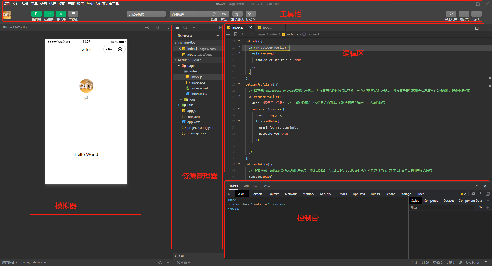
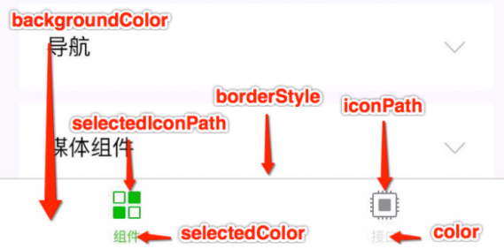
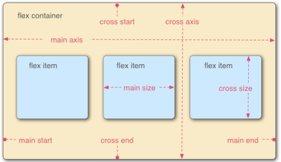
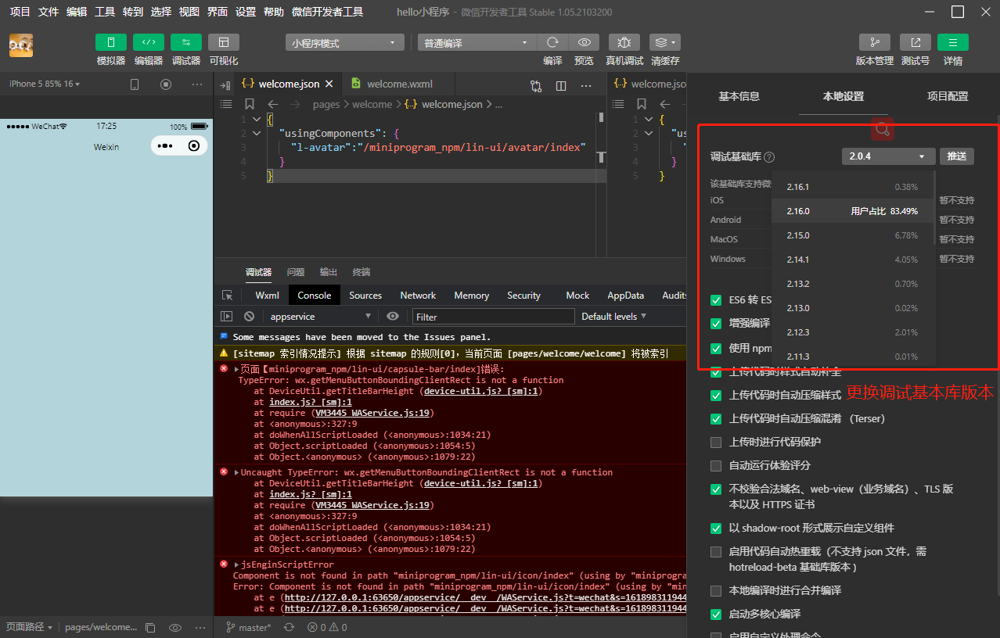

# #说明

>1. 本笔记为观看慕课网[`微信小程序入门与实战-全新版`](https://coding.imooc.com/class/75.html)的教学视频、参照借鉴B站[`尚硅谷2021版微信小程序开发（零基础小程序开发入门到精通）`](https://www.bilibili.com/video/BV12K411A7A2?share_source=copy_web)、[`黑马程序员Web前端教程_零基础玩转微信小程序`](https://www.bilibili.com/video/BV1nE41117BQ?share_source=copy_web)的课件、官方的[`微信开放文档`](https://developers.weixin.qq.com/miniprogram/dev/framework/) 记录整理而成
>
>2. 本人选择的课程是`面向初学者`的教学视频,用的原生js进行讲解,门槛很低。但有基础的朋友也可以同时当作梳理基础知识,学习过程肯定也会更清晰、同时也会有自己不一样的理解。对于笔记内容有疑问的欢迎提出讨论,望求同存异共同进步
>
>3. 需要预备知识点-->`html+css+js`
>
>本人笔记地址分享:[`全部笔记`](https://gitee.com/hongjilin/hongs-study-notes)
>
>​										笔记开启时间:2021/4/20

# #目录

>[TOC]

------


# 一、初识微信小程序

## 1、什么是微信小程序

### Ⅰ-小程序历史

>1. 2017 年度百度百科十大热词之一 
>2. 微信小程序，简称小程序，英文名 Mini Program，是一种不需要下载安装即可使用的应用 (`张小龙对其的定义是无需安装,用完即走,实际上是需要安装的,只不过小程序的体积特别小,下载速度很快,用户感觉不到下载的过程` ) 
>3. 小程序刚发布的时候要求压缩包的体积不能大于 1M,，否则无法通过，在2017年4月做了改进，由原来的1M提升到2M；
>4. 2017年1月9日0点，万众瞩目的微信第一批小程序正式低调上线。

### Ⅱ-小程序的优势

>1. 微信有海量⽤⼾，⽽且粘性很⾼，在微信⾥开发产品更容易触达⽤⼾；
>2. 推⼴app 或公众号的成本太⾼。 
>3. 开发适配成本低。
>4. 容易⼩规模试错，然后快速迭代。
>5. 跨平台。

## 2、小程序准备

### Ⅰ-环境准备

>1. [安装微信小程序开发工具](https://developers.weixin.qq.com/miniprogram/dev/devtools/download.html),建议安装稳定版进行开发
>
>2. 注册小程序账号
>
>3. 使用注册的appid进行使用，如果是测试号会限制很多功能
>
>   在官网[登录](https://mp.weixin.qq.com/)成功后可以看到下面的界面，然后复制你的APPID,悄悄的保存起来，`不要给别⼈看到`😄。

### Ⅱ-新建小程序流程

>1. 打开开发者工具，第一次打开需要扫码登陆
>
>2. 新建小程序项目
>
>   
>
>3. 填写项目信息
>
>   
>
>4. 新建成功

### Ⅲ-微信开发者工具介绍

#### 1）开发工具界面图解

>详细的使⽤，可以查看[官⽹](https://developers.weixin.qq.com/miniprogram/dev/devtools/devtools.html):
>
>

#### 2）开发工具的一些基本配置

>1. 点击`工具栏`-->`详情`-->`本地设置`，除了默认勾选，需要勾选其他的几个如：增强编译、不校验合法域名...
>
>  
>
>2. 常用快捷键`keyMap修改`设置(本人习惯记录)：
>
>     1. `ctrl+P`：全局搜索
>
>     2. `alt+/`or `shift+j`:代码提示
>
>        

### Ⅳ-微信小程序名称或者原始id该如何找回？

>问题描述：很久没有进行开发了，小程序的名称跟原始id都忘记了，找回需要先填写,如何解决
>
>解决：首先[`查询自己的原始id`](https://developers.weixin.qq.com/community/develop/doc/000ea0f82d4f58b41589642b456809),在这个网站能查询到自己的原始id，再通过这个原始id进行找回


------

# 二、小程序的基本目录结构与文件作用剖析

>[小程序框架](https://developers.weixin.qq.com/miniprogram/dev/framework/MINA.html)的⽬标是通过尽可能简单、⾼效的⽅式让开发者可以在微信中开发具有原⽣APP体验的服务。 
>
>⼩程序框架提供了⾃⼰的视图层描述语⾔ `WXML 和 WXSS` ，以及 JavaScript ，并`在视图层与逻辑层间提供了数据传输和事件系统`，让开发者能够专注于数据与逻辑。

## 1、小程序文件结构和传统web对比

>|                | 传统web    | 微信小程序 |
>| -------------- | ---------- | ---------- |
>| 项目骨架、结构 | HTML       | WXML       |
>| 页面样式       | CSS        | WXSS       |
>| 项目逻辑       | Javascript | Javascript |
>| 配置           | 无         | JSON       |
>
>1. 通过以上对⽐得出传统web是`三层结构`。⽽微信⼩程序是`四层结构`，多了⼀层`配置.json`
>
>2. 当这几个文件在同一级目录下且命名相同(后缀不同),可以互相引用却不用导入

## 2、基本的项目目录

### Ⅰ-项目目录解释

>1. 项目目录图解:
>
>   
>
>2. 以`app`开头的文件是应用程序级别的文件,更改一处全局生效。而页面`pages`的配置优先级高于全局配置(`就近原则`)


## 3、小程序配置文件

> ⼀个⼩程序应⽤程序会包括最基本的两种配置⽂件。⼀种是全局的app.json 和 ⻚⾯⾃⼰的page.json

### Ⅰ-[全局配置app.json](https://developers.weixin.qq.com/miniprogram/dev/framework/config.html)

>1. `app.json` 是当前⼩程序的全局配置，包括了⼩程序的所有⻚⾯路径、界⾯表现、⽹络超时时间、底部tab等。普通快速启动项⽬⾥边的 app.json 配置
>
>2. 代码
>
>  ```json
>  {
>    "pages":[
>      "pages/index/index",
>      "pages/logs/logs"
>   ],
>    "window":{
>      "backgroundTextStyle":"light",
>      "navigationBarBackgroundColor": "#fff",
>      "navigationBarTitleText": "WeChat",
>      "navigationBarTextStyle":"black"
>   }
>  }
>  ```
>
>3. 字段的含义
>
>     1）pages 字段⸺⽤于描述当前⼩程序所有⻚⾯路径，这是为了让微信客⼾端知道当前你的⼩程序⻚⾯定义在哪个⽬录。 
>
>​	`默认显示此字段中的第一项`
>
> ​	 2）window 字段⸺定义⼩程序所有⻚⾯的顶部背景颜⾊，⽂字颜⾊定义等。
>
>  	3）完整的配置信息请参考 app.json配置
>
> ​	 4) [tabBar](https://developers.weixin.qq.com/miniprogram/dev/reference/configuration/app.html#tabBar)-底部 `tab` 栏的表现:
>
>
>更多配置详细请看[`app配置文档`](https://developers.weixin.qq.com/miniprogram/dev/reference/configuration/app.html)

### Ⅱ-[页面配置page.json](https://developers.weixin.qq.com/miniprogram/dev/reference/configuration/page.html)

>1. 这⾥的 `page.json` 其实⽤来表⽰⻚⾯⽬录下的 page.json 这类和⼩程序⻚⾯相关的配置。 开发者可以独⽴定义每个⻚⾯的⼀些属性，如顶部颜⾊、是否允许下拉刷新等等。 ⻚⾯的配置只能设置 app.json 中部分 window 配置项的内容，⻚⾯中配置项会覆盖 app.json 的 window 中相同的配置项。
>
>2. 常用配置属性列举:
>
> | 属性                         | 类型     | 默认值  | 描述                                                         |
> | ---------------------------- | -------- | ------- | ------------------------------------------------------------ |
> | navigationBarBackgroundColor | HexColor | #000000 | 导航栏背景颜⾊，如 #000000                                   |
> | navigationBarTextStyle       | String   | white   | 导航栏标题颜⾊，仅⽀持 black / white                         |
> | navigationBarTitleText       | String   |         | 导航栏标题⽂字内容                                           |
> | backgroundColor              | HexColor | #ffffff | 窗⼝的背景⾊                                                 |
> | backgroundTextStyle          | String   | dark    | 下拉`loading`的样式，仅⽀持 dark / light                     |
> | enablePullDownRefresh        | Boolean  | false   | 是否全局开启下拉刷新。 详⻅ [Page.onPullDownRefresh](https://developers.weixin.qq.com/miniprogram/dev/framework/app-service/page.html#onpulldownrefresh) |
> | onReachBottomDistance        | Number   | 50      | ⻚⾯上拉触底事件触发时距⻚⾯底部距离，单位为px。 详⻅ [Page.onReachBottom](https://developers.weixin.qq.com/miniprogram/dev/framework/app-service/page.html#onreachbottom) |
> | disableScroll                | Boolean  | false   | 设置为 true 则⻚⾯整体不能上下滚动；只在⻚⾯配置中有效，⽆法在 app.json 中设置该项 |
>

### Ⅲ-[sitemap 配置](https://developers.weixin.qq.com/miniprogram/dev/reference/configuration/sitemap.html)-了解即可

> ⼩程序根⽬录下的 `sitemap.json` ⽂件⽤于配置⼩程序及其⻚⾯是否允许被微信索引。`主要服务于搜索`


------

# 三、小程序的基础知识储备

> 整个小程序学习过程中遇到的 所需基础知识 或 补充知识 将整合至此
>
> 相关知识点本人在`一二阶段补缺笔记`中有记录,在此便只举例大概,不详细记录

## 1、Flex 布局

>1. Flex基本概念
>
>   1) Flex 是 Flexible Box 的缩写，意为”弹性布局”，用来为盒状模型提供最大的灵活性。 
>
>   2) 任何一个容器都可以指定为 Flex 布局。 
>
>   3) display: ‘flex’
>
>   ​	
>
>   4) 这部分是一阶段基础知识,可看[文档](http://www.runoob.com/w3cnote/flex-grammar.html
>   )学习
>
>2. 在小程序中,通常使用`<view/>`代替`<div/>`作为容器来做布局-->代码示例在`第一章的第三小节第三点`

## 2、移动端相关知识点

>自行补充学习,相关知识点本人在`一二阶段补缺笔记`中有记录,便不再赘述


------


# 四、[WXSS](https://developers.weixin.qq.com/miniprogram/dev/framework/view/wxss.html)样式文件详解

>1. WXSS (WeiXin Style Sheets)是一套样式语言，用于描述 WXML 的组件样式。
>
>2. WXSS 用来决定 WXML 的组件应该怎么显示。
>
>   为了适应广大的前端开发者，WXSS 具有 CSS 大部分特性。同时为了更适合开发微信小程序，WXSS 对 CSS 进行了扩充以及修改。
>
>3. 与 CSS 相比，WXSS 扩展的特性有：
>   1. 响应式⻓度单位:即尺寸单位 -->`rpx`
>   2. 样式导入
>
>4. 注意:
>
>   当页面文件在同一级目录下且命名相同(后缀不同),`可以互相引用却不用导入`

## 1、尺寸单位

>1. `rpx（responsive pixel）`: 可以根据屏幕宽度进行自适应。规定屏幕宽为750rpx。如在 `iPhone6` 上，屏幕宽度为375px，共有750个物理像素，则750rpx = 375px = 750物理像素，1rpx = 0.5px = 1物理像素。
>
> | 设备         | rpx换算px (屏幕宽度/750) | px换算rpx (750/屏幕宽度) |
> | :----------- | :----------------------- | :----------------------- |
> | iPhone5      | 1rpx = 0.42px            | 1px = 2.34rpx            |
> | iPhone6      | 1rpx = 0.5px             | 1px = 2rpx               |
> | iPhone6 Plus | 1rpx = 0.552px           | 1px = 1.81rpx            |
>
>2. 建议与注意点:
>
>   1. 开发微信小程序时`推荐设计师可以用iPhone6作为视觉稿的标准`-->即只有在`iPhone6`标准中才可以`一比二换算`,更方便
>   2. 在较小的屏幕上不可避免的会有一些毛刺，请在开发时尽量避免这种情况

## 2、样式导⼊

>1. 使用`@import`语句可以导入外联样式表,也可以和less中的导⼊混⽤，`@import`后跟需要导入的外联样式表的`相对路径`(只⽀持相对路径)，用`;`表示语句结束。
>
>   ```css
>   /** common.wxss **/
>   .small-p {
>     padding:5px;
>   }
>   /** app.wxss **/
>   @import "common.wxss";
>   .middle-p {
>     padding:15px;
>   }
>   ```

## 3、内联样式

>框架组件上支持使用 style、class 属性来控制组件的样式。
>
>1. `style`：静态的样式统一写到 class 中。style 接收动态的样式，在运行时会进行解析，请尽量避免将静态的样式写进 style 中，以免影响渲染速度
>
>   ```html
>   <view style="color:{{color}};" />
>   ```
>
>2. `class`：用于指定样式规则，其属性值是样式规则中类选择器名(样式类名)的集合，样式类名不需要带上`.`，样式类名之间用空格分隔
>
>   ```html
>   <view class="normal_view" />
>   ```


------

# 五、组件与组件库

## 1、官方组件

>重点举例⼩程序中常⽤的布局组件 view,tex 等,现只举例部分,之后遇到觉得需要mark再写入,大部分可以看[官方文档组件部分](https://developers.weixin.qq.com/miniprogram/dev/component/),便不太多赘述

### Ⅰ-[view](https://developers.weixin.qq.com/miniprogram/dev/component/view.html)

>1. 在小程序中,通常使用`<view/>`代替`<div/>`作为容器来做布局
>
>   ```xml
>   <!--pages/welcome/welcome.wxml-->
>   <view class="container">
>     <image class="avatar" src="/images/测试头像图片.jpg"></image>
>     <text>Hello,洪jl</text>
>     <!-- <button>开启小程序之旅</button> -->
>     <view>
>       <text>开启小程序之旅</text>
>     </view>
>   </view>
>   ```

### Ⅱ-[text](https://developers.weixin.qq.com/miniprogram/dev/component/text.html)

>1. ⽂本标签 
>
>2. 只能嵌套text 
>
>3. ⻓按⽂字可以复制（只有该标签有这个功能）-->selectable
>
>4. 可以对如: `空格回车&nbsp;` 进⾏编码  -->decode
>
> | 属性名     | 类型    | 默认值 | 说明         |
> | ---------- | ------- | ------ | ------------ |
> | selectable | Boolean | false  | ⽂本是否可选 |
> | decode     | Boolean | false  | 是否解码     |
>
>   ```jsx
>   <text selectable="{{false}}" decode="{{false}}">
>      普&nbsp;通
>    </text>
>   ```

### Ⅲ-[image](https://developers.weixin.qq.com/miniprogram/dev/component/image.html)

>1. 图⽚标签，image组件`默认`宽度320px、⾼度240px,所以如果不进行宽高设置,不会进行自适应
>
>2. ⽀持懒加载
>
> | 属性名    | 类型    | 默认值        | 说明                 |
> | --------- | ------- | ------------- | -------------------- |
> | src       | String  |               | 图⽚资源地址         |
> | mode      | String  | `scaleToFill` | 图⽚裁剪、缩放的模式 |
> | lazy-load | Boolean | false         | 图⽚懒加载           |
>
>3. `mode`模式列举:
>
> | 模式 | 值                                                         | 说明                                                       |
> | ---- | ---------------------------------------------------------- | ---------------------------------------------------------- |
> | 缩放 | scaleToFill                                                | 不保持纵横⽐缩放图⽚，使图⽚的宽⾼完全拉伸⾄填满image 元素 |
> | 缩放 | aspectFit                                                  | 保持纵横⽐缩放图⽚，使图⽚的⻓边能完全显⽰出来。           |
> | 缩放 | aspectFill                                                 | 保持纵横⽐缩放图⽚，只保证图⽚的短边能完全显⽰出来         |
> | 缩放 | widthFix                                                   | 宽度不变，⾼度⾃动变化，保持原图宽⾼⽐不变                 |
> | 裁剪 | top                                                        | 不缩放图⽚，只显⽰图⽚的顶部区域                           |
> | 裁剪 | bottom                                                     | 不缩放图⽚，只显⽰图⽚的底部区域                           |
> | 裁剪 | center                                                     | 不缩放图⽚，只显⽰图⽚的中间区域                           |
> | 裁剪 | left                                                       | 不缩放图⽚，只显⽰图⽚的左边区域                           |
> | 裁剪 | right                                                      | 不缩放图⽚，只显⽰图⽚的右边区域                           |
> | 裁剪 | `top left`、`top right`<br />`bottom left`、`bottom right` | 不缩放图⽚,只显示值所指向区域                              |
>
>4. 代码示例:
>
>   ```jsx
>     <image class="avatar"  mode="aspectFit" src="/images/测试头像图片.jpg"></image>
>   ```

### Ⅳ-[swiper](https://developers.weixin.qq.com/miniprogram/dev/component/swiper.html)

>微信内置轮播图组件滑块。其中只可放置[swiper-item](https://developers.weixin.qq.com/miniprogram/dev/component/swiper-item.html)组件，否则会导致未定义的行为。具体代码示例看官方文档


## 2、[LinUi](https://doc.mini.talelin.com/)组件库

>1. `Lin UI` 是基于 **微信小程序原生语法** 实现的组件库。遵循简洁，易用的设计规范。
>
>2. 与其他组件库不同的是，除了提供基本的组件外，还会提供 `wxs模块` 、`高级组件` 、 `电商组件模块` 等等。 例如，在电商项目里常用的 `SKU联动选择` ，`城市选择器` 等
>
>3. [`安装`](https://doc.mini.talelin.com/start/)过程可看官方文档:
>
>   1) 打开小程序的项目根目录，执行下面的命令（如果使用了云开发，需要进入miniprogram文件夹下执行下面的命令）
>
>   ```sh
>   npm init
>   /*注意事项
>   1.执行npm init进行初始化，此时会生成一个package.json文件，如果不进行npm init，在构建npm的时候会报一个错误：没有找到 node_modules 目录
>   2.不建议使用cnpm，这样会带来一些未知的错误。如果网络情况不佳，可以使用下面的命令行更换为淘宝源。
>   npm config set registry https://registry.npm.taobao.org */
>   ```
>
>   2)继续执行下面的命令
>
>   ```sh
>   npm install lin-ui
>   ```
>
>4. 安装完成后在小程序需要点击`工具`-->`构建 npm`才可以使用(`所有npm引入的都需要这一步`)

### Ⅰ-配置与使用示例

>1. 要使用`自定义组件`的话,需要在当前page页面.json文件中注册
>
>   ```json
>   //page.json
>   {
>     "usingComponents": {
>       "l-avatar":"/miniprogram_npm/lin-ui/avatar/index",
>        "组件名(可以自取,一般如果是linui,就l-xxx)":"构建后的路径--要具体到那个文件夹下的js"
>     }
>   }
>   ```
>
>2. 使用:
>
>   ```jsx
>   <!--pages/welcome/welcome.wxml-->
>   <view class="container">
>     <!-- <image class="avatar" lazy-load="true" mode="aspectFit" src="/images/测试头像图片.jpg"></image> -->
>    <l-avatar 
>    class="l-avatar"
>    placement="bottom" 
>    open-data="{{['userAvatarUrl','userNickName']}}"
>    size="200"
>    />
>   </view>
>   
>   /* pages/welcome/welcome.wxss */
>   //可以自己写样式类,加到组件上
>   .l-avatar{
>     margin-top: 160rpx;
>   }
>   ```


------

# 杂记

> 体系学习过程笔记外的知识点


## 1、微信开发者工具使用技巧

### Ⅰ-新建页面的技巧与规则:

>1. 本技巧适用于`微信开发者工具`
>2. 当你需要新建一个页面时:新建一个page文件目录-->右键`新建page`-->输入page名字-->一次生成所需四个文件 且自动注册到`app.json`中
>3. ##如果配置文件中出现错误时,自动新建无法成功,更无法自动注册

### Ⅱ-指定初始页面

>当你写多个page时,如果每次通过修改`app.json`的配置项来指定初始页面,十分麻烦
>
>1. 可以在`app.json`用"entryPagePath":"pages/页面文件夹/页面文件名" 配置首页,但仍要修改配置文件,十分麻烦
>
>2. 使用编译器的`工具栏`-->添加`编译模式`进行指定初始化页面(启动页面默认值要先删除才有提示)
>
>   
>
>3. 添加后每次调试只要`选择编译模式`,就可以切换初始页面


## 2、微信开发基础知识与细节

>学习、练习、开发微信小程序过程中遇到的一些基础知识与细节记录

### Ⅰ-相对路径规则:

> 1. `/`代表根目录:如引入根目录下的images/图片 
>
>    ```xml
>    <image src="/images/测试头像图片.jpg"></image>
>    ```
>
> 2. 其余的如:`../`上一级目录、`./`同级目录,都与一般无异

### Ⅱ-npm引入第三方库后需进行构建

>安装第三方库后在小程序需要点击`工具`-->`构建 npm`才可以使用
>
>`所有npm引入的都需要这一步`


## 3、开发过程遇到的问题与解决

### Ⅰ-设置整个page的背景色

> 1. 问题:当我设置页面背景色时,发现添加背景色的page的高度是被内容撑起而不是全屏?如何解决最简单
>    问题截图解决后
>
>    解决:可以在你需要修改的page的样式文件中,给`<page/>`标签加样式,默认小程序是使用<page/>作为最外层的
>
>    ```css
>    page{
>      background-color: #b3d4db;
>    }
>    ```

### Ⅱ-小程序中使用less

>原⽣⼩程序不⽀持 less ，其他基于⼩程序的框架⼤体都⽀持，如 wepy ， mpvue ， taro 等。 但是仅仅因为⼀个less功能，⽽去引⼊⼀个框架，肯定是不可取的。因此可以⽤以下⽅式来实现
>
>1. 编辑器是`vscode`
>
>2. 安装插件`easy less`
>
>   
>
>3. 在vscode的设置中加⼊如下，配置
>
>   ```json
>     "less.compile": {
>           "outExt": ".wxss"
>      }
>   ```
>
>4. 在要编写样式的地⽅，新建 less ⽂件，如 index.less ,然后正常编辑即可。

### Ⅲ-报错 `TypeError: wx.getMenuButtonBoundingClientRect is not a function`

>控制台报错: `TypeError: wx.getMenuButtonBoundingClientRect is not a function`
>
>问题分析:这个 api是 更高版本版本支持的，你的用户有的客户端基础库版本 小于这个基础库。你在小程序后台设置下 最低基础库2.1.0.那样用户客户端基础库版本低于此就会提示升级
>
>解决:
>
>

------

