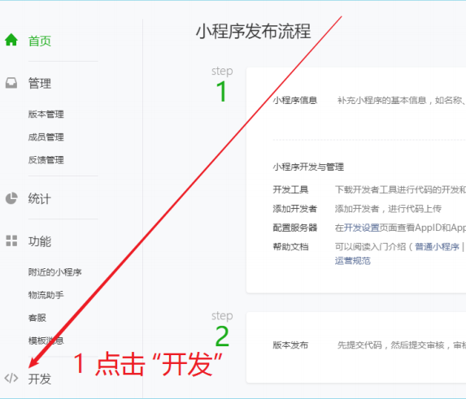
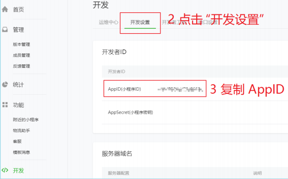
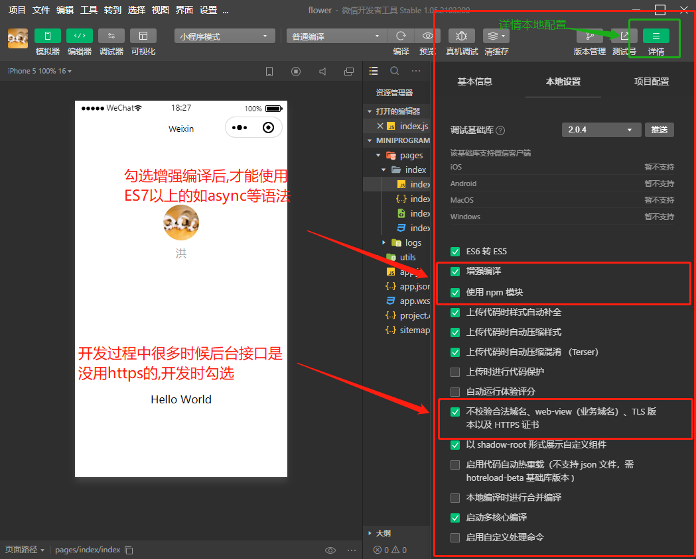

# #说明

>本笔记为观看慕课网[`微信小程序入门与实战-全新版`](https://coding.imooc.com/class/75.html)的教学视频、参照借鉴B站[`尚硅谷2021版微信小程序开发（零基础小程序开发入门到精通）`](https://www.bilibili.com/video/BV12K411A7A2?share_source=copy_web)、[`黑马程序员Web前端教程_零基础玩转微信小程序`](https://www.bilibili.com/video/BV1nE41117BQ?share_source=copy_web)的课件 记录整理而成
>仅供本人洪学习使用
>
>本人笔记地址分享:[`全部笔记`](https://gitee.com/hongjilin/hongs-study-notes)
>
>​										笔记开启时间:2021/4/20

# #目录

>[TOC]

# 微信小程序学习

# 一、初识微信小程序

## 1、什么是微信小程序

### Ⅰ-小程序历史

>1. 2017 年度百度百科十大热词之一 
>2. 微信小程序，简称小程序，英文名 Mini Program，是一种不需要下载安装即可使用的应用 (`张小龙对其的定义是无需安装,用完即走,实际上是需要安装的,只不过小程序的体积特别小,下载速度很快,用户感觉不到下载的过程` ) 
>3. 小程序刚发布的时候要求压缩包的体积不能大于 1M,，否则无法通过，在2017年4月做了改进，由原来的1M提升到2M；
>4. 2017年1月9日0点，万众瞩目的微信第一批小程序正式低调上线。

### Ⅱ-小程序的优势

>1. 微信有海量⽤⼾，⽽且粘性很⾼，在微信⾥开发产品更容易触达⽤⼾；
>2. 推⼴app 或公众号的成本太⾼。 
>3. 开发适配成本低。
>4. 容易⼩规模试错，然后快速迭代。
>5. 跨平台。

## 2、小程序准备

### Ⅰ-环境准备

>1. [安装微信小程序开发工具](https://developers.weixin.qq.com/miniprogram/dev/devtools/download.html),建议安装稳定版进行开发
>
>2. 注册小程序账号
>
>3. 使用注册的appid进行使用，如果是测试号会限制很多功能
>
>   在官网[登录](https://mp.weixin.qq.com/)成功后可以看到下面的界面，然后复制你的APPID,悄悄的保存起来，`不要给别⼈看到`😄。

### Ⅱ-新建小程序流程

>1. 打开开发者工具，第一次打开需要扫码登陆
>
>2. 新建小程序项目
>
>   
>
>3. 填写项目信息
>
>   
>
>4. 新建成功

### Ⅲ-微信开发者工具介绍

#### 1）开发工具界面图解

>详细的使⽤，可以查看[官⽹](https://developers.weixin.qq.com/miniprogram/dev/devtools/devtools.html):
>
>

#### 2）开发工具的一些基本配置

>1. 点击`工具栏`-->`详情`-->`本地设置`，除了默认勾选，需要勾选其他的几个如：增强编译、不校验合法域名...
>
>   
>
>2. 常用快捷键：
>
>   1. `ctrl+P`：全局搜索

### Ⅳ-微信小程序名称或者原始id该如何找回？

>问题描述：很久没有进行开发了，小程序的名称跟原始id都忘记了，找回需要先填写,如何解决
>
>解决：首先[`查询自己的原始id`](https://developers.weixin.qq.com/community/develop/doc/000ea0f82d4f58b41589642b456809),在这个网站能查询到自己的原始id，再通过这个原始id进行找回

## 3、小程序目录结构与配置

>[小程序框架](https://developers.weixin.qq.com/miniprogram/dev/framework/MINA.html)的⽬标是通过尽可能简单、⾼效的⽅式让开发者可以在微信中开发具有原⽣APP体验的服务。 
>
>⼩程序框架提供了⾃⼰的视图层描述语⾔ `WXML 和 WXSS` ，以及 JavaScript ，并`在视图层与逻辑层间提供了数据传输和事件系统`，让开发者能够专注于数据与逻辑。

### Ⅰ-小程序文件结构和传统web对比

>|      | 传统web    | 微信小程序 |
>| ---- | ---------- | ---------- |
>| 结构 | HTML       | WXML       |
>| 样式 | CSS        | WXSS       |
>| 逻辑 | Javascript | Javascript |
>| 配置 | 无         | JSON       |
>
>通过以上对⽐得出传统web是`三层结构`。⽽微信⼩程序是`四层结构`，多了⼀层`配置.json`

### Ⅱ-基本的项目目录

>

### Ⅲ-小程序配置文件

> ⼀个⼩程序应⽤程序会包括最基本的两种配置⽂件。⼀种是全局的app.json 和 ⻚⾯⾃⼰的page.json

#### 1）[全局配置app.json](https://developers.weixin.qq.com/miniprogram/dev/framework/config.html)

>1. `app.json` 是当前⼩程序的全局配置，包括了⼩程序的所有⻚⾯路径、界⾯表现、⽹络超时时间、底部tab等。普通快速启动项⽬⾥边的 app.json 配置
>
>2. 代码
>
>   ```json
>   {
>     "pages":[
>       "pages/index/index",
>       "pages/logs/logs"
>    ],
>     "window":{
>       "backgroundTextStyle":"light",
>       "navigationBarBackgroundColor": "#fff",
>       "navigationBarTitleText": "WeChat",
>       "navigationBarTextStyle":"black"
>    }
>   }
>   ```
>
>3. 字段的含义
>
>   1）pages 字段⸺⽤于描述当前⼩程序所有⻚⾯路径，这是为了让微信客⼾端知道当前你的⼩程序⻚⾯定义在哪个⽬录。 
>
>   2）window 字段⸺定义⼩程序所有⻚⾯的顶部背景颜⾊，⽂字颜⾊定义等。
>
>   3）完整的配置信息请参考 app.json配置


