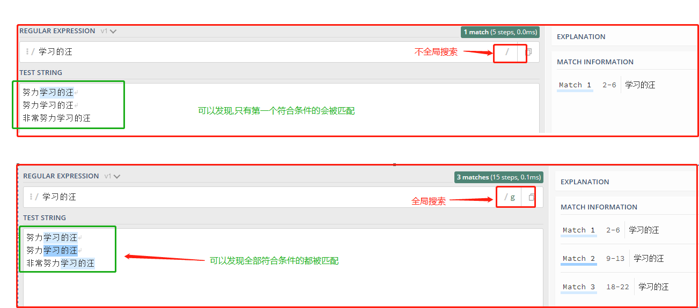
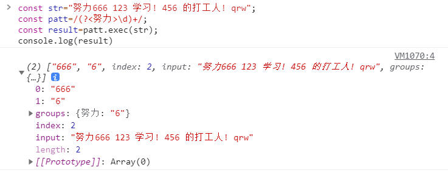
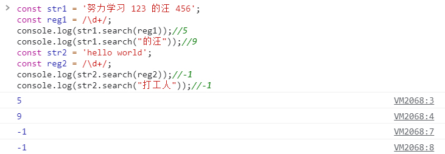

# #说明

>正则可以说是操作 [ 字符串 ] 最强大的工具了,没有之一,特别是在进行爬虫技术或 前端字符串处理时简直必备技能,然鹅正则总是学了忘、忘了学,用时还需要去百度翻资料,也是严重影响了工作效率,所以我也认真查阅许多资料认真学习梳理成此笔记.
>
>在此我会尽量详细地对查阅的资料进行摘录梳理并加入自己理解,相信看完这个笔记后同学们能快速掌握或者定位知识点
>
>查阅的资料或博客:[[comer的60分钟正则从入门到深入](https://segmentfault.com/a/1190000013075245)]、[[Vincent Ko的可能是最好的正则表达式的教程笔记了吧...](https://juejin.cn/post/6844903648309297166)]、[gitHub的[learn-regex](https://github.com/ziishaned/learn-regex/blob/master/translations/README-cn.md)]、[阮一峰的ES6文档](https://www.jb51.net/tools/zhengze.html)、[deerchao的正则表达式30分钟入门教程](https://www.jb51.net/tools/zhengze.html) 、博客园的 [只争朝夕，不负韶华的正则常用的六种方法](https://home.cnblogs.com/u/aidixie/)
>
>除此笔记外大家可以看我其他笔记 :**[全栈笔记](https://gitee.com/hongjilin/hongs-study-notes/tree/master)**、**[编程_前端开发学习笔记](https://gitee.com/hongjilin/hongs-study-notes/tree/master/编程_前端开发学习笔记)**、**[Vue笔记整合](https://gitee.com/hongjilin/hongs-study-notes/tree/master/编程_前端开发学习笔记/Vue笔记整合)** 、**[React笔记](https://gitee.com/hongjilin/hongs-study-notes/tree/master/编程_前端开发学习笔记/React笔记)**、 **[ReactHooks笔记](https://gitee.com/hongjilin/hongs-study-notes/tree/master/编程_前端开发学习笔记/ReactHooks笔记)** 、**[微信小程序学习笔记](https://gitee.com/hongjilin/hongs-study-notes/tree/master/编程_前端开发学习笔记/微信小程序学习笔记)**、**[Chrome开发使用及学习笔记](https://gitee.com/hongjilin/hongs-study-notes/tree/master/编程_前端开发学习笔记/Chrome开发使用及学习笔记)** 以及许多其他笔记就不一一例举了

# 一、正则基础概述

> 首先给出正则最基础的知识点概述,好让同学们能回想起一些之前学过的知识点,能更好地进行阅读
>
> 这里分享一个在线练习正则的网站,同学们可以在这里进行练习  --> [ [在线练习](https://regex101.com/) ]
>
> 笔记中例子中如特殊没有指出,则默认使用 `/g` 标志(修饰符)全局搜索作为示范

## 1、什么是正则表达式?

>> 正则表达式是一组由字母和符号组成的特殊文本，它可以用来从文本中找出满足你想要的格式的句子。**通俗的讲就是按照某种规则去匹配符合条件的字符串**
>
>一个正则表达式是一种从左到右匹配主体字符串的模式。 “Regular expression”这个词比较拗口，我们常使用缩写的术语“regex”或“regexp”。 正则表达式可以从一个基础字符串中根据一定的匹配模式替换文本中的字符串、验证表单、提取字符串等等

## 2、基础语法图表

### Ⅰ -  基础语法表格

>首先先给出最最基础部分的匹配规则,这个是肯定要会的
>
>| single char (单字符)                       | quantifiers(数量)             | position(位置)             |
>| ------------------------------------------ | ----------------------------- | -------------------------- |
>| \d   匹配数字                              | * 0个或者更多                 | ^一行的开头                |
>| \w  匹配word(数字、字母)                   | + 1个或更多，至少1个          | $一行的结尾                |
>| \W 匹配**非**word(数字、字母)              | ? 0个或1个,一个Optional       | \b 单词"结界"(word bounds) |
>| \s  匹配white space(包括空格、tab等)       | {min,max}出现次数在一个范围内 |                            |
>| \S  匹配**非**white space(包括空格、tab等) | {n}匹配出现n次的              |                            |
>| .    匹配任何，任何的字符                  |                               |                            |

### Ⅱ -  常用语法示例图解析

> 此处暂时看不懂没关系,后面会进行详细的语法介绍,此处只是让我们对正则表达式更有概念,感觉不好理解可以跳过,学完再回来看
>
> 此示例图解析部分主要摘录自 `comer的60分钟正则从入门到深入`,本人觉得其图画的挺好的,且确实刚开始可以稍微看下正则具体应用,方便后续理解,便摘录下来

#### a)  通用正则表达式

> 

#### b)  手机号正则

>```js
>/^1[34578][0-9]{9}$/
>```
>
> 

#### c) 日期匹配与分组替换

>```js
>/^\d{4}[/-]d{1,2}[/-]\d{1,2}$/
>```
>
> 
>
>这个正则比较复杂，画符念咒的地方太多了，一一分析：
>
>- Start of line 是由^生效的表示以此开头
>- 对应结尾End of line 由$生效表示以此结尾
>- 接着看digit 由 d 生效表示数字
>- 3times 由{4} 生效表示重复4次，开始的时候有疑问，为什么不是 4times 。后来明白作者的用意，正则表达式是一个规则，用这个规则去从字符串开始匹配到结束（注意计算机读字符串可是不会分行的，都是一个串，我们看到的多行，人家会认为是个 t ）这里设计好像小火车的轨道一直开到末尾。digit 传过一次，3times表示再来三次循环，共4次，后面的once同理。 自己被自己啰嗦到了。
>- 接下来，是 one of 在手机正则里面已经出现了。表示什么都行。只要符合这两个都让通过。
>
>> 好了这个正则解释完了，接下来用它做什么呢？
>
> 
>
>我们可以验证日期的合法性
>结合URL分组替换所用到的分组特性，我们可以轻松写出日期格式化的方法
>
>> 改造下这个正则
>
>```js
>/^(\d{4})[/-](\d{1,2})[/-](\d{1,2})$/
>```
>
> 
>
>轻松的可以拿到 group#1 #2 #3 的内容，对应 $1 $2 $3
>
> 

## 3、基本匹配

>正则表达式其实就是在执行搜索时的格式，它由一些字母(也可以是汉字)和数字组合而成。
>
> 例如：一个正则表达式 `学习的汪 H`，它表示一个规则：由`学`开始，接着是`习`,...最后`H`。它是组个字符与输入的正则表达式作比较,同时大小写敏感
>
>```js
>"学习的汪 H" =>
>努力学习的汪 hongjilin //无符合匹配字符串
>努力学习的汪 Hongjilin   //其中的 [ 学习的汪 H ] 高亮
>```
>
>结果示例:  这里分享一个在线练习正则的网站,同学们可以在这里进行练习  --> [ [在线练习](https://regex101.com/) ]

# 二、元字符

> 正则表达式主要依赖于元字符。 元字符不代表他们本身的字面意思，他们都有特殊的含义。**一些元字符写在方括号中的时候有一些特殊的意思**

## 1、元字符列举

>以下是一些元字符的列举：
>
>| 元字符 | 描述                                                         |
>| ------ | ------------------------------------------------------------ |
>| .      | 句号匹配任意单个字符除了换行符。                             |
>| [ ]    | 字符种类。匹配方括号内的任意字符。                           |
>| [^ ]   | 否定的字符种类。匹配除了方括号里的任意字符                   |
>| *      | 匹配>=0个重复的在*号之前的字符。                             |
>| +      | 匹配>=1个重复的+号前的字符。                                 |
>| ?      | 标记?之前的字符为可选.                                       |
>| {n,m}  | 匹配num个大括号之前的字符或字符集 (n <= num <= m).           |
>| (xyz)  | 字符集，匹配与 xyz 完全相等的字符串.                         |
>| \|     | 或运算符，匹配符号前或后的字符.                              |
>| \      | 转义字符,用于匹配一些保留的字符 `[ ] ( ) { } . * + ? ^ $ \ |` |
>| ^      | 从开始行开始匹配.                                            |
>| $      | 从末端开始匹配.                                              |

## 2、点运算符 -->  `.` 

>`.`是元字符中最简单的例子。 `.`匹配任意单个字符，但不匹配换行符。 例如，表达式 [`...o` ] 匹配3个(几个点就几位)任意字符后面跟着是 [ `o` ] 的字符串。
>
>```JS
>'...o' =>  //此处给出三个点 就是前三位为任意
>努力学习的汪 hongjilin   //其中的 [ 汪 ho ] 高亮
>努力学习的汪 Hongjilin   //其中的 [ 汪 Ho ] 高亮
>```
>
> 
>
>这时,某个认真看笔记的同学提问: `.` 用来匹配任意字符  那么字符串中的`句号.`,我们又怎么匹配呢?别急,带着这个疑问继续往下看,答案就在下方字符集中

## 3、字符集

>字符集也叫做字符类。 方括号用来指定一个字符集。 在方括号中使用连字符来指定字符集的范围。 在方括号中的字符集不关心顺序。 例如，表达式 [ `学习的汪 [Hh]` ] 匹配 [ `学习的汪 h` ]   和 [ `学习的汪 H` ] 。
>
>```js
>"学习的汪 [Hh]" =>
>努力学习的汪 hongjilin   //其中的 [ 学习的汪 h ] 高亮
>努力学习的汪 Hongjilin   //其中的 [ 学习的汪 H ] 高亮
>```
>
> 

### Ⅰ- 字符集中匹配句号.   -->>  `[.]`

>前面我们说过`点运算符`,那同学们是否会有个疑惑, `.` 被用来匹配任意字符,那么作为字符串中的`句号.`,又该用什么匹配呢?
>
>方括号的句号就表示句号。 表达式 `lin[.]` 匹配 `lin.`字符串
>
>```js
>"lin[.]" =>
>努力学习的汪 hongjilins 
>努力学习的汪 Hongjilin.  
>```
>
> 

### Ⅱ -  否定字符集   -->>  `[^]` 

>一般来说 `^` 表示一个字符串的开头，但它用在一个方括号的开头的时候，它表示这个字符集是否定的。 例如，表达式`[^地]学习的[^帅]` 匹配一个字符串为 [ 学习的 ]的, 同时前面一位字符串不能为`地`,后面一位字符串不能为`帅`
>
>```js
>"[^地]学习的[^帅]" => 
>努力学习的汪 hongjilins  //只有此处高亮
>努力学习的帅汪 Hongjilin. 
>帅气地学习的
>```
>
>  

### Ⅲ - 重复次数  -->> `*、+、?`

>后面跟着元字符 `+`，`*` or `?` 的，用来指定匹配子模式的次数。 这些元字符在不同的情况下有着不同的意思。

#### a)  `*` 号

>`*`号匹配 在`*`之前的字符出现`大于等于0`次。 例如，表达式 `a*` 匹配0或更多个以a开头的字符。表达式`[a-z]*` 匹配一个行中所有以小写字母开头的字符串。
>
>```js
>"[a-z]*" =>
>Hong ji lin VERY shuai //部分高亮
>HONGJILINHAOSHUAI	  //全部不亮
>hongjilinhaoshuai	  //全部高亮
>```
>
> 
>
>> `*`号搭配 `.`号
>
>`*`字符和`.`字符搭配可以匹配所有的字符`.*`。 `*`和表示匹配空格的符号`\s`连起来用，如表达式`\s*学习\s*`匹配0或更多个空格开头和0或更多个空格结尾的cat字符串。
>
>```js
>"\s*学习\s*" => 					  //0~无限次,所以只要有[ 学习 ]都会被匹配,同时会被匹配的还有其紧靠的无限次的空格
>努力 学习的汪 hongjilins  		    //[ 学习 ]前一个空格,后面无空格
>努力      学习       的汪hongjilins    //[ 学习 ]前后多个空格
>努力学习的帅汪 Hongjilin. 			   //[ 学习 ] 前后无空格 
>```
>
> 

#### b) `+`号

>`+`号匹配`+`号之前的字符出现 >=1 次。 例如表达式`学习.+汪` 匹配以中文(也可以是字母)`学习`开头以 [汪] 结尾，中间跟着至少一个字符的字符串。
>
>```js
>"学习.+汪" => 
>努力学习的汪 hongjilins   
>努力学习的帅汪 Hongjilin. 
>努力学习 66 汪 Hongjilin. 
>努力的学习汪  			 //此行无匹配结果
>```
>
> 

#### c) `?` 号

>在正则表达式中元字符 `?` 标记在符号前面的字符为可选，即出现 0 或 1 次。 例如，表达式 `学习的[帅]?汪` 匹配字符串 `学习的汪` 和 `学习的帅汪`。
>
>```js
>"学习的[帅]?汪" => 
>努力学习的汪 hongjilins
>努力学习的帅汪 Hongjilin. 
>努力的学习汪 				//无匹配结果
>努力学习的帅气汪 Hongjilin. //无匹配结果
>```
>
>

### Ⅳ -  量词  -->> `{}` 

#### a) 正常使用示例

>在正则表达式中 `{}` 是一个量词，常用来限定一个或一组字符可以重复出现的次数。 例如， 表达式 `[0-9]{2,3}` 匹配最少 2 位最多 3 位 0~9 的数字。
>
>```js
>"[0-9]{2,3}" => 
>努力学习的1汪1
>努力学习的233汪
>努力学习的4个4444汪
>努力学习的5个55555汪
>```
>
>

#### b) 省略第二个参数,带逗号

>我们可以省略第二个参数。 例如，`[0-9]{2,}` 匹配至少两位 0~9 的数字。
>
>```js
>"[0-9]{2,}" => 
>努力学习的1汪1
>努力学习的233汪
>努力学习的4个4444汪
>努力学习的5个55555汪
>```
>
>[  ](https://regex101.com/r/Gdy4w5/1)

#### c) 逗号也省略

>如果逗号也省略掉则表示重复固定的次数。 例如，`[0-9]{2}` 匹配2位数字
>
>```js
>"[0-9]{2}" => 
>努力学习的1汪1
>努力学习的233汪
>努力学习的4个4444汪
>努力学习的5个55555汪
>```
>
> 

### Ⅴ-  特征标群  -->>  `(...)` 

>特征标群是一组写在 `(...)` 中的子模式。`(...)` 中包含的内容将会被看成一个整体，和数学中小括号（ ）的作用相同。例如, 表达式 `(ab)*` 匹配连续出现 0 或更多个 `ab`。如果没有使用 `(...)` ，那么表达式 `ab*` 将匹配连续出现 0 或更多个 `b` 。再比如之前说的 `{}` 是用来表示前面一个字符出现指定次数。但如果在 `{}` 前加上特征标群 `(...)` 则表示整个标群内的字符重复 N 次。
>
>我们还可以在 `()` 中用或字符 `|` 表示或。例如，`(学习|打工)的汪` 匹配 `学习的汪` 或 `打工的汪` .
>
>```js
>"(学习|打工)的汪 (hong){2}" => 
>努力学习的汪 hongjilins
>努力学习打工的汪 hongjilins
>努力打工的汪 honghongjilins
>努力学习打工的汪 honghongjilins
>```
>
>

### Ⅵ - 或运算符   -->>  `|`

>或运算符就表示或，用作判断条件。
>
>举个栗子:  `(学习|打工)的(汪|打工人)` 进行匹配
>
>```js
>"(学习|打工)的(汪|打工人)" =>
>努力打工的汪 hongjilins
>努力学习的打工人 honghongjilins
>努力学习打工的打工人汪 hongjilins
>```
>
> 

### Ⅶ -  转码特殊字符   -->>  `\`

>反斜线 `\` 在表达式中用于转码紧跟其后的字符。用于指定 `{ } [ ] / \ + * . $ ^ | ?` 这些特殊字符。如果想要匹配这些特殊字符则要在其前面加上反斜线 `\`。
>
>例如 `.` 是用来匹配除换行符外的所有字符的。如果想要匹配句子中的 `.` 则要写成 `\.` 以下这个例子 `\.?`是选择性匹配`.`
>
>```js
>"(学习|打工)的汪\.? hong\??" =>
>努力打工的汪. hong
>努力学习的汪? hong
>努力学习的汪 hong?
>```
>
> 

### Ⅷ -  锚点(边界)  -->>  `^、$、\b、\B`

>在正则表达式中，想要匹配指定开头或结尾的字符串就要使用到锚点。`^` 指定开头，`$` 指定结尾。
>
>通常也会搭配`标志`(修饰符)相关知识点使用
>
>由于还未说到`标志`相关知识,此处例子仍使用 [ /g ]全局搜索,如果对此有疑惑的可以留着疑问看下方的 [五、标志](#五、标志) 

#### a) `^` 号

>`^` 用来检查匹配的字符串是否在所匹配字符串的开头。
>
>例如，在 `abc` 中使用表达式 `^a` 会得到结果 `a`。但如果使用 `^b` 将匹配不到任何结果。因为在字符串 `abc` 中并不是以 `b` 开头。
>
>例如，`^(学习|打工)的汪` 进行匹配
>
>```js
>"^(学习|打工)的汪" =>  //注意:下列字符串要分四次匹配,因为即使换行了,后三行字符串本质上都不在字符串开头
>//或者标志换成 /m 而不是 /g  因为此处还未说到标志,所以默认大家使用/g全局搜索
>学习的汪 hong
>打工的汪 hong
>努力打工的汪 hong
>努力学习的汪
>```
>
> 

#### b) `$` 号

>同理于 `^` 号，`$` 号用来匹配字符是否是最后一个。
>
>例如，`学习的(汪|打工人)$` 匹配以 [ 汪 ] 或者 [ 打工人 ]  结尾的字符串。
>
>```js
>"学习的(汪|打工人)$" =>  //注意:下列字符串要分四次匹配,因为即使换行了,前三行字符串本质上都不在字符串结尾
>//或者标志换成 /m 而不是 /g  因为此处还未说到标志,所以默认大家使用/g全局搜索
>努力学习的汪 
>努力学习的打工人
>努力学习的打工人 hongjilins
>努力学习的汪_  //此处 _ 模拟表示空格 
>```
>
> 

#### c) 单词边界 `\b`

>\b : 单词边界:指[a-zA-z0-9]之外的字符,举个栗子:`\bis\b`
>
>```js
>'\bis\b'=>
>My name is hongjilin
>my name@is@hong jilin
>myname学is习hongjilin
>mynameishongjilin //只有此处不被匹配
>```
>
> 

#### d) 非单词边界 `\B`

>```js
>'\Bis\B'=>
>My name is hongjilin
>my name@is@hong jilin
>myname学is习hongjilin
>mynameishongjilin //只有此处被匹配,与单词边界切好相反
>```
>
> 


# 三、简写字符集

>这些简写字符集,简洁明了且非常常用,但是也因为这样当初没有仔细去记,用时还得查阅资料十分不便,建议背下来
>
>正则表达式提供一些常用的字符集简写。如下:   
>
>| 简写 | 描述                                               |
>| ---- | -------------------------------------------------- |
>| .    | 除换行符外的所有字符                               |
>| \w   | 匹配所有字母数字，等同于 `[a-zA-Z0-9_]`            |
>| \W   | 匹配所有非字母数字，即符号，等同于： `[^\w]`       |
>| \d   | 匹配数字： `[0-9]`                                 |
>| \D   | 匹配非数字： `[^\d]`                               |
>| \s   | 匹配所有空格字符，等同于： `[\t\n\f\r\p{Z}]`       |
>| \S   | 匹配所有非空格字符： `[^\s]`                       |
>| \f   | 匹配一个换页符                                     |
>| \n   | 匹配一个换行符                                     |
>| \r   | 匹配一个回车符                                     |
>| \t   | 匹配一个制表符                                     |
>| \v   | 匹配一个垂直制表符                                 |
>| \p   | 匹配 CR/LF（等同于 `\r\n`），用来匹配 DOS 行终止符 |

# 四、零宽度断言 (前后预查)

>先行断言和后发断言都属于**非捕获簇**（不捕获文本 ，也不针对组合计进行计数）。 先行断言用于判断所匹配的格式是否在另一个确定的格式之前，匹配结果不包含该确定格式（`仅作为约束`）。
>
>例如，我们想要获得所有跟在 `$` 符号后的数字，我们可以使用正后发断言 `(?<=\$)[0-9\.]*`。 这个表达式匹配 `$` 开头，后面可以跟着`单个字符`:[0~9]、[.]、[?],这些字符可以出现大于等于 0 次。
>
>```js
>"(?<=\$)[0-9\.\?]*" =>
>$0.,1,2,3,$4,5,6,$?7,8,$..9.9?
>//0.     //4    //?7   //..9.9?
>```
>
>零宽度断言如下：
>
>| 符号 | 描述            |
>| ---- | --------------- |
>| ?=   | 正先行断言-存在 |
>| ?!   | 负先行断言-排除 |
>| ?<=  | 正后发断言-存在 |
>| ?<!  | 负后发断言-排除 |

## 1、 正先行断言  -->>  `?=...`

>`?=...` 正先行断言，表示第一部分表达式之后必须跟着 `?=...`定义的表达式。
>
>返回结果只包含满足匹配条件的第一部分表达式(即不会返回先行断言匹配部分的内容)。 定义一个正先行断言要使用 `()`。在括号内部使用一个问号和等号： `(?=...)`。
>
>正先行断言的内容写在括号中的等号后面。 例如，表达式 `学习的汪(?=\shong)` 首先匹配 [ 学习的汪 ]，然后在括号中我们又定义了正先行断言 `(?=\shong)` ，即  [ 学习的汪 ]后面紧跟着 [ `(空格)hong `]。
>
>```js
>"学习的汪(?=\shong)" =>  //此处断言中的可以再加如`+` 、`*` ......,此处举其中一个栗子说明
>努力学习的汪 hong //只有此处被匹配到    返回: [学习的汪]  -->断言中的匹配项作为约束不会返回
>努力学习的汪 帅
>努力学习的汪hong  //此处后面没有空格
>```
>
> 

## 2、负先行断言  -->>  `?!...` 

>负先行断言 `?!` 用于筛选所有匹配结果，筛选条件为 其后不跟随着断言中定义的格式。 `正先行断言` 定义和 `负先行断言` 一样，区别就是 `=` 替换成 `!` 也就是 `(?!...)`。
>
>表达式 `学习的汪(?!\s+hong)` 首先匹配 [ 学习的汪 ]，然后在括号中我们又定义了负先行断言 `(?!\shong)` ,即  [ 学习的汪 ]后面不跟着 [ `(空格)hong ` ]。
>
>```js
>"学习的汪(?!\s+hong)" => 
>努力学习的汪 hong  //只有此处不被匹配到
>努力学习的汪 帅
>努力学习的汪hong
>```
>
> 

## 3、 正后发断言  -->>  `?<= ...`

>正后发断言 记作`(?<=...)` 用于筛选所有匹配结果，筛选条件为 其前跟随着断言中定义的格式。 例如，表达式 `(?<=[学习|打工])的(汪|打工人)` 匹配  [汪]  和  [打工人] ，且需要其前方跟着 [学习] 或  [打工] 。
>
>```js
>"(?<=[学习|打工])的(汪|打工人)" => 
>努力学习的汪
>努力打工的打工人
>努力学习汪
>```
>
> 

## 4、负后发断言  -->>  `?<!...`

>负后发断言 记作 `(?<!...)` 用于筛选所有匹配结果，筛选条件为 其前 **不** 跟随着断言中定义的格式。 例如，表达式 `(?<![学习|打工])的(汪|打工人)` 匹配  [汪]  和  [打工人] ，且需要其前方 **不** 跟着 [学习] 或  [打工] 。
>
>```js
>"/(?<![学习|打工])的(汪|打工人)/g" => 
>努力学习的汪
>努力打工的打工人
>努力学习汪
>```
>
>

# 五、标志(修饰符)

>标志也叫模式修正符，因为它可以用来修改表达式的搜索结果。 这些标志可以任意的组合使用，它也是整个正则表达式的一部分。
>
>| 标志 | 描述                                                  |
>| ---- | ----------------------------------------------------- |
>| i    | 忽略大小写。                                          |
>| g    | 全局搜索。                                            |
>| m    | 多行修饰符：锚点元字符 `^` `$` 工作范围在每行的起始。 |

## 1、全局搜索 (Global search)  -->>  `\g`

>修饰符 `g` 常用于执行一个全局搜索匹配，即（不仅仅返回第一个匹配的，而是返回全部）。 例如，表达式 `/学习的汪/g` 表示搜索 任意字符（除了换行）+ `学习的汪`，并返回全部结果。
>
>```
>"/学习的汪/g" => 
>努力学习的汪
>努力学习的汪
>非常努力学习的汪
>```
>
>

## 2、忽略大小写 (Case Insensitive)  -->>  `/i`

>修饰语 `i` 用于忽略大小写。 例如，表达式 `/Hong/gi` 表示在全局搜索 `Hong`，在后面的 `i` 将其条件修改为忽略大小写，则变成搜索 [hong(忽略大小写)]，`g` 表示全局搜索。
>
>```js
>"/Hong/gi" =>  //默认情况下是大小写敏感的,但此处这样标志后,就成为忽略大小写
>hongjilin
>Hongjilin
>HONGJILIN
>hOngjilin
>```
>
>

## 3、 多行注释符

>多行修饰符 `m` 常用于执行一个多行匹配。
>
>像之前介绍的 `(^,$)` 用于检查格式是否是在待检测字符串的开头或结尾。但我们如果想要它在每行的开头和结尾生效，我们需要用到多行修饰符 `m`。
>
>例如，表达式 `/学习的(汪|打工人)$/gm` 表示 [学习的] 后面跟着 [汪] 或 [打工人] ，末尾可选除换行符外任意字符。根据 `m` 修饰符，现在表达式匹配每行的结尾。-->此处举出上方锚点的例子
>
>```js
>"/学习的(汪|打工人)$/gm" =>  //在之前说到 锚点 时提到,如果是 /g 只能一行一行匹配,而如果换成这个就可以直接匹配
>努力学习的汪
>努力学习的打工人
>努力学习的打工人 hongjilins
>努力学习的汪_  //此处 _ 模拟表示空格 
>```
>
>

# 六 、贪婪匹配与惰性匹配 (Greedy vs lazy matching)

## 1、贪婪匹配

>正则表达式默认采用贪婪匹配模式，在该模式下意味着会匹配尽可能长的子串。
>
>```js
>"/(.*汪)/" => 
>努力学习的汪 非常认真读书的汪  的汪  的汪
>```
>
> 

## 2、 惰性匹配

>我们可以使用 `?` 将贪婪匹配模式转化为惰性匹配模式。
>
>```js
>"/(.*?汪)/" => 
>努力学习的汪 非常认真读书的汪  的汪  的汪
>```
>
>

# 七、正则常用方法

>**正则中常用方法主要分为两类，一类是：RegExp对象方法；一类是：支持正则表达式的String对象的方法。**
>
>此处主要列举常用的

## 1、 RegExp对象方法:

>RegExp对象方法:exce()、test() 、compile()

### Ⅰ-  exce()方法

#### a) 概念与介绍

>1. exec() 方法用于检索字符串中的正则表达式的匹配，如果字符串中有匹配的值返回该匹配值构成的数组 ，
>2. 该数组还有继承的属性：
>   - index：表示第一个匹配的字符在原字符串中的位置，
>   - input:表示原字符串，
>   - groups：表示当初中命名的分组时匹配到的分组对象；
>3. exec()方法没有匹配到数据时返回 null。

#### b) 当正则匹配中没有分组时

>```js
>const str="努力666 123 学习! 456 的打工人! qrw";
>const patt=/\d+/;
>const result=patt.exec(str);
>console.log(result)
>```
>
> 

#### c ) 当正则匹配中有分组且分组存在名字时

>```js
>const str="努力666 123 学习! 456 的打工人! qrw";
>const patt=/(?<努力>\d)+/;
>const result=patt.exec(str);
>console.log(result)
>```
>
> 

#### d) 没有匹配到符合正则的字符时

>```js
>const str="努力学习的汪";
>const patt=/\d+/;
>const result=patt.exec(str);
>console.log(result)  //返回 null
>```
>
> 

### Ⅱ - test()方法

>介绍：方法用于检测一个字符串是否匹配某个模式；如果字符串中有匹配的值返回 true ，否则返回 false。
>
>```js
>const str="努力学习的汪";
>//查找"学习"
>const reg1=/学习/g;
>const result1=reg1.test(str);
>console.log(result1); //true
>//查找 "打工"
>const reg2=/打工/g;
>const result2=reg2.test(str);
>console.log(result2); //false
>```
>
> 

### Ⅲ -  compile()方法

>该方法的作用是能够对正则表达式进行编译，被编译过的正则在使用的时候效率会更高，适合于对一个正则多次调用的情况下，如果对一个正则只使用一两次，那么该方法没有特别显著的效应。
>
>```js
>const reg=/[abc]/gi;
>console.log(reg.test('a'));//true
>reg=/[cde]/gi;
>console.log(reg.test('a')); //false
>reg.compile(reg);
>console.log(reg.test('a')); //false
>```
>
>被编译的正则和没有编译的正则在测试结果上没有任何区别，只是多次调用的效率上会更高一些

## 2、支持正则表达式的String对象的方法:

>字符串对象共有 4 个方法，可以使用正则表达式：`match()`、`replace()`、`search()`和`split()`。
>
>ES6 将这 4 个方法，在语言内部全部调用`RegExp`的实例方法，从而做到所有与正则相关的方法，全都定义在`RegExp`对象上。
>
>- [ String.prototype.match ] 调用 `RegExp.prototype[Symbol.match]`
>- [ String.prototype.replace ]  调用 `RegExp.prototype[Symbol.replace]`
>- [ String.prototype.search ]  调用 `RegExp.prototype[Symbol.search]`
>- [ String.prototype.split ]  调用 `RegExp.prototype[Symbol.split]`
>
>ES系列更多笔记可以点此跳转

### Ⅰ- search()方法

#### a) 概念与介绍

>用于检索字符串中指定的子字符串，或检索与正则表达式相匹配的子字符串。
>如果找到任何匹配的子串，则返回 该子串在原字符串中的第一次出现的位置。　　
>如果没有找到任何匹配的子串，则返回 -1。

#### b) 举个栗子

>```js
>const str1 = '努力学习 123 的汪 456';
>const reg1 = /\d+/; 
>console.log(str1.search(reg1));//5
>console.log(str1.search("的汪"));//9
>const str2 = 'hello world';
>const reg2 = /\d+/;
>console.log(str2.search(reg2));//-1
>console.log(str2.search("打工人"));//-1
>```
>
> 

### Ⅱ - replace()方法

#### a) 概念与介绍

>用于在字符串中用一些字符替换另一些字符，或替换一个与正则表达式匹配的子串。原字符串不变，创建一个新的字符串
>
>创建一个新的字符串，原字符串不变

#### b) 替换第一个

>```js
>const str="努力学习的汪! 努力学习的汪!! 努力学习的汪!!!"; 
>const n=str.replace('学习',"打工");
>console.log(str) //原字符串不变
>console.log(n) //新字符串
>```
>
> 

#### c) 替换全部

>```js
>const str="努力学习的汪! 努力学习的汪!! 努力学习的汪!!!"; 
>const n=str.replace(/学习/g,"打工");   //替换全部
>const a=str.replace(/学习/,"打工"); //仍是替换单行
>console.log(str) //原字符串不变
>console.log(a) //仍是替换单行
>console.log(n) //新字符串 全部替换
>```
>
> 

### Ⅲ - split()方法

#### a) 概念与介绍

>用于把一个字符串按符合匹配条件的方式分割成一个字符串数组。不改变原字符串

#### b) 举个栗子

>```js
>const str="How 1are 2you 3? 4I'm 5fine! 6thanks";
>const a=str.split(" ");
>const b=str.split(" ",2);
>const c=str.split(/\d/);
>const d=str.split(/\d/,3);
>console.log(a);  // ["How", "1are", "2you", "3?", "4I'm", "5fine!", "6thanks"]
>console.log(b);  // ["How", "1are"]
>console.log(c);  // ["How ", "are ", "you ", "? ", "I'm ", "fine! ", "thanks"]
>console.log(d);  // ["How ", "are ", "you "]
>```
>
> 

### Ⅳ- match()方法

#### a) 概念与介绍

>1. 概念: match() 方法可在字符串内检索指定的值，或找到一个或多个正则表达式的匹配
>2. 注意点: match() 方法将检索字符串 String，以找到一个或多个与 regexp 匹配的文本。这个方法的行为在很大程度上有赖于 regexp 是否具有标志 g。
>   - 如果 regexp 没有标志 g，那么 match() 方法就只能在 stringObject 中执行一次匹配，**与exce的完全一致**
>   - 如果 regexp 有标志 g，它将找到全部符合正则子字符串，并返回一个数组。
>   - 如果没有找到任何匹配的文本，无论有没有g，match() 将返回 null

#### b) 没有g的正则匹配

>```js
>const str = '努力学习 123 的汪 456';
>const reg=/\d+/;
>const result=str.match(reg); 
>console.log(result)  //没有 全局搜索 的时候返回与 exce() 完全一致
>```
>
> 

#### c)  有g的正则匹配

>```js
>const str = '努力学习 123 的汪 456';
>const reg=/\d+/g;
>const result=str.match(reg); 
>console.log(result)  //返回数组
>```
>
> 

#### d) 没有匹配到子字符串

>```js
>const str = '努力学习 123 的汪 456';
>const reg=/打工/g;
>const result=str.match(reg); 
>console.log(result)  //匹配不到返回null
>```
>
> 

# 八、常用正则收录

## 1、正则表达式只保留数字

>1. 正则代码
>
>  ```jsx
>str=str.replaceAll("[^0-9]", "");//此表达式匹配错误
>str=str.replace(/\D/g,''); //正确	
>  ```
>
>2. 调用代码示例
>
>  ```jsx
>onChange={(e)=> store.changeSearchParamsValue('storeId')(e.target.value.replace(/\D/g,''))} 
>@action changeSearchNumberParamsValue = (type) => (value) => {
>    //this.searchParams[type] = value.replace(/\D/g,''); 外面限制好后传入
>     this.searchParams[type] = value;
>  };
>  ```
>
>3. 实现效果
>
>  > 输入非数字内容则无法键入(替换为空)

## 2、限制不能为空以及中文

>```jsx
>str=str.replace(/\s/g, '').replace(/[\u4E00-\u9FA5]|[\uFE30-\uFFA0]/gi, '');
>```

