#说明

>1. 本笔记为观看B站的: [`尚硅谷Java数据结构与java算法（Java数据结构与算法）`](https://www.bilibili.com/video/BV1E4411H73v?share_source=copy_web) 、其他多个相关博客与资料进行整理记录,里面加了大量个人对于这门课程的注解/图解与理解,欢迎大家指出不足之处,我也会及时进行校正
>2. 本人目前岗位为前端,但有较好的java基础,所以选定该学习视频,学习过程笔记也会使用`java语言进行demo实现`,毕竟是概念部分还是跟紧老师学习,但用的都是基础语法,js与java其实都差不多并不会影响理解,甚至这部分代码js写法与java相差无几。
>3. 不过在随后`leetCode`部分,我将会用`java`与`javaScript`两种语言分别实现与记录,所以前后端的同学都将是可以看得懂的
>4. 个人跟随课程进程编写出的相关练习也会上传在此笔记同级文件目录下
>5. 数据结构与算法吃透比学完更重要,要确保吸收知识点且不影响工作的前提下,预计学习过程将持续几个月。但也坚信慢工出细活,形成的笔记以及知识体系也会更详细完整
>6. 本人笔记地址分享:[`全部笔记`](https://gitee.com/hongjilin/hongs-study-notes)、[`数据结构与算法学习笔记`](https://gitee.com/hongjilin/hongs-study-notes/tree/master/%E7%BC%96%E7%A8%8B_%E7%AE%97%E6%B3%95%E5%8F%8A%E8%AF%BE%E7%A8%8B%E5%9F%BA%E7%A1%80%E5%AD%A6%E4%B9%A0%E7%AC%94%E8%AE%B0/%E6%95%B0%E6%8D%AE%E7%BB%93%E6%9E%84%E4%B8%8E%E7%AE%97%E6%B3%95)、[`LeetCode笔记`](https://gitee.com/hongjilin/hongs-study-notes/tree/master/%E7%BC%96%E7%A8%8B_%E7%AE%97%E6%B3%95%E5%8F%8A%E8%AF%BE%E7%A8%8B%E5%9F%BA%E7%A1%80%E5%AD%A6%E4%B9%A0%E7%AC%94%E8%AE%B0/%E6%95%B0%E6%8D%AE%E7%BB%93%E6%9E%84%E4%B8%8E%E7%AE%97%E6%B3%95/LeetCode)
>
>​												记录时间:2020/4/12启

# #目录(`更新中`)

>[TOC]

------


# 数据结构与算法

>1) 算法是程序的灵魂，优秀的程序可以在海量数据计算时，依然保持高速计算 
>
>2) 一般来讲 程序会使用了内存计算框架(比如 Spark)和缓存技术(比如 Redis 等)来优化程序,再深入的思考一下，这 些计算框架和缓存技术， 它的核心功能是哪个部分呢？ 
>
>3) 拿实际工作经历来说, 在 Unix 下开发服务器程序，功能是要支持上千万人同时在线，在上线前做内测，一切OK,可上线后，服务器就支撑不住了, 公司的 CTO 对代码进行优化，再次上线，坚如磐石。你就能感受到程序 是有灵魂的，就是算法。 
>
>4) 目前程序员面试的门槛越来越高，很多一线 IT 公司(大厂)，都会有数据结构和算法面试题(负责的告诉你，肯定有的) 
>
>5) 如果你不想永远都是代码工人,那就花时间来研究下数据结构和算法

## 一、数据结构与算法概述以及经典题目举例

### 1、数据结构和算法的关系

>1) 数据 data 结构(structure)是一门研究组织数据方式的学科，有了编程语言也就有了数据结构.学好数据结构可以 编写出更加漂亮,更加有效率的代码。 
>
>2) 要学习好数据结构就要多多考虑如何将生活中遇到的问题,用程序去实现解决. 
>
>3) `程序 = 数据结构 + 算法`
>
>4) 数据结构是算法的基础, 换言之，想要学好算法，需要把数据结构学到位。

### 2、线性结构与非线性结构

>数据结构包括：线性结构和非线性结构。

#### Ⅰ-线性结构

>1) 线性结构作为最常用的数据结构，其特点是数据元素之间存在一对一的线性关系 
>
>2) 线性结构有两种不同的存储结构，即顺序存储结构(数组)和链式存储结构(链表)。顺序存储的线性表称为顺序 表，顺序表中的存储元素是连续的 
>
>3) 链式存储的线性表称为链表，链表中的存储元素不一定是连续的，元素节点中存放数据元素以及相邻元素的地 址信息 
>
>4) 线性结构常见的有：数组、队列、链表和栈

#### Ⅱ-非线性结构

>非线性结构包括：二维数组，多维数组，广义表，树结构，图结构


### 3、经典面试题

#### Ⅰ-字符串匹配问题：

>1) 有一个字符串 str1= ""硅硅谷 尚硅谷你尚硅 尚硅谷你尚硅谷你尚硅你好""，和一个子串 str2="尚硅谷你尚 硅你"
>
>2) 现在要判断 str1 是否含有 str2, 如果存在，就返回第一次出现的位置, 如果没有，则返回-1 
>
>3) 要求用最快的速度来完成匹配 4) 
>
>解: 1. 暴力匹配 [简单，但是效率低] 2.  `KMP 算法《部分匹配表》`

#### Ⅱ-汉诺塔游戏

>请完成汉诺塔游戏的代码: 要求：
>
>1) 将 A 塔的所有圆盘移动到 C 塔。并且规定，在 
>
>2) 小圆盘上不能放大圆盘， 
>
>3)在三根柱子之间一次只能移动一个圆盘
>
>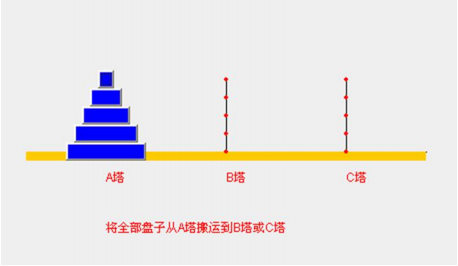

#### Ⅲ-八皇后问题:

>八皇后问题，是一个古老而著名的问题，是回溯算法的典型案例。该问题是国际西洋棋棋手马克斯·贝瑟尔于 1848 年提出：在 8×8 格的国际象棋上摆放八个皇后，使其不能互相攻击，即：任意两个皇后都不能处于同一行、 同一列或同一斜线上，问有多少种摆法。【92】=> `分治算法`
>
>

#### Ⅳ-马踏棋盘算法

>1) 马踏棋盘算法也被称为骑士周游问题 
>
>2) 将马随机放在国际象棋的 8×8 棋盘 Board[0～7][0～7]的某个方格中，马按走棋规则(马走日字)进行移动。要求 每个方格只进入一次，走遍棋盘上全部 64 个方格 
>
>3) [游戏演示:](http://www.4399.com/flash/146267_2.html)
>
>4) 会使用到图的`深度优化遍历算法(DFS) + 贪心算法优化`
>
>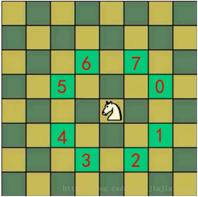

### 4、几个实际编程中遇到的问题

#### Ⅰ-字符串替换问题

>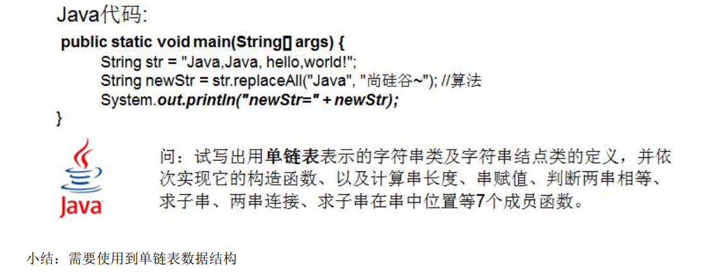


#### Ⅱ-一个五子棋程序

>如何判断游戏的输赢，并可以完成存盘退出和继续上局的功能 
>
>1) 棋盘 二维数组=>(稀疏数组)-> 写入文件 【存档功能】 
>
>2) 读取文件-》稀疏数组-》二维数组 -》 棋盘 【接上局】
>
>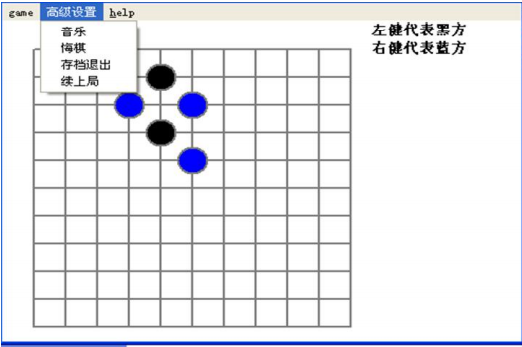


#### Ⅲ-约瑟夫(Josephu)问题(丢手帕问题)

>1) Josephu 问题为：设编号为 1，2，… n 的 n 个人围坐一圈，约定编号为 k（1<=k<=n）的人从 1 开始报数，数 到 m 的那个人出列，它的下一位又从 1 开始报数，数到 m 的那个人又出列，依次类推，直到所有人出列为止， 由此产生一个出队编号的序列。 
>
>2) 提示：用一个不带头结点的循环链表来处理 Josephu 问题：先构成一个有 n 个结点的单循环链表（单向环形链 表），然后由 k 结点起从 1 开始计数，计到 m 时，对应结点从链表中删除，然后再从被删除结点的下一个结点 又从 1 开始计数，直到最后一个结点从链表中删除算法结束。 
>
>3) 小结：`该问题解决自 ->第四章链表的6小节 --环形链表实现 `


#### Ⅳ-其它常见算法问题:

>1) 修路问题 => 最小生成树(加权值)【数据结构】+ `普利姆算法 `
>
>2) 最短路径问题 => `图+弗洛伊德算法` 
>
>3) 汉诺塔 => `分支算法` 
>
>4) 八皇后问题 => `回溯`
>
>


## 二、稀疏数组与队列

### 1、稀疏 sparsearray 数组

#### Ⅰ-需求分析

> 需求举例:编写的五子棋程序中，有存盘退出和续上盘的功能
>
> 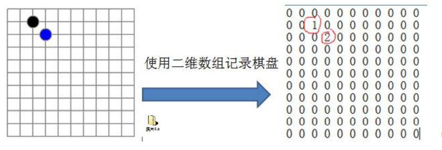
>
> 分析:因为该二维数组的很多值是默认值 0, 因此记录了`很多没有意义的数据.->稀疏数组`。

#### Ⅱ-基本介绍

>当一个数组中大部分元素为０，或者为同一个值的数组时，可以使用稀疏数组来保存该数组。 稀疏数组的处理方法是: 
>
>1) 记录数组一共有`几行几列，有多少个不同`的值 
>
>2) 把具有不同值的元素的行列及值记录在一个小规模的数组中，从而`缩小程序的规模`
>
>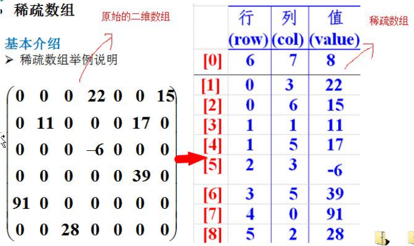

#### Ⅲ-应用实例

>1) 使用稀疏数组，来保留类似前面的二维数组(棋盘、地图等等) 
>
>2) 把稀疏数组存盘，并且可以从新恢复原来的二维数组数 
>
>3) 整体思路分析
>
>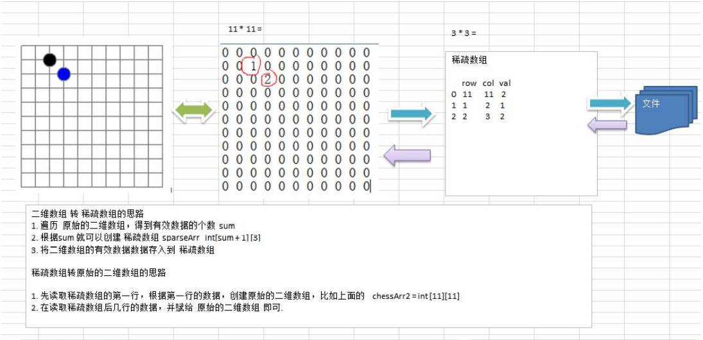
>
>4) 代码实现
>
>```java
>package com;
>public class SparseArray {
>    public static void main(String[] args) {
>        //创建一个原始的二维数组11*11
>        /* 0:表示没有棋子,1表示黑子,2表示蓝子 */
>        int chessArr1[][] = new int[11][11];
>        chessArr1[1][2] = 1;
>        chessArr1[2][3] = 2;
>        chessArr1[5][5] = 2;
>        //输出原始的二维数组
>        System.out.println("原始的二维数组");
>        for (int[] row : chessArr1) {
>            for (int data : row) {
>                System.out.printf("%d\t", data);
>            }
>            System.out.println();
>        }
>        //将二维数组转稀疏数组
>        //1.先遍历二维数组,得到非0数据的个数
>        int sum = 0;
>        for (int i = 0; i < 11; i++) {
>            for (int j = 0; j < 11; j++) {
>                if (chessArr1[i][j] != 0) sum++;
>            }
>        }
>        //创建对应的稀疏数组
>        int sparseArr[][] = new int[sum + 1][3];
>        //给稀疏数组赋值  -->存行列长度,有效数据
>        sparseArr[0][0] = 11;
>        sparseArr[0][1] = 11;
>        sparseArr[0][2] = sum;
>        //遍历二维数组,
>        int count = 0;//给稀疏数组当计数器
>        for (int i = 0; i < 11; i++) {
>            for (int j = 0; j < 11; j++) {
>                //当数组中遇到不为0时,给稀疏数组插入(push同效果):行 列 有效数
>                if (chessArr1[i][j] != 0) {
>                    count++;
>                    sparseArr[count][0] = i;
>                    sparseArr[count][1] = j;
>                    sparseArr[count][2] = chessArr1[i][j];
>                }
>            }
>        }
>        System.out.println("有效数据" + sum);
>        //输出稀疏数组的形式
>        System.out.println("'得到稀疏数组为~~'");
>        for (int i = 0; i < sparseArr.length; i++) {
>            System.out.printf("%d\t%d\t%d\t\n", sparseArr[i][0], sparseArr[i][1], sparseArr[i][2]);
>        }
>        System.out.println("将稀疏数组回复成原始的二维数组");
>        //1. 先读取稀疏数组的第一行,根据第一行的数据,创建原始的二维数组
>        int chessArr2[][] = new int[sparseArr[0][0]][sparseArr[0][1]];
>        //2. 在读稀疏数组后几行的数据(从第二行开始,所以i=1),并赋值给原始的二维数组即可
>        for (int i = 1; i < sparseArr.length; i++) {
>            chessArr2[sparseArr[i][0]][sparseArr[i][1]] = sparseArr[i][2];
>        }
>        //输出恢复后的二维数组
>        System.out.println("输出恢复后的二维数组");
>        for (int[] row : chessArr2) {
>            for (int data : row) {
>                System.out.printf("%d\t", data);
>            }
>            System.out.println();
>        }
>    }
>}
>```
>
>5) 练习 要求： 1) 在前面的基础上，将稀疏数组保存到磁盘上，比如 map.data 2) 恢复原来的数组时，读取 map.data 进行恢复

### 2、队列

#### Ⅰ-队列介绍

>1) 队列是一个有序列表，可以用数组或是链表来实现。 
>
>2) 遵循先入先出的原则。即：先存入队列的数据，要先取出。后存入的要后取出
>
>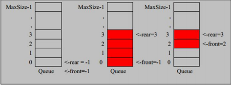

#### Ⅱ-数组模拟队列

>1. 队列本身是有序列表，若使用数组的结构来存储队列的数据，则队列数组的声明如上图, 其中 maxSize 是该队列的最大容量。 
>
>2. 因为队列的输出、输入是分别从前后端来处理，因此需要两个变量 front 及 rear 分别记录队列前后端的下标， front 会随着数据输出而改变，而 rear 则是随着数据输入而改变，如队列介绍中图所示
>
>3. 当我们将数据存入队列时称为”addQueue”，addQueue 的处理需要有两个步骤：思路分析:
>
>   1) 将尾指针往后移：rear+1 , 当 front == rear 【空】 
>
>   2) 若尾指针 rear 小于队列的最大下标 maxSize-1，则将数据存入 rear 所指的数组元素中，否则无法存入数据
>
>4. `注意`:front并没有直接指向数据,而是数据前一位,所以当你要用front读取队列头时需要`front+1`
>
>5. 代码实现
>
>   ```java
>   package com.queue;
>   import java.util.Scanner;
>   
>   public class ArrayQueueDemo {
>       public static void main(String[] args) {
>           //创建一个队列
>           ArrayQueue queue = new ArrayQueue(3);
>           char key = ' ';//接受用户输入
>           Scanner scanner = new Scanner(System.in);
>           boolean loop = true;
>           //输出一个菜单
>           while (loop) {
>               System.out.println("s(show):显示队列");
>               System.out.println("e(exit):退出程序");
>               System.out.println("a(add):添加数据到队列");
>               System.out.println("g(get):从队列取出数据");
>               System.out.println("h(head):查看队列头的数据");
>               key = scanner.next().charAt(0);//接受一个字符
>               switch (key) {
>                   case 's':
>                       queue.showQueue();
>                       break;
>                   case 'a':
>                       System.out.println("输入一个数字");
>                       int value = scanner.nextInt(); //不用再new一个新得scanner
>                       queue.addQueue(value);
>                       break;
>                   case 'g':
>                       try {
>                           int res = queue.getQueue();
>                           System.out.printf("取出的数据是%d\n", res);
>                       } catch (Exception e) {
>                           System.out.println(e.getMessage());
>                       }
>   
>                       break;
>                   case 'h':
>                       try {
>                           int head = queue.headQueue();
>                           System.out.printf("表头是%d\n", head);
>                       } catch (Exception e) {
>                           System.out.println(e.getMessage());
>                       }
>                       break;
>                   default:
>                       scanner.close();//关闭不释放会有异常
>                       loop = false;
>                       break;
>               }
>           }
>           System.out.println("程序退出");
>       }
>   }
>   
>   //使用数组模拟队列-编写一个ArrayQueue类
>   class ArrayQueue {
>       private int maxSize;//表示数组的最大容量
>       private int front; //队列头
>       private int rear;//队列尾
>       private int[] arr; //该数据用于存放数据,模拟队列
>   
>       //创建队列的构造器
>       public ArrayQueue(int arrMaxSize) {
>           maxSize = arrMaxSize;
>           arr = new int[maxSize];
>           front = -1;//指向队列头部,分析出front是只想队列头的前一个位置
>           rear = -1;//指向队列尾部,只想队列尾部数据(即队列最后一个数据)
>       }
>   
>       //1. 判断队列是否满
>       public boolean isFull() {
>           return rear == maxSize - 1; //当队列为指向数组最后一位时就是队列满
>       }
>   
>       //2. 判断队列是否为空
>       public boolean isEmpty() {
>           return rear == front; //当队列头与尾部相等时,说明该队列没有值了
>       }
>   
>       //3. 添加数据到队列
>       public void addQueue(int n) {
>           //判断队列是否满
>           if (isFull()) {
>               System.out.println("队列满,不能加入数据~~~~~~");
>               return;
>           }
>           rear++; //让rear 往后移动一位
>           arr[rear] = n; //以后移后的rear作为数组下标进行赋值
>       }
>   
>       //4. 获取队列的数据,出队列
>       public int getQueue() {
>           //判断队列是否为空//抛出异常
>           if (isEmpty()) throw new RuntimeException("队列为空,不能取数据");
>           front++; //front后移 出队列
>           return arr[front];
>       }
>   
>       //5. 显示队列的所有数据
>       public void showQueue() {
>           //遍历
>           if (isEmpty()) {
>               System.out.println("队列空的 没有数据");
>               return;
>           }
>           for (int i = 0; i < arr.length; i++) {
>               System.out.printf("arr[%d]=%d\n", i, arr[i]);
>           }
>       }
>   
>       //显示队列的头数据,注意不是取出数据
>       public int headQueue() {
>           //判断
>           if (isEmpty())  throw new RuntimeException("队列空的,没有数据~~~~");
>           return arr[front + 1]; //front并没有直接指向数据,而是数据前一位,所以需要+1
>       }
>   
>   }
>   ```
>
>6. 问题分析与优化方向:
>
>   1) 目前数组使用一次就不能用， 没有达到复用的效果.
>
>   ​	`原因`:取出数据时是将列表头(`front++`)向后移动,导致队列前面的空间并没有被释放,如上图第三个队列示例图 
>
>   2) 将这个数组使用算法，改进成一个环形的队列 取模：%

#### Ⅲ-数组模拟环形队列思路分析

>1. 对前面的数组模拟队列的优化，充分利用数组. 因此将数组看做是一个环形的。(通过取模的方式来实现即可)
>
>2. 分析说明:
>
>      1. 尾索引的下一个为头索引时表示队列满，即将队列容量空出一个作为约定,这个在做判断队列满的 时候需要注意 (rear + 1) % maxSize == front 满]
>
>      2. rear == front [空]
>
>   3. 思路分析示例图3-2-3-1
>
>      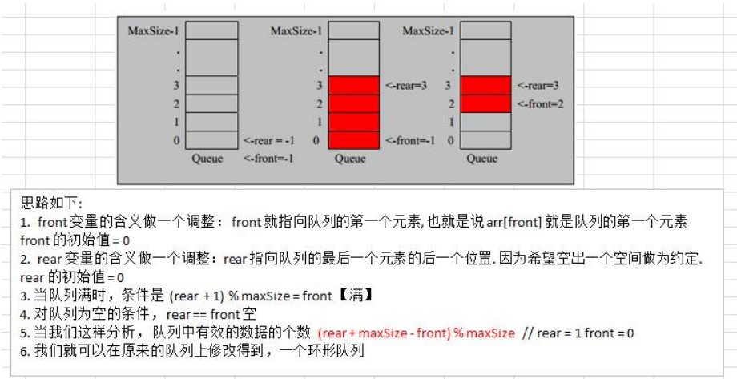
>
>3. 环形队列示例图
>
>   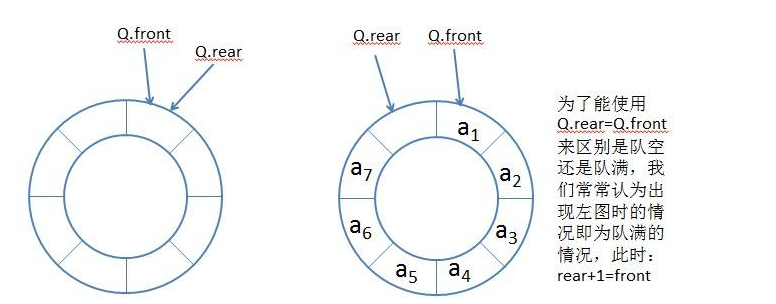

#### Ⅳ-个人对于环形队列的理解与总结

>个人对于思路分析示例图3-2-3-1理解与总结:
>
>1. `rear`初始化为0:因为当队列为空时,`rear`队列尾应是指向`-1`位置,因为整个队列是空的
>
>   所以符合调整:rear指向队列的最后一个元素的后一个位置,可以留出一个空间作为约定(用来`判断是队空还是队满`)
>
>2. `front`初始化为0:因为要指向队列第一个位置,所以为0
>
>3. 队列满条件:`(rear+1)%maxSize==front`-->原理如环形队列示例图
>
>   当`(rear+1)%maxSize==front`时,队列情况如环形队列示例图右边部分 -->例: (4+1)%10==5
>
>4. 队列为空`rear==front`:假使你队列曾经加到8个数据,所以你`rear==8`,但当你将队列一个一个取出时front发生如下变化:`front==0-->front++*n-->front==8`,所以当front==rear==8时,就可以判断队列为空
>
>5. 队列的有效数据个数:`(rear+maxSize-font)%maxSize` -->
>
>   1)提出疑惑:为什么要先加`maxSize`-->可能出现队尾rear小于队首front的情况
>
>    通过这个环形队列图(里面数字是`数组下标`不是数据)你应该可以很容易理解:假使队列长8、队尾在2的位置、队首在6的位置
>
> ​	解决:如图所示
>
>   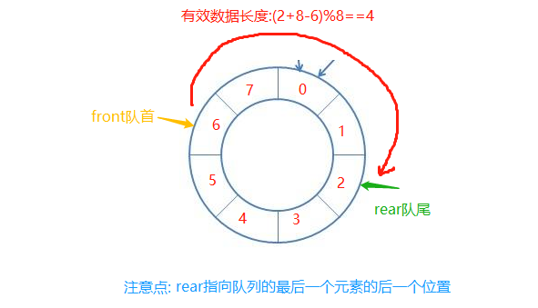
>
>   2)再次提出疑惑:老铁!!!我看图上`6~2`,甚至还用手指去数,明明就是五个数据啊!为什么还能算成`4`?
>
> ​	解:注意`rear`的定义:rear指向队列的最后一个元素的后一个位置,所以这时候最后一个队列数据是在`1`的位置,所以`6~1`是4位

#### Ⅴ-环形队列代码实现

>```java
>package com.queue;
>import java.util.Scanner;
>
>public class CircleArrayQueueDemo {
>    public static void main(String[] args) {
>        //创建一个环形队列
>        System.out.println("创建一个环形队列");
>        CircleArrayQueue queue = new CircleArrayQueue(3);
>        char key = ' ';//接受用户输入
>        Scanner scanner = new Scanner(System.in);
>        boolean loop = true;
>        //输出一个菜单
>        while (loop) {
>         .....//同上面队列代码调用,省略
>        }
>    }
>}
>
>class CircleArrayQueue {
>    private int maxSize;//表示数组的最大容量
>    private int front; //队列头
>    private int rear; //队列尾部
>    private int[] arr;//该数据用于存放数据,模拟队列
>
>    //创建队列的构造器
>    public CircleArrayQueue(int arrMaxSize) {
>        //注意:如果要能存3个有效数据,arrMaxSize就要为`4`,因为预留了一个位置,所以需要传入的数字要+1
>        maxSize = arrMaxSize + 1;
>        arr = new int[maxSize];
>        /**
>         * 1. 此处front含义做出调整:front指向队列的第一个元素,也就是说arr[front]就是队列的第一个元素,front的初始值为0*
>         * 2.此处rear含义做出调整:rear指向队列的最后一个元素的后一个位置,因为希望空出一个空间作为约定(判断栈满栈空),rear的初始值为0
>         */
>        front = rear = 0;
>    }
>
>    //1. 判断队列是否满
>    public boolean isFull() {
>        //此时队满条件发生变化,因为rear预留了一个位置
>        return (rear + 1) % maxSize == front;
>    }
>
>    //2. 判断队列是否为空
>    public boolean isEmpty() {
>        return front == rear;
>    }
>
>    /**
>     * 3.获取队列的有效数量
>     * @return int  此函数结果用来在 遍历队列数组时防止下标越界
>     */
>    public int getSize() {
>        return (rear + maxSize - front) % maxSize;
>    }
>
>    //4. 添加数据到队列
>    public void addQueue(int n) {
>        //判断是否队满
>        if (isFull()) {
>            System.out.println("队列满,不能加入数据~~~~~");
>            return;
>        }
>        arr[rear] = n;//这里需要先赋值再将rear+1,因为rear指向最后一个有效数据
>        //让rear后移一位,但是需要注意`%`,因为栈尾可以回到下标为`0`处,原因看我画的图
>        rear = (rear + 1) % maxSize;
>
>    }
>
>    //5. 获取队列数据 出队列(类似删除数组第一位)
>    public int getQueue() {
>        //判断队列是否为空,抛出异常
>        if (isEmpty()) {
>            throw new RuntimeException("队列为空,不能取数据");
>        }
>        //这里需要先将`front`的值保存下来(或者直接保存arr[front],再去return),因为front此时对应的是第一个有效数据,如果＋1后再返回,将指向错误的有效数据
>        int thisFront = front;
>        //front后移,原因与注意点同rear
>        front = (front + 1) % maxSize;
>        return arr[thisFront];
>    }
>
>    //6. 显示所有队列的数据
>    public void showQueue() {
>        //先判断是否为空
>        if (isEmpty()) {
>            System.out.println("队列为空,没有数据");
>            return;
>        }
>        /**
>         * 1.首先front指向队列第一位,所以要从front开始遍历
>         * 2.结束
>         *
>         */
>        for (int i = front; i < front + getSize(); i++) {
>            System.out.printf("arr[%d]=%d\n", i % maxSize, arr[i % maxSize]);
>        }
>    }
>
>    //7. 显示队列的头数据,注意不是取出数据
>    public int headQueue() {
>        //判断是否为空
>        if (isEmpty()) {
>            throw new RuntimeException("队列空的,没有数据~~~~");
>        }
>        //front是直接指向队列第一位的,所以这里可以直接返回
>        return arr[front];
>    }
>}
>```

------


## 三、链表

### 1、链表(Linked List)介绍

> 1) 链表是以节点的方式来存储,是链式存储 
>
> 2) 每一个结点包含 data 域、next 域。其中 next 域存放的是下一个结点的地址(双向链表还有一个`prev`)
>
> 3) 如图：发现链表的各个节点不一定是连续存储. 
>
> ​	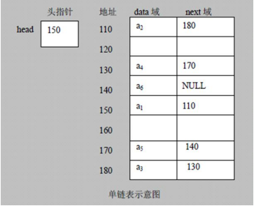
>
> 4) 链表分带头节点的链表和没有头节点的链表，根据实际的需求来确定
>
> 5) 单链表(带头结点) 逻辑结构示意图如下
>
> ​	
>
> 6) 代码描述节点:
>
> 1. ```java
>    public ListNode{
>        public int age;				// 本结点的信息	
>        public String name;
>        public ListNode next; 		// 下一个结点的地址
>    }
>    ```

### 2、单链表的应用实例

>使用带 head 头的单向链表实现 –水浒英雄排行榜管理完成对英雄人物的增删改查操作

#### Ⅰ-添加方法一:在添加英雄时，直接添加到链表的尾部

> 1. 思路分析示意图:
>
>    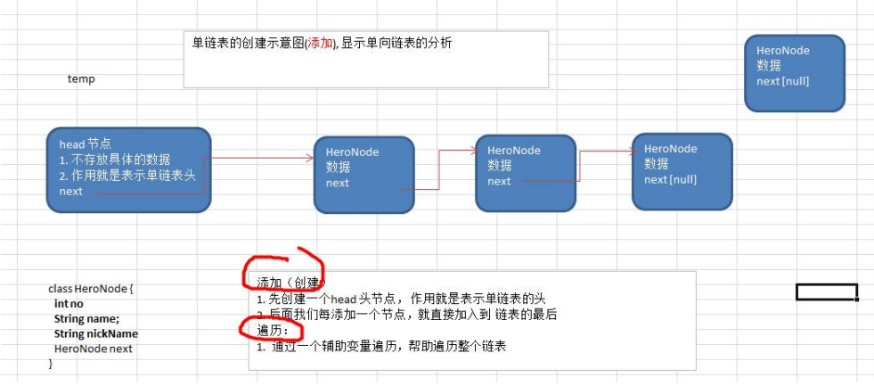
>
> 2. 演示最基础的链表插入:`插入到链表的最后面`,不考虑顺序
>
>    1. 首先我们需要创建一个头结点，该结点的作用就是表示单链表的头，如果没有头结点，我们是无法知道链表的首个结点是谁、在哪；
>    2. 单链表是单向的，所以我们需要从头结点开始遍历整个链表直到末尾，然后增加结点到链表的末尾；
>    3. 需要注意的是，头结点是万万不能乱动的，所以我们最好将头结点复制到一个临时结点变量中，对临时变量进行遍历。
>       
>
> 3. 代码示例:
>
>    ```java
>    package com.linkedlist.firstadd;
>    /**
>     * 演示最基础的链表插入,插入到链表的最后面,不考虑顺序
>     */
>    public class FirstAdd {
>        public static void main(String[] args) {
>            //先创建节点对象,一个节点就是一个节点英雄
>            HeroNode hero1 = new HeroNode(1, "宋江", "及时雨");
>            HeroNode hero2 = new HeroNode(2, "卢俊义", "玉麒麟");
>            HeroNode hero3 = new HeroNode(3, "吴用", "智多星");
>            HeroNode hero4 = new HeroNode(4, "林冲", "豹子头");
>            //创建链表对象
>            SingleLinkedList singleLinkedList = new SingleLinkedList();
>            //不按顺序添加
>            singleLinkedList.add(hero1);
>            singleLinkedList.add(hero4);
>            singleLinkedList.add(hero2);
>            singleLinkedList.add(hero3);
>            //调用打印
>            singleLinkedList.list();
>        }
>    }
>    
>    //一、定义一个HeroNode,每个HeroNode对象就是一个节点
>    class HeroNode {
>        public int no;
>        public String name;
>        public String nickname;
>        public HeroNode next;//指向下一个节点
>        //构造器
>        public HeroNode(int no, String name, String nickname) {
>            this.no = no;
>            this.name = name;
>            this.nickname = nickname;
>        }
>        //为了显示方法,我们重新toString;里不打印next,是因为如果这样打印的话,会将整个链表全部打印出来
>        @Override
>        public String toString() {
>            return "HeroNode[no=" + no + ",name=" + name + ",nickname=" + nickname + "]";
>        }
>    
>    }
>    //二、定义SingleLinkedList管理我们的英雄
>    class SingleLinkedList {
>        //1. 先初始化一个头节点,头节点不要动,不存放具体的数据
>        private HeroNode head = new HeroNode(0, "", "");
>        //2. 返回头节点,get方法
>        public HeroNode getHead() {
>            return head;
>        }
>    
>        /**
>         * 3. 添加节点到单链表后
>         * 思路:不考虑编号顺序,直接插入到链表最后
>         * 1)找到当前链表的最后节点
>         * 2)将最后这个节点的next指向新的节点
>         */
>        public void add(HeroNode heroNode) {
>            //因为head节点是不能动的,动了的话链表就找不到入口或者找错路口,所以我们需要一个辅助遍历
>            HeroNode temp = head;
>            //遍历链表,找到最后
>            while (true) {
>                //找到链表的最后:当next值为空,就是最后一位
>                if (temp.next == null) break;
>                //如果没有找到最后,就将temp向后移动,不然就原地踏步死循环了
>                temp = temp.next;
>            }
>            //当退出while循环的时候,temp就指向了链表的最后
>            //将最后这个节点的next指向新的节点
>            temp.next = heroNode;
>        }
>    
>        //4. 显示链表[遍历]
>        public void list() {
>            //判断链表是否为空
>            if (head.next == null) {
>                System.out.println("链表为空");
>                return;
>            }
>            //因为头节点不能动且头节点是没有数据的,所以直接`head.next;`
>            HeroNode temp = head.next;
>            while (true) {
>                if (temp == null) break;
>                //输出节点信息
>                System.out.println(temp);
>                //将temp后移,一定小心
>                temp = temp.next;
>            }
>        }
>    }
>    
>    ```

#### Ⅱ-添加方法二:根据排名将英雄插入到指定位置

>1. 如果有这个排名(即no重复)，则添加失败，并给出提示
>
>2. 思路分析示意图:
>
>  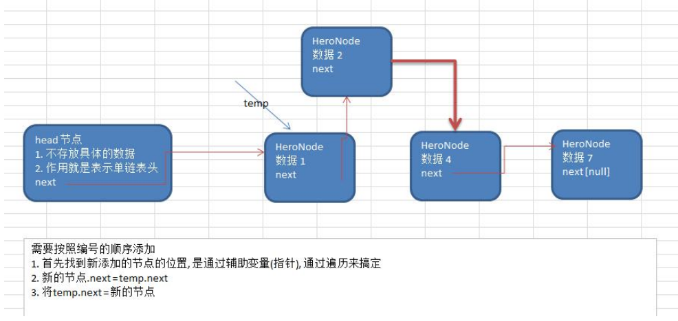
>
>3. 代码中实例场景示例图:
>
>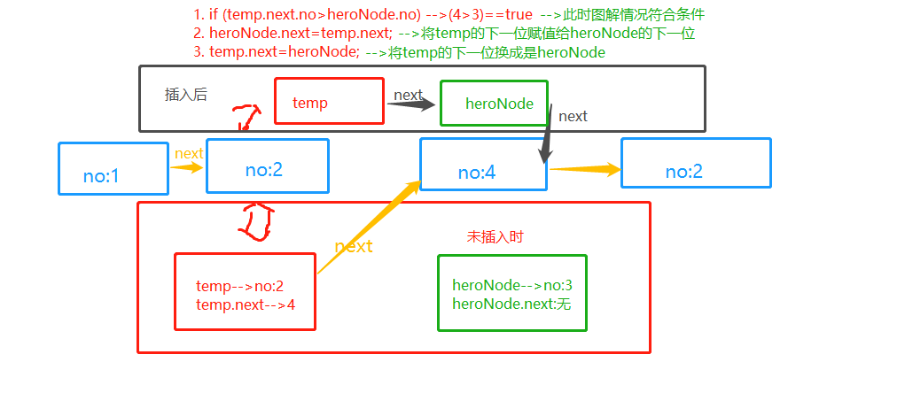
>
>4. 思路分析:
>   1. 首先还是要创建一个头结点，然后拷贝一个头结点作为辅助变量，使用辅助变量来遍历整个链表；
>   2. 如果出现某个结点（假设是 A 结点）的下一个结点（假设是 B 结点）的编号大于待插入结点的情况，那么就首先将 B 结点记录在待插入的结点中，然后再将这个待插入结点插入到 A 结点之后；
>   3. 如果遍历到了链表末尾还没找到编号更大的，就直接插入到末尾即可。
>
>5. 代码实现:(只是将第一方法代码示例中的`add()`替换未`addByOrder`)
>
>  ```java
>      public void addByOrder(HeroNode heroNode) {
>      /*因为head节点是不能动的,动了的话链表就找不到入口或者找错路口,所以我们需要一个辅助遍历
>         因为单链表,所以我们找的temp 必须为于添加位置的前一个节点,否则插入不了*/
>          HeroNode temp = head;
>          boolean flag = false; //flag标识添加的编号是否存在,默认为false
>          while (true) {
>              if (temp.next == null) break;//说明temp已经在链表的最后,就在链表插入(此时temp已经在链表尾部了)
>              if (temp.next.no > heroNode.no) break;//说明位置已经找到,就在temp的后面插入
>              else if (temp.next.no == heroNode.no) {//说明希望添加的heroNode编号已经存在
>                  flag = true;
>                  break;
>              }
>              temp = temp.next;//temp后移,直到找到符合上面条件为止
>          }
>          if (flag) System.out.printf("准备插入的英雄的编号%d已经存在了,不能加入\n", heroNode.no);
>          else {
>              //将heroNode插入到链表的temp后面
>              heroNode.next = temp.next;
>              temp.next = heroNode;
>          }
>      }
>
>  -------------- main()中调用  ------------------------
>   singleLinkedList.addByOrder(hero2);
>   singleLinkedList.addByOrder(hero4);
>   singleLinkedList.addByOrder(hero4);
>  ```
>

#### Ⅲ-修改节点

>1. 思路(1) 先找到该节点，通过遍历，(2) temp.name = newHeroNode.name ; temp.nickname= newHeroNode.nickname
>   1. 首先还是要创建一个头结点，然后拷贝一个头结点作为辅助变量，使用辅助变量来遍历整个链表；
>   2. 遍历过程中，比对每个结点的编号与要更新的结点的编号是否一致，如果一致则说明找到了要更新的结点。接着将找到的结点中的数据替换成要更新的数据即可；
>   3. 如果遍历结束还没找到对应编号的结点，说明链表中不存在这个结点；
>      
>2. 代码实现
>
>  ```java
>    //5. 修改节点信息,根据no编号来修改,即no编号不能改
>      public void update(HeroNode newHeroNode) {
>          if (head.next == null) {
>              System.out.println("链表为空");
>              return;
>          }
>          ;
>          //定义一个辅助变量
>          HeroNode temp = head;
>          boolean flag = false;
>          //找到需要修改的节点,根据no编号
>          while (true) {
>              if (temp == null) break; //表示当前到链表尾端
>              if (temp.no == newHeroNode.no) {//表示找到该节点了
>                  flag = true;
>                  break;
>              }
>              temp = temp.next;
>          }
>          if (flag) {//根据flag可以判断是否找到要修改的节点
>              temp.name = newHeroNode.name;
>              temp.nickname = newHeroNode.nickname;
>          } else System.out.printf("没有找到编号%d的阶段,不能进行修改\n", newHeroNode.no);
>      }
>  ----------------- main()调用测试 ----------------------------------------
>    //测试修改节点的代码
>          HeroNode newHeroNode = new HeroNode(2, "小卢", "玉麒麟~~");
>          singleLinkedList.update(newHeroNode);
>          System.out.println("测试修改后的");
>          singleLinkedList.list();    
>  ```

#### Ⅳ-删除节点

>1. 思路分析图
>
>  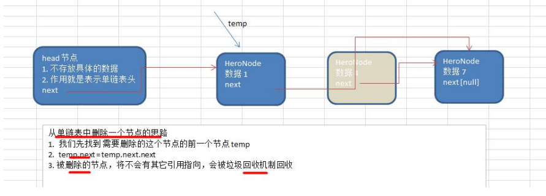
>
>2. 其实就是方法二中`实例场景示例图`的逆推
>   1. 首先还是要创建一个头结点，然后拷贝一个头结点作为辅助变量，使用辅助变量来遍历整个链表；
>   2. 如果 遍历到某个结点的编号与要查找的给定的编号相同，那么就找到了结点；
>   3. 如果遍历结束还没找到，说明该编号不在链表的结点中。
>3. 代码示例
>
>  ```java
>     //6. 删除节点1.head不能动,所以需要一个temp辅助节点找到待删除节点前的一个节点
>      //         2.我们比较时,时temp.next.no和待删除节点的no比较
>      public void del(int no) {
>          if (head.next == null) {
>              System.out.println("链表为空");
>              return;
>          }
>          HeroNode temp = head;
>          boolean flag = false;
>          while (true) {
>              if (temp.next == null) break;//说明到了链表的最后
>              if (temp.next.no == no) {
>                  //表示找到了待删除节点的前一个节点temp
>                  flag = true;
>                  break;
>              }
>              temp=temp.next;//temp后移,遍历
>          }
>          if (flag) temp.next=temp.next.next; //如果找到,进行删除
>          else System.out.printf("要删除的%d节点不存在\n",no);
>      }
>  ----------------- main()调用 ------------------------------
>     //删除一个节点
>      singleLinkedList.del(1);
>      singleLinkedList.del(4);
>      System.out.println("删除后的链表情况~~");
>      singleLinkedList.list();
>  ```

#### Ⅴ-全部代码

>```java
>package com.linkedlist.secondadd;
>public class SecondAdd {
>    public static void main(String[] args) {
>        //先创建节点对象,一个节点就是一个节点英雄
>        HeroNode hero1 = new HeroNode(1, "宋江", "及时雨");
>        HeroNode hero2 = new HeroNode(2, "卢俊义", "玉麒麟");
>        HeroNode hero3 = new HeroNode(3, "吴用", "智多星");
>        HeroNode hero4 = new HeroNode(4, "林冲", "豹子头");
>        //创建链表对象
>        SingleLinkedList singleLinkedList = new SingleLinkedList();
>        //1. 不按顺序添加:方法一
>//        singleLinkedList.add(hero1);
>//        singleLinkedList.add(hero4);
>//        singleLinkedList.add(hero2);
>//        singleLinkedList.add(hero3);
>        //2. 添加方法二
>        singleLinkedList.addByOrder(hero1);
>        singleLinkedList.addByOrder(hero3);
>        singleLinkedList.addByOrder(hero2);
>        singleLinkedList.addByOrder(hero4);
>        singleLinkedList.addByOrder(hero4);
>        //调用打印
>        singleLinkedList.list();
>        //3. 测试修改节点的代码
>        HeroNode newHeroNode = new HeroNode(2, "小卢", "玉麒麟~~");
>        singleLinkedList.update(newHeroNode);
>        System.out.println("测试修改后的");
>        singleLinkedList.list();
>        //4. 删除一个节点
>        singleLinkedList.del(1);
>        singleLinkedList.del(4);
>        System.out.println("删除后的链表情况~~");
>        singleLinkedList.list();
>    }
>    
>    /**-------下面 `面试题部分`方法可以放在这个地方进行运行 编写的是静态方法----------------*/
>     public static int getLength(HeroNode head) {...}
>     public static HeroNode findLastIndexNode(HeroNode head, int K) {}
>     public static void reverseLinkedHead(HeroNode head) {}
>     public static void reversePrint(HeroNode head) {}
>    /**-------下面 `面试题部分`方法可以放在这个地方进行运行----------------*/
>}
>
>//一、定义一个HeroNode,每个HeroNode对象就是一个节点
>class HeroNode {
>    public int no;
>    public String name;
>    public String nickname;
>    public HeroNode next;//指向下一个节点
>
>    //构造器
>    public HeroNode(int no, String name, String nickname) {
>        this.no = no;
>        this.name = name;
>        this.nickname = nickname;
>    }
>
>    //为了显示方法,我们重新toString
>    @Override
>    public String toString() {
>        return "HeroNode[no=" + no + ",name=" + name + ",nickname=" + nickname + "]";
>    }
>
>}
>
>//二、定义SingleLinkedList管理我们的英雄
>class SingleLinkedList {
>    //1. 先初始化一个头节点,头节点不要动,不存放具体的数据
>    private HeroNode head = new HeroNode(0, "", "");
>
>    //2. 返回头节点,get方法  这个方法是配合下面面试题时使用,使外面也能获得私有变量
>    public HeroNode getHead() {
>        return head;
>    }
>
>    /**
>     * 3. 添加节点到单链表后-----------------弃用的,用来对比`addByOrder()`
>     * 思路:不考虑编号顺序,直接插入到链表最后
>     * 1)找到当前链表的最后节点
>     * 2)将最后这个节点的next指向新的节点
>     */
>    public void add(HeroNode heroNode) {
>        //因为head节点是不能动的,动了的话链表就找不到入口或者找错路口,所以我们需要一个辅助遍历
>        HeroNode temp = head;
>        //遍历链表,找到最后
>        while (true) {
>            //找到链表的最后:当next值为空,就是最后一位
>            if (temp.next == null) break;
>            //如果没有找到最后,就将temp向后移动,不然就原地踏步死循环了
>            temp = temp.next;
>        }
>        //当退出while循环的时候,temp就指向了链表的最后
>        //将最后这个节点的next指向新的节点
>        temp.next = heroNode;
>    }
>
>    //4. 添加节点到单链表后,按no排序
>    public void addByOrder(HeroNode heroNode) {
>    /*因为head节点是不能动的,动了的话链表就找不到入口或者找错路口,所以我们需要一个辅助遍历
>       因为单链表,所以我们找的temp 必须为于添加位置的前一个节点,否则插入不了*/
>        HeroNode temp = head;
>        boolean flag = false; //flag标识添加的编号是否存在,默认为false
>        while (true) {
>            if (temp.next == null) break;//说明temp已经在链表的最后,就在链表插入(此时temp已经在链表尾部了)
>            if (temp.next.no > heroNode.no) break;//说明位置已经找到,就在temp的后面插入
>            else if (temp.next.no == heroNode.no) {//说明希望添加的heroNode编号已经存在
>                flag = true;
>                break;
>            }
>            temp = temp.next;//temp后移,直到找到符合上面条件为止
>        }
>        if (flag) System.out.printf("准备插入的英雄的编号%d已经存在了,不能加入\n", heroNode.no);
>        else {
>            //将heroNode插入到链表的temp后面
>            heroNode.next = temp.next;
>            temp.next = heroNode;
>        }
>    }
>
>    //5. 修改节点信息,根据no编号来修改,即no编号不能改
>    public void update(HeroNode newHeroNode) {
>        if (head.next == null) {
>            System.out.println("链表为空");
>            return;
>        }
>        ;
>        //定义一个辅助变量
>        HeroNode temp = head;
>        boolean flag = false;
>        //找到需要修改的节点,根据no编号
>        while (true) {
>            if (temp == null) break; //表示当前到链表尾端
>            if (temp.no == newHeroNode.no) {//表示找到该节点了
>                flag = true;
>                break;
>            }
>            temp = temp.next;
>        }
>        if (flag) {//根据flag可以判断是否找到要修改的节点
>            temp.name = newHeroNode.name;
>            temp.nickname = newHeroNode.nickname;
>        } else System.out.printf("没有找到编号%d的阶段,不能进行修改\n", newHeroNode.no);
>    }
>
>    //6. 删除节点1.head不能动,所以需要一个temp辅助节点找到待删除节点前的一个节点
>    //         2.我们比较时,时temp.next.no和待删除节点的no比较
>    public void del(int no) {
>//        if (head.next == null) {
>//            System.out.println("链表为空");
>//            return;
>//        }此处可以不加,与下面代码功能重复
>        HeroNode temp = head;
>        boolean flag = false;
>        while (true) {
>            if (temp.next == null) break;//说明到了链表的最后
>            if (temp.next.no == no) {
>                //表示找到了待删除节点的前一个节点temp
>                flag = true;
>                break;
>            }
>            temp = temp.next;//temp后移,遍历
>        }
>        if (flag) temp.next = temp.next.next; //如果找到,进行删除
>        else System.out.printf("要删除的%d节点不存在\n", no);
>    }
>
>    //7. 显示链表[遍历]
>    public void list() {
>        //判断链表是否为空
>        if (head.next == null) {
>            System.out.println("链表为空");
>            return;
>        }
>        //因为头节点不能动且头节点是没有数据的,所以直接`head.next;`
>        HeroNode temp = head.next;
>        while (true) {
>            if (temp == null) break;
>            //输出节点信息
>            System.out.println(temp);
>            //将temp后移,一定小心
>            temp = temp.next;
>        }
>    }
>}
>```

### 3、单链表 面试题

>单链表的常见面试题有如下:
>
>1)求单链表中有效节点的个数
>
>2)查找单链表中的倒数第k个结点 【新浪面试题】
>
>3)单链表的反转【腾讯面试题，有点难度】
>
>4)从尾到头打印单链表 【百度，要求方式1：反向遍历 。 方式2：Stack栈】
>
>5)合并两个有序的单链表，合并之后的链表依然有序【课后练习.】
>
>以下例子将在`2`部分的全部代码中实现,在上面代码中`已经预留位置`

#### Ⅰ-求单链表中有效节点的个数

>就是直接遍历 没得分析,直接上代码:
>
>```java
>  /**
>     * 1. 求单链表中有效节点的个数
>     * 方法：获取到单链表的节点的个数(如果是带头结点的链表，需求不统计头节点)
>     * @param head 链表的头节点
>     * @return 返回的就是有效节点的个数
>     */
>    public static int getLength(HeroNode head) {
>        if (head.next == null) return 0; //空链表
>        int length = 0; //声明一个累加器
>        //定义一个辅助的变量,这里我们没有统计头节点(-->head.next)
>        HeroNode cur = head.next;
>        while (cur != null) {//当当前节点 为空时退出累计遍历
>            length++;
>            cur = cur.next;
>        }
>        return length;
>    };
>-----------------main()调用  ---------------------------
>System.out.println("有效的节点个数=" + getLength(singleLinkedList.getHead()));//2
>```

#### Ⅱ-查找单链表中的倒数第k个结点 【新浪面试题】

>1. 思路分析:
>
>   1)编写一个方法，接收head节点，同时接收一个K
>
>   2)K表示是倒数第K个节点
>
>   3)先把链表从头到尾遍历，得到链表的总的长度 getLength
>
>   4)得到size 后，我们从链表的第一个开始遍历 (size-K)个，就可以得到
>
>   5)如果找到了，则返回该节点，否则返回nulll
>
>2. 代码示例:
>
>   ```java
>       /**2.查找单链表中的倒数第k个结点
>        * @param head 要进行查找的单向链表
>        * @param K 传入倒数第几位 数字
>        * @return 该位置的节点
>        */
>       public static HeroNode findLastIndexNode(HeroNode head, int K) {
>           if (head.next == null) return null; //空链表,无法找到
>           //1. 获得链表的长度(总个数)
>           int size = getLength(head);
>           //2. 做一个K的校验,明显K不能为负数以及大于总长度
>           if (K <= 0 || K > size) return null;
>           //3. 定义给辅助变量
>           HeroNode cur = head.next;
>           //4. 遍历 倒数第K个节点 就是`size-K`的位置
>           for (int i = 0; i < (size - K); i++) {
>               cur = cur.next; //cur后移到符合条件的位置
>           }
>           return cur;
>       }
>   -----------------main()调用  ---------------------------
>    //测试一下看看是否得到了倒数第K个节点
>    HeroNode res = findLastIndexNode(singleLinkedList.getHead(), 2);
>    System.out.println("res=" + res);
>   ```

#### Ⅲ-单链表的反转【腾讯面试题，有点难度】

>1. 解决这个问题的核心就是`头插法`。
>
>    1. 首先创建一个临时头结点用于记录反转过程中的链表；
>   2. 遍历单链表，每遍历到一个有效结点，就让该有效结点指向临时头结点指向的结点；
>    3. 临时头结点再指向该有效结点，
>   4. 原单链表遍历结束之后，再让原头结点指向临时头结点指向的结点。
>    5. 图片示例(该动图取自[RonzL](https://blog.csdn.net/zhuxian1277)的博客):
>
> 2. 具体举例图解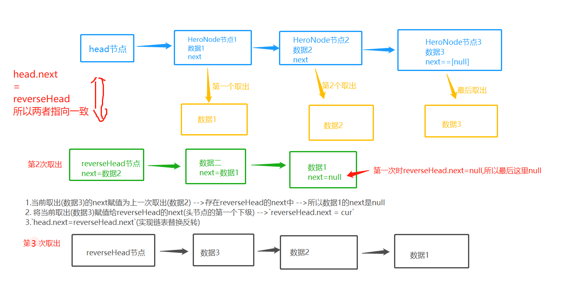
>
> 3. 代码实现:
>
>      1. 实现方法一:
>
>   ```java
>       /**
>          * 3.单链表的反转【腾讯面试题，有点难度】
>          * @param head 传入需要进行反转的单链表
>          */
>         public static void reverseLinkedHead(HeroNode head) {
>              //1. 当链表为空或者只有一个节点时候,直接返回,无需反转
>             if (head.next == null || head.next.next == null) return;
>              //2. 定义一个辅助的指针遍历,帮助我们遍历原来的链表
>              HeroNode cur = head.next;
>              //3. 定义一个next,辅助变量,来指向当前节点[cur]的下一个节点,用来进行位置互换
>              HeroNode next = null;
>              //4. 初始化一个新的头节点,用来暂时存放反转链表
>              HeroNode reverseHead = new HeroNode(0, "", "");
>              //5. 遍历原来的链表,每遍历一个节点,就将其取出,并放在新的链表reverseHead的最前端
>              while (cur != null) {//当当前节点 为空时退出累计遍历
>                  next = cur.next; //先暂时保存当前节点的下一个节点,后面换完位置后需要复原cur的下一位,否则无法遍历
>                  cur.next = reverseHead.next;//将cur的下一个节点指向新的链表的最前端
>                  reverseHead.next = cur;//将cur链接到新的链表上
>                  cur = next;//让cur后移
>              }
>              //遍历结束,将head.next指向reverseHead.next 接管链表,实现单链表的反转
>              head.next = reverseHead.next;
>          }
>      -----------------main()调用  ---------------------------
>         //7. 测试一下单链表的反转功能
>      	System.out.println("原来链表的情况~~");
>      	singleLinkedList.list();
>      	System.out.println("反转单链表~~");
>      	reverseLinkedHead(singleLinkedList.getHead());
>      	singleLinkedList.list();
>   ```
> 
>      1. 实现方法二(只是写法改变,但代码显得更容易理解):
> 
>    ```java
>    /**
>     * 单链表的反转
>     */
>    public SingleLinkedList reverse() {
>       SingleLinkedList linkedList = new SingleLinkedList();
>        // 遍历待反转的链表，将结点依次添加到新链表
>       Node tmp = head;
>        while (tmp.next != null) {
>            linkedList.addFirst(tmp.next.item);
>            tmp = tmp.next;
>        }
>        return linkedList;
>    }
>    public boolean addFirst(Integer item) {
>        Node newNode = new Node(item, null);
>        // tmp 指向头结点
>        Node tmp = head;
>        newNode.next = tmp.next;
>        tmp.next = newNode;
>        return true;
>    }
>    ```
> 

#### Ⅳ-从尾到头打印单链表

>1. 【百度面试题，要求方式1：反向遍历(上一个问题解决) 。 方式2：Stack栈   方法3: 递归】
>
>2. `栈方法`
>
>   1. 思路分析图解: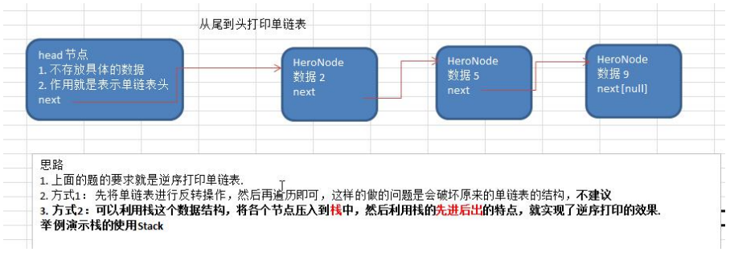
>
>   2. 代码示例:
>
>      ```java
>        /**
>         * 4. 可以利用栈这个数据结构，将各个节点压入到栈中，然后利用栈的先进后出的特点，就实现了逆序打印的效果
>         * @param head 要传入的链表头
>         */
>        public static void reversePrint(HeroNode head) {
>            if (head.next == null) return; //空链表 不能打印
>            //创建一个栈,将各个节点压入栈
>            Stack<HeroNode> stack = new Stack<HeroNode>();
>            HeroNode cur = head.next;
>            //将链表所有节点压入栈
>            while (cur != null) {
>                stack.push(cur);
>                cur = cur.next;//cur后移,这样就可以压入下一个节点
>            }
>            //将栈中节点取出打印.利用其先进后出特点,实现逆序da'yin
>            while (stack.size() > 0) {
>                System.out.println(stack.pop());
>            }
>        }
>        -----------------main()调用  ---------------------------
>       //8.测试逆序打印单链表, 没有改变链表的结构~~
>       System.out.println("测试逆序打印单链表, 没有改变链表的结构~~");
>       reversePrint(singleLinkedList.getHead());
>      ```
>
>3. `递归方式`
>
>   1. 图例(该动图取自[RonzL](https://blog.csdn.net/zhuxian1277)的博客):
>
>   2. 代码实现:
>
>      ```java
>      /**
>       * 使用递归打印结点
>       * @Param [node] 链表的第一个结点，即 head.next
>       */
>      public static void printReverse_3(HeroNode node){
>          // 这里一定要先递归调用再打印
>          if (node.next != null){
>              printReverse_3(node.next);
>          }
>          System.out.println(node);
>      }
>      
>      ```


#### Ⅴ-合并两个有序的单链表，合并之后的链表依然有序

>练习题目:合并两个有序的单链表，合并之后的链表依然有序
>
>1. 思路解析:
>    1. 如果传入的节点1为空了(即已经递归到链表尾或者是空链表),返回节点2,反之亦然(同时return会结束该递归函数(但是递归函数结束后接着return,所以整个递归函数将会停止)并返回)。
>    2. 判断no是否重复,如果重复就重新递归传入链表下一级`head2.next`,不重复就传入`head2`
>    3. 递归其实都是在进行对于`head.next`的赋值,直到传入节点为空(符合前面两个判断条件),开始向外`return`,此时逐层给`head.next`赋值,最后会返回到最外层函数返回值处,就是合并后的链表
>
>2. 代码实现:
>
>   ```java
>       /**
>        * 合并两个单链表静态函数
>        * @param head1 传入第一个链表头节点
>        * @param head2 传入第二个链表头节点
>        * @return 返回合并后的链表
>        */
>       public static HeroNode mergeLinkedList(HeroNode head1, HeroNode head2) {
>           if (head1 == null) return head2; //此处是递归,不能按head.next==null进行判断,否则会造成数据丢失
>           if (head2 == null)  return head1;     
>           if (head1.no <= head2.no) {
>               //如果不加这个判断,如果两者的no相同,将会导致出现重复的数据(如两个),判断后进入递归
>               //打印代码 System.out.println("head:"+head+",head.next:"+head.next);
>               //打印结果 headHeroNode:[no=0,name=,nickname=],head.nextHeroNode:[no=0,name=,nickname=]
>               head1.next = (head2.no != head1.no) ? mergeLinkedList(head1.next, head2)
>                 			  : mergeLinkedList(head1.next, head2.next);
>   //            head1.next= mergeLinkedList(head1.next, head2);  犯下的错误,导致数据重复
>               return head1;
>           } else {
>               head2.next = mergeLinkedList(head1, head2.next);
>               return head2;
>           }
>       }
>   
>       /**
>        * 遍历打印静态链表
>        * @param head 传入打印的链表头节点
>        */
>       public static void staticList(HeroNode head) {
>           //判断链表是否为空
>           if (head.next == null) {
>               System.out.println("链表为空");
>               return;
>           }
>           //因为头节点不能动且头节点是没有数据的,所以直接`head.next;`
>           HeroNode temp = head.next;
>           System.out.println("head" + head + ",head.next" + head.next);
>           while (true) {
>               if (temp == null) break;
>               //输出节点信息
>               System.out.println(temp);
>               //将temp后移,一定小心
>               temp = temp.next;
>           }
>       }
>   -------------------  main()调用 --------------------------------
>     HeroNode hero1 = new HeroNode(1, "宋江", "及时雨");
>     HeroNode hero2 = new HeroNode(2, "卢俊义", "玉麒麟");
>     HeroNode hero3 = new HeroNode(5, "洪吉林", "帅哥");
>     HeroNode hero4 = new HeroNode(4, "林冲", "豹子头");
>     HeroNode hero5 = new HeroNode(5, "洪吉林", "帅哥");
>     HeroNode hero6 = new HeroNode(6, "努力学习的汪", "好学生");
>     HeroNode hero7 = new HeroNode(7, "离婚且带娃", "不是我");
>     HeroNode hero8 = new HeroNode(8, "你听我狡辩", "口头禅");
>         //创建链表对象
>     SingleLinkedList singleLinkedList = new SingleLinkedList();
>     SingleLinkedList singleLinkedList1 = new SingleLinkedList();
>     //2. 添加方法
>     singleLinkedList.addByOrder(hero1);
>     singleLinkedList.addByOrder(hero3);
>     singleLinkedList.addByOrder(hero4);
>     singleLinkedList.addByOrder(hero7);
>     singleLinkedList.list();
>     System.out.println("两个链表分界线");
>     //-----------课后作业:第二个链表-----------------------
>     singleLinkedList1.addByOrder(hero2);
>     singleLinkedList1.addByOrder(hero5);
>     singleLinkedList1.addByOrder(hero6);
>     singleLinkedList1.addByOrder(hero8);
>     singleLinkedList1.list();
>     System.out.println("合并两个链表");
>     staticList(mergeLinkedList(singleLinkedList.getHead(), singleLinkedList1.getHead()));
>   ```

### 4、双向链表与其实例

>1. 双向链表实现实际上对比单向链表多了一个`pre`属性,大部分功能相似
>
>2. 使用双向链表实现水浒传英雄增删改查思路图:
>
>   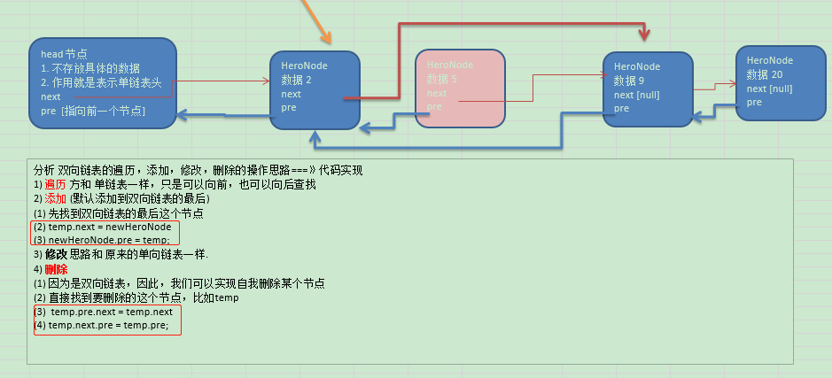
>
>3. 删除部分代码实现:
>
>   ```java
>     /**
>        * 5. 从双向链表中删除一个节点
>        * 说明:
>        * 1.对于双向链表,我们可以直接找到要删除的这个节点
>        * 2.找到后,自我删除即可
>        */
>       public void del(int no) {
>           if (head.next == null) {
>               System.out.println("链表为空,无法删除");
>               return;
>           }
>           DoubleHeroNode temp = head;//辅助遍历(指针)
>           boolean flag = false;//标识是否找到待删除节点
>           while (true) {
>               if (temp == null) break;//已经到了链表最后
>               if (temp.no == no) { //找到待删除的节点
>                   flag = true;
>                   break;
>               }
>               temp = temp.next;//temp后移,遍历
>           }
>           if (flag) {
>               temp.pre.next = temp.next;//将下一个节点地址赋值给上一个节点的`next`
>               //如果不加判断,可能当前节点是最后一个,导致`temp.next.pre`会出现空指针异常
>               if (temp.next != null) temp.next.pre = temp.pre;//将下一个节点的上一个(pre)赋值为当前节点的上一个(pre)
>           } else System.out.printf("要删除的%d节点不存在\n", no);
>   
>       }
>   ```
>
>4. 全部代码(`包括课堂练习题`):
>
>   ```java
>   package com.linkedlist.doublelinked;
>   public class DoubleLinkedListDemo {
>       public static void main(String[] args) {
>           DoubleHeroNode hero1 = new DoubleHeroNode(1, "宋江", "及时雨");
>           DoubleHeroNode hero2 = new DoubleHeroNode(2, "卢俊义", "玉麒麟");
>           DoubleHeroNode hero3 = new DoubleHeroNode(3, "吴用", "智多星");
>           DoubleHeroNode hero4 = new DoubleHeroNode(4, "林冲", "豹子头");
>           DoubleHeroNode hero5 = new DoubleHeroNode(5, "666", "666");
>           //创建链表对象
>           DoubleLinkedList doubleLinkedList = new DoubleLinkedList();
>           //1.直接添加到链表尾部
>           doubleLinkedList.add(hero1);
>           doubleLinkedList.add(hero2);
>           doubleLinkedList.add(hero3);
>           doubleLinkedList.add(hero4);
>           doubleLinkedList.list();
>           //修改测试
>           System.out.println("测试修改林冲");
>           DoubleHeroNode newHeroNode = new DoubleHeroNode(4, "洪吉林", "零充");
>           doubleLinkedList.update(newHeroNode);
>           doubleLinkedList.list();
>           //删除测试
>           System.out.println("测试删除吴用");
>           doubleLinkedList.del(3);
>           doubleLinkedList.list();
>           //测试插入添加
>           //1.直接添加到链表尾部
>           System.out.println("测试插入添加 ");
>           doubleLinkedList.addByOrder(hero5);
>           doubleLinkedList.addByOrder(hero3);
>           doubleLinkedList.list();
>       }
>   }
>   
>   class DoubleLinkedList {
>       //1. 先初始化一个头节点,头节点不要动,不存放具体的数据
>       private DoubleHeroNode head = new DoubleHeroNode(0, "", "");
>   
>       //2. 返回头节点,get方法
>       public DoubleHeroNode getHead() {
>           return head;
>       }
>   
>       //3. 添加一个节点节点到双向链表的最后
>       public void add(DoubleHeroNode heroNode) {
>           //因为head节点是不能动的,动了的话链表就找不到入口或者找错路口,所以我们需要一个辅助遍历
>           DoubleHeroNode temp = head;
>           //遍历链表,找到最后
>           while (true) {
>               //找到链表的最后:当next值为空,就是最后一位
>               if (temp.next == null) break;
>               //如果没有找到最后,就将temp向后移动,不然就原地踏步死循环了
>               temp = temp.next;
>           }
>           //当退出while循环的时候,temp就指向了链表的最后
>           //形成一个双向链表
>           temp.next = heroNode;
>           heroNode.pre = temp;
>       }
>   
>       //3.1 按照no进行对双向链表的插入,课堂练习题
>       public void addByOrder(DoubleHeroNode heroNode) {
>           DoubleHeroNode temp = head;//需要找到要添加位置的前一个节点
>           boolean flag = false;
>           while (true) {
>               if (temp.next == null) break;//说明已经遍历到链表最后
>               if (temp.next.no > heroNode.no) break;//说明已经找到,就在temp后面插入
>               else if (temp.next.no == heroNode.no) {//说明已经存在重复no
>                   flag = true;
>                   break;
>               }
>               temp = temp.next;
>           }
>           if (flag) System.out.printf("准备插入的英雄的编号%d已经存在了,不能加入\n", heroNode.no);
>           else {
>               heroNode.next = temp.next; //将temp的下next赋值到要插入的节点的next
>               heroNode.pre = temp;  //将temp作为heroNode的pre(上一位)
>               temp.next = heroNode; //在找到的位置后面插入heroNode ,并且这里不用判断非空
>           }
>       }
>   
>       //4. 修改节点信息,
>       //可以看到双向链表的节点内容修改与单向链表一样,只是节点类型改变
>       public void update(DoubleHeroNode newHeroNode) {
>           if (head.next == null) {
>               System.out.println("链表为空");
>               return;
>           }
>           DoubleHeroNode temp = head;
>           boolean flag = false;
>           //找到需要修改的节点,根据no编号
>           while (true) {
>               if (temp == null) break; //表示当前到链表尾端
>               if (temp.no == newHeroNode.no) {//表示找到该节点了
>                   flag = true;
>                   break;
>               }
>               temp = temp.next;
>           }
>           if (flag) {//根据flag可以判断是否找到要修改的节点
>               temp.name = newHeroNode.name;
>               temp.nickname = newHeroNode.nickname;
>           } else System.out.printf("没有找到编号%d的阶段,不能进行修改\n", newHeroNode.no);
>       }
>   
>       /**
>        * 5. 从双向链表中删除一个节点
>        * 说明:
>        * 1.对于双向链表,我们可以直接找到要删除的这个节点
>        * 2.找到后,自我删除即可
>        */
>       public void del(int no) {
>           if (head.next == null) {
>               System.out.println("链表为空,无法删除");
>               return;
>           }
>           DoubleHeroNode temp = head;//辅助遍历(指针)
>           boolean flag = false;//标识是否找到待删除节点
>           while (true) {
>               if (temp == null) break;//已经到了链表最后
>               if (temp.no == no) { //找到待删除的节点
>                   flag = true;
>                   break;
>               }
>               temp = temp.next;//temp后移,遍历
>           }
>           if (flag) {
>               temp.pre.next = temp.next;//将下一个节点地址赋值给上一个节点的`next`
>               //如果不加判断,可能当前节点是最后一个,导致`temp.next.pre`会出现空指针异常
>               if (temp.next != null) temp.next.pre = temp.pre;//将下一个节点的上一个(pre)赋值为当前节点的上一个(pre)
>           } else System.out.printf("要删除的%d节点不存在\n", no);
>   
>       }
>   
>       //7. 显示链表[遍历]
>       public void list() {
>           //判断链表是否为空
>           if (head.next == null) {
>               System.out.println("链表为空");
>               return;
>           }
>           //因为头节点不能动且头节点是没有数据的,所以直接`head.next;`
>           DoubleHeroNode temp = head.next;
>           while (true) {
>               if (temp == null) break;
>               //输出节点信息
>               System.out.println(temp);
>               //将temp后移,一定小心
>               temp = temp.next;
>           }
>       }
>   
>   }
>   
>   
>   //一、定义一个HeroNode,每个HeroNode对象就是一个节点
>   class DoubleHeroNode {
>       public int no;
>       public String name;
>       public String nickname;
>       public DoubleHeroNode next;//指向下一个节点,默认为null
>       public DoubleHeroNode pre;//指向前一个节点,默认为null
>   
>       //构造器
>       public DoubleHeroNode(int no, String name, String nickname) {
>           this.no = no;
>           this.name = name;
>           this.nickname = nickname;
>       }
>   
>       //为了显示方法,我们重新toString
>       @Override
>       public String toString() {
>           return "HeroNode[no=" + no + ",name=" + name + ",nickname=" + nickname + "]";
>       }
>   }
>   ```

### 5、单向与双向链表对比

>1. 管理单向链表相较于双向链表的缺点分析
>
>   1) ① 单链表只有一个指向下一结点的指针，也就是只能next; ② 双链表除了有一个指向下一结点的指针外，还有一个指向前一结点的指针，可以通过prev()快速找到前一结点，顾名思义，单链表只能单向读取
>
>   2) 单向链表不能自我删除，需要靠辅助节点 ，而双向链表则可以自我删除，所以前面我们单链表删除时节点，总是找到 temp,temp 是待删除节点的前一个节点,双向链表则是可以直接将temp指向要删除的节点
>
>2. 双链表具有以下优点:
>
>   1. 删除单链表中的某个结点时，一定要得到待删除结点的前驱，得到该前驱有两种方法，第一种方法是在定位待删除结点的同时一路保存当前结点的前驱。第二种方法是在定位到待删除结点之后，重新从单链表表头开始来定位前驱。尽管通常会采用方法一。但其实这两种方法的效率是一样
>   2. 查找时也一样，我们可以借用二分法的思路，从head（首节点）向后查找操作和last（尾节点）向前查找操作同步进行，这样双链表的效率可以提高一倍
>
>3. `面试官`：从你的描述来看，双链表的在查找、删除的时候可以利用二分法的思想去实现,但是为什么目前市场应用上`单链表的应用要比双链表的应用要广泛`的多呢?
>
>   > 从存储结构来看，每个双链表的节点要比单链表的节点多一个指针，而长度为n就需要 n*length（这个指针的length在32位系统中是4字节，在64位系统中是8个字节） 的空间，这在一些追求时间效率不高应用下并不适应，因为它占用空间大于单链表所占用的空间；这时设计者就会采用以时间换空间的做法，这时一种工程总体上的衡量。
>
>4. 结构对比图
>
>   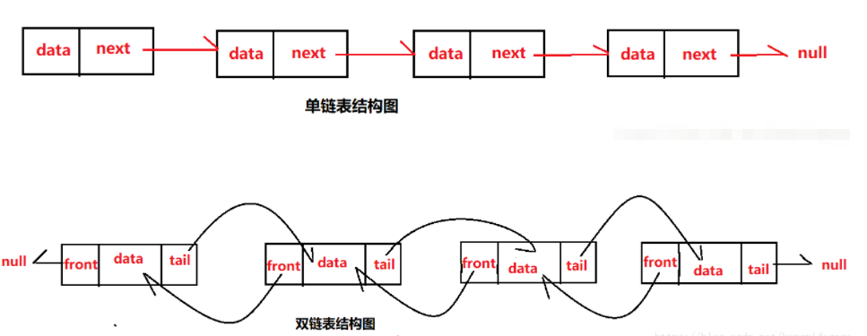

### 6、单链表之`约瑟夫问题`

#### Ⅰ-问题描述:

>1. `约瑟夫`（ *Josephu* ） 问题是一个非常著名的有趣的题目。问题具体描述如下：
>
>   设编号分别为1、2、3… n 的 n 个人围坐一圈，约定编号为 k（1≤k≤n）的人从 1 开始报数，数到 m 的那个人出列。出列的人的下一位又从 1 开始报数，数到 m 的那个人继续出列。以此类推，直到所有人都出列为止，由此产生一个出队编号的序列，这个序列也就是约瑟夫问题的解。
>
>2. 下面将用一个动图来描述一下这个问题
>
>   假设有 4 个人围坐一圈，约定编号为 1 的人开始报数，数到 3 的那个出列。最后产生的出队编号的序列将会是：3、2、4、1。
>
>   

#### Ⅱ-老师给的思路实现

>1. 用一个不带头结点的循环链表来处理 Josephu 问题：先构成一个有 n 个结点的单循环链表，然后由 k 结点起从 1 开 始计数，计到 m 时，对应结点从链表中删除，然后再从被删除结点的下一个结点又从 1 开始计数，直到最后一个结点从链表中删除算法结束。
>
>2. 约瑟夫问题-创建环形链表的思路图解
>
>   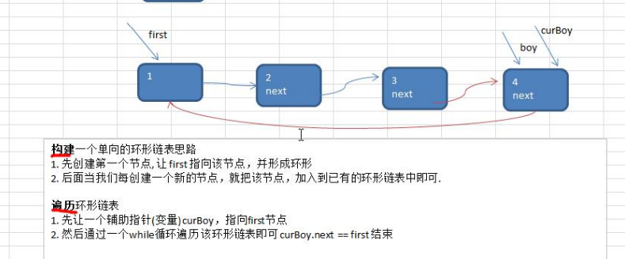
>
>3. 约瑟夫问题-小孩出圈的思路分析图
>
>   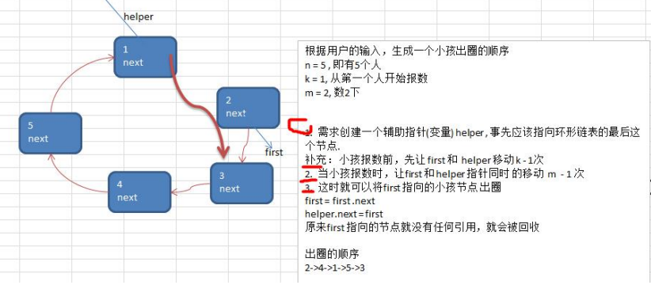
>
>4. 代码实现:
>
>   ```java
>   package com.linkedlist.josepfu;
>   
>   public class Josepfu {
>       public static void main(String[] args) {
>          int NUM=5;// 加入5个小孩节点
>           // 测试一把看看构建环形链表，和遍历是否ok
>           CircleSingleLinkedList circleSingleLinkedList = new CircleSingleLinkedList();
>           circleSingleLinkedList.addBoy(NUM);
>           circleSingleLinkedList.showBoy();
>           //测试一把小孩出圈是否正确
>           circleSingleLinkedList.countBoy(1, 2, NUM); // 2->4->1->5->3
>       }
>   }
>   
>   //二、创建一个环形的单向链表
>   class CircleSingleLinkedList {
>       //1. 创建一个first节点,当前没有编号
>       private Boy first = null;
>   
>       //2. 添加小孩节点,构建成一个环形的链表
>       public void addBoy(int nums) {
>           //nums做一个数据校验
>           if (nums < 1) {
>               System.out.println("nums的值不正确");
>               return;
>           }
>           Boy curBoy = null; //辅助指针,帮助构建环形链表
>           //使用for来创建我们的环形链表
>           for (int i = 1; i <= nums; i++) {//i从1开始,才能得到编号与数字顺序一样的no;
>               //根据编号创建小孩节点
>               Boy boy = new Boy(i);
>               if (i == 1) { //如果fori从0开始遍历,这里也要改为i==0,否则下面 `curBoy.setNext(boy);`将空指针异常
>                   first = boy;
>                   first.setNext(first); //构成环,即只有一个时自己指向自己
>                   curBoy = first;
>               } else {
>                   boy.setNext(first); //将当前次循环的next指向第一个节点形成环
>                   curBoy.setNext(boy);//此处curBoy标记的是上一次循环的boy 如`i==2`-->curBoy==first、`i==3`-->curBoy==boy(第二个)
>                   curBoy = boy;  //这一步是移动当前curBoy位置到boy,保存当前boy 用作在下轮循环中指定当前boy的next
>               }
>           }
>       }
>   
>       //3. 遍历当前环形链表
>       public void showBoy() {
>           if (first == null) {
>               System.out.println("没有任何小孩~~~~");
>               return;
>           }
>           Boy curBoy = first;
>           while (true) {
>               System.out.printf("小孩编号%d\n", curBoy.getNo());
>               if (curBoy.getNext() == first) break;
>               curBoy = curBoy.getNext();//curBoy后移
>           }
>       }
>   
>       /**
>        * //4. 根据用户输入,计算小孩出圈的顺序
>        *
>        * @param startNo  开始的位置
>        * @param countNum 每次循环的数字
>        * @param nums     单纯用来校验循环次数是否多于总长度
>        */
>       public void countBoy(int startNo, int countNum, int nums) {
>           if (first == null || startNo < 1 || startNo > nums) {
>               System.out.println("参数输入有误,请重新输入");
>               return;
>           }
>           //①创建一个辅助指针,帮助完成小孩出圈
>           Boy helper = first;
>           //②将辅助指针事先指向环形列表的最后这个节点(即next指向first)
>           while (true) {
>               if (helper.getNext() == first) break;//说明helper指向最后的小孩节点
>               helper = helper.getNext();
>           }
>           //③小孩报数前,先让first和helper移动K-1次(如果我是从3开始,我需要事先指向3的位置)
>           //为什么是K-1次-->因为循环i是从0开始的
>           for (int i = 0; i < startNo - 1; i++) {
>               first = first.getNext();
>               helper = helper.getNext();
>           }
>           //④出圈删除:当小孩报数时,让first和helper指针同时移动m-1次,然后出圈
>           while (true) {
>               if (helper == first) break; //说明圈中只有一个节点
>               //让first和helper指针同时移动countNum-1次
>               for (int i = 0; i < countNum - 1; i++) {
>                   first = first.getNext();
>                   helper = helper.getNext();
>               }
>               //出了for循环后,此时first指向的节点就是要出圈的小孩节点
>               System.out.printf("小孩%d出圈\n", first.getNo());
>               //此时将first指向的小孩节点出圈
>               first = first.getNext();
>              //注意:此处用的时setNext-->这步就是删除操作,原来的first指向的节点没有任何引用的时候,就会被回收
>               helper.setNext(first);
>           }
>           System.out.printf("最后留在圈中的小孩编号%d\n", first.getNo());
>       }
>   
>   }
>   
>   
>   //一、创建一个Boy类,表示一个节点
>   class Boy {
>       private int no;//编号
>       private Boy next; //指向下一个节点,默认null
>   
>       public Boy(int no) {
>           this.no = no;
>       }
>   
>       public int getNo() {
>           return no;
>       }
>   
>       public void setNo(int no) {
>           this.no = no;
>       }
>   
>       public Boy getNext() {
>           return next;
>       }
>   
>       public void setNext(Boy next) {
>           this.next = next;
>       }
>   }
>   ```
>
>   

#### Ⅲ-思路改进与代码实现

>将该问题解决思想带入 实现水浒传英雄 (该思路与解决于查阅[RonzL](https://blog.csdn.net/zhuxian1277)的博客后学习记录)
>
>1. 思路解析:
>
>     1. 首先要确定解决问题的核心思想：`使用一个不带头结点的循环(环形)链表来处理该问题`。
>
>     2. 假设每个结点代表一个人，那么一个由 n 个结点组成的循环链表就相当于是 n 个人围成的一个圈。那么约瑟夫问题以环形链表的形式来描述就是如下情景：
>
>        首先使用 n 个结点构成一个单向循环链表，然后由第 k 个结点起从 1 开始计数，当计到 m 时，从链表中删除对应结点；接着从被删除结点的下一个结点开始从 1 计数，当计到 m 时，继续从链表中删除。依次循环往复，直到链表中的所有结点都被删除为止。
>
>     3. 那么对于这个单向循环链表形式下的约瑟夫问题，我们如何解决呢？
>
>        1) 我们可以引入一个辅助指针 helperNode，这个指针总是指向待删除结点的前一个结点。为什么这个辅助指针要指向待删除结点的前一个结点，而不是指向自身呢？
>
>        2) 因为我们的目的是要删除当前计数为 m 的结点，但是受限于单向链表的特性（如果要删除单链表的某个结点，必须要知道该结点的前一个结点），我们无法让结点自己删除自己。鉴于这个特性，我们必须要引入一个辅助指针来记录当前正在计数的结点的前一个结点，这样才能符合删除条件的结点从链表中删除。
>
>2. 引入这个辅助指针之后，具体的操作思路如下:
>
>     1. 每一轮计数开始时，总让辅助指针 helperNode 初始指向本轮第一个计数的结点；
>     2. 从第一个计数的结点开始计数至 m，实际上是向后移动了 m-1 个结点。由于辅助指针总是指向待删除结点的前一个结点，因此让需要让辅助指从第一个计数结点后移 m-2 个结点；
>     3. 辅助指针移动到待删除结点的前一个结点之后，只需要让辅助指针指向待删除的结点的下一个结点即可完成删除操作；
>     4. 依次循环往复，直至只剩最后一个结点；
>     5. 对于环形链表判断是否只有最后一个结点，只需要判断辅助指针指向的结点是否是辅助指针指向的结点的下一个结点即可。
>
>3. 上面的思路可以用下面一个动图来描述:
>
>  
>
>4. 代码实现:
>
>  ```java
>  package com.linkedlist.doublelinked;
>  /**
>   * 课程外思路实现
>   */
>  public class DoubleLinkedListDemo2 {
>      public static void main(String[] args) {
>          // 构造测试数据
>          HeroNode node_1 = new HeroNode(1, "宋江", "及时雨");
>          HeroNode node_2 = new HeroNode(2, "卢俊义", "玉麒麟");
>          HeroNode node_3 = new HeroNode(3, "吴用", "智多星");
>          HeroNode node_4 = new HeroNode(4, "公孙胜", "入云龙");
>          HeroNode node_5 = new HeroNode(5, "洪吉林", "码农");
>          HeroNode node_6 = new HeroNode(6, "努力学习的汪", "学习狗");
>
>          System.out.println("===============向环形链表中插入结点==================");
>          HeroNode first = insertCircleList(null, node_1);
>          first = insertCircleList(first, node_2);
>          first = insertCircleList(first, node_3);
>          first = insertCircleList(first, node_4);
>          first = insertCircleList(first, node_5);
>          first = insertCircleList(first, node_6);
>          showList(first);
>
>          System.out.println("===============约瑟夫游戏开始===============");
>          // 从第 1 个结点开始计数，每次计 3 个数。
>          josepfuGame(first, 1, 3);
>
>      }
>
>      /**
>       * @Description 1. 约瑟夫游戏开始
>       * @Param [first, k, m]   头节点,从第 k 个人开始数，每次数 m 个
>       */
>      public static void josepfuGame(HeroNode first, int k, int m) {
>          if (first == null) {
>              System.out.println("链表为空！");
>              return;
>          }
>          HeroNode helperNode = first;
>          // 首先要移动到第 k 个结点，此时辅助指针初始指向第一个计数的结点
>          for (int i = 1; i < k; i++) {
>              helperNode = helperNode.next;
>          }
>          while (helperNode.next.getNo() != helperNode.getNo()) {
>              // 报数， m 个数也就是相当于向后移动 m-1 次，也就是要把第 m-1 个结点去掉
>              // 由于单链表的特点，要去掉第 m-1 个结点，肯定是要让指针前一个结点，即第(m-2)个结点
>              for (int j = 0; j < m - 2; j++) {  // 让指针后移 m-2 个结点
>                  helperNode = helperNode.next;
>              }
>              System.out.println(helperNode.next + "退出链表了!");
>              // 删除结点
>              helperNode.next = helperNode.next.next;
>              // 因为下一轮要从刚刚去掉的结点的后面一个结点开始计数了，所以需要让辅助指针初始指向下一轮第一个计数的结点
>              helperNode = helperNode.next;
>          }
>          System.out.println(helperNode + "退出链表了!");
>      }
>
>      /**
>       * @Description 2. 插入结点到环形链表中，用于构造环形链表
>       */
>      public static HeroNode insertCircleList(HeroNode first, HeroNode node) {
>          // 判断链表是不是为空，如果为空，就直接插入
>          if (first == null) {
>              first = node;
>              // 因为要环形链表，而且只有一个结点，所以要我指向我自己
>              first.next = node;
>          } else {
>              // 如果环形链表不为空
>              HeroNode tempNode = first;
>              while (true) {
>                  // 如果到了环形链表的最后一个元素
>                  if (tempNode.next.getNo() == first.getNo()) {
>                      tempNode.next = node;
>                      // 因为是环形链表，所以最后一个结点还要指向第一个结点
>                      node.next = first;
>                      break;
>                  }
>                  tempNode = tempNode.next;
>              }
>          }
>          return first;
>      }
>
>      /**
>       * @Description 3. 打印单向环形链表
>       */
>      public static void showList(HeroNode first) {
>          if (first == null) {
>              System.out.println("链表为空！");
>              return;
>          }
>          HeroNode tempNode = first;
>          while (true) {
>              if (tempNode.next.getNo() == first.getNo()) {
>                  System.out.println(tempNode);
>                  break;
>              }
>              System.out.println(tempNode);
>              tempNode = tempNode.next;
>          }
>      }
>
>  }
>
>
>  class HeroNode {
>      private int no;             // 本节点数据
>      private String name;
>      private String nickName;
>      public HeroNode next;       // 指向下一个节点
>
>      public HeroNode(int no, String name, String nickName) {
>          this.no = no;
>          this.name = name;
>          this.nickName = nickName;
>      }
>
>      public int getNo() {
>          return no;
>      }
>
>      //为了显示方法,我们重新toString
>      @Override
>      public String toString() {
>          return "HeroNode[no=" + no + ",name=" + name + ",nickname=" + nickName + "]";
>      }
>  }
>
>  ```


## 四、栈

### 1、栈的概念

#### Ⅰ-什么是栈

>1) 栈的英文为(stack) 
>
>2) 栈是一个`先入后出`(FILO-First In Last Out)的有序列表。 
>
>3) 栈(stack)是限制线性表中元素的插入和删除只能在线性表的同一端进行的一种特殊线性表。允许插入和删除的 一端，为`变化的一端，称为栈顶`(Top)，另一端为`固定的一端，称为栈底`(Bottom)。 
>
>4) 根据栈的定义可知，最先放入栈中元素在栈底，最后放入的元素在栈顶，而删除元素刚好相反，最后放入的元素最先删除，最先放入的元素最后删除 
>
>5) 图解方式说明`出栈(pop)和入栈(push)`的概念
>
>​	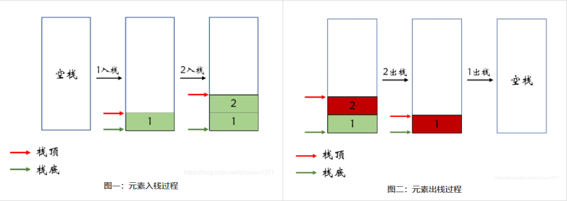

#### Ⅱ-栈的应用场景

>栈作为一种重要的基本数据结构，它的应用是比较广泛的。栈的应用包括如下几个方面：
>
>1. 子程序的调用：在跳往子程序前， 会先将下个指令的地址存到堆栈中， 直到子程序执行完后再将地址取出， 以
>     回到原来的程序中；
>2. 处理递归调用：和子程序的调用类似， 只是除了储存下一个指令的地址外， 也将参数、 区域变量等数据存入堆
>     栈中；
>3. 表达式的转换（中缀表达式转后缀表达式）与求值；
>4. 二叉树的遍历；
>5. 图形的深度优先（depth 一 first）搜索法。
>   

### 2、数组模拟栈

>由于栈是一种有序列表， 当然可以使用数组的结构来储存栈的数据内容。下面我们就用数组模拟栈的出栈， 入栈等操作。

#### Ⅰ-思路分析

>使用数组来模拟栈的思路是比较简单的，按照下面的步骤即可
>
>1. 定义一个类，该类的成员变量包括一个数组 stack（用于模拟栈）、两个整型变量 maxSize、top（分别代表栈的大小、栈顶指针）；
>2. 栈顶指针 top 初始化为 -1；
>3. 每当有元素要入栈时，top 加 1，然后元素记录在数组中，即 stack[top] = element；
>4. 每当有元素要出栈时，先读取数组的元素，即 element = stack[top]，然后 top 减 1。

#### Ⅱ-代码实现

>```java
>package com.stack;
>import java.util.Scanner;
>public class ArrayStackDemo {
>    public static void main(String[] args) {
>        //测试一下ArrayStack 是否正确
>        //先创建一个ArrayStack对象->表示栈
>        ArrayStack stack = new ArrayStack(4);
>        String key = "";
>        boolean loop = true; //控制是否退出菜单
>        Scanner scanner = new Scanner(System.in);
>
>        while (loop) {
>            System.out.println("show: 表示显示栈");
>            System.out.println("exit: 退出程序");
>            System.out.println("push: 表示添加数据到栈(入栈)");
>            System.out.println("pop: 表示从栈取出数据(出栈)");
>            System.out.println("请输入你的选择");
>            key = scanner.next();
>            switch (key) {
>                case "show":
>                    stack.list();
>                    break;
>                case "push":
>                    System.out.println("请输入一个数");
>                    int value = scanner.nextInt();
>                    stack.push(value);
>                    break;
>                case "pop":
>                    try {
>                        int res = stack.pop();
>                        System.out.printf("出栈的数据是 %d\n", res);
>                    } catch (Exception e) {
>                        // TODO: handle exception
>                        System.out.println(e.getMessage());
>                    }
>                    break;
>                case "exit":
>                    scanner.close();
>                    loop = false;
>                    break;
>                default:
>                    break;
>            }
>        }
>
>        System.out.println("程序退出~~~");
>    }
>}
>
>//1. 定义一个ArrayStack栈
>class ArrayStack {
>    private int maxSize;//栈的大小
>    private int[] stack; //数组,数组模拟栈
>    private int top = -1; //top表示栈顶,初始化为-1
>
>    public ArrayStack(int maxSize) {
>        this.maxSize = maxSize;
>        stack = new int[this.maxSize];
>    }
>
>    //栈满
>    public boolean isFull() {
>        return top == maxSize - 1;
>    }
>
>    //栈空
>    public boolean isEmpty() {
>        return top == -1;
>    }
>
>    //入栈--push
>    public void push(int value) {
>        if (isFull()) {
>            System.out.println("栈满");
>            return;
>        }
>        top++;
>        stack[top] = value;
>    }
>
>    //出栈-pop,将栈顶的数据返回
>    public int pop() {
>        if (isEmpty()) throw new RuntimeException("栈空,没有数据");
>        int value = stack[top];
>        top--;
>        return value;
>    }
>
>    //遍历栈,遍历时需要从栈顶开始显示数据
>    public void list() {
>        if (isEmpty()) {
>            System.out.println("栈空,没有数据");
>            return;
>        }
>        for (int i = top; i >= 0; i--) {
>            System.out.printf("stack[%d]=%d\n", i, stack[i]);
>        }
>    }
>
>
>}
>```

### 3、栈实现简单计算器（中缀）

#### Ⅰ-思路分析

>1. 表达式分为中缀表达式、前缀表达式、后缀表达式。中缀表达式就是表达式本身，如 “3+2*6-1” 就是一个中缀表达式。关于表达式的详细介绍将会在后面的笔记中展示
>
>2. 本案例实现的简单计算器就是直接对中缀表达式（也就是原计算表达式）进行分析处理。
>
>3. 如果要实现一个计算器，可以按照以下思路：
>
>   1) 初始化两个栈，一个作为符号栈、一个作为数字栈；
>
>   2) 通过一个索引 index，来从左至右遍历中缀表达式；
>
>   3) 如果遍历到的是一个数字，就直接入数字栈；
>
>   4) 如果遍历到的是一个符号：
>
>   ​	① 如果当前符号栈为空，就直接入符号栈；
>
>   ​	② 如果符号栈有操作符，就进行比较：
>
>   ​		1. 若当前的操作符优先级小于或等于栈顶的操作符，就从数字栈中 pop 出两个数，再从符号栈中 pop 出一个符号进行运算。运算得到的结果 push 入数字栈中，然后将当前的操作符入符号栈；
>
>   ​		2. 若当前的操作符优先级大于栈顶的操作符，就直接入符号栈；
>
>   5) 中缀表达式遍历完毕之后，就依次从数字栈和符号栈中 pop 出相应的数和符号，对他们进行运算；
>
>   6) 最后在数字栈中将只剩下一个数字，这个数字就是表达式的结果。
>
>4. 思路分析图:
>
>   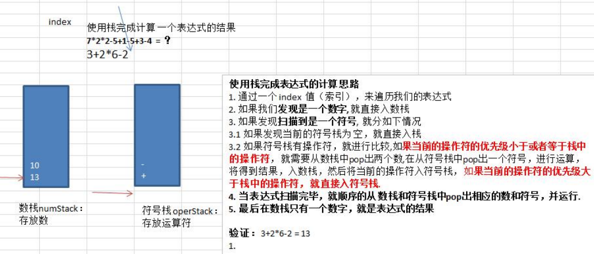

#### Ⅱ-代码实现:

>```java
>package com.stack;
>
>public class Calculator {
>    public static void main(String[] args) {
>        String expression = "70*2+2*3+2000";
>        //先创建两个栈,一个数栈一个符号栈
>        ArrayStack2 numStack = new ArrayStack2(10);
>        ArrayStack2 operStack = new ArrayStack2(10);
>        //定义相关变量
>        int index = 0, num1 = 0, num2 = 0, oper = 0, res = 0;
>        char ch = ' ';//每次将扫描到的char保存于ch中
>        String keepNum = "";//用于拼接多位数
>        //开始循环扫描expression
>        while (true) {
>            //依次得到expression的每一个字符
>            ch = expression.substring(index, index + 1).charAt(0);
>            //判断ch是什么
>            if (operStack.isOper(ch)) {//如果是运算符
>                if (!operStack.isEmpty()) {//判断当前字符站是否为空
>                    //如果符号栈中有操作符,就进行比较如果当前的操作符的优先级小于或者等于栈中的操作符,就需要从数栈中pop出两个数
>                    //再从符号栈中pop出一个符号进行运算,再将得到的结果入数栈,然后将当前的操作符入符号栈
>                    if (operStack.priority(ch) <= operStack.priority(operStack.peek())) {
>                        num1 = numStack.pop();
>                        num2 = numStack.pop();
>                        oper = operStack.pop();
>                        res = numStack.cal(num1, num2, oper);
>                        //把运算的结果入数栈
>                        numStack.push(res);
>                        //然后将当前的操作符入符号栈
>                        operStack.push(ch);
>                    } else operStack.push(ch);//如果当前操作符的优先级大于栈中的操作符,就直接入符号栈
>                } else operStack.push(ch);   //如果为空直接入符号栈
>            } else {
>                //如果是数,则直接入数栈
>                //numStack.push(ch - 48); //? "1+3" '1' => 1
>                //分析思路
>                //1. 当处理多位数时，不能发现是一个数就立即入栈，因为他可能是多位数
>                //2. 在处理数，需要向expression的表达式的index 后再看一位,如果是数就进行扫描，如果是符号才入栈
>                //3. 因此我们需要定义一个变量 字符串，用于拼接
>                //处理多位数
>                keepNum += ch;
>                //如果ch已经是expression的最后一位,就直接入栈
>                if (index == expression.length() - 1) numStack.push(Integer.parseInt(keepNum));
>                else {
>                    //判断下一个字符是不是数字,如果是数字,就继续扫描,如果是运算符,则入栈
>                    if (operStack.isOper(expression.substring(index + 1, index + 2).charAt(0))) {//此处是判断是符号入栈,并清空,不是不好就记录下来 下轮使用
>                        numStack.push(Integer.parseInt(keepNum));
>                        keepNum = "";
>                    }
>                }
>            }
>            index++;
>            if (index >= expression.length()) break; //结束循环，跳出循环体，执行后面的程序。
>        }
>        //当表达式扫描完毕,就顺序的从数栈和符号栈中pop出相应的数和符号,并进行运算
>        //经过上面的操作，符号栈剩下的都是优先级相等的符号了，直接出栈做运算就可以啦
>        while (true) {
>            //如果符号栈为空,则计算到最后的结果,数栈中只有一个数字--结果
>            if (operStack.isEmpty()) break;
>            num1 = numStack.pop();
>            num2 = numStack.pop();
>            oper = operStack.pop();
>            res = numStack.cal(num1, num2, oper);
>            numStack.push(res);//结果入栈
>//            System.out.println("-------- 出循环后数栈 ---------");
>//            numStack.list();
>//            System.out.println("-----------------");
>        }
>        int res2 = numStack.pop();
>        System.out.printf("表达式%s=%d", expression, res2);
>    }
>}
>
>
>//1. 定义一个ArrayStack栈
>class ArrayStack2 {
>    private int maxSize;//栈的大小
>    private int[] stack; //数组,数组模拟栈
>    private int top = -1; //top表示栈顶,初始化为-1
>
>    public ArrayStack2(int maxSize) {
>        this.maxSize = maxSize;
>        stack = new int[this.maxSize];
>    }
>
>    //可以返回当前栈顶的值,但不是pop,而是用做对比
>    public int peek() {
>        return stack[top];
>    }
>
>    //栈满
>    public boolean isFull() {
>        return top == maxSize - 1;
>    }
>
>    //栈空
>    public boolean isEmpty() {
>        return top == -1;
>    }
>
>    //入栈--push
>    public void push(int value) {
>        if (isFull()) {
>            System.out.println("栈满");
>            return;
>        }
>        top++;
>        stack[top] = value;
>    }
>
>    //出栈-pop,将栈顶的数据返回
>    public int pop() {
>        if (isEmpty()) throw new RuntimeException("栈空,没有数据");
>        int value = stack[top];
>        top--;
>        return value;
>    }
>
>    //遍历栈,遍历时需要从栈顶开始显示数据
>    public void list() {
>        if (isEmpty()) {
>            System.out.println("栈空,没有数据");
>            return;
>        }
>        for (int i = top; i >= 0; i--) {
>            System.out.printf("stack[%d]=%d\n", i, stack[i]);
>        }
>    }
>
>    //返回运算符的优先级,优先级是程序员来确定,优先级使用数字表示
>    //数字越大,则优先级越高
>    public int priority(int oper) {
>        if (oper == '*' || oper == '/') return 1;
>        else if (oper == '+' || oper == '-') return 0;
>        else return -1;
>    }
>
>    //判断是否为一个运算符
>    public boolean isOper(char val) {
>        return val == '+' || val == '-' || val == '*' || val == '/';
>    }
>
>    //计算方法
>    public int cal(int num1, int num2, int oper) {
>        int res = 0;
>        switch (oper) {
>
>            case '+':
>                res = num1 + num2;
>                break;
>            case '-':
>                res = num2 - num1;// 注意顺序
>                break;
>            case '*':
>                res = num1 * num2;
>                break;
>            case '/':
>                res = num2 / num1;
>                break;
>            default:
>                break;
>        }
>        return res;
>    }
>}
>```


