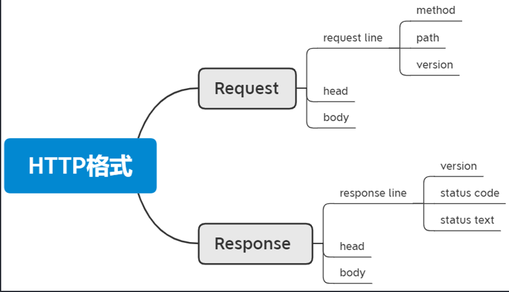
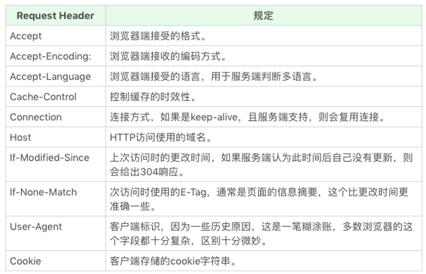

# #此文件为方便gitee网站观阅使用专门创建

> 此笔记文件于某一时间截取复制至此,容易存在更新不及时问题,建议观看同级目录下的笔记文件
>
> 只截取了上方`浅学Http协议底层原理及浏览器工作流程笔记`笔记的部分知识点至此,方便网站阅读
>
> 更多知识点请看`同级笔记目录其他文件`

# #说明

>此部分为学习码上前端的[`2021年前端程序员必须要掌握的浏览器的工作原理、HTTP协议底层原理、TCP网络协议、浏览器的渲染流程`](https://www.bilibili.com/video/BV1h44y167zh?p=2&share_source=copy_web)视频而整理的学习笔记
>
>此笔记主要用作`概览,不深入`学习计浏览器工作原理,为之后深入学习计算机网络打基础
>
>本人全部笔记地址分享 -->[点我跳转](https://gitee.com/hongjilin/hongs-study-notes)

# 浅学浏览器工作原理

# 一、**浏览器工作流程**概览

>•浏览器首先使用 HTTP 协议或者 HTTPS 协议，向服务端请求页面；
>
>•把请求回来的 HTML 代码经过解析，构建成 DOM 树；
>
>•计算 DOM 树上的 CSS 属性；
>
>•根据 CSS 属性对元素逐个进行渲染，得到内存中的`位图`①；
>
>•一个可选的步骤是对位图进行合成，这会极大地增加后续绘制的速度；
>
>•合成之后，再绘制到界面上。
>
> 

### 位图

>位图，又称为点阵图像、像素图或栅格图像，是由像素（图片元素）的单个点组成。这些点可以进行不同的排列和染色以构成图样。
>
>位图的单位：像素（Pixel）

# 二、HTTP协议底层原理概览

> Http是基于Tcp协议基础上出现的,HTTP在Tcp基础上规定了Request与Response
>
> http1标准:
>
> - HTTP1.1 https://tools.ietf.org/html/rfc2616
> - HTTP1.1 https://tools.ietf.org/html/rfc7234
>
> http2标准: https://tools.ietf.org/html/rfc2818
>
> HTTPS标准: https://tools.ietf.org/html/rfc2818

## 1.HTTP请求:是一种规则，无状态，无记忆：

###  Ⅰ- HTTP请求过程

>（1）建立TCP连接
>
>（2）web浏览器向web服务器发送请求指令
>
>（3）web浏览器发送请求头信息
>
>（4）web服务器应答
>
>（5）web服务器发送应答头信息
>
>（6）web服务器向浏览器发送数据
>
>（7）web服务器关闭TCP连接

### Ⅱ- HTTP请求的四个组成部分：

>  a、HTTP请求方法或者动作(GET/POST)
>
>  b、正在请求的URL
>
>  c、请求头，包含客户环境信息、身份信息等
>
>  d、请求体（正文），包含客户提交的查询字符串信息、表单信息

### Ⅲ- HTTP响应的三个组成部分：

>  a、一个数字和文字组成的转态码。作用：显示请求是否成功
>
>  b、响应头，包含服务器类型、日期、内容类型、长度等
>
>  c、响应体，即响应正文，字符串、HTML等 

## 2、**HTTP** **协议格式**

>  

### Ⅰ- **HTTP Method**

>GET POST  HEAD PUT  DELETE CONNECT  `OPTIONS TRACE(通常这两种是调试时才使用的)`

### Ⅱ- **HTTP Status code**

>•1xx：临时回应，表示客户端请继续。
>
>•2xx：请求成功。 =>表示用户请求被正确接收、理解和处理，如200
>
>•3xx: 表示请求的目标有变化，希望客户端进一步处理。 =>做定向使用  如nginx请求转发 再如303前端使用重定向
>
>•4xx：客户端请求错误。  
>
>•5xx：服务端请求错误。

### Ⅲ- **HTTP Head**

#### ① *Request Header*

> 

#### ② *Response Header*

> 

#### ③ ***HTTP Request Body***

>•application/json 				  -->最常用的json格式
>
>•application/x-www-form-urlencoded  -->常用的from表单提交格式
>
>•multipart/form-data   			 -->常用的文件上传格式
>
>•text/xml               			-->常用xml文件格式

#### ④ *HTTP head*

> 略

## 3、OSI模型图

> 

## 4、数据传输简单基础原理=>(服务端,浏览器,POST,GET)

>##### 	1. 浏览器访问原理=>
>
>-    `协议=>ip=>端口=>uri`
>
>##### 	2. 服务端(前端)数据传输过程=>
>
>-   `控制层=>逻辑层=>数据层=>后端(数据持久层)`
>
>##### 	3. GET与POST区别:=>
>
>*   GET是进行明文传递,POST非明文请求数据放在请求体中

## 5、请求响应与跨域概念

>#####   1.req:request（请求对象）=>
>
>-     代表,所有跟请求有关的东西都在req对象里头,包括请求参数 请求头 请求头 cookie
>
>##### 2.res:response（响应对象）=>
>
>-   所有响应客户端的东西都在res里头,包括相应参数,响应头(跨域处理就是在这)
>
>##### 3.跨域请求的本质与原理=>
>
>-   当一个请求url的协议、域名、端口三者之间任意一个与当前页面url不同即为跨域
>
>-   请求本质是成功的,但是浏览器判断本次请求不安全

