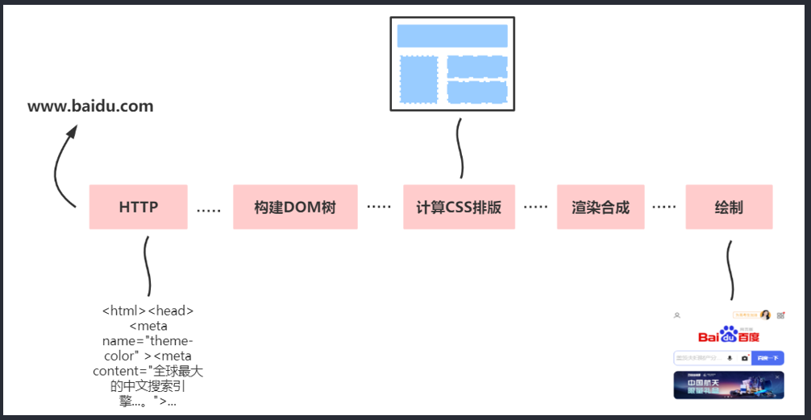

# #说明

>此部分为学习码上前端的[`2021年前端程序员必须要掌握的浏览器的工作原理、HTTP协议底层原理、TCP网络协议、浏览器的渲染流程`](https://www.bilibili.com/video/BV1h44y167zh?p=2&share_source=copy_web)视频而整理的学习笔记
>
>本人全部笔记地址分享 -->[点我跳转](https://gitee.com/hongjilin/hongs-study-notes)

# #目录

>[TOC]

# 浏览器工作原理

## 一、**浏览器工作流程**

>•浏览器首先使用 HTTP 协议或者 HTTPS 协议，向服务端请求页面；
>
>•把请求回来的 HTML 代码经过解析，构建成 DOM 树；
>
>•计算 DOM 树上的 CSS 属性；
>
>•根据 CSS 属性对元素逐个进行渲染，得到内存中的`位图`①；
>
>•一个可选的步骤是对位图进行合成，这会极大地增加后续绘制的速度；
>
>•合成之后，再绘制到界面上。
>
> 

### Ⅰ- 位图

>位图，又称为点阵图像、像素图或栅格图像，是由像素（图片元素）的单个点组成。这些点可以进行不同的排列和染色以构成图样。
>
>位图的单位：像素（Pixel）
