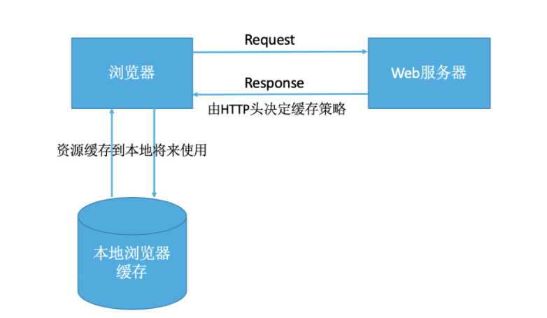
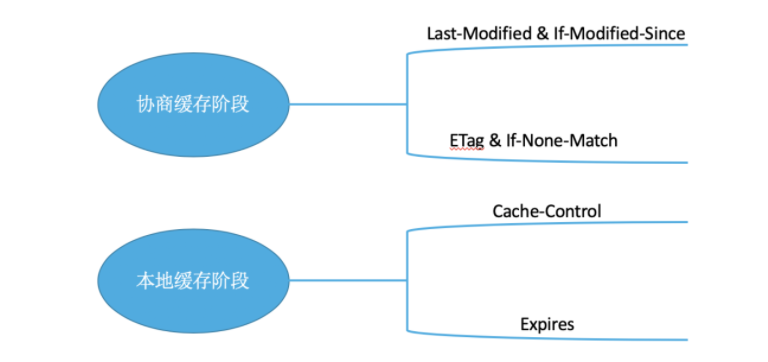
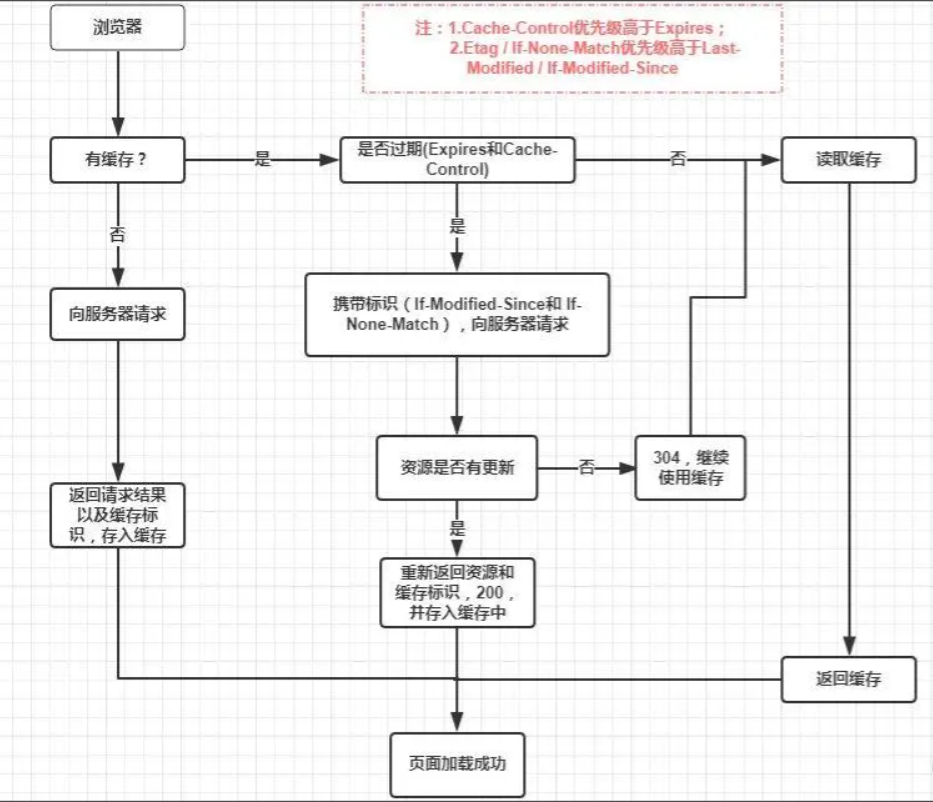

## #说明

>浏览器缓存策略对于我们前端来说应该算是必须要会的知识点,但如果没有系统地进行归纳总结,也很难三言两语说明白甚至说错;特别是在面试时,基本上就讲个概念,甚至有时候就忘掉了,所以整理一下,也为了以后遗忘时能快速复习
>
>查阅借鉴的资料: 掘金的 [http面试必会的：强制缓存和协商缓存](https://juejin.cn/post/6844903838768431118)、[一文读懂前端缓存](https://juejin.cn/post/6844903747357769742?utm_source=gold_browser_extension)、[前端浏览器缓存知识梳理](https://juejin.cn/post/6947936223126093861);Github的 [缓存（二）——浏览器缓存机制：强缓存、协商缓存](https://github.com/amandakelake/blog/issues/41#);机器之心的 [彻底弄懂浏览器缓存策略](https://www.jiqizhixin.com/articles/2020-07-24-12)
>
>

## 1、前端缓存

>当我们第一次访问网站时,电脑会把网站上的图片与数据下载到电脑上,当我们再次访问该网站时,网站就会从电脑中直接加载出来,这就是缓存
>
>* web缓存是指一个Web资源(如html页面、图、JS等)存在于web服务器和客户端(浏览器)之间的副本
>* 缓存会根据进来的请求保存输出内容的副本: 当下一个请求来到的时候,如果是相同的Url,缓存会根据缓存机制决定是直接使用副本响应访问请求还是像源服务器再次发起请求

### Ⅰ - 缓存有哪些好处

>* 缓解服务端压力,不用每次都去请求某些数据
>* 提升性能,打开本地资源肯定比请求服务器来的更快 
>* 减少宽带消耗,当我们使用缓存的时候,只会产生很小的网络消耗,至于为什么打开本地资源也会产生网络消耗?

### Ⅱ - 前端缓存种类

>1. 数据库缓存
>2. CDN缓存
>3. 代理服务器缓存
>4. 浏览器缓存
>
>**此图截取自网上相关文章**
>
>

## 2、什么是浏览器缓存策略

>良好的缓存策略可以降低资源的重复加载从而提高页面整体加载速度,通常浏览器缓存策略分为两种结果
>
>* 强缓存
>* 协商缓存
>
> 

### Ⅰ - 基本原理

>* 浏览器在加载资源时,根据请求头的 `Expires(过期时间)` 和`chche-control(缓存控制)`判断是否命中强缓存,命中则直接从缓存中读取资源,不会发送到服务器
>* 如果没有命中强缓存,浏览器一定会发送一个请求到服务器,通过`last-modified`和`etag`验证资源是否命中协商缓存,如果命中,服务器回将这个请求返回,但是不会返回这个资源的数据,依然是从缓存中读取资源
>* 如果前面两者都没有命中,则直接从服务器加载资源 

### Ⅱ - 根据什么规则缓存

>1. **新鲜度**(过期机制):也就是缓存副本有效期. 一个缓存副本必须满足以下条件,浏览器会认为它是有效的,足够新的
>   - 含有完整的过期时间控制头信息(HTTP协议报头),并且仍在有效期内
>   - 浏览器已经使用过这个缓存副本,并且在一个会话中已经检查过新鲜度
>   - **通常是强缓存阶段使用的机制**
>2. **校验值**(验证机制): 服务器返回资源的时候有时在控制头信息带上这个资源的实体标签`Etag`,
>   - 它可以用来作为浏览器再次请求过程的校验标识
>   - 如果发现校验标识不匹配,说明资源已经被修改或者过期,浏览器需要重新获取资源内容
>   - **所以通常是协商缓存中使用的机制**

### Ⅲ - HTTP缓存的两个阶段

>浏览器缓存一般分为两类: **强缓存**(也称本地缓存) 和 **协商缓存**(也称弱缓存)
>
>###### 强缓存阶段
>
>>浏览器发送请求前,会去缓存里查看是否命中强缓存,如果命中,则直接从缓存中读取资源,不会发送请求到服务器;
>
>###### 协商缓存阶段
>
>> 当强缓存没有命中时,浏览器一定会向服务器发起请求
>>
>> * 服务器会根据 `request header` 中的一些字段来判断是否命中协商缓存
>> * 如果命中,服务端会返回304响应,但是不会携带任何响应实体,只是高速浏览器可以直接从浏览器缓存中获取这个资源
>> * 如果 **强缓存** 和 **协商缓存** 都没有命中,则直接从服务器加载资源
>
> 

### Ⅳ - 优先级

>* `Cache-Control`优先级大于 `expires`
>* `Etag` 优先级大于 `last - Modified/if-Modified-since`,同时存在时会以Etag为准

### Ⅴ - 浏览器缓存流程图

> 

## 3、强缓存与协商缓存

### Ⅰ - 强缓存

> ###### 通过`Expires(过yu期)`和`cache-control(缓存控制器)`两种响应头实现
>
> 浏览器在加载资源时,根据请求头的 `Expires(过期时间)` 和`chche-control(缓存控制)`判断是否命中强缓存,命中则直接从缓存中读取资源,不会发送到服务器

#### ①  Expires(过期)

>`Expires`是 http1.0 提出的表示资源过期时间的header, 它描述的是一个绝对时间,由服务端返回
>
>expires受限于本地时间,如果修改了本地时间,可能会造成缓存失效

#### ②  cache-control

>`cache-control`出现于HTTP1.1, 优先级高于Expires ,表示的是相对时间
>
>* `cache-control:no-cache` 的响应实际上是可以存储在本地缓存去中的,只是在与原始服务器进行新鲜度再验证之前,缓存不能将其提供给客户端使用
>* `Cache-Control: no-store` 真正的不缓存到本地
>* `Cache-Control: public` 可以被所有用户缓存(多用户共享),包括终端和CDN等中间代理服务器
>* `Cache-Control: private`只能被终端浏览器缓存（而且是私有缓存），不允许中继缓存服务器进行缓存

### Ⅱ - 协商缓存

>###### 协商缓存是通过`【Last-Modified，If-Modified-Since】`和`【ETag、If-None-Match】`这两对Header来管理的
>
>当浏览器对某个资源的请求没有命中强缓存,就会发一个请求到服务器,验证协商缓存是否命中; 如果协商缓存命中,请求响应返回的http状态为304 并且会显示一个`Not Modified(未修改的)`的字符串

#### ①  Last-Modified，If-Modified-Since

>1. `Last-Modified`表示本地文件最后修改日期
>   - 浏览器会在request header 加上 `If-Modified-Since`(上此返回的`Last-Modified`的值)
>   - 询问服务器在该日期后资源是否有更新
>   - 有更新的话就会将新的资源发送过来
>2. 但如果在本地打开缓存文件,就会造成`Last-Modified`的修改,所以在HTTP1.1中出现了`Etag`
>3. 当资源过期时（使用`Cache-Control`标识的max-age/s-maxage）
>   - 发现资源具有`Last-Msodified`声明，则向服务器请求时带上头 `If-Modified-Since`（即响应头中的`Last-Modified`值），表示请求时间。
>   - 这个时候服务器收到请求后发现有头`If-Modified-Since`则与**被请求资源**的最后修改时间进行比对
>   - 若最后修改时间较新，说明资源有被改动过，将新资源返回并返回状态`200`，否则返回`304`表示资源没被更新使用缓存即可。

#### ② ETag、If-None-Match

>1. `Etag`就行是一个直问,资源变化都会导致Etag变化,跟最后修改时间没有关系,Etag可以保证每一个资源都是唯一的
>2. 当资源过期时（使用Cache-Control标识的max-age/s-maxage）
>   - 发现资源具有`Etage`声明，则向服务器请求时带上头`If-None-Match`（即响应头中`Etag`的值）
>   - 服务器收到请求后发现有头`If-None-Match` 则与被请求资源的相应校验串进行比对
>   - 决定返回200或304（**注意：服务器会优先验证If-None-Match**）
>
>###### 两者优先级?
>
>>**`ETag`的优先级比`Last-Modified`更高**
>>
>>具体为什么要用`ETag`，主要出于下面几种情况考虑：
>>
>>* 一些文件也许会周期性的更改,但是它的内容并不会改变(仅仅只改变了修改时间),这种时候我们并不希望客户端认为这个文件被修改了,而重新GET
>>* 某些文件修改非常频繁,比如在秒以下的时间内进行修改(比如说1s内修改了N次),而其他方法检查到的粒度是s级的,这种修改无法判断
>>* 某些服务器不能精确的得到文件的最后修改时间
>
>###### 服务端返回 304 流程图
>
>

### Ⅲ -强缓存与协商缓存异同点

>* **相同点**: 如果命中,都是从客户端缓存中加载资源,而不是从服务器加载资源数据
>* **不同点**: 强缓存不发送请求到服务器,协商缓存会发送请求到服务器

## 4、几种状态码的区别

>
>
>
