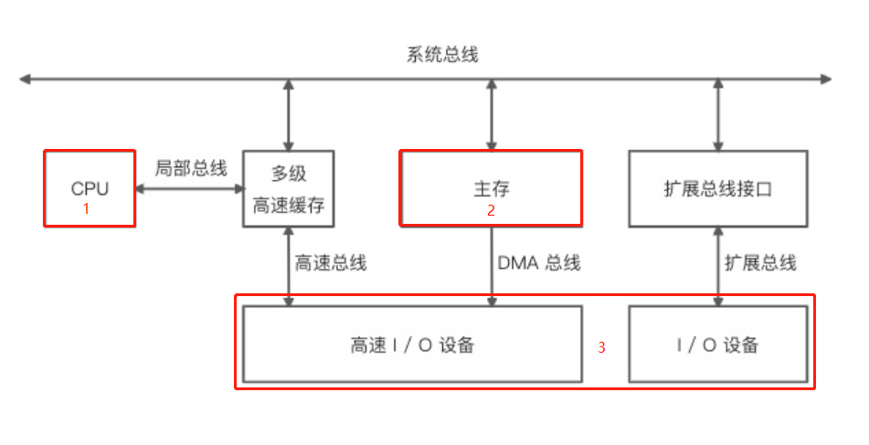
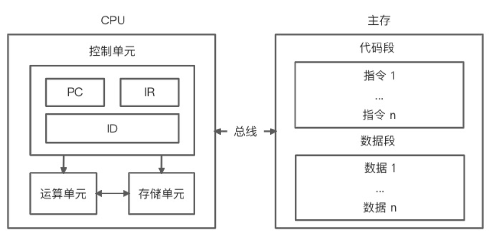

# #说明

>查阅摘录的资料:[阿里巴巴专有钉钉前端面试指南](https://juejin.cn/post/6986436944913924103) ,文章中给出了题目,而我将根据这些题目摘录下来并逐个进行答案梳理,答案多来自网上各个博客或者掺杂本人描述,仅供本人学习使用

# #考察内容

>专有钉钉的一面面试主要考察以下三个方面的内容：
>
>- 基础知识：考察面试者是否掌握扎实的前端基础知识体系
>- 业务思考：考察面试者的业务深度
>- 笔试实践：考察面试者基本知识的实践能力，并考察代码风格和逻辑思维能力
>
>###### 基础知识主要包含以下几个方面：
>
>- 基础：计算机原理、编译原理、数据结构、算法、设计模式、编程范式等基本知识了解
>- 语法：JavaScript、ECMAScript、CSS、TypeScript、HTML、Node.js 等语法的了解和使用
>- 框架：React、Vue、Egg、Koa、Express、Webpack 等原理的了解和使用
>- 工程：编译工具、格式工具、Git、NPM、单元测试、Nginx、PM2、CI / CD 了解和使用
>- 网络：HTTP、TCP、UDP、WebSocket、Cookie、Session、跨域、缓存、协议的了解
>- 性能：编译性能、监控、白屏检测、SEO、Service Worker 等了解
>- 插件：Chrome 、Vue CLI 、Webpack 等插件设计思路的理解
>- 系统：Mac、Windows、Linux 系统配置的实践
>- 后端：Redis 缓存、数据库、Graphql、SSR、模板引擎等了解和使用

# 一、编程基础

> 这部分就考核到你大学时期有没有好好学习了,出来混迟早要还的

### 1、列举你所了解的计算机存储设备类型

#### Ⅰ - 存储的组成

>现代计算机以 **存储器** 为中心, 主要由 **CPU**、**I/O设备** 以及 **主存储器** 三大部分组成.各个部分通过总线进行连接通信
>
>###### 举个多总线结构的示意图
>
> 
>
>> CPU、主存以及 I / O 设备之间的所有数据都是通过总线进行并行传输，使用局部总线是为了提高 CPU 的吞吐量（CPU 不需要直接跟 I / O 设备通信），而使用高速总线（更贴近 CPU）和 DMA 总线则是为了提升高速 I / O 设备（外设存储器、局域网以及多媒体等）的执行效率。
>
>###### 主存储器包括 **随机存储器** RAM 和 **只读存储器** ROM (指的都是半导体存储器)

#### Ⅱ - **随机存储器** RAM

>实际上这个就是我们常说的内存
>
>* RAM 主要分为静态 RAM（SRAM） 和动态 RAM（DRAM） 两种类型
>* DRAM 种类很多，包括 SDRAM、RDRAM、CDRAM 等
>* **断电后数据会丢失，主要用于存储临时程序或者临时变量数据**。
>* DRAM 一般访问速度相对较慢。
>* 由于现代 CPU 读取速度要求相对较高，因此在 CPU 内核中都会设计 L1、L2 以及 L3 级别的多级高速缓存，这些缓存基本是由 SRAM 构成，一般访问速度较快。
>* 如果看到这你还不懂,那你可以想象成相当于我们手机的 **运行内存**

#### Ⅲ - **只读存储器** ROM

>这个是我们说的外存:如硬盘、软盘、磁带、CD等
>
>* ROM 可以分为 MROM（一次性）、PROM、EPROM、EEPROM 。
>* ROM 中存储的程序（例如启动程序、固化程序）和数据（例如常量数据）**在断电后不会丢失**

### 2、**一般代码存储在计算机的哪个设备中？代码在 CPU 中是如何运行的？**

>**高级程序设计语言** 是不能直接被计算机理解并执行的,我们需要通过一些编译程序将这些高级程序设计语言进行翻译,转换成特定处理器上可以执行的指令,然后处理器根据指令执行,我们的程序就以这种方式跑起来了
>
>###### CPU的简单工作原理如图
>
>
>
>**CPU 主要由控制单元、运算单元和存储单元组成（注意忽略了中断系统）** 

#### Ⅰ - 控制单元

>在 [节拍脉冲](https://www.zhihu.com/question/20392042) 的作用下,将 [程序计数器](https://baike.baidu.com/item/%E7%A8%8B%E5%BA%8F%E8%AE%A1%E6%95%B0%E5%99%A8/3219536) 指向的 **主存或多级高速缓存**
>
>

###  知识点补充

#### Ⅰ - 节拍脉冲是什么

>时钟周期是由CPU时钟定义的定长时刻距离，是CPU作业的最小时刻单位，也称`节拍脉冲`或T周期。通常为节拍脉冲或T周期，既主频的倒数，它是处理操作的最基本的单位
>
>[原文地址](https://www.zhihu.com/question/20392042)

#### Ⅱ - 程序计数器

>程序计数器是用于存放下一条指令所在单元的地址的地方。 
>
>当执行一条指令时，首先需要根据PC中存放的指令地址，将指令由内存取到[指令寄存器](https://baike.baidu.com/item/指令寄存器/3219483)中，此过程称为“取指令”。与此同时，PC中的地址或自动加1或由转移指针给出下一条指令的地址。此后经过分析指令，执行指令。完成第一条指令的执行，而后根据PC取出第二条指令的地址，如此循环，执行每一条指令。
>
>[原文地址](https://baike.baidu.com/item/%E7%A8%8B%E5%BA%8F%E8%AE%A1%E6%95%B0%E5%99%A8/3219536)

#### Ⅲ - 多级缓存

>**多级高速缓存**: 为提高存储性能而采用的多层次结构的高速缓存。
>
>**CPU多级缓存**: 这个文章写的不错,可以看这里  --> [点我跳转](https://blog.csdn.net/f191501223/article/details/84310300)

